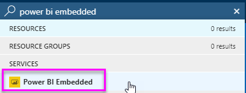
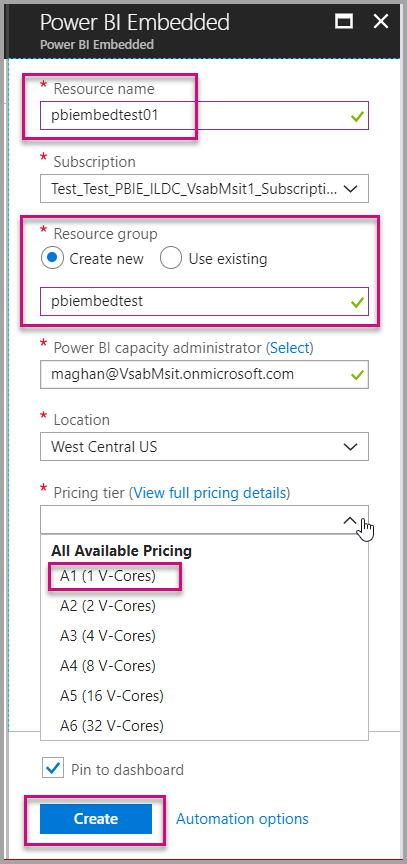

# Tutorial: Embed a Power BI report, dashboard or tile into an application for your customers
With **Power BI Embedded in Azure**, you can embed reports, dashboards, or tiles into an application so that your customers can share data. This is typically an **ISV developer** scenario using an **app owns data** structure. **App owns data** means embedding Power BI content for your own customers. For example, the user of the Power BI content can view reports, dashboards or tiles without needing to log-in to **Power BI**. This tutorial demonstrates how to integrate or embed a report into an application using the **Power BI** .NET SDK along with the **Power BI** JavaScript API when using **Power BI Embedded in Azure** for your customers using **app owns data**.

In this tutorial, you learn how to:
>[!div class="checklist"]
>* Register an application in Azure.
>* Embed a report, dashboard, or tile into an application using Power BI Embedded in Azure.

## Prerequisites
To get started, you need a **Power BI Pro** account and a **Microsoft Azure** account.

* If you're not signed up for **Power BI Pro**, [sign up for a free trial](https://powerbi.microsoft.com/en-us/pricing/) before you begin.
* If you don’t have an Azure subscription, create a [free account](https://azure.microsoft.com/free/?WT.mc_id=A261C142F) before you begin.
* You need to have your own [Azure Active Directory tenant ](create-an-azure-active-directory-tenant.md) setup.
* You need Visual Studio installed (version 2013 or later).

## Setup your embedded analytics development environment

Before you start embedding reports, dashboard, or tiles into your application, you need to make sure your environment is setup to allow for embedding. As part of the setup, you will need to do the following.

### Register an application in Azure Active Directory (Azure AD)

You register your application with Azure Active Directory to allow your application access to the Power BI REST APIs. This allows you to establish an identity for your application and specify permissions to Power BI REST resources.

1. Accept the [Microsoft Power BI API Terms](https://powerbi.microsoft.com/api-terms).

2. Sign into the [Azure portal](https://portal.azure.com).
 
    

3. In the left-hand navigation pane, choose **All Services**, select **App Registrations** and then select **New application registration**.
   
     
    

4. Follow the prompts and create a new application. For apps owns data you need to use **Native** for the application type. You also need to provide a **Redirect URI**, which **Azure AD** uses to return token responses. Enter a value specific to your application (for example: http://localhost:13526/redirect).

    

### Apply permissions to your application within Azure Active Directory

You will need to enable additional permissions for your application in addition to what was provided on the app registration page. You need to be logged in with the *master* account, used for embedding, which needs to be a global admin account.

### Use the Azure Active Directory portal

1. Browse to [App registrations](https://portal.azure.com/#blade/Microsoft_AAD_IAM/ApplicationsListBlade) within the Azure portal and select the app that you are using for embedding.
   
    

2. Select **Settings**, then under **API Access** select **Required permissions**.
   
    

3. Select **Windows Azure Active Directory** and then make sure **Access the directory as the signed-in user** is selected. Select **Save**.
   
    

4. Select **Add**.

    

5. Select **Select an API**.

    

6. Select **Power BI Service**, then select **Select**.

    

7. Select all permissions under **Delegated Permissions**. You will need to select them one by one in order to save the selections. Select **Save** when done.
   
    

8. Within **Required permissions**, select **Grant Permissions**.
   
    The **Grant Permissions** action is needed for the *master account* to avoid being prompted for consent by Azure AD. If the account performing this action is a Global Admin, you will grant permissions to all users within your organization for this application. If the account performing this action is the *master account* and is not a Global Admin, you will grant permissions only to the *master account* for this application.
   
    

### Create your Power BI Embedded dedicated capacity in Azure

1. Sign into the [Azure portal](https://portal.azure.com).

    

2. In the left-hand navigation pane, choose **All Services** and select **Power BI Embedded**.

    

3. Follow the prompts and fill in the proper information needed to create a new **Power BI Embedded** dedicated capacity, and then select **Create**. When choosing the **Pricing Tier**, review the table below to decide which tier bests suits your needs. Then select **Create** and wait for the resource to complete.

    

| Capacity Node | Total cores *(Backend + frontend)* | Backend Cores | Frontend Cores | DirectQuery/live connection limits | Max page renders at peak hour |
| --- | --- | --- | --- | --- | --- |
| A1 |1 v-cores |.5 cores, 3GB RAM |.5 cores | 5 per second |1-300 |
| A2 |2 v-cores |1 core, 5GB RAM |1 core | 10 per second |301-600 |
| A3 |4 v-cores |2 cores, 10GB RAM |2 cores | 15 per second |601-1,200 |
| A4 |8 v-cores |4 cores, 25GB RAM |4 cores |30 per second |1,201-2,400 |
| A5 |16 v-cores |8 cores, 50GB RAM |8 cores |60 per second |2,401-4,800 |
| A6 |32 v-cores |16 cores, 100GB RAM |16 cores |120 per second |4,801-9600 |

Now you can view the new **Power BI Embedded dedicated capacity**.

   

## Setup your Power BI environment

### Create an app workspace

If you are embedding reports, dashboards, or tiles for your customers, then you have to place your content within an app workspace. The *master* account must be an admin of the app workspace.

1. Start by creating the workspace. Select **workspaces** > **Create app workspace**. This will be the place to put content that your application needs to access.

    

2. Give the workspace a name. If the corresponding **Workspace ID** isn't available, edit it to come up with a unique ID. This will be the name of the app, too.

    

3. You have a few options to set. If you choose **Public**, anyone in your organization can see what’s in the workspace. **Private**, on the other hand, means only members of the workspace can see its contents.

    

    You can't change the Public/Private setting after you've created the group.

4. You can also choose if members can **edit** or have **view-only** access.

    

5. Add email addresses of people you want to have access to the workspace, and select **Add**. You can’t add group aliases, just individuals.

6. Decide whether each person is a member or an admin. Admins can edit the workspace itself, including adding other members. Members can edit the content in the workspace, unless they have view-only access. Both admins and members can publish the app.

7. Expand **Advanced**, then enable **Dedicated capacity**, then select the **Power BI Embedded dedicated capacity** you created. THen select **Save**.

    

Now you can view the new workspace. Power BI creates the workspace and opens it. It appears in the list of workspaces you’re a member of. Because you’re an admin, you can select the ellipsis (…) to go back and make changes to it, adding new members or changing their permissions.

   

### Create and publish your reports

You can create your reports and datasets using Power BI Desktop and then publish those reports to an app workspace. The end user publishing the reports need to have a Power BI Pro license in order to publish to an app workspace.

1. Download the sample [Blog Demo](https://github.com/Microsoft/powerbi-desktop-samples) from GitHub.

    

2. Open sample PBIX report in **Power BI Desktop**

   

3. Publish to the **app workspace**

   

    Now you can view the report in the Power BI service online

   

## Embed your content

1. Download the [App Owns Data sample](https://github.com/Microsoft/PowerBI-Developer-Samples) from GitHub to get started.

    

2. Open up the Web.config file in the sample application. There are 5 fields you will need to fill in to run the application successfully. The **clientID**, the **groupId**, the **reportId**, the **pbiUsername** and the **pbiPassword**.

      

    * Fill in the **clientId** information with the **Application ID** from **Azure**. The **clientId** is used by the application to identify itself to the users from which you're requesting permissions. To get the **clientId** follow these steps:

        1. Sign into the [Azure portal](https://portal.azure.com).

        

        2. In the left-hand navigation pane, choose **All Services** and select **App Registrations**.

        
        3. Select the application that you want to get the **clientId** for.

        

      4. You should see an **Application ID** that is listed as a GUID. Use this **Application ID** as the **clientId** for the application.

             

    * Fill in the **groupId** information with the **app workspace GUID** from Power BI.

        

    * Fill in the **reportId** information with the **report GUID** from Power BI.

            

    * Fill in the **pbiUsername** with the master user Power BI account.
    * Fill in the **pbiPassword** with the password for the master user Power BI account.

3. Run the application!

    First select **Run** in **Visual Studio**.

    

    Then select **Embed Report**. Depending on which content you choose to test with - reports, dasboards or tiles - then select that option in the application.

    
 
    Now you can view the report in the sample application.

    

## Next steps
* For a full sample of using the JavaScript API, you can use the [Playground tool ](https://microsoft.github.io/PowerBI-JavaScript/demo).
* More Information about the JavaScript API, see [Power BI JavaScript API](https://github.com/Microsoft/PowerBI-JavaScript).

More questions? [Try asking the Power BI Community](http://community.powerbi.com/)