# Tutorial: Embed Power BI content into an application for your customers

With **Power BI Embedded in Azure**, you can embed reports, dashboards, or tiles into an application using app owns data. **App owns data** is about having an application that uses Power BI as its embedded analytics platform. As an **ISV developer**, you can create Power BI content that displays reports, dashboards, or tiles in an application that is fully integrated and interactive, without requiring users to have a Power BI license. This tutorial demonstrates how to integrate a report into an application using the Power BI .NET SDK with the Power BI JavaScript API using **Power BI Embedded in Azure** for your customers.

In this tutorial, you learn how to:
> [!div class="checklist"]
> * Register an application in Azure.
> * Embed a Power BI report into an application.

## Prerequisites

To get started, you're required to have:

* A [Power BI Pro account](../service-self-service-signup-for-power-bi.md) (a master account that is a username and password to sign in to your Power BI Pro account), or a [service principal (app-only token)](embed-service-principal.md).
* A [Microsoft Azure](https://azure.microsoft.com/) subscription.
* You need to have your own [Azure Active Directory tenant](create-an-azure-active-directory-tenant.md) setup.

If you're not signed up for **Power BI Pro**, [sign up for a free trial](https://powerbi.microsoft.com/pricing/) before you begin.

If you don’t have an Azure subscription, create a [free account](https://azure.microsoft.com/free/?WT.mc_id=A261C142F) before you begin.

## Set up your embedded analytics development environment

Before you start embedding reports, dashboard, or tiles into your application, you need to make sure your environment allows for embedding with Power BI.

You can go through the [Embedding setup tool](https://aka.ms/embedsetup/AppOwnsData), so you can quickly get started and download a sample application that helps you walk through creating an environment and embedding a report.

However, if you choose to set up the environment manually, you can continue below.

### Register an application in Azure Active Directory (Azure AD)

[Register your application](register-app.md) with Azure Active Directory to allow your application access to the [Power BI REST APIs](https://docs.microsoft.com/rest/api/power-bi/). Registering your application allows you to establish an identity for your application and specify permissions to Power BI REST resources. Depending if you want to use a master account or [service principal](embed-service-principal.md), determines how to get started registering an application.

Depending on which method you take, affects which type of application you register in Azure.

If you proceed using a master account, then proceed with registering a **Native** app. You use a Native app because you're working with a non-interactive login.

However, if you proceed using the service principal, you need to proceed with registering a **server-side web application** app. You register a server-side web application to create an application secret.

## Set up your Power BI environment

### Create an app workspace

If you're embedding reports, dashboards, or tiles for your customers, then you have to place your content within an app workspace. There are different types of workspaces that you can set up: the [traditional workspaces](../service-create-workspaces.md) or the [new workspaces](../service-create-the-new-workspaces.md). If you're using a *master* account, then it doesn't matter which type of workspaces you use. However, if you use *[service principal](embed-service-principal.md)* to sign into your application, then you're required to you use the new workspaces. In either scenario, both the *master* account or *service principal* must be an admin of the app workspaces involved with your application.

### Create and publish your reports

You can create your reports and datasets using Power BI Desktop and then publish those reports to an app workspace. There are two ways to accomplish this task: As an end user, you can publish reports to a traditional app workspace with a master account (Power BI Pro license). If you're using service principal, you can publish reports to the new workspaces using the [Power BI REST APIs](https://docs.microsoft.com/rest/api/power-bi/imports/postimportingroup).

The below steps walk through how to publish your PBIX report to your Power BI workspace.

1. Download the sample [Blog Demo](https://github.com/Microsoft/powerbi-desktop-samples) from GitHub.

    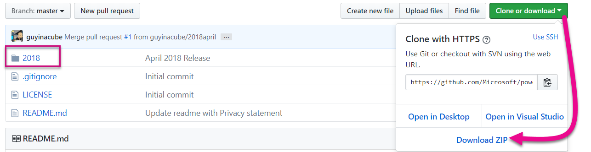

2. Open sample PBIX report in **Power BI Desktop**.

   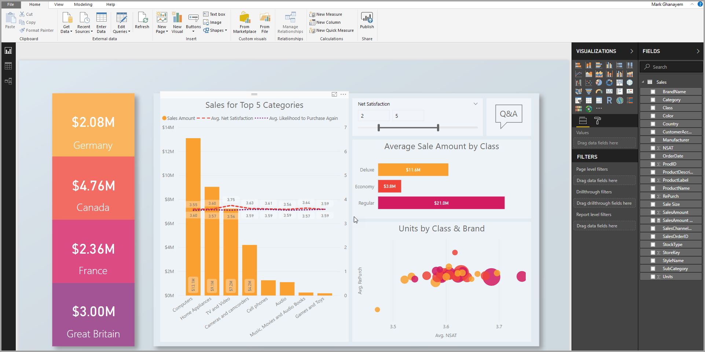

3. Publish to **app workspaces**. This process differs depending on whether you're using a master account (Power Pro license), or service principal. If you're using a master account, then you can publish your report through Power BI Desktop.  Now if you're using service principal, you must use the Power BI REST APIs.

## Embed content using the sample application

This sample is deliberately kept simple for demonstration purposes. It's up to the developer to protect the application secret or the master account credentials.

Follow the steps below to start embedding your content using the sample application.

1. Download [Visual Studio](https://www.visualstudio.com/) (version 2013 or later). Make sure to download the latest [NuGet package](https://www.nuget.org/profiles/powerbi).

2. Download the [App Owns Data sample](https://github.com/Microsoft/PowerBI-Developer-Samples) from GitHub to get started.

    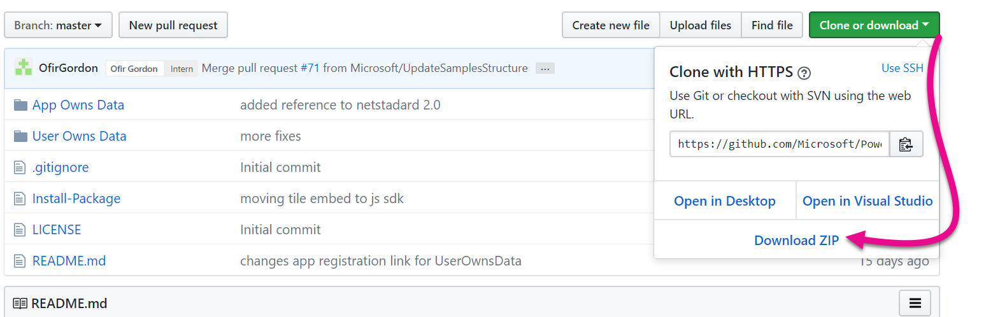

3. Open the **Web.config** file in the sample application. There are fields you need to fill in to run the application. You can choose **MasterUser** or **ServicePrincipal** for the **AuthenticationType**. Depending on which type of authentication method you choose there are different fields to complete.  

    <center>

    |**AuthenticationType = MasterUser** </br> (Power BI Pro license) | **AuthenticationType = ServicePrincipal** </br> (app-only token) |
    |---------------------------------------------------------------------------------------------------------------------------------------|-------------------------------------------------------------------------------------------------------------------------------------|
    | **[applicationId](#application-id)** | **[applicationId](#application-id)** |
    | | **[applicationsecret](#application-secret)** |
    | **[workspaceId](#workspace-id)** | **[workspaceId](#workspace-id)** |
    | **[reportId](#report-id)** | **[reportId](#report-id)** |
    | **[pbiUsername](#power-bi-username-and-password)** |
    | **[pbiPassword](#power-bi-username-and-password)**

    </center>

    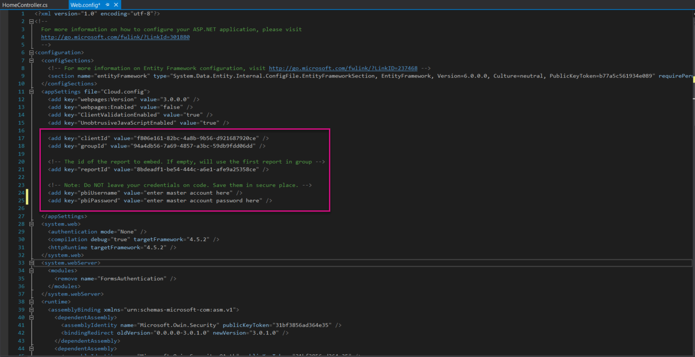

### Application ID

This attribute requires both the master account and [service principal](embed-service-principal.md).

Fill in the **applicationId** information with the **Application ID** from **Azure**. The **applicationId** is used by the application to identify itself to the users from which you're requesting permissions.

To get the **applicationId**, follow these steps:

1. Sign into the [Azure portal](https://portal.azure.com).

2. In the left-hand navigation pane, select **All Services**, and select **App Registrations**.

    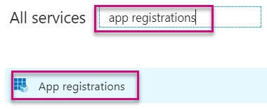

3. Select the application that needs the **applicationId**.

    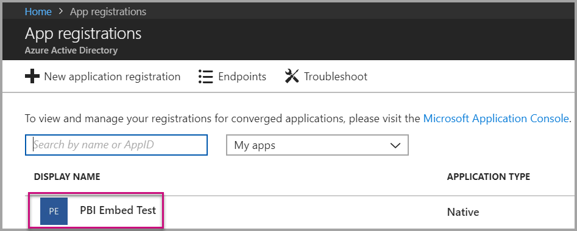

4. There's an **Application ID** that is listed as a GUID. Use this **Application ID** as the **applicationId** for the application.

    

### Application secret

    This attribute requires [service principal](embed-service-principal.md) only.

    Fill in the **ApplicationSecret** information from the **Keys** section of your **App registrations** section in **Azure**.  This attribute works when using [service principal](embed-service-principal.md).

    To get the **ApplicationSecret**, follow these steps:

1. Sign in to the [Azure portal](https://portal.azure.com).

2. In the left-hand navigation pane, select **All services** and then select **App registrations**.

    

3. Select the application that needs to use the **ApplicationSecret**.

    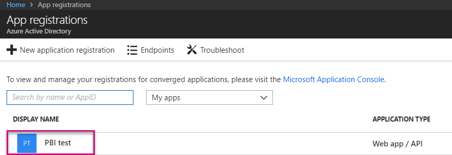

4. Select **Settings**.

    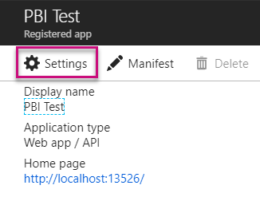

5. Select **Keys**.

    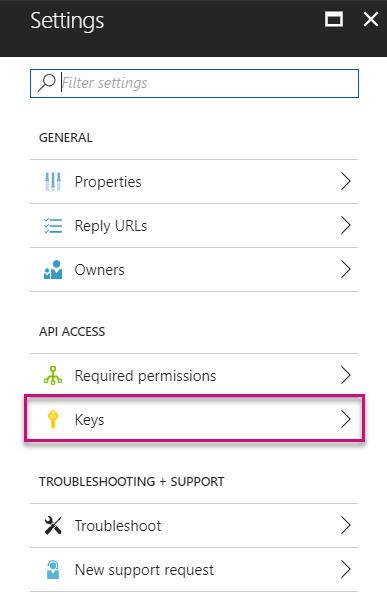

6. Enter a name in the **Description** box and select a duration. Then select **Save** to get the **Value** for your application. When you close the **Keys** pane after saving the key value, the value field shows only as hidden. At that point, you aren't able to retrieve the key value. If you lose the key value, create a new one in the Azure portal.

    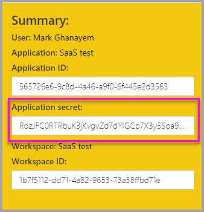

### Workspace ID

    This attribute requires both the master account and [service principal](embed-service-principal.md).

    Fill in the **workspaceId** information with the app workspace (group) GUID from Power BI. You can get this information either from the URL when signed into the Power BI service or using Powershell.

    URL </br>

    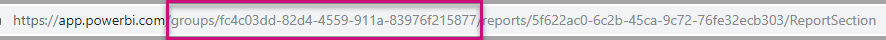

    Powershell </br>

    ```powershell
    Get-PowerBIworkspace -name "App Owns Embed Test"
    ```

   

### Report ID

This attribute requires both the master account and [service principal](embed-service-principal.md).

Fill in the **reportId** information with the report GUID from Power BI. You can get this information either from the URL when signed into the Power BI service or using Powershell.

URL</br>

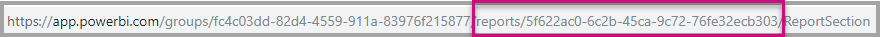

Powershell </br>

```powershell
Get-PowerBIworkspace -name "App Owns Embed Test" | Get-PowerBIReport
```

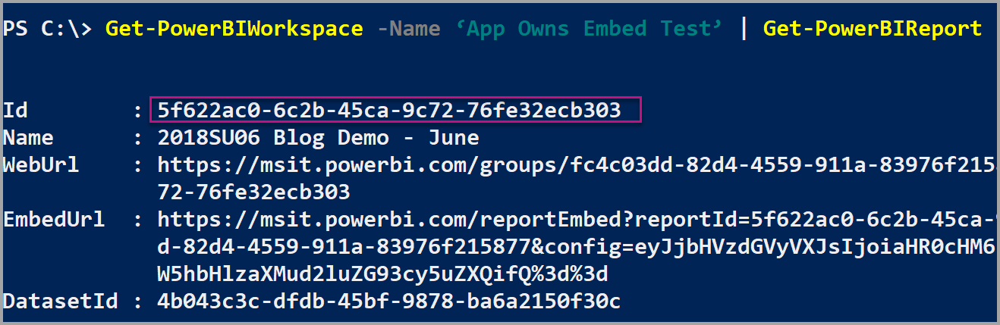

### Power BI username and password**

This attribute requires the master account information only.

If you're using [service principal](embed-service-principal.md) to authenticate, then you don't need to fill in the username or password attributes.

* Fill in the **pbiUsername** with the Power BI master account.
* Fill in the **pbiPassword** with the password for the Power BI master account.

### Run the application

1. Select **Run** in **Visual Studio**.

    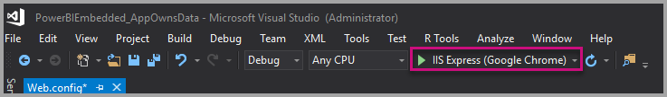

2. Then select **Embed Report**. Depending on which content you choose to test with - reports, dashboards or tiles - then select that option in the application.

    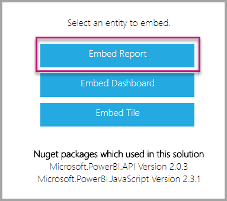

3. Now you can view the report in the sample application.

    

## Embed content within your application

Even though the steps to embed your content can be done with the [Power BI REST APIs](https://docs.microsoft.com/rest/api/power-bi/), the example codes described in this article are made with the **.NET SDK**.

Embedding for your customers within your application requires you to get an **access token** for your master account or [service principal](embed-service-principal.md) from **Azure AD**. You're required to get an [Azure AD access token](get-azuread-access-token.md#access-token-for-non-power-bi-users-app-owns-data) for your Power BI application before you make calls to the [Power BI REST APIs](https://docs.microsoft.com/rest/api/power-bi/).

To create the Power BI Client with your **access token**, you want to create your Power BI client object, which allows you to interact with the [Power BI REST APIs](https://docs.microsoft.com/rest/api/power-bi/). You create the Power BI client object by wrapping the **AccessToken** with a ***Microsoft.Rest.TokenCredentials*** object.

```csharp
using Microsoft.IdentityModel.Clients.ActiveDirectory;
using Microsoft.Rest;
using Microsoft.PowerBI.Api.V2;

var tokenCredentials = new TokenCredentials(authenticationResult.AccessToken, "Bearer");

// Create a Power BI Client object. it's used to call Power BI APIs.
using (var client = new PowerBIClient(new Uri(ApiUrl), tokenCredentials))
{
    // Your code to embed items.
}
```

### Get the content item you want to embed

You can use the Power BI client object to retrieve a reference to the item you want to embed.

Here is a code sample of how to retrieve the first report from a given workspace.

*A sample of getting a content item whether it's a report, dashboard, or tile that you want to embed is available within the Services\EmbedService.cs file in the [sample application](https://github.com/Microsoft/PowerBI-Developer-Samples).*

```csharp
using Microsoft.PowerBI.Api.V2;
using Microsoft.PowerBI.Api.V2.Models;

// You need to provide the workspaceId where the dashboard resides.
ODataResponseListReport reports = await client.Reports.GetReportsInGroupAsync(workspaceId);

// Get the first report in the group.
Report report = reports.Value.FirstOrDefault();
```

### Create the embed token

Generated an embed token, which can be used from the JavaScript API. The embed token is specific to the item you're embedding. So at any time you embed a piece of Power BI content, you need to create a new embed token for it. For more information, including which **accessLevel** to use, see [GenerateToken API](https://msdn.microsoft.com/library/mt784614.aspx).

*A sample of creating an embed token for a report, dashboard, or tile want to embed is available within the Services\EmbedService.cs file in the [sample application](https://github.com/Microsoft/PowerBI-Developer-Samples).*

```csharp
using Microsoft.PowerBI.Api.V2;
using Microsoft.PowerBI.Api.V2.Models;

// Generate Embed Token.
var generateTokenRequestParameters = new GenerateTokenRequest(accessLevel: "view");
EmbedToken tokenResponse = client.Reports.GenerateTokenInGroup(workspaceId, report.Id, generateTokenRequestParameters);

// Generate Embed Configuration.
var embedConfig = new EmbedConfig()
{
    EmbedToken = tokenResponse,
    EmbedUrl = report.EmbedUrl,
    Id = report.Id
};
```

A class is created for **EmbedConfig** and **TileEmbedConfig**. A sample is available within the **Models\EmbedConfig.cs** file and the **Models\TileEmbedConfig.cs file**.

### Load an item using JavaScript

You can use JavaScript to load a report into a div element on your web page.

For a full sample of using the JavaScript API, you can use the [Playground tool](https://microsoft.github.io/PowerBI-JavaScript/demo). The Playground tool is a quick way to play with different types of Power BI Embedded samples. You can also get more Information about the JavaScript API by visiting the [PowerBI-JavaScript wiki](https://github.com/Microsoft/powerbi-javascript/wiki) page.

Here is a sample that uses an **EmbedConfig** model and a **TileEmbedConfig** model along with views for a report.

*A sample of adding a view for a report, dashboard, or tile is available within the Views\Home\EmbedReport.cshtml, Views\Home\EmbedDashboard.cshtml, or the Views\Home\Embedtile.cshtml files in the [sample application](#embed-your-content-within-a-sample-application).*

```javascript
<script src="~/scripts/powerbi.js"></script>
<div id="reportContainer"></div>
<script>
    // Read embed application token from Model
    var accessToken = "@Model.EmbedToken.Token";

    // Read embed URL from Model
    var embedUrl = "@Html.Raw(Model.EmbedUrl)";

    // Read report Id from Model
    var embedReportId = "@Model.Id";

    // Get models. models contains enums that can be used.
    var models = window['powerbi-client'].models;

    // Embed configuration used to describe what and how to embed.
    // This object is used when calling powerbi.embed.
    // This also includes settings and options such as filters.
    // You can find more information at https://github.com/Microsoft/PowerBI-JavaScript/wiki/Embed-Configuration-Details.
    var config = {
        type: 'report',
        tokenType: models.TokenType.Embed,
        accessToken: accessToken,
        embedUrl: embedUrl,
        id: embedReportId,
        permissions: models.Permissions.All,
        settings: {
            filterPaneEnabled: true,
            navContentPaneEnabled: true
        }
    };

    // Get a reference to the embedded report HTML element
    var reportContainer = $('#reportContainer')[0];

    // Embed the report and display it within the div container.
    var report = powerbi.embed(reportContainer, config);
</script>
```

## Move to production

Now that you've completed developing your application, it's time to back your app workspace with a dedicated capacity. 

> [!Important]
> Dedicated capacity is required to move to production.

### Create a dedicated capacity

By creating a dedicated capacity, you can take advantage of having a dedicated resource for your customer. You can purchase a dedicated capacity within the [Microsoft Azure portal](https://portal.azure.com). For details on how to create a Power BI Embedded capacity, see [Create Power BI Embedded capacity in the Azure portal](azure-pbie-create-capacity.md).

Use the table below to determine which Power BI Embedded capacity best fits your needs.

| Capacity Node | Total cores<br/>*(Backend + frontend)* | Backend Cores | Frontend Cores | DirectQuery/live connection limits|
| --- | --- | --- | --- | --- | --- |
| A1 |1 v-core(s) |0.5 core(s), 3-GB RAM |0.5 cores |0 5 per second |
| A2 |2 v-core(s) |1 core(s), 5-GB RAM |1 cor(e) | 10 per second |
| A3 |4 v-core(s) |2 core(s), 10-GB RAM |2 core(s) | 15 per second |
| A4 |8 v-core(s) |4 core(s), 25-GB RAM |4 core(s) |30 per second |
| A5 |16 v-core(s) |8 core(s), 50-GB RAM |8 core(s) |60 per second |
| A6 |32 v-core(s) |16 core(s), 100-GB RAM |16 core(s) |120 per second |

**_With A SKUs, you can't access Power BI content with a FREE Power BI license._**

Using embed tokens with PRO licenses are intended for development testing, so the number of embed tokens a Power BI master account or service principal can generate is limited. A dedicated capacity requires embedding in a production environment. There's no limit on how many embed tokens you can generate with a dedicated capacity. Go to [Available Features](https://docs.microsoft.com/rest/api/power-bi/availablefeatures/getavailablefeatures) to check the usage value that indicates the current embedded usage in percentage. The usage amount is based per master account.

For more information, see [Embedded analytics capacity planning whitepaper](https://aka.ms/pbiewhitepaper).

### Assign an app workspace to a dedicated capacity

Once you create a dedicated capacity, you can assign your app workspace to that dedicated capacity.

To assign a dedicated capacity to a workspace using [service principal](embed-service-principal.md), use the [Power BI REST API](https://docs.microsoft.com/rest/api/power-bi/capacities/groups_assigntocapacity). When you are using the Power BI REST APIs, make sure to use the [service principal object ID](embed-service-principal.md#how-to-get-the-service-principal-object-id).

Follow the steps below to assign a dedicated capacity to a workspace using a **master account**.

1. Within the **Power BI service**, expand workspaces and select the ellipsis for the workspace you're using for embedding your content. Then select **Edit workspaces**.

    

2. Expand **Advanced**, then enable **Dedicated capacity**, then select the dedicated capacity you created. Then select **Save**.

    

3. After you select **Save**, you should see a **diamond** next to the app workspace name.

    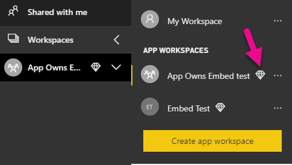

## Next steps

In this tutorial, you've learned how to embed Power BI content into an application for your customers. You can also try to embed Power BI content for your organization.

> [!div class="nextstepaction"]
>[Embed for your organization](embed-sample-for-your-organization.md)

More questions? [Try asking the Power BI Community](http://community.powerbi.com/)
