# Tutorial: Embed a Power BI report, dashboard or tile into your application using app owns data
In this tutorial you will learn how to embed a report, dashboard or tile into an application when embedding for your customers. This is typically for an ISV scenario. To integrate a report into an application, you use the **Power BI** API, and an Azure Active Directory (AD) authorization **access token** to get a report. Then, you load the report using an embed token. The **Power BI** API provides programmatic access to certain **Power BI** resources.

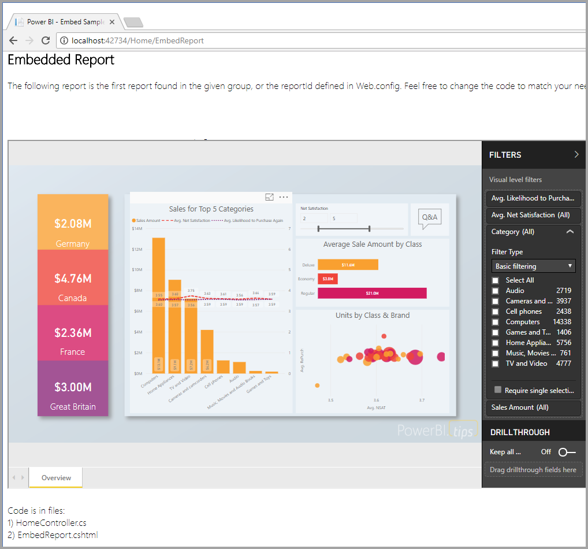

>[!div class="checklist"]
>* Register an application in Azure.
>* Embed a Report, Dashboard, or Tile in Power BI using Power BI Embedded in Axure.

To get started with this walkthrough, you need a **Power BI Pro** account and a **Microsoft Azure** account. If you're not signed up for **Power BI Pro**, [sign up for a free trial](https://powerbi.microsoft.com/en-us/pricing/) before you begin. If you don’t have an Azure subscription, create a [free account](https://azure.microsoft.com/free/?WT.mc_id=A261C142F) before you begin.

## Prerequisites
* You need a [Power BI Pro](https://powerbi.microsoft.com/en-us/pricing/) account.
* You need an [Azure](https://azure.microsoft.com/free/?WT.mc_id=A261C142F) account.
* You need to have your own [Azure Active Directory tenant ](create-an-azure-active-directory-tenant.md) setup.
* You need a pre-built application (Here is an [App Owns Data sample](https://github.com/Microsoft/PowerBI-Developer-Samples) to get started.)

## Download the sample
This article shows the code used in the [App Owns Data sample](https://github.com/Microsoft/PowerBI-Developer-Samples) on GitHub. 

## Setup your embedded analytics development environment

Before you start embedding reports, dashboard, or tiles into your application, you need to make sure your environment is setup to allow for embedding. As part of the setup, you will need to do the following.

### Register an application in Azure Active Directory

You register your application with Azure Active Directory to allow your application access to the Power BI REST APIs. This allows you to establish an identity for your application and specify permissions to Power BI REST resources.

1. Accept the [Microsoft Power BI API Terms](https://powerbi.microsoft.com/api-terms).

2. Sign into the [Azure portal](https://portal.azure.com).

    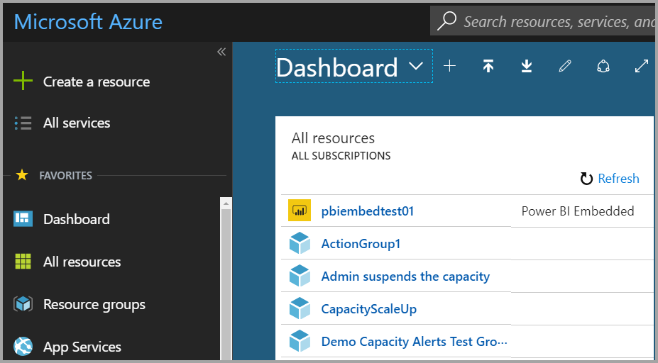

3. In the left-hand navigation pane, choose **More Services**, select **App Registrations** under **Security + Identity** and select **New application registration**.
   
    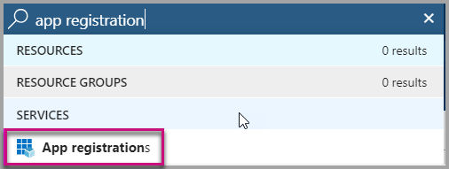 
    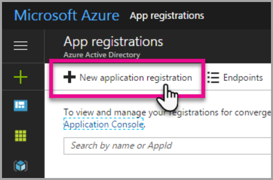

4. Follow the prompts and create a new application. This is a Native Application sample, so you need to provide a Redirect URI, which Azure AD uses to return token responses. Enter a value specific to your application, .e.g http://localhost:13526/redirect

    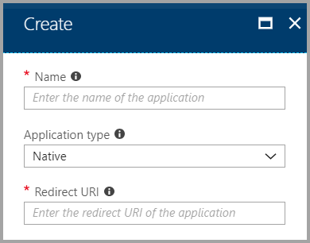

### Get the client id
When you register an application, you receive a **Client ID**. The **Client ID** is used by the application to identify themselves to the users that they are requesting permissions from.

1. Sign into the [Azure portal](https://portal.azure.com).

    

2. In the left-hand navigation pane, choose **More Services** and select **App Registrations**.

    

3. Select the application that you want to retrieve the client id for.

    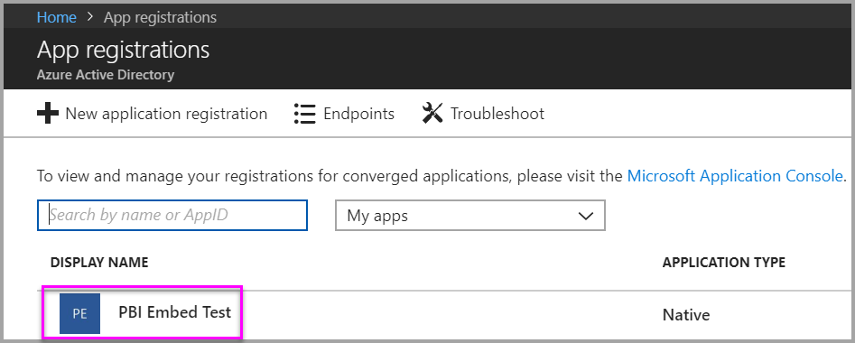

4. You will see **Application ID** listed as a GUID. This is the client id for the application.
   
    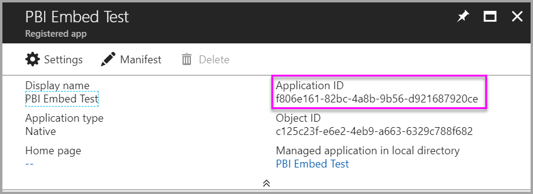

### Apply permissions to your application within Azure Active Directory

You will need to enable additional permissions to your application in addition to what was provided in app registration page. You can accomplish this through the Azure Active Directory portal, or programmatically.

You need to be logged in with the *master* account, used for embedding, which needs to be a global admin account.

### Use the Azure Active Directory portal

1. Browse to [App registrations](https://portal.azure.com/#blade/Microsoft_AAD_IAM/ApplicationsListBlade) within the Azure portal and select the app that you are using for embedding.
   
    

2. Select **Settings** then select **Required permissions** under **API Access**.
   
    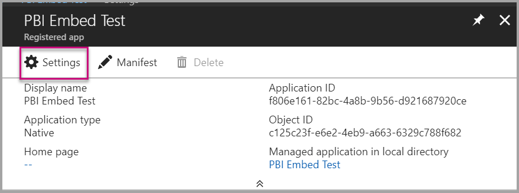 
    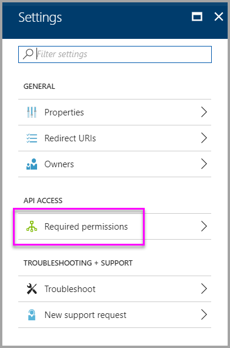

3. Select **Windows Azure Active Directory** and then make sure **Access the directory as the signed-in user** is selected. Select **Save**.
   
    

4. Select **Add**.

    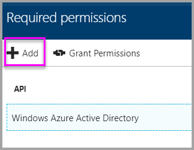

5. Select **Select an API**.

    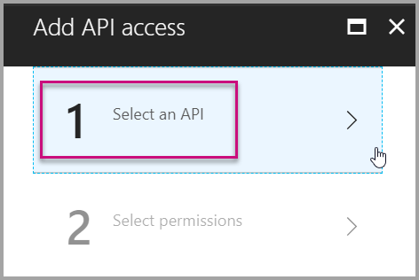

6. Select **Power BI Service**, then select **Select**.

    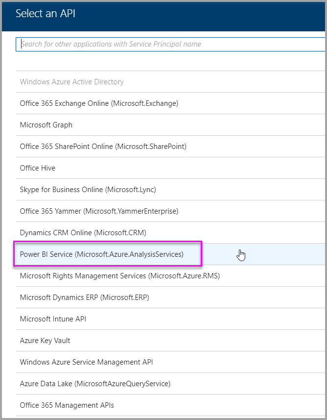

7. Select all permissions under **Delegated Permissions**. You will need to select them one by one in order to save the selections. Select **Save** when done.
   
    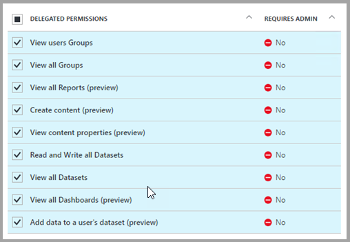

8. Within **Required permissions**, select **Grant Permissions**.
   
    The **Grant Permissions** action is needed for the *master account* to avoid being prompted for consent by Azure AD. If the account performing this action is a Global Admin, you will grant permissions to all users within your organization for this application. If the account performing this action is the *master account* and is not a Global Admin, you will grant permissions only to the *master account* for this application.
   
    

### Create your Power BI Embedded Dedicated Capacity in Azure

1. Sign into the [Azure portal](https://portal.azure.com).

    

2. In the left-hand navigation pane, choose **More Services** and select **Power BI Embedded**.

    

3. Follow the prompts and fill in the proper information needed to create a new Power BI Embedded Dedicated Capacity, and then select **Create**. When choosing the **Pricing Tier**, review the table below to decide which tier bests suits your needs.

    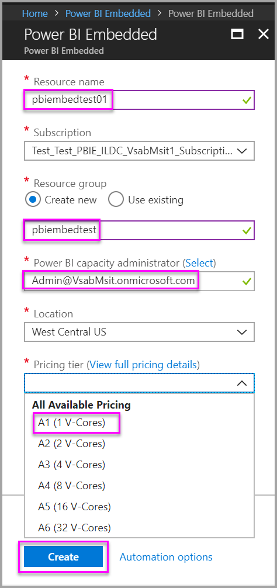

| Capacity Node | Total cores *(Backend + frontend)* | Backend Cores | Frontend Cores | DirectQuery/live connection limits | Max page renders at peak hour |
| --- | --- | --- | --- | --- | --- |
| A1 |1 v-cores |.5 cores, 3GB RAM |.5 cores | 5 per second |1-300 |
| A2 |2 v-cores |1 core, 5GB RAM |1 core | 10 per second |301-600 |
| A3 |4 v-cores |2 cores, 10GB RAM |2 cores | 15 per second |601-1,200 |
| A4 |8 v-cores |4 cores, 25GB RAM |4 cores |30 per second |1,201-2,400 |
| A5 |16 v-cores |8 cores, 50GB RAM |8 cores |60 per second |2,401-4,800 |
| A6 |32 v-cores |16 cores, 100GB RAM |16 cores |120 per second |4,801-9600 |

4. Now you can view the new **Power BI Embedded dedicated capacity** created.

    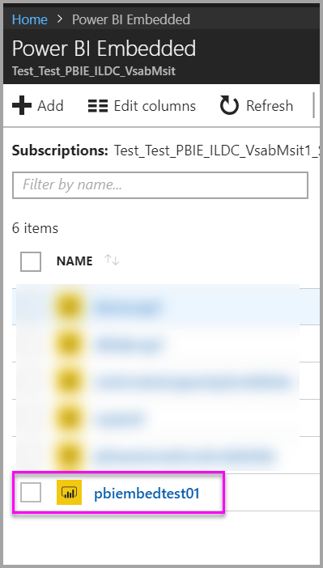

### Create app workspaces

If you are embedding dashboards and reports for your customers, those dashboards and reports have to be placed within an app workspace. The *master* account, that was mentioned above, must be an admin of the app workspace.

1. Start by creating the workspace. Select **workspaces** > **Create app workspace**. Create app workspace. This will be the place to put content that you and your colleagues collaborate on.

    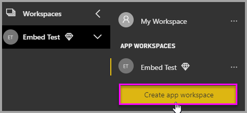

2. Give the workspace a name. If the corresponding **Workspace ID** isn't available, edit it to come up with a unique ID. This will be the name of the app, too.

    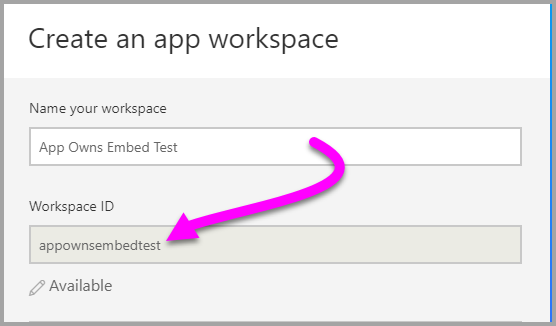

3. You have a few options to set. If you choose **Public**, anyone in your organization can see what’s in the workspace. **Private**, on the other hand, means only members of the workspace can see its contents.

    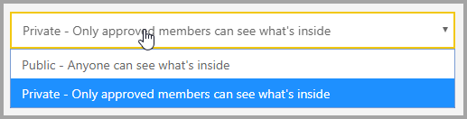

    You can't change the Public/Private setting after you've created the group.

4. You can also choose if members can **edit** or have **view-only** access.

    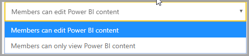

Set edit or view-only

Only add people to the app workspace so they can edit the content. If they're only going to view the content, don't add them to the workspace. You can include them when you publish the app.

5. Add email addresses of people you want to have access to the workspace, and select **Add**. You can’t add group aliases, just individuals.

6. Decide whether each person is a member or an admin. Admins can edit the workspace itself, including adding other members. Members can edit the content in the workspace, unless they have view-only access. Both admins and members can publish the app.

7. Expand **Advanced**, then enable **Dedicated capacity**, then select the **Power BI Embedded dedicated capacity** you created. 

    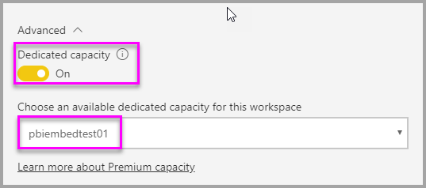

8. Select Save.

9. Power BI creates the workspace and opens it. It appears in the list of workspaces you’re a member of. Because you’re an admin, you can select the ellipsis (…) to go back and make changes to it, adding new members or changing their permissions.

    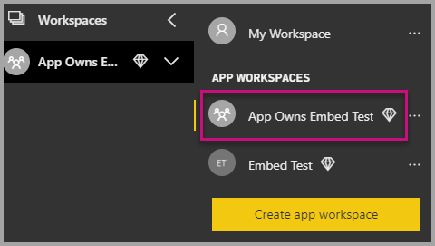

### Create and upload your reports

You can create your reports and datasets using Power BI Desktop and then publish those reports to an app workspace. The end user publishing the reports need to have a Power BI Pro license in order to publish to an app workspace.

Download the sample [Blog Demo](https://github.com/Microsoft/powerbi-desktop-samples) from GitHub.

   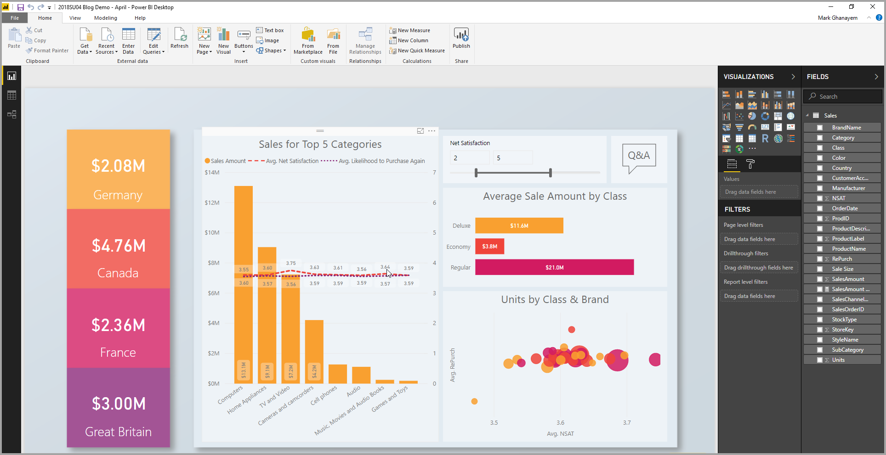

## Step 2: Embed your content

Within your application, you will need to authenticate with Power BI. If you are embedding content for your customers, you will store the credentials for the *master* account within your application. For more information, see [Authenticate users and get an Azure AD access token for your Power BI app](get-azuread-access-token.md).

Once authenticated, within your application, use the Power BI REST APIs and JavaScript APIs to embed dashboards and reports into your application. 

For **embedding for your organization**, see the following walkthroughs:

* [Integrate a dashboard into an app](integrate-dashboard.md)
* [Integrate a tile into an app](integrate-tile.md)
* [Integrate a report into an app](integrate-report.md)

For **embeding with your customers**, which is typical for ISVs, see the following:

* [Integrate a dashboard, tile, or report into your application](embed-sample-for-customers.md)

When embedding for your customers, an embed token is required. To learn more see, [GenerateToken](https://msdn.microsoft.com/library/mt784614.aspx).

## Step 3: Promote your solution to production

Moving to production requires a few extra steps.

### Embedding for your organization

If you are embedding for your organization, you only need to let people know how to get to your application. 

Free users can consume content that is embedded from an app workspace (group), if that workspace is backed by capacity. List the Free user as a member of app workspace (group), otherwise you receive a 401 unauthorized error. The following table lists the available Power BI Premium SKUs available within Office 365.

| Capacity Node | Total cores *(Backend + frontend)* | Backend Cores | Frontend Cores | DirectQuery/live connection limits | Max page renders at peak hour |
| --- | --- | --- | --- | --- | --- |
| EM3 |4 v-cores |2 cores, 10GB RAM |2 cores | |601-1,200 |
| P1 |8 v-cores |4 cores, 25GB RAM |4 cores |30 per second |1,201-2,400 |
| P2 |16 v-cores |8 cores, 50GB RAM |8 cores |60 per second |2,401-4,800 |
| P3 |32 v-cores |16 cores, 100GB RAM |16 cores |120 per second |4,801-9600 |

> [!NOTE]
> You must be a Global or Billing Admin, within your tenant, in order to purchase Power BI Premium. For information on how to purchase Power BI Premium, see [How to purchase Power BI Premium](../service-admin-premium-purchase.md).

### Embedding for your customers

If you are embedding for your customers, do the following.

* If you are using a separate tenant for development, then you must make sure your app workspaces, along with dashboards and reports, are available in your production environment. Make sure that you create the application in Azure AD for your production tenant and assign the proper app permissions as indicated in Step 1.
* Purchase a capacity that fits your needs. You can use the table below to understand which Power BI Embedded capacity SKU you may need. For more details, see [Embedded analytics capacity planning whitepaper](https://aka.ms/pbiewhitepaper). When you are ready to purchase, you can do so within the [Microsoft Azure portal](https://portal.azure.com). For details on how to create Power BI Embedded capacity, see [Create Power BI Embedded capacity in the Azure portal](https://docs.microsoft.com/azure/power-bi-embedded/create-capacity).

> [!IMPORTANT]
> Because embed tokens are intended for development testing only, the number of embed tokens a Power BI master account can generate is limited. A [capacity must be purchased](https://docs.microsoft.com/power-bi/developer/embedded-faq#technical) for production embedding scenarios. There is no limit to embed token generation when a capacity is purchased. Go to [Get Available Features](https://msdn.microsoft.com/en-us/library/mt846473.aspx) to check for how many free embed tokens have been used.

| Capacity Node | Total cores *(Backend + frontend)* | Backend Cores | Frontend Cores | DirectQuery/live connection limits | Max page renders at peak hour |
| --- | --- | --- | --- | --- | --- |
| A1 |1 v-cores |.5 cores, 3GB RAM |.5 cores | 5 per second |1-300 |
| A2 |2 v-cores |1 core, 5GB RAM |1 core | 10 per second |301-600 |
| A3 |4 v-cores |2 cores, 10GB RAM |2 cores | 15 per second |601-1,200 |
| A4 |8 v-cores |4 cores, 25GB RAM |4 cores |30 per second |1,201-2,400 |
| A5 |16 v-cores |8 cores, 50GB RAM |8 cores |60 per second |2,401-4,800 |
| A6 |32 v-cores |16 cores, 100GB RAM |16 cores |120 per second |4,801-9600 |

* Edit the app workspace and assign it to a capacity under advanced.

    

* Deploy your updated application to production and begin embedding Power BI dashboards and reports.

## Admin settings

Global Admins, or Power BI service administrators, can turn the ability to use the REST APIs, on or off for a tenant. Power BI admins can set this setting for the entire organization, or for individual security groups. It is enabled for the entire organization by default. This is done through the [Power BI admin portal](../service-admin-portal.md).

More questions? [Try asking the Power BI Community](http://community.powerbi.com/)