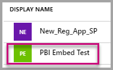

# Tutorial: Embed a Power BI report, dashboard or tile into an application for your customers
As an ISV developer you can embed reports, dashbards, or tiles into an application so that you can deliver information to your customers. To integrate a report, dashboard, or tile into an application, you use the **Power BI** API, an **Azure Active Directory (Azure AD)** authorization **access token** and an embed token.

In this tutorial, you learn how to:
>[!div class="checklist"]
>* Register an application in Azure.
>* Embed a report, dashboard, or tile into an application using Power BI Embedded in Azure.


## Prerequisites
To get started, you need a **Power BI Pro** account and a **Microsoft Azure** account.

* If you're not signed up for **Power BI Pro**, [sign up for a free trial](https://powerbi.microsoft.com/en-us/pricing/) before you begin.
* If you don’t have an Azure subscription, create a [free account](https://azure.microsoft.com/free/?WT.mc_id=A261C142F) before you begin.
* You need to have your own [Azure Active Directory tenant ](create-an-azure-active-directory-tenant.md) setup.
* You need a pre-built application (Here is an [App Owns Data application sample](https://github.com/Microsoft/PowerBI-Developer-Samples) to get started.)

## Setup your embedded analytics development environment

Before you start embedding reports, dashboard, or tiles into your application, you need to make sure your environment is setup to allow for embedding. As part of the setup, you will need to do the following.

### Register an application in Azure Active Directory (Azure AD)

You register your application with Azure Active Directory to allow your application access to the Power BI REST APIs. This allows you to establish an identity for your application and specify permissions to Power BI REST resources.

1. Accept the [Microsoft Power BI API Terms](https://powerbi.microsoft.com/api-terms).

2. Sign into the [Azure portal](https://portal.azure.com).
 
    

3. In the left-hand navigation pane, choose **More Services**, select **App Registrations** under **Security + Identity** and select **New application registration**.
   
    </br>
    

4. Follow the prompts and create a new application. For apps owns data you need to use **Native** for the application type. You also need to provide a **Redirect URI**, which **Azure AD** uses to return token responses. Enter a value specific to your application (for example: http://localhost:13526/redirect).

    

### Get the client id
When you register an application, you receive a **Client ID**. The **Client ID** is used by the application to identify themselves to the users from which you're requesting permissions.

1. Sign into the [Azure portal](https://portal.azure.com).

    

2. In the left-hand navigation pane, choose **More Services** and select **App Registrations**.

    

3. Select the application that you want to retrieve the client id for.

    

4. You will see **Application ID** listed as a GUID. This is the client id for the application.
   
    

### Apply permissions to your application within Azure Active Directory

You will need to enable additional permissions to your application in addition to what was provided in app registration page. You can accomplish this through the Azure Active Directory portal, or programmatically.

You need to be logged in with the *master* account, used for embedding, which needs to be a global admin account.

### Use the Azure Active Directory portal

1. Browse to [App registrations](https://portal.azure.com/#blade/Microsoft_AAD_IAM/ApplicationsListBlade) within the Azure portal and select the app that you are using for embedding.
   
    

2. Select **Settings**, then under **API Access** select **Required permissions**.
   
    

3. Select **Windows Azure Active Directory** and then make sure **Access the directory as the signed-in user** is selected. Select **Save**.
   
    

4. Select **Add**.

    

5. Select **Select an API**.

    

6. Select **Power BI Service**, then select **Select**.

    

7. Select all permissions under **Delegated Permissions**. You will need to select them one by one in order to save the selections. Select **Save** when done.
   
    

8. Within **Required permissions**, select **Grant Permissions**.
   
    The **Grant Permissions** action is needed for the *master account* to avoid being prompted for consent by Azure AD. If the account performing this action is a Global Admin, you will grant permissions to all users within your organization for this application. If the account performing this action is the *master account* and is not a Global Admin, you will grant permissions only to the *master account* for this application.
   
    

### Create your Power BI Embedded dedicated capacity in Azure

1. Sign into the [Azure portal](https://portal.azure.com).

    

2. In the left-hand navigation pane, choose **More Services** and select **Power BI Embedded**.

    

3. Follow the prompts and fill in the proper information needed to create a new Power BI Embedded Dedicated Capacity, and then select **Create**. When choosing the **Pricing Tier**, review the table below to decide which tier bests suits your needs. Then select **Create** and wait for the resource to complete.

    

| Capacity Node | Total cores<br/>*(Backend + frontend)* | Backend Cores | Frontend Cores | DirectQuery/live connection limits | Max page renders at peak hour |
| --- | --- | --- | --- | --- | --- |
| A1 |1 v-cores |.5 cores, 3GB RAM |.5 cores | 5 per second |1-300 |
| A2 |2 v-cores |1 core, 5GB RAM |1 core | 10 per second |301-600 |
| A3 |4 v-cores |2 cores, 10GB RAM |2 cores | 15 per second |601-1,200 |
| A4 |8 v-cores |4 cores, 25GB RAM |4 cores |30 per second |1,201-2,400 |
| A5 |16 v-cores |8 cores, 50GB RAM |8 cores |60 per second |2,401-4,800 |
| A6 |32 v-cores |16 cores, 100GB RAM |16 cores |120 per second |4,801-9600 |

4. Now you can view the new **Power BI Embedded dedicated capacity** created.

    

## Setup your Power BI environment

### Create an app workspace

If you are embedding reports, dashboards, or tiles for your customers, then you have to be place your content within an app workspace. The *master* account must be an admin of the app workspace.

1. Start by creating the workspace. Select **workspaces** > **Create app workspace**. Create app workspace. This will be the place to put content that your application needs to access.

    

2. Give the workspace a name. If the corresponding **Workspace ID** isn't available, edit it to come up with a unique ID. This will be the name of the app, too.

    

3. You have a few options to set. If you choose **Public**, anyone in your organization can see what’s in the workspace. **Private**, on the other hand, means only members of the workspace can see its contents.

    

    You can't change the Public/Private setting after you've created the group.

4. You can also choose if members can **edit** or have **view-only** access.

    

5. Add email addresses of people you want to have access to the workspace, and select **Add**. You can’t add group aliases, just individuals.

6. Decide whether each person is a member or an admin. Admins can edit the workspace itself, including adding other members. Members can edit the content in the workspace, unless they have view-only access. Both admins and members can publish the app.

7. Expand **Advanced**, then enable **Dedicated capacity**, then select the **Power BI Embedded dedicated capacity** you created. THen select **Save**.

    

Now you can view the new workspace. Power BI creates the workspace and opens it. It appears in the list of workspaces you’re a member of. Because you’re an admin, you can select the ellipsis (…) to go back and make changes to it, adding new members or changing their permissions.

   

### Create and publish your reports

You can create your reports and datasets using Power BI Desktop and then publish those reports to an app workspace. The end user publishing the reports need to have a Power BI Pro license in order to publish to an app workspace.

1. Download the sample [Blog Demo](https://github.com/Microsoft/powerbi-desktop-samples) from GitHub.

    

2. Open sample PBIX report in **Power BI Desktop**

   

3. Publish to the **app workspace**

   

    Now you can view the report in the Power BI service online

   

## Embed your content

1. Download the [App Owns Data sample](https://github.com/Microsoft/PowerBI-Developer-Samples) from GitHub to get started.

    

2. Open up the Web.config file in the sample application.

    

    * Fill in the clientId information with the Application Id from Azure.

    

    * Fill in the groupId information with the app workspace GUID from Power BI.

    

    * Fill in the reportId information with the report GUID from Power BI.

        

    * Fill in the pbuUsername with the master user Power BI account.
    * Fill in the pbiPassword with the password for the master user Power BI account.

3. Run the application

    

    
 
    

The below examples are based on the downloaded sample used in this tutorial.
### Get an access token from Azure AD
Within your application, you will first need to get an **access token**, from Azure AD, before you can make calls to the Power BI REST API. For more information, see [Authenticate users and get an Azure AD access token for your Power BI app](get-azuread-access-token.md).

You can see examples of this within each content item task in **Controllers\HomeController.cs**.

### Get a content item
To embed your Power BI content, you will need to do a couple of things to make sure it embeds correctly. While all of these steps can be done with the REST API directly, the examples here are made with the .NET SDK.

### Create the Power BI Client with your access token
With your access token, you will want to create your Power BI client object which will allow you to interact with the Power BI APIs. This is done by wrapping the AccessToken with a *Microsoft.Rest.TokenCredentials* object.

```
using Microsoft.IdentityModel.Clients.ActiveDirectory;
using Microsoft.Rest;
using Microsoft.PowerBI.Api.V2;

var tokenCredentials = new TokenCredentials(authenticationResult.AccessToken, "Bearer");

// Create a Power BI Client object. It will be used to call Power BI APIs.
using (var client = new PowerBIClient(new Uri(ApiUrl), tokenCredentials))
{
    // Your code to embed items.
}
```
### Get the content item you want to embed
Use the Power BI client object to retrieve a reference to the item you want to embed. You can embed dashboards, tiles or reports. Here is an example of how to retrieve the first dashboard, tile or report from a given workspace.

A sample of this is available within **Controllers\HomeController.cs** of the [App Owns Data sample](https://github.com/Microsoft/PowerBI-Developer-Samples).

**Reports**

```
using Microsoft.PowerBI.Api.V2;
using Microsoft.PowerBI.Api.V2.Models;

// You will need to provide the GroupID where the dashboard resides.
ODataResponseListReport reports = client.Reports.GetReportsInGroupAsync(GroupId);

// Get the first report in the group.
Report report = reports.Value.FirstOrDefault();
```

**Dashboards**

```
using Microsoft.PowerBI.Api.V2;
using Microsoft.PowerBI.Api.V2.Models;

// You will need to provide the GroupID where the dashboard resides.
ODataResponseListDashboard dashboards = client.Dashboards.GetDashboardsInGroup(GroupId);

// Get the first report in the group.
Dashboard dashboard = dashboards.Value.FirstOrDefault();
```

**Tiles**

```
using Microsoft.PowerBI.Api.V2;
using Microsoft.PowerBI.Api.V2.Models;

// To retrieve the tile, you first need to retrieve the dashboard.

// You will need to provide the GroupID where the dashboard resides.
ODataResponseListDashboard dashboards = client.Dashboards.GetDashboardsInGroup(GroupId);

// Get the first report in the group.
Dashboard dashboard = dashboards.Value.FirstOrDefault();

// Get a list of tiles from a specific dashboard
ODataResponseListTile tiles = client.Dashboards.GetTilesInGroup(GroupId, dashboard.Id);

// Get the first tile in the group.
Tile tile = tiles.Value.FirstOrDefault();
```

### Create the embed token
An embed token needs to be generated which can be used from the JavaScript API. The embed token will be specific to the item you are embedding. This means that any time you embed a piece of Power BI content, you need to create a new embed token for it. For more information, including which **accessLevel** to use, see [GenerateToken API](https://msdn.microsoft.com/library/mt784614.aspx).

> [!IMPORTANT]
> Because embed tokens are intended for development testing only, the number of embed tokens a Power BI master account can generate is limited. A [capacity must be purchased](https://docs.microsoft.com/power-bi/developer/embedded-faq#technical) for production embedding scenarios. There is no limit to embed token generation when a capacity is purchased. Go to [Get Available Features](https://msdn.microsoft.com/en-us/library/mt846473.aspx) to check for the percantage of embed tokens used.

A sample of this is available within **Controllers\HomeController.cs** of the [Embedding for your organization sample](https://github.com/Microsoft/PowerBI-Developer-Samples/tree/master/App%20Owns%20Data).

This assumes a class is created for **EmbedConfig** and **TileEmbedConfig**. A sample of these are available within **Models\EmbedConfig.cs** and **Models\TileEmbedConfig.cs**.

**Reports**

```
using Microsoft.PowerBI.Api.V2;
using Microsoft.PowerBI.Api.V2.Models;

// Generate Embed Token.
var generateTokenRequestParameters = new GenerateTokenRequest(accessLevel: "view");
EmbedToken tokenResponse = client.Reports.GenerateTokenInGroup(GroupId, report.Id, generateTokenRequestParameters);

// Generate Embed Configuration.
var embedConfig = new EmbedConfig()
{
    EmbedToken = tokenResponse,
    EmbedUrl = report.EmbedUrl,
    Id = report.Id
};
```

**Dashboards**

```
using Microsoft.PowerBI.Api.V2;
using Microsoft.PowerBI.Api.V2.Models;

// Generate Embed Token.
var generateTokenRequestParameters = new GenerateTokenRequest(accessLevel: "view");
EmbedToken tokenResponse = client.Dashboards.GenerateTokenInGroup(GroupId, dashboard.Id, generateTokenRequestParameters);

// Generate Embed Configuration.
var embedConfig = new EmbedConfig()
{
    EmbedToken = tokenResponse,
    EmbedUrl = dashboard.EmbedUrl,
    Id = dashboard.Id
};
```

**Tiles**

```
using Microsoft.PowerBI.Api.V2;
using Microsoft.PowerBI.Api.V2.Models;

// Generate Embed Token for a tile.
var generateTokenRequestParameters = new GenerateTokenRequest(accessLevel: "view");
EmbedToken tokenResponse = client.Tiles.GenerateTokenInGroup(GroupId, dashboard.Id, tile.Id, generateTokenRequestParameters);

// Generate Embed Configuration.
var embedConfig = new TileEmbedConfig()
{
    EmbedToken = tokenResponse,
    EmbedUrl = tile.EmbedUrl,
    Id = tile.Id,
    dashboardId = dashboard.Id
};
```
### Load an item using JavaScript
You can use JavaScript to load a dashboard into a div element on your web page. The sample uses an EmbedConfig/TileEmbedConfig model along with views for a report, dashboard or . For a full sample of using the JavaScript API, you can use the [Microsoft Power BI Embedded Sample](https://microsoft.github.io/PowerBI-JavaScript/demo).

**Views\Home\EmbedReport.cshtml**

```
<script src="~/scripts/powerbi.js"></script>
<div id="reportContainer"></div>
<script>
    // Read embed application token from Model
    var accessToken = "@Model.EmbedToken.Token";

    // Read embed URL from Model
    var embedUrl = "@Html.Raw(Model.EmbedUrl)";

    // Read report Id from Model
    var embedReportId = "@Model.Id";

    // Get models. models contains enums that can be used.
    var models = window['powerbi-client'].models;

    // Embed configuration used to describe the what and how to embed.
    // This object is used when calling powerbi.embed.
    // This also includes settings and options such as filters.
    // You can find more information at https://github.com/Microsoft/PowerBI-JavaScript/wiki/Embed-Configuration-Details.
    var config = {
        type: 'report',
        tokenType: models.TokenType.Embed,
        accessToken: accessToken,
        embedUrl: embedUrl,
        id: embedReportId,
        permissions: models.Permissions.All,
        settings: {
            filterPaneEnabled: true,
            navContentPaneEnabled: true
        }
    };

    // Get a reference to the embedded report HTML element
    var reportContainer = $('#reportContainer')[0];

    // Embed the report and display it within the div container.
    var report = powerbi.embed(reportContainer, config);
</script>
```

**Views\Home\EmbedDashboard.cshtml**

```
<script src="~/scripts/powerbi.js"></script>
<div id="dashboardContainer"></div>
<script>
    // Read embed application token from Model
    var accessToken = "@Model.EmbedToken.Token";

    // Read embed URL from Model
    var embedUrl = "@Html.Raw(Model.EmbedUrl)";

    // Read dashboard Id from Model
    var embedDashboardId = "@Model.Id";

    // Get models. models contains enums that can be used.
    var models = window['powerbi-client'].models;

    // Embed configuration used to describe the what and how to embed.
    // This object is used when calling powerbi.embed.
    // This also includes settings and options such as filters.
    // You can find more information at https://github.com/Microsoft/PowerBI-JavaScript/wiki/Embed-Configuration-Details.
    var config = {
        type: 'dashboard',
        tokenType: models.TokenType.Embed,
        accessToken: accessToken,
        embedUrl: embedUrl,
        id: embedDashboardId
    };

    // Get a reference to the embedded dashboard HTML element
    var dashboardContainer = $('#dashboardContainer')[0];

    // Embed the dashboard and display it within the div container.
    var dashboard = powerbi.embed(dashboardContainer, config);
</script>
```

**Views\Home\EmbedTile.cshtml**

```
<script src="~/scripts/powerbi.js"></script>
<div id="tileContainer"></div>
<script>
    // Read embed application token from Model
    var accessToken = "@Model.EmbedToken.Token";

    // Read embed URL from Model
    var embedUrl = "@Html.Raw(Model.EmbedUrl)";

    // Read tile Id from Model
    var embedTileId = "@Model.Id";

    // Read dashboard Id from Model
    var embedDashboardeId = "@Model.dashboardId";

    // Get models. models contains enums that can be used.
    var models = window['powerbi-client'].models;

    // Embed configuration used to describe the what and how to embed.
    // This object is used when calling powerbi.embed.
    // This also includes settings and options such as filters.
    // You can find more information at https://github.com/Microsoft/PowerBI-JavaScript/wiki/Embed-Configuration-Details.
    var config = {
        type: 'tile',
        tokenType: models.TokenType.Embed,
        accessToken: accessToken,
        embedUrl: embedUrl,
        id: embedTileId,
        dashboardId: embedDashboardeId
    };

    // Get a reference to the embedded tile HTML element
    var tileContainer = $('#tileContainer')[0];

    // Embed the tile and display it within the div container.
    var tile = powerbi.embed(tileContainer, config);
</script>
```

## Next steps
* More Information about the JavaScript API, see [Power BI JavaScript API](https://github.com/Microsoft/PowerBI-JavaScript).

More questions? [Try asking the Power BI Community](http://community.powerbi.com/)