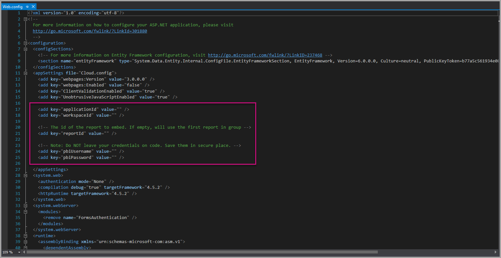

# Tutorial: Embed a Power BI report, dashboard, or tile into an application for your customers

With **Power BI Embedded in Azure**, you can embed reports, dashboards, or tiles into an application using **app owns data**. **App owns data** is about having an application that uses Power BI as its embedded analytics platform. Using **app owns data** is typically an **ISV developer** scenario. As an **ISV developer**, you can create **Power BI** content that displays reports, dashboards, or tiles in an application that is fully integrated and interactive, without requiring users of the application to have a Power BI license. This tutorial demonstrates how to integrate a report into an application using the **Power BI** .NET SDK along with the **Power BI** JavaScript API when using **Power BI Embedded in Azure** for your customers using **app owns data**.

In this tutorial, you learn how to:
>[!div class="checklist"]
>* Register an application in Azure.
>* Embed a Power BI report into an application.

## Prerequisites

To get started, you need a **Power BI Pro** account (this account is your **master account**) and a **Microsoft Azure** subscription.

* If you're not signed up for **Power BI Pro**, [sign up for a free trial](https://powerbi.microsoft.com/en-us/pricing/) before you begin.
* If you don’t have an Azure subscription, create a [free account](https://azure.microsoft.com/free/?WT.mc_id=A261C142F) before you begin.
* You need to have your own [Azure Active Directory tenant ](create-an-azure-active-directory-tenant.md) setup.
* You need [Visual Studio](https://www.visualstudio.com/) installed (version 2013 or later).

## Set up your embedded analytics development environment

Before you start embedding reports, dashboard, or tiles into your application, you need to make sure your environment allows for embedding with Power BI.

You can go through the [Embedding setup tool](https://aka.ms/embedsetup/AppOwnsData) so you can quickly get started and download a sample application that helps you walk through creating an environment and embedding a report.

However, if you choose to set up the environment manually, you can continue below.

### Register an application in Azure Active Directory (Azure AD)

You register your application with Azure Active Directory to allow your application access to the Power BI REST APIs. Registering your application allows you to establish an identity for your application and specify permissions to Power BI REST resources.

1. Accept the [Microsoft Power BI API Terms](https://powerbi.microsoft.com/api-terms).

2. Sign into the [Azure portal](https://portal.azure.com).

    

3. In the left-hand navigation pane, select **All Services**, select **App Registrations**, and then select **New application registration**.

    </br>
    

4. Follow the prompts and create a new application. For app owns data you need to use **Native** for the application type. You also need to provide a **Redirect URI**, which **Azure AD** uses to return token responses. Enter a value specific to your application (for example: `http://localhost:13526/Redirect`).

    

### Apply permissions to your application within Azure Active Directory

Enable additional permissions for your application, including what was provided on the app registration page. Sign in with the *master* account that you're using for embedding. The master account needs to be a global admin account.

### Use the Azure Active Directory portal

1. Browse to [App registrations](https://portal.azure.com/#blade/Microsoft_AAD_IAM/ApplicationsListBlade) within the Azure portal and select the app that you're using for embedding.

    

2. Select **Settings**, then under **API Access** select **Required permissions**.

    

3. Select **Windows Azure Active Directory** and then make sure **Access the directory as the signed-in user** is selected. Select **Save**.

    

4. Select **Add**.

    

5. Select **Select an API**.

    

6. Select **Power BI Service**, then select **Select**.

    

7. Select all permissions under **Delegated Permissions**. Select **Save** when done.

    

8. Within **Required permissions**, select **Grant Permissions**.

    The **Grant Permissions** action needs the *master account* to avoid being prompted for consent by Azure AD. If the account performing this action is a Global Admin, you need to grant permissions to all users within your organization for this application. If the account performing this action is the *master account* and is not a Global Admin, you need to grant permissions only to the *master account* for this application.

    

## Set up your Power BI environment

### Create an app workspace

If you're embedding reports, dashboards, or tiles for your customers, then you have to place your content within an app workspace. The *master* account must be an admin of the app workspace.

1. Start by creating the workspace. Select **workspaces** > **Create app workspace**. In Create app workspace, place the content that your application needs to access.

    

2. Give the workspace a name. If the corresponding **Workspace ID** isn't available, edit it to come up with a unique ID.

    

3. You have a few options to set. If you choose **Public**, anyone in your organization can see what’s in the workspace. If you choose **Private**, this means only members of the workspace can see its contents.

    

    You can't change the Public/Private setting after you've created the group.

4. You can also choose if members can **edit** or have **view-only** access.

    

5. Add email addresses of people you want to have access to the workspace, and select **Add**. You can’t add group aliases, just individuals.

6. Decide whether each person is a member or an admin. Admins can edit the workspace itself, including adding other members. Members can edit the content in the workspace unless they have view-only access. Both admins and members can publish the app.

    Now you can view the new workspace. Power BI creates the workspace and opens it. It appears in the list of workspaces in which you’re a member. Because you’re an admin, you can select the ellipsis (…) to go back and make changes to it, adding new members or changing their permissions.

    

### Create and publish your reports

You can create your reports and datasets using Power BI Desktop and then publish those reports to an app workspace. The end user publishing the reports need to have a Power BI Pro license to publish to an app workspace.

1. Download the sample [Blog Demo](https://github.com/Microsoft/powerbi-desktop-samples) from GitHub.

    

2. Open sample PBIX report in **Power BI Desktop**

   

3. Publish to the **app workspace**

   

    Now you can view the report in the Power BI service online.

   

## Embed your content using the sample application

Follow these steps to start embedding your content using a sample application.

1. Download the [App Owns Data sample](https://github.com/Microsoft/PowerBI-Developer-Samples) from GitHub to get started.

    

2. Open up the Web.config file in the sample application. There are five fields you need to fill in to run the application successfully. The **applicationId**, the **workspaceId**, the **reportId**, the **pbiUsername**, and the **pbiPassword**.

    

    Fill in the **applicationId** information with the **Application ID** from **Azure**. The **applicationId** is used by the application to identify itself to the users from which you're requesting permissions. To get the **applicationId**, follow these steps:

    Sign into the [Azure portal](https://portal.azure.com).

    

    In the left-hand navigation pane, select **All Services**, and select **App Registrations**.

    

    Select the application that you want to get the **applicationId** for.

    

    You should see an **Application ID** that is listed as a GUID. Use this **Application ID** as the **applicationId** for the application.

    

    Fill in the **workspaceId** information with the **app workspace GUID** from Power BI.

    

    Fill in the **reportId** information with the **report GUID** from Power BI.

    

    * Fill in the **pbiUsername** with the Power BI master user account.
    * Fill in the **pbiPassword** with the password for the Power BI master user account.

3. Run the application!

    First select **Run** in **Visual Studio**.

    

    Then select **Embed Report**. Depending on which content you choose to test with - reports, dashboards or tiles - then select that option in the application.

    

    Now you can view the report in the sample application.

    

## Embed your content within your application

Even though the steps to embed your content can be done with the [Power BI REST APIs](https://docs.microsoft.com/rest/api/power-bi/), the example codes described in this article are made with the **.NET SDK**.

Embedding for your customers within your application requires you to get an **access token** for your master account from **Azure AD**. It's required to get an [Azure AD access token](get-azuread-access-token.md#access-token-for-non-power-bi-users-app-owns-data) for your Power BI application using **app owns data** before you make calls to the [Power BI REST APIs](https://docs.microsoft.com/rest/api/power-bi/).

To create the Power BI Client with your **access token**, you want to create your Power BI client object, which allows you to interact with the [Power BI REST APIs](https://docs.microsoft.com/rest/api/power-bi/). You create the Power BI client object by wrapping the **AccessToken** with a ***Microsoft.Rest.TokenCredentials*** object.

```csharp
using Microsoft.IdentityModel.Clients.ActiveDirectory;
using Microsoft.Rest;
using Microsoft.PowerBI.Api.V2;

var tokenCredentials = new TokenCredentials(authenticationResult.AccessToken, "Bearer");

// Create a Power BI Client object. it's used to call Power BI APIs.
using (var client = new PowerBIClient(new Uri(ApiUrl), tokenCredentials))
{
    // Your code to embed items.
}
```

### Get the content item you want to embed

You can use the Power BI client object to retrieve a reference to the item you want to embed.

Here is a code sample of how to retrieve the first report from a given workspace.

*A sample of getting a content item whether it's a report, dashboard, or tile that you want to embed is available within the Controllers\HomeController.cs file in the [sample application](#embed-your-content-within-a-sample-application).*

```csharp
using Microsoft.PowerBI.Api.V2;
using Microsoft.PowerBI.Api.V2.Models;

// You need to provide the workspaceId where the dashboard resides.
ODataResponseListReport reports = await client.Reports.GetReportsInGroupAsync(workspaceId);

// Get the first report in the group.
Report report = reports.Value.FirstOrDefault();
```

### Create the embed token

Generated an embed token, which can be used from the JavaScript API. The embed token is specific to the item you're embedding. So at any time you embed a piece of Power BI content, you need to create a new embed token for it. For more information, including which **accessLevel** to use, see [GenerateToken API](https://msdn.microsoft.com/library/mt784614.aspx).

Here is a sample of adding an embed token for a report to your application.

*A sample of creating an embed token for a report, dashboard, or tile is available within the Controllers\HomeController.cs file in the [sample application](#embed-your-content-within-a-sample-application).*

```csharp
using Microsoft.PowerBI.Api.V2;
using Microsoft.PowerBI.Api.V2.Models;

// Generate Embed Token.
var generateTokenRequestParameters = new GenerateTokenRequest(accessLevel: "view");
EmbedToken tokenResponse = client.Reports.GenerateTokenInGroup(workspaceId, report.Id, generateTokenRequestParameters);

// Generate Embed Configuration.
var embedConfig = new EmbedConfig()
{
    EmbedToken = tokenResponse,
    EmbedUrl = report.EmbedUrl,
    Id = report.Id
};
```

A class is created for **EmbedConfig** and **TileEmbedConfig**. A sample is available within the **Models\EmbedConfig.cs** file and the **Models\TileEmbedConfig.cs file**.

### Load an item using JavaScript

You can use JavaScript to load a report into a div element on your web page.

For a full sample of using the JavaScript API, you can use the [Playground tool](https://microsoft.github.io/PowerBI-JavaScript/demo). The Playground tool is a quick way to play with different types of Power BI Embedded samples. You can also get more Information about the JavaScript API by visiting the [PowerBI-JavaScript wiki](https://github.com/Microsoft/powerbi-javascript/wiki) page.

Here is a sample that uses an **EmbedConfig** model and a **TileEmbedConfig** model along with views for a report.

*A sample of adding a view for a report, dashboard, or tile is available within the Views\Home\EmbedReport.cshtml, Views\Home\EmbedDashboard.cshtml, or the Views\Home\Embedtile.cshtml files in the [sample application](#embed-your-content-within-a-sample-application).*

```javascript
<script src="~/scripts/powerbi.js"></script>
<div id="reportContainer"></div>
<script>
    // Read embed application token from Model
    var accessToken = "@Model.EmbedToken.Token";

    // Read embed URL from Model
    var embedUrl = "@Html.Raw(Model.EmbedUrl)";

    // Read report Id from Model
    var embedReportId = "@Model.Id";

    // Get models. models contains enums that can be used.
    var models = window['powerbi-client'].models;

    // Embed configuration used to describe the what and how to embed.
    // This object is used when calling powerbi.embed.
    // This also includes settings and options such as filters.
    // You can find more information at https://github.com/Microsoft/PowerBI-JavaScript/wiki/Embed-Configuration-Details.
    var config = {
        type: 'report',
        tokenType: models.TokenType.Embed,
        accessToken: accessToken,
        embedUrl: embedUrl,
        id: embedReportId,
        permissions: models.Permissions.All,
        settings: {
            filterPaneEnabled: true,
            navContentPaneEnabled: true
        }
    };

    // Get a reference to the embedded report HTML element
    var reportContainer = $('#reportContainer')[0];

    // Embed the report and display it within the div container.
    var report = powerbi.embed(reportContainer, config);
</script>
```

## Move to production

Now that you've completed developing your application, it's time to back your app workspace with a dedicated capacity. Dedicated capacity is required to move to production.

### Create a dedicated capacity

By creating a dedicated capacity, you can take advantage of having a dedicated resource for your customer. You can purchase a dedicated capacity within the [Microsoft Azure portal](https://portal.azure.com). For details on how to create a Power BI Embedded capacity, see [Create Power BI Embedded capacity in the Azure portal](azure-pbie-create-capacity.md).

Use the table below to determine which Power BI Embedded capacity best fits your needs.

| Capacity Node | Total cores<br/>*(Backend + frontend)* | Backend Cores | Frontend Cores | DirectQuery/live connection limits | Max page renders at peak hour |
| --- | --- | --- | --- | --- | --- |
| A1 |1 v-core(s) |0.5 core(s), 3-GB RAM |0.5 cores |0 5 per second |1-300 |
| A2 |2 v-core(s) |1 core(s), 5-GB RAM |1 cor(e) | 10 per second |301-600 |
| A3 |4 v-core(s) |2 core(s), 10-GB RAM |2 core(s) | 15 per second |601-1,200 |
| A4 |8 v-core(s) |4 core(s), 25-GB RAM |4 core(s) |30 per second |1,201-2,400 |
| A5 |16 v-core(s) |8 core(s), 50-GB RAM |8 core(s) |60 per second |2,401-4,800 |
| A6 |32 v-core(s) |16 core(s), 100-GB RAM |16 core(s) |120 per second |4,801-9600 |

**_With A SKUs, you can't access Power BI content with a FREE Power BI license._**

Using embed tokens with PRO licenses are intended for development testing, so the number of embed tokens a Power BI master account can generate is limited. A dedicated capacity is required for embedding in a production environment. There's no limit on how many embed tokens you can generate with a dedicated capacity. Go to [Available Features](https://docs.microsoft.com/rest/api/power-bi/availablefeatures/getavailablefeatures) to check the usage value that indicates the current embedded usage in percentage. The usage amount is based per master account.

For more information, see [Embedded analytics capacity planning whitepaper](https://aka.ms/pbiewhitepaper).

### Assign an app workspace to a dedicated capacity

Once you create a dedicated capacity, you can assign your app workspace to that dedicated capacity. To assign a dedicated capacity to a workspace, follow these steps.

1. Within the **Power BI service**, expand workspaces and select the ellipsis for the workspace you're using for embedding your content. Then select **Edit workspaces**.

    

2. Expand **Advanced**, then enable **Dedicated capacity**, then select the dedicated capacity you created. Then select **Save**.

    

3. After you select **Save**, you should see a **diamond** next to the app workspace name.

    

## Next steps

In this tutorial, you've learned how to embed Power BI content into an application for your customers. You can also try to embed Power BI content for your organization.

> [!div class="nextstepaction"]
>[Embed for your organization](embed-sample-for-your-organization.md)

More questions? [Try asking the Power BI Community](http://community.powerbi.com/)
