# Tutorial: Embed Power BI content into an application for your organization

In **Power BI**, you can embed reports (Power BI or Paginated), dashboards, or tiles into an application by using user owns data. **User owns data** lets your application extend the Power BI service so it can use embedded analytics. This tutorial demonstrates how to integrate a report (Power BI or Paginated) into an application. You use the Power BI .NET SDK with the Power BI JavaScript API to embed Power BI into an application for your organization.

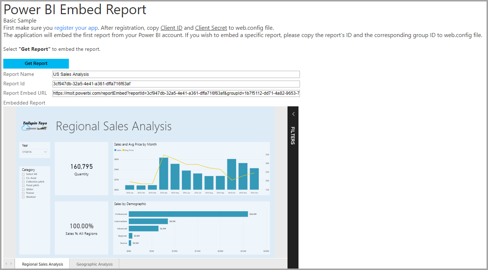

In this tutorial, you learn the following tasks:
> [!div class="checklist"]
> * Register an application in Azure.
> * Embed a Power BI or Paginated report into an application using your Power BI tenant.

## Prerequisites

To get started, you're required to have:

* A [Power BI Pro account](../service-self-service-signup-for-power-bi.md).
* A [Microsoft Azure](https://azure.microsoft.com/) subscription.
* You need to have your own [Azure Active Directory tenant](create-an-azure-active-directory-tenant.md) setup.
* For embedding paginated reports you need at least an A4/P1 capacity [See here](https://docs.microsoft.com/en-us/power-bi/paginated-reports-faq#what-size-premium-capacity-do-i-need-for-paginated-reports).

If you're not signed up for **Power BI Pro**, [sign up for a free trial](https://powerbi.microsoft.com/pricing/) before you begin.

If you don’t have an Azure subscription, create a [free account](https://azure.microsoft.com/free/?WT.mc_id=A261C142F) before you begin.

## Set up your embedded analytics development environment

Before you start embedding reports, dashboard, or tiles into your application, you need to make sure your environment allows for embedding with Power BI.

You can go through the [Embedding setup tool](https://aka.ms/embedsetup/UserOwnsData), so you can quickly get started and download a sample application that helps you walk through creating an environment and embedding a report. In the case of embedding a paginated report you need to assign at least A4/P1 capacity to the created app workspace.

If you choose to set up the environment manually, you can continue below.

### Register an application in Azure Active Directory

[Register your application](register-app.md) with Azure Active Directory to allow your application access to the [Power BI REST APIs](https://docs.microsoft.com/rest/api/power-bi/). Registering your application allows you to establish an identity for your application and specify permissions to Power BI REST resources.

You need to proceed with registering a **server-side web application** app. You register a server-side web application to create an application secret.

## Set up your Power BI environment

### Create an app workspace

If you're embedding reports, dashboards, or tiles for your customers, then you have to place your content within an app workspace. There are different types of workspaces that you can set up: the [traditional workspaces](../service-create-workspaces.md) or the [new workspaces](../service-create-the-new-workspaces.md).

### Create and publish your Power BI reports

You can create your reports and datasets by using Power BI Desktop. Then you can publish those reports to an app workspace. The end user publishing the reports needs to have a Power BI Pro license to publish to an app workspace.

1. Download the sample [Demo](https://github.com/Microsoft/powerbi-desktop-samples) from GitHub.

    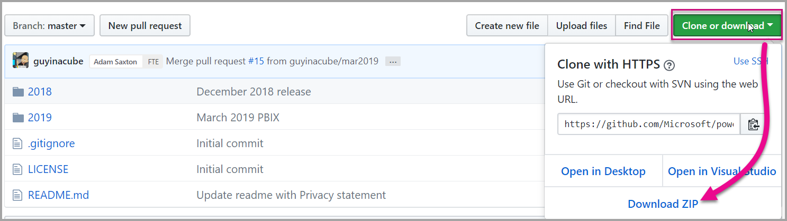

2. Open the sample .pbix report in Power BI Desktop.

   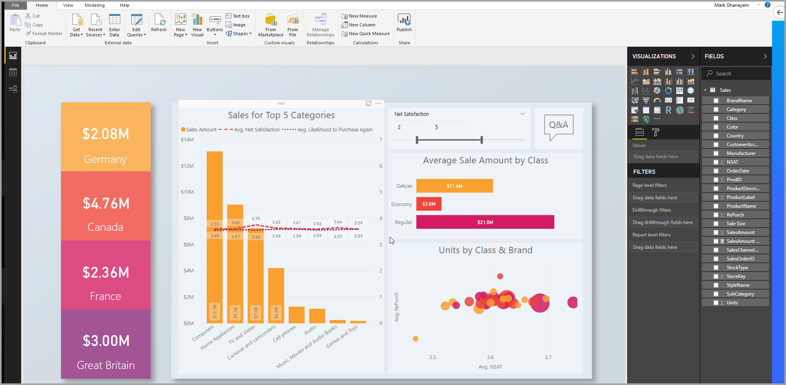

3. Publish to the app workspace.

   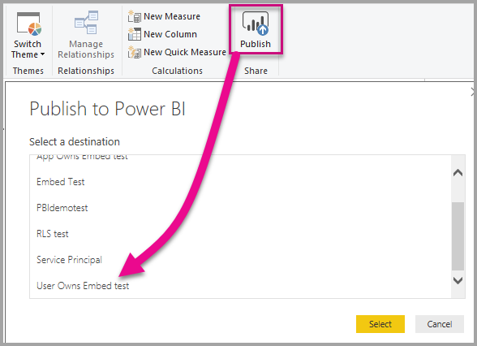

    Now you can view the report in the Power BI service online.

   
   
### Create and publish your paginated reports

You can create your paginated reports by using [Power BI Report Builder](https://docs.microsoft.com/en-us/power-bi/paginated-reports-report-builder-power-bi#create-reports-in-power-bi-report-builder).Then you can [upload the report](https://docs.microsoft.com/en-us/power-bi/paginated-reports-quickstart-aw#upload-the-report-to-the-service) to an app workspace assigned to at least A4/P1 capacity.The end-user uploading the report needs to jave a Power BI Pro license to publish to an app workspace.
   
## Embed your content by using the sample application

This sample is deliberately kept simple for demonstration purposes.

Follow the steps below to start embedding your content using the sample application.

1. Download [Visual Studio](https://www.visualstudio.com/) (version 2013 or later). Make sure to download the latest [NuGet package](https://www.nuget.org/profiles/powerbi).

2. Download the [User Owns Data sample](https://github.com/Microsoft/PowerBI-Developer-Samples) from GitHub to get started.

    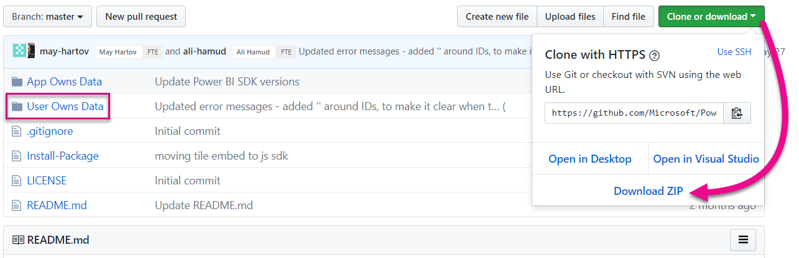

3. Open the **Cloud.config** file in the sample application.

    There are fields you need to fill in to run the application.

    | Field |
    |--------------------|
    | **[Application ID](#application-id)** |
    | **[Application Secret](#application-secret)** |
    | **[Workspace ID](#workspace-id)** |
    | **[Report ID](#report-id)** |
    | **[AADAuthorityUrl](#aadauthorityurl)** |

    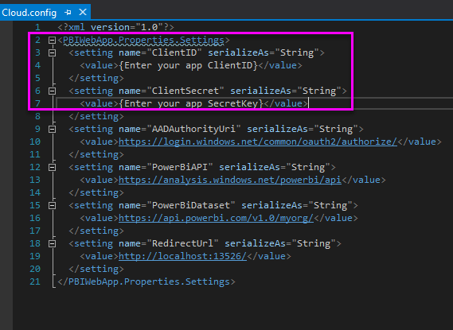

### Application ID

Fill in the **applicationId** information with the **Application ID** from **Azure**. The **applicationId** is used by the application to identify itself to the users from which you're requesting permissions.

To get the **applicationId**, follow these steps:

1. Sign into the [Azure portal](https://portal.azure.com).

2. In the left-hand navigation pane, select **All Services**, and select **App Registrations**.

3. Select the application that needs the **applicationId**.

    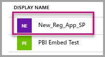

4. There's an **Application ID** that is listed as a GUID. Use this **Application ID** as the **applicationId** for the application.

    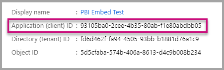

### Workspace ID

Fill in the **workspaceId** information with the app workspace (group) GUID from Power BI. You can get this information either from the URL when signed into the Power BI service or using Powershell.

URL <br>

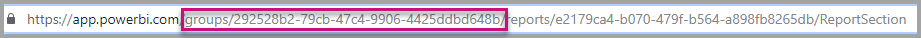

Powershell <br>

```powershell
Get-PowerBIworkspace -name "User Owns Embed Test"
```

   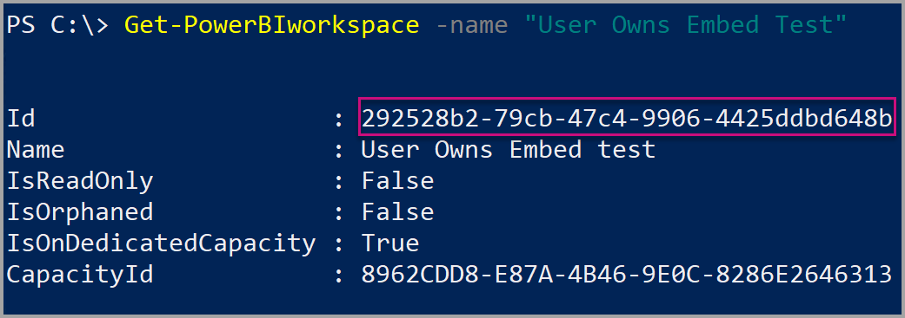

### Report ID

Fill in the **reportId** information with the report GUID from Power BI. You can get this information either from the URL when signed into the Power BI service or using Powershell.

Power BI Report URL <br>


Paginated Report URL <br>

TBD

Powershell <br>

```powershell
Get-PowerBIworkspace -name "User Owns Embed Test" | Get-PowerBIReport
```

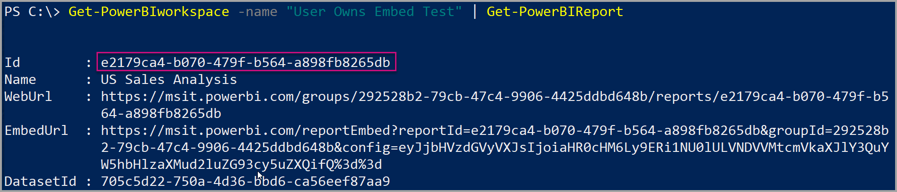

### AADAuthorityUrl

Fill in the **AADAuthorityUrl** information with the URL that either allows you to embed within your organizational tenant or embed with a guest user.

For embedding with your organizational tenant, use the URL - *https://login.microsoftonline.com/common/oauth2/authorize*.

For embedding with a guest, use the URL - *https://login.microsoftonline.com/report-owner-tenant-id* - where you add the tenant ID of the report owner in replacement of *report-owner-tenant-id*.

### Run the application

1. Select **Run** in **Visual Studio**.

    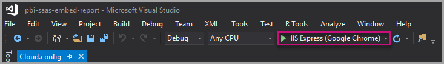

2. Then select **Embed Report**. Depending on which content you choose to test with - reports, dashboards or tiles - then select that option in the application.

    

3. Now you can view the report in the sample application.

    

## Embed your content within your application

Even though the steps to embed your content can be done with the [Power BI REST APIs](https://docs.microsoft.com/rest/api/power-bi/), the example codes described in this article are made with the .NET SDK.

To integrate a report into a web app, you use the Power BI REST API or the Power BI C# SDK. You also use an Azure Active Directory authorization access token to get a report. Then you load the report by using the same access token. The Power BI Rest API provides programmatic access to specific Power BI resources. For more information, see [Power BI REST APIs](https://docs.microsoft.com/rest/api/power-bi/) and the [Power BI JavaScript API](https://github.com/Microsoft/PowerBI-JavaScript).

### Get an access token from Azure AD

Within your application, you must get an access token from Azure AD before you can make calls to the Power BI REST API. For more information, see [Authenticate users and get an Azure AD access token for your Power BI app](get-azuread-access-token.md).

### Get a report

To get a Power BI or paginated report, you use the [Get Reports](https://docs.microsoft.com/rest/api/power-bi/reports/getreports) operation, which gets a list of Power BI and paginated reports. From the list of reports, you can get a report ID.

### Get reports by using an access token

The [Get Reports](https://docs.microsoft.com/rest/api/power-bi/reports/getreports) operation returns a list of reports. You can get a single report from the list of reports.

To make the REST API call, you must include an *Authorization* header in the format of *Bearer {access token}*.

#### Get reports with the REST API

The following code sample shows you how to retrieve reports with the REST API:

> [!Note]
> A sample of getting a content item that you want to embed is available in the Default.aspx.cs file in the [sample application](https://github.com/Microsoft/PowerBI-Developer-Samples). Examples are a report, dashboard, or tile.

```csharp
using Newtonsoft.Json;

//Get a Report. In this sample, you get the first Report.
protected void GetReport(int index)
{
    //Configure Reports request
    System.Net.WebRequest request = System.Net.WebRequest.Create(
        String.Format("{0}/Reports",
        baseUri)) as System.Net.HttpWebRequest;

    request.Method = "GET";
    request.ContentLength = 0;
    request.Headers.Add("Authorization", String.Format("Bearer {0}", accessToken.Value));

    //Get Reports response from request.GetResponse()
    using (var response = request.GetResponse() as System.Net.HttpWebResponse)
    {
        //Get reader from response stream
        using (var reader = new System.IO.StreamReader(response.GetResponseStream()))
        {
            //Deserialize JSON string
            PBIReports Reports = JsonConvert.DeserializeObject<PBIReports>(reader.ReadToEnd());

            //Sample assumes at least one Report.
            //You could write an app that lists all Reports
            if (Reports.value.Length > 0)
            {
                var report = Reports.value[index];

                txtEmbedUrl.Text = report.embedUrl;
                txtReportId.Text = report.id;
                txtReportName.Text = report.name;
            }
        }
    }
}

//Power BI Reports used to deserialize the Get Reports response.
public class PBIReports
{
    public PBIReport[] value { get; set; }
}
public class PBIReport
{
    public string id { get; set; }
    public string reportType { get; set }
    public string name { get; set; }
    public string webUrl { get; set; }
    public string embedUrl { get; set; }
}
```

#### Get reports by using the .NET SDK

You can use the .NET SDK to retrieve a list of reports instead of calling the REST API directly. The following code sample shows you how to list reports:

```csharp
using Microsoft.IdentityModel.Clients.ActiveDirectory;
using Microsoft.PowerBI.Api.V2;
using Microsoft.PowerBI.Api.V2.Models;

var tokenCredentials = new TokenCredentials(<ACCESS TOKEN>, "Bearer");

// Create a Power BI Client object. It is used to call Power BI APIs.
using (var client = new PowerBIClient(new Uri(ApiUrl), tokenCredentials))
{
    // Get the first report all reports in that workspace
    ODataResponseListReport reports = client.Reports.GetReports();

    Report report = reports.Value.FirstOrDefault();

    var embedUrl = report.EmbedUrl;
}
```

### Load a report by using JavaScript

You can use JavaScript to load a report into a div element on your web page. The following code sample shows you how to retrieve a report from a given workspace:

> [!NOTE]  
> A sample of loading a content item that you want to embed is available in the **Default.aspx** file in the [sample application](https://github.com/Microsoft/PowerBI-Developer-Samples).

```javascript
<!-- Embed Report-->
<div> 
    <asp:Panel ID="PanelEmbed" runat="server" Visible="true">
        <div>
            <div><b class="step">Step 3</b>: Embed a report</div>

            <div>Enter an embed url for a report from Step 2 (starts with https://):</div>
            <input type="text" id="tb_EmbedURL" style="width: 1024px;" />
            <br />
            <input type="button" id="bEmbedReportAction" value="Embed Report" />
        </div>

        <div id="reportContainer"></div>
    </asp:Panel>
</div>
```

#### Site.master

```javascript
window.onload = function () {
    // client side click to embed a selected report.
    var el = document.getElementById("bEmbedReportAction");
    if (el.addEventListener) {
        el.addEventListener("click", updateEmbedReport, false);
    } else {
        el.attachEvent('onclick', updateEmbedReport);
    }

    // handle server side post backs, optimize for reload scenarios
    // show embedded report if all fields were filled in.
    var accessTokenElement = document.getElementById('MainContent_accessTokenTextbox');
    if (accessTokenElement !== null) {
        var accessToken = accessTokenElement.value;
        if (accessToken !== "")
            updateEmbedReport();
    }
};

// update embed report
function updateEmbedReport() {

    // check if the embed url was selected
    var embedUrl = document.getElementById('tb_EmbedURL').value;
    if (embedUrl === "")
        return;

    // get the access token.
    accessToken = document.getElementById('MainContent_accessTokenTextbox').value;

    // Embed configuration used to describe the what and how to embed.
    // This object is used when calling powerbi.embed.
    // You can find more information at https://github.com/Microsoft/PowerBI-JavaScript/wiki/Embed-Configuration-Details.
    var config = {
        type: 'report',
        accessToken: accessToken,
        embedUrl: embedUrl
    };

    // Grab the reference to the div HTML element that will host the report.
    var reportContainer = document.getElementById('reportContainer');

    // Embed the report and display it within the div container.
    var report = powerbi.embed(reportContainer, config);

    // report.on will add an event handler which prints to Log window.
    report.on("error", function (event) {
        var logView = document.getElementById('logView');
        logView.innerHTML = logView.innerHTML + "Error<br/>";
        logView.innerHTML = logView.innerHTML + JSON.stringify(event.detail, null, "  ") + "<br/>";
        logView.innerHTML = logView.innerHTML + "---------<br/>";
    }
  );
}
```

## Using a Power BI Premium dedicated capacity

Now that you've completed developing your application, it's time to back your app workspace with a dedicated capacity.

### Create a dedicated capacity

By creating a dedicated capacity, you can take advantage of having a dedicated resource for the content in your app workspace. For paginated reports you must back your app workspace with at least A4/P1 capacity.You can create a dedicated capacity by using [Power BI Premium](../service-premium-what-is.md).

The following table lists the Power BI Premium SKUs available in [Microsoft Office 365](../service-admin-premium-purchase.md):

| Capacity node | Total vCores<br/>(back end + front end) | Back-end vCores | Front-end vCores | DirectQuery/live connection limits |
| --- | --- | --- | --- | --- | --- |
| EM1 |1 vCore |0.5 vCore, 10 GB of RAM |0.5 vCore |3.75 per second |
| EM2 |2 vCores |1 vCore, 10 GB of RAM |1 vCores |7.5 per second |
| EM3 |4 vCores |2 vCores, 10 GB of RAM |2 vCores |15 per second |
| P1 |8 vCores |4 vCores, 25 GB of RAM |4 vCores |30 per second |
| P2 |16 vCores |8 vCores, 50 GB of RAM |8 vCores |60 per second |
| P3 |32 vCores |16 vCores, 100 GB of RAM |16 vCores |120 per second |
| P4 |64 vCores |32 vCores, 200 GB of RAM |32 vCores |240 per second |
| P5 |128 vCores |64 vCores, 400 GB of RAM |64 vCores |480 per second |

> [!NOTE]
> - When you’re trying to embed with Microsoft Office apps, you can use EM SKUs to access content with a free Power BI license. 
But you can't access content with a free Power BI license when you're using Powerbi.com or Power BI mobile.
> - When you're trying to embed with Microsoft Office apps by using Powerbi.com or Power BI mobile, you can access content with a free Power BI license.

### Assign an app workspace to a dedicated capacity

After you create a dedicated capacity, you can assign your app workspace to that dedicated capacity. To complete this process, follow these steps:

1. Within the Power BI service, expand workspaces and select the ellipsis for the workspace you're using for embedding your content. Then select **Edit workspaces**.

    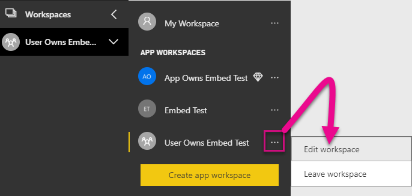

2. Expand **Advanced** and enable **Dedicated capacity**. Select the dedicated capacity you created. Then select **Save**.

    

3. After you select **Save**, you should see a diamond next to the app workspace name.

    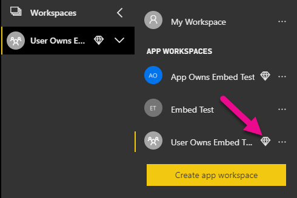

## Admin settings

Global admins or Power BI service administrators can turn the ability to use the REST APIs on or off for a tenant. Power BI admins can set this setting for the entire organization or for individual security groups. It's enabled for the entire organization by default. You can make these changes in the [Power BI admin portal](../service-admin-portal.md).

## Next steps

In this tutorial, you learned how to embed Power BI content into an application by using your Power BI organization account. You can now try to embed Power BI content into an application by using apps. You can also try to embed Power BI content for your customers(not supported yet for embedding paginated reports):

> [!div class="nextstepaction"]
> [Embed from apps](embed-from-apps.md)

> [!div class="nextstepaction"]
>[Embed for your customers](embed-sample-for-customers.md)

If you have more questions, [try asking the Power BI Community](http://community.powerbi.com/).
