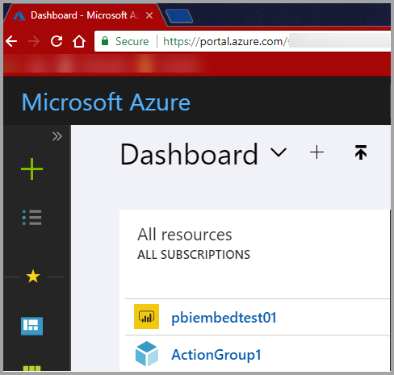
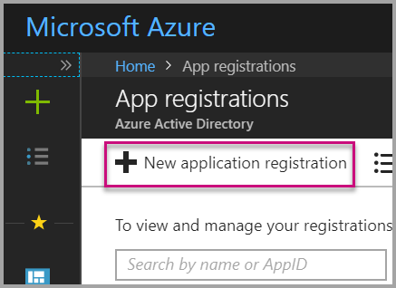
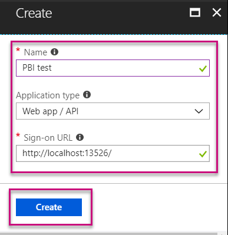
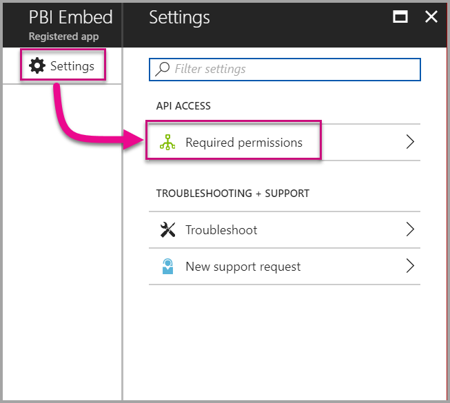
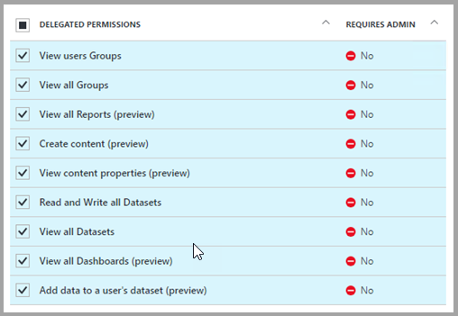
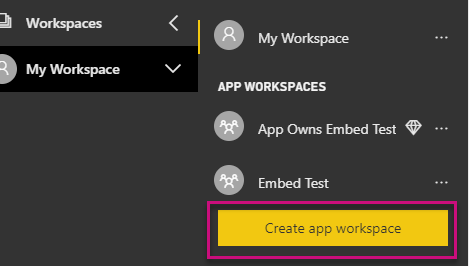
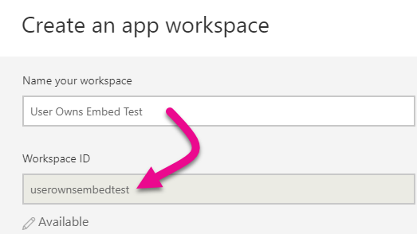
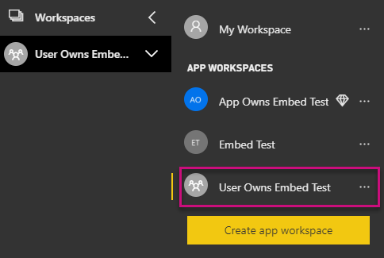

# Tutorial: Embed a Power BI report, dashboard, or tile into an application for your organization

This tutorial demonstrates how to integrate a report into an application by using the Power BI .NET SDK along with the Power BI JavaScript API when embedding Power BI into an application for your organization. With Power BI, you can embed reports, dashboards, or tiles into an application by using **user owns data**. **User owns data** lets your application extend the Power BI service.


In this tutorial, you learn the following tasks:
>[!div class="checklist"]
>* Register an application in Azure.
>* Embed a Power BI report into an application.

## Prerequisites

To get started, you need a Power BI Pro account and a Microsoft Azure subscription:

* If you're not signed up for Power BI Pro, [sign up for a free trial](https://powerbi.microsoft.com/en-us/pricing/) before you begin.
* If you don’t have an Azure subscription, create a [free account](https://azure.microsoft.com/free/?WT.mc_id=A261C142F) before you begin.
* You need to have your own [Azure Active Directory (Azure AD) tenant](create-an-azure-active-directory-tenant.md) setup.
* You need [Visual Studio](https://www.visualstudio.com/) installed, version 2013 or later.

## Set up your embedded analytics development environment

Before you start embedding reports, dashboards, or tiles into your application, you need to make sure your environment is set up to allow for embedding. As part of the setup, you need to take one of these actions:

- You can go through the [embedding setup tool](https://aka.ms/embedsetup/UserOwnsData) to quickly get started and download a sample application that you walks you through creating an environment and embedding a report.

- If you choose to set up the environment manually, take the steps in the following sections.

### Register an application in Azure Active Directory

To allow your application access to the Power BI REST APIs, register your application with Azure Active Directory. This allows you to establish an identity for your application and specify permissions to Power BI REST resources.

1. Accept the [Microsoft Power BI API terms](https://powerbi.microsoft.com/api-terms).

2. Sign in to the [Azure portal](https://portal.azure.com).

    

3. In the left-hand navigation pane, choose **All Services** and select **App Registrations**. Then select **New application registration**.

    </br>

    

4. Follow the prompts and create a new application. For **user owns data**, you need to use **Web app / API** for the application type. You also need to provide a sign-on URL that Azure AD uses to return token responses. Enter a value specific to your application. An example is `http://localhost:13526/`.

    

### Apply permissions to your application within Azure Active Directory

You need to enable permissions for your application in addition to what you provided on the app registration page. You need to be logged in with a global admin account to enable permissions.

### Use the Azure Active Directory portal

1. Browse to [App registrations](https://portal.azure.com/#blade/Microsoft_AAD_IAM/ApplicationsListBlade) within the Azure portal and select the app that you're using for embedding.

    

2. Select **Settings**. Then under **API Access**, select **Required permissions**.

    

3. Select **Windows Azure Active Directory**. Then make sure **Access the directory as the signed-in user** is selected. Select **Save**.

    

4. Select **Add**.

    

5. Choose **Select an API**.

    

6. Select **Power BI Service**. Then choose **Select**.

    

7. Select all permissions under **Delegated Permissions**. You need to select them one by one to save the selections. Select **Save** when you're done.

    

## Set up your Power BI environment

### Create an app workspace

If you're embedding reports, dashboards, or tiles for your customers, then you have to place your content within an app workspace:

1. Start by creating the workspace. Select **Workspaces** > **Create app workspace**. This is where you place the content that your application needs to access.

    

2. Give the workspace a name. If the corresponding **Workspace ID** isn't available, edit it to come up with a unique ID. This name also needs to be the name of the app.

    

3. You have a few options to set. If you choose **Public**, anyone in your organization can see what’s in the workspace. **Private**, on the other hand, means that only members of the workspace can see its contents.

    

    You can't change the Public or Private setting after you've created the group.

4. You can also choose whether members can edit or have view-only access.

    

5. Add email addresses of people you want to have access to the workspace and select **Add**. You can’t add group aliases, just individuals.

6. Decide whether each person is a member or an admin. Admins can edit the workspace itself, including adding other members. Members can edit the content in the workspace unless they have view-only access. Both admins and members can publish the app.

    Now you can view the new workspace. Power BI creates the workspace and opens it. It appears in the list of workspaces in which you’re a member. Because you’re an admin, you can select the ellipsis (…) to go back and make changes to it, adding new members or changing their permissions.

    

### Create and publish your reports

You can create your reports and datasets by using Power BI Desktop. Then you can publish those reports to an app workspace. The end user publishing the reports needs to have a Power BI Pro license to publish to an app workspace.

1. Download the sample [Blog Demo](https://github.com/Microsoft/powerbi-desktop-samples) from GitHub.

    

2. Open the sample .pbix report in Power BI Desktop.

   

3. Publish to the app workspace.

   

    Now you can view the report in the Power BI service online.

   

## Embed your content by using the sample application

To start embedding your content by using a sample application, follow these steps:

1. Download the [User Owns Data sample](https://github.com/Microsoft/PowerBI-Developer-Samples) from GitHub to get started.  There are three different sample applications, one for [reports](https://github.com/Microsoft/PowerBI-Developer-Samples/tree/master/User%20Owns%20Data/integrate-report-web-app), one for [dashboards](https://github.com/Microsoft/PowerBI-Developer-Samples/tree/master/User%20Owns%20Data/integrate-dashboard-web-app), and one for [tiles](https://github.com/Microsoft/PowerBI-Developer-Samples/tree/master/User%20Owns%20Data/integrate-tile-web-app). This article refers to the **reports** application.

    

2. Open up the **Cloud.config** file in the sample application. There are a few fields you need to populate to run the application successfully: **ClientID** and **ClientSecret**.

    

    Fill in the **ClientID** information with the **Application ID** from Azure. The **ClientID** is used by the application to identify itself to the users from which you're requesting permissions.

    To get the **ClientID**, follow these steps:

    1. Sign in to the [Azure portal](https://portal.azure.com).

        

    1. In the left-hand navigation pane, choose **All services** and select **App registrations**.

        

    1. Select the application that needs to use the **ClientID**.

        

    1. You should see an **Application ID** that's listed as a GUID. Use this **Application ID** as the **ClientID** for the application.

        

    1. Fill in the **ClientSecret** information from the **Keys** section of your **App registrations** section in **Azure**.

    1. To get the **ClientSecret**, follow these steps:

        1. Sign in to the [Azure portal](https://portal.azure.com).

            

        1. In the left-hand navigation pane, choose **All services** and select **App registrations**.

            

        1. Select the application that needs to use the **ClientSecret**.

            

        1. Select **Settings**.

            

        1. Select **Keys**.

            

    1. Fill in the **Description** with a name and select a duration. Then select **Save** to get the **Value** for your application. When you close the **Keys** blade after saving the key value, the value field shows only as hidden. At that point, you aren't able to retrieve the key value. If you lose the key value, you need to create a new one within the Azure portal.

        

    1. Fill in the **groupId** information with the app workspace GUID from Power BI.

        

    1. Fill in the **reportId** information with the report GUID from Power BI.

        

3. Run the application:

    1. First select **Run** in **Visual Studio**.

        

    1. Then select **Get Report**.

        

    1. Now you can view the report in the sample application.

        

## Embed your content within your application

Even though the steps to embed your content can be done with the [Power BI REST APIs](https://docs.microsoft.com/rest/api/power-bi/), the example codes described in this article are made with the **.NET SDK**.

To integrate a report into a web app, you use the **Power BI REST API**, or the **Power BI C# SDK**, and an Azure Active Directory authorization **access token** to get a report. Then you load the report by using the same **access token**. The **Power BI Rest API** provides programmatic access to specific **Power BI** resources. For more information, see [Power BI REST APIs](https://docs.microsoft.com/rest/api/power-bi/) and the [Power BI JavaScript API](https://github.com/Microsoft/PowerBI-JavaScript).

### Get an access token from Azure AD

Within your application, you first need to get an **access token**, from Azure AD, before you can make calls to the Power BI REST API. For more information, see [Authenticate users and get an Azure AD access token for your Power BI app](get-azuread-access-token.md).

### Get a report

To get a **Power BI** report, you use the [Get Reports](https://docs.microsoft.com/rest/api/power-bi/reports/getreports) operation, which gets a list of Power BI reports. From the list of reports, you can get a report ID.

### Get reports by using an access token

The [Get Reports](https://docs.microsoft.com/rest/api/power-bi/reports/getreports) operation returns a list of reports. You can get a single report from the list of reports.

To make the REST API call, you must include an *Authorization* header in the format of *Bearer {access token}*.

#### Get reports with the REST API

Here's a code sample of how to retrieve reports with the **REST API**:

*A sample of getting a content item that you want to embed is available within the **_Default.aspx.cs_** file in the [sample application](#embed-your-content-using-the-sample-application). Examples are a report, dashboard, or tile.*

```csharp
using Newtonsoft.Json;

//Get a Report. In this sample, you get the first Report.
protected void GetReport(int index)
{
    //Configure Reports request
    System.Net.WebRequest request = System.Net.WebRequest.Create(
        String.Format("{0}/Reports",
        baseUri)) as System.Net.HttpWebRequest;

    request.Method = "GET";
    request.ContentLength = 0;
    request.Headers.Add("Authorization", String.Format("Bearer {0}", accessToken.Value));

    //Get Reports response from request.GetResponse()
    using (var response = request.GetResponse() as System.Net.HttpWebResponse)
    {
        //Get reader from response stream
        using (var reader = new System.IO.StreamReader(response.GetResponseStream()))
        {
            //Deserialize JSON string
            PBIReports Reports = JsonConvert.DeserializeObject<PBIReports>(reader.ReadToEnd());

            //Sample assumes at least one Report.
            //You could write an app that lists all Reports
            if (Reports.value.Length > 0)
            {
                var report = Reports.value[index];

                txtEmbedUrl.Text = report.embedUrl;
                txtReportId.Text = report.id;
                txtReportName.Text = report.name;
            }
        }
    }
}

//Power BI Reports used to deserialize the Get Reports response.
public class PBIReports
{
    public PBIReport[] value { get; set; }
}
public class PBIReport
{
    public string id { get; set; }
    public string name { get; set; }
    public string webUrl { get; set; }
    public string embedUrl { get; set; }
}
```

#### Get reports by using the .NET SDK

You can use the .NET SDK to retrieve a list of reports instead of calling the REST API directly. Here's a code sample of how to list reports:

```csharp
using Microsoft.IdentityModel.Clients.ActiveDirectory;
using Microsoft.PowerBI.Api.V2;
using Microsoft.PowerBI.Api.V2.Models;

var tokenCredentials = new TokenCredentials(<ACCESS TOKEN>, "Bearer");

// Create a Power BI Client object. It is used to call Power BI APIs.
using (var client = new PowerBIClient(new Uri(ApiUrl), tokenCredentials))
{
    // Get the first report all reports in that workspace
    ODataResponseListReport reports = client.Reports.GetReports();

    Report report = reports.Value.FirstOrDefault();

    var embedUrl = report.EmbedUrl;
}
```

### Load a report by using JavaScript

You can use JavaScript to load a report into a div element on your web page. Here's a code sample of how to retrieve a report from a given workspace:

> [!NOTE]
> A sample of loading a content item that you want to embed is available within the **_Default.aspx_** file in the [sample application](#embed-your-content-using-the-sample-application). Examples are a report, dashboard, or tile.

```javascript
<!-- Embed Report-->
<div> 
    <asp:Panel ID="PanelEmbed" runat="server" Visible="true">
        <div>
            <div><b class="step">Step 3</b>: Embed a report</div>

            <div>Enter an embed url for a report from Step 2 (starts with https://):</div>
            <input type="text" id="tb_EmbedURL" style="width: 1024px;" />
            <br />
            <input type="button" id="bEmbedReportAction" value="Embed Report" />
        </div>

        <div id="reportContainer"></div>
    </asp:Panel>
</div>
```

**Site.master**

```javascript
window.onload = function () {
    // client side click to embed a selected report.
    var el = document.getElementById("bEmbedReportAction");
    if (el.addEventListener) {
        el.addEventListener("click", updateEmbedReporte, false);
    } else {
        el.attachEvent('onclick', updateEmbedReport);
    }

    // handle server side post backs, optimize for reload scenarios
    // show embedded report if all fields were filled in.
    var accessTokenElement = document.getElementById('MainContent_accessTokenTextbox');
    if (accessTokenElement !== null) {
        var accessToken = accessTokenElement.value;
        if (accessToken !== "")
            updateEmbedReport();
    }
};

// update embed report
function updateEmbedReport() {

    // check if the embed url was selected
    var embedUrl = document.getElementById('tb_EmbedURL').value;
    if (embedUrl === "")
        return;

    // get the access token.
    accessToken = document.getElementById('MainContent_accessTokenTextbox').value;

    // Embed configuration used to describe the what and how to embed.
    // This object is used when calling powerbi.embed.
    // You can find more information at https://github.com/Microsoft/PowerBI-JavaScript/wiki/Embed-Configuration-Details.
    var config = {
        type: 'report',
        accessToken: accessToken,
        embedUrl: embedUrl
    };

    // Grab the reference to the div HTML element that will host the report.
    var reportContainer = document.getElementById('reportContainer');

    // Embed the report and display it within the div container.
    var report = powerbi.embed(reportContainer, config);

    // report.on will add an event handler which prints to Log window.
    report.on("error", function (event) {
        var logView = document.getElementById('logView');
        logView.innerHTML = logView.innerHTML + "Error<br/>";
        logView.innerHTML = logView.innerHTML + JSON.stringify(event.detail, null, "  ") + "<br/>";
        logView.innerHTML = logView.innerHTML + "---------<br/>";
    }
  );
}
```

## Using a Power BI Premium dedicated capacity

Now that you've completed developing your application, it's time to back your app workspace with dedicated capacity.

### Create a dedicated capacity

By creating a dedicated capacity, you can take advantage of having a dedicated resource for the content in your app workspace. You can create a dedicated capacity by using [Power BI Premium](../service-premium.md).

The following table lists the available Power BI Premium SKUs available in [Microsoft Office 365](../service-admin-premium-purchase.md):

| Capacity node | Total v-cores<br/>*(Back end + front end)* | Back end v-cores | Front end v-cores | DirectQuery/live connection limits | Maximum page renders at peak hour |
| --- | --- | --- | --- | --- | --- |
| EM1 |1 v-core |0.5 v-core, 10 GB RAM |0.5 v-core |3.75 per second |150-300 |
| EM2 |2 v-cores |1 v-core, 10 GB RAM |1 v-cores |7.5 per second |301-600 |
| EM3 |4 v-cores |2 v-cores, 10 GB RAM |2 v-cores |15 per second |601-1,200 |
| P1 |8 v-cores |4 v-cores, 25 GB RAM |4 v-cores |30 per second |1,201-2,400 |
| P2 |16 v-cores |8 v-cores, 50 GB RAM |8 v-cores |60 per second |2,401-4,800 |
| P3 |32 v-cores |16 v-cores, 100 GB RAM |16 v-cores |120 per second |4,801-9600 |
| P4 |64 v-cores |32 v-cores, 200 GB RAM |32 v-cores |240 per second |9601-19200
| P5 |128 v-cores |64 v-cores, 400 GB RAM |64 v-cores |480 per second |19201-38400

> [!NOTE]
> - With EM SKUs, you can access content with a free Power BI license when you're trying to embed with Microsoft Office apps. But you can't access content with a free Power BI license when you're using Powerbi.com or Power BI mobile.

> - With P SKUs, you can access content with a free Power BI license when you're trying to embed with Microsoft Office apps by using Powerbi.com or Power BI mobile.

### Assign an app workspace to a dedicated capacity

After you create a dedicated capacity, you can assign your app workspace to that dedicated capacity. To complete this process, follow these steps:

1. Within the Power BI service, expand workspaces and select the ellipsis for the workspace you're using for embedding your content. Then select **Edit workspaces**.

    

2. Expand **Advanced** and enable **Dedicated capacity**. Select the dedicated capacity you created. Then select **Save**.

    

3. After you select **Save**, you should see a diamond next to the app workspace name.

    

## Admin settings

Global admins or Power BI service administrators can turn the ability to use the REST APIs on or off for a tenant. Power BI admins can set this setting for the entire organization or for individual security groups. It's enabled for the entire organization by default. You can do this through the [Power BI admin portal](../service-admin-portal.md).

## Next steps

In this tutorial, you learned how to embed Power BI content into an application by using your Power BI organization account. You can now try to embed Power BI content into an application by using apps. You can also try to embed Power BI content for your customers.

> [!div class="nextstepaction"]
> [Embed from apps](embed-from-apps.md)

> [!div class="nextstepaction"]
>[Embed for your customers](embed-sample-for-customers.md)

If you have more questions, [try asking the Power BI Community](http://community.powerbi.com/).
