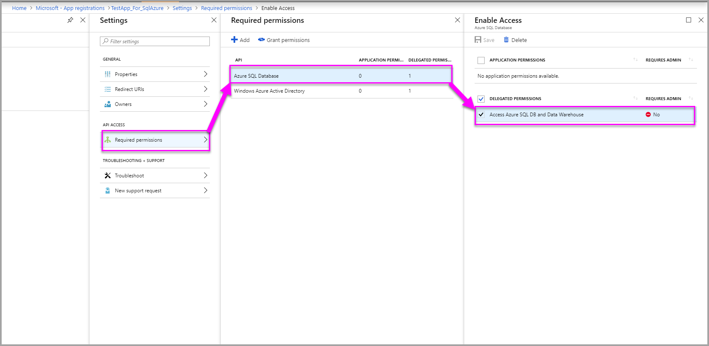

# Service principal with Power BI (Preview)

With **service principal**, you can embed Power BI content into an application and use automation with Power BI using an **app-only** token. Service principal is beneficial when using **Power BI Embedded** or when **automating Power BI tasks and processes**.

When working with Power BI Embedded, there are advantages when using a service principal application.  A primary advantage is you do not need a master user account (Power BI Pro license) to authenticate into your application. Service principal uses an application ID and an application secret to authenticate the application.

As you automate various tasks with Power BI APIs, you can script service principal (app-only token) to scale.

## Application and service principal relationship

To access resources that secure an Azure AD tenant, the entity that requires access represents a security principal. This action holds true for both users (user principal) and applications (service principal).

The security principal defines the access policy and permissions for users and applications in the Azure AD tenant. This access policy enables core features such as authentication of users and applications during sign-in, and authorization during resource access. For more information, reference [service principal object](https://docs.microsoft.com/azure/active-directory/develop/app-objects-and-service-principals#service-principal-object).

When you [register an Azure AD application](register-app.md) in the Azure portal, two objects are created in your Azure AD tenant:

* An application object
* A [service principal object]((https://docs.microsoft.com/azure/active-directory/develop/app-objects-and-service-principals#service-principal-object))

Consider the application object as the *global* representation of your application for use across all tenants, and the service principal object as the *local* representation for use in a specific tenant.

The application object serves as the template from which common and default properties are *derived* for use in creating corresponding service principal objects.

A service principal is required per tenant where the application is used, enabling it to establish an identity for sign-in and access to resources that are secured by the tenant. A single-tenant application has only one service principal (in its home tenant), created and consented for use during application registration.

## Service principal with Power BI Embedded

With service principal, you can mask your master user account information in your application by using an application ID and an application secret. You no longer need to hard-code a master user account into your application to authenticate.

Since **Power BI APIs** and **Power BI .NET SDK** now support calls using service principal, you can use the [Power BI APIs](https://docs.microsoft.com/rest/api/power-bi/) with service principal. For example, you can make changes to workspaces such as create workspaces, add or remove users from workspaces, and import content into workspaces.

You can only use a service principal application if your Power BI artifacts and resources are stored in the [new Power BI workspace](../service-create-the-new-workspaces.md).

## Service principal vs. master user account

There are differences between using a service principal and a standard master user account (Power BI Pro license) for authentication. The below table highlights some significant differences.

| Function | Master User Account </br> (Power BI Pro license) | Service Principal </br> (app-only token) |
|------------------------------------------------------|---------------------|-------------------|
| Can sign in to the Power BI service  | Yes | No |
| Needs to be enabled in the Power BI Admin portal | No | Yes |
| Works with app workspaces (v1) | Yes | No |
| Works with the new app workspaces (v2) | Yes | Yes |
| Needs to be a workspace admin | Yes | Yes |
| Can use multi-factor authentication (MFA) in Azure | No | Yes |
| Can be used with Power BI REST APIs | Yes | Yes |
| Needs a global admin to create | Yes | No |
| Can install and manage an On-premises data gateway | Yes | No |

## Get started with service principal

Different from the traditional use of a master user account, using the service principal (app-only token) requires a few different pieces to set up. Now to get started with the service principal (app-only token) you need to set up the right environment.

1. You need to [register an Azure AD application](register-app.md) to capture an Application ID and an Application secret to access your Power BI content.  When you use the [register app tool](https://dev.powerbi.com/apps), choose **Server-side web application** to go through the process of gathering an Application ID and an Application secret.

2. Create a [security group in Azure](https://docs.microsoft.com/azure/virtual-network/security-overview), and add the application you created to that security group.

3. Sign in to Power BI and enable the service principal developer setting in the Power BI admin portal.

    Once you enable service principals to be used in Power BI, then your AD permissions do not take effect anymore. Permissions are managed through the Power BI admin portal.

    There is an essential message in the Power BI admin portal when you enable this setting to remind you that AAD permissions no longer take effect.

   > [!Important]
   > Service principals inherit the permissions for all Power BI tenant settings from their security group. To restrict permissions create a dedicated security group for service principals and add it to the 'Except specific security groups' list for the relevant, enabled Power BI settings.

    

4. [Set up your Power BI environment](embed-sample-for-customers.md#set-up-your-power-bi-environment).

5. Add the service principal application as an admin to the [new workspace](../service-create-the-new-workspaces.md) you created. You can manage this task through the [APIs](https://docs.microsoft.com/rest/api/power-bi/groups/addgroupuser). However, you can manage to add a service principal application as an admin through the Power BI service by adding the security group you created in step 2 to the [new workspace](../service-create-the-new-workspaces.md).

6. Now choose to embed your content within a sample application, or within your application.

    * [Embed your content using the sample application](embed-sample-for-customers.md#embed-your-content-using-the-sample-application)
    * [Embed your content within your application](embed-sample-for-customers.md#embed-your-content-within-your-application)

7. Now you are ready to [move to production](embed-sample-for-customers.md#move-to-production).

## Using Powershell to create a service principal application

You can also use Powershell to create a service principal application.  Below is a sample of how to create a service principal application using Powershell.

1. Open Powershell as an administrator

2. Install the Azure AD module

    ```powershell
    Install-Module -Name AzureAD
    ```
3. Then run the command *Set-ExecutionPolicy -ExecutionPolicy Bypass*

    ```powershell
    Set-ExecutionPolicy -ExecutionPolicy Bypass
    ```
4. Run Powershell script

    ```powershell
    param (
    [string]$applicationName
    )

    # Login to Azure and be able to use the app cmdlets
    Connect-AzureAD
    Login-AzureRmAccount

    # Create a new AAD web application
    $App = New-AzureADApplication -DisplayName $applicationName -Homepage "https://localhost:44322" -ReplyUrls "https://localhost:44322"

    # Add service principal to the application (only for allowed users)
    New-AzureRmADServicePrincipal -ApplicationId $App.AppId
    ```

    > [!Note]
    > Once you exit out of the blade, it is not visible any more so save it. However, if you forget to save it, then you can just craete a new one.

## Gateway management for Analysis Services on-premises live connections

Using Power BI REST APIs, allows you to specify the effective identity for SQL Server Analysis Services (SSAS) on-premises live connections for an embed token using a [service principal object](https://docs.microsoft.com/azure/active-directory/develop/app-objects-and-service-principals#service-principal-object).

Customers that configure row-level security (rls) using a SSAS data source can enjoy the new service principal capability to manage users and their access to data in SSAS when integrating with **Power BI Embedded**.

When you're generating the embed token, you can currently specify the effective identity of a user using a master user account. Now you can also use a service principal object to specify the effective identity. You can specify the effective identity of a user by passing the AAD access token to the server. The access token is used to pull only the relevant data for that user for a SSAS on-premises live connection.

Such effective identity issues apply to RLS rules directly on the SSAS server. Power BI Embedded uses the provided access token when querying data from the SSAS server.

### REST API Usage

If you're calling the [REST API](https://docs.microsoft.com/rest/api/power-bi/embedtoken/reports_generatetoken#definitions), you can add identity blob inside each identity.

```JSON
{
    "accessLevel": "View",
    "identities": [
        {
            "datasets": ["fe0a1aeb-f6a4-4b27-a2d3-b5df3bb28bdc"],
        “identityBlob”: {
            “value”: “eyJ0eXAiOiJKV1QiLCJh….”
         }
        }
    ]
}
```

The value provided in the identity blob should be a valid access token to Azure SQL Server (with a resource URL of (<https://database.windows.net/>).

   > [!Note]
   > To be able to create an access token for Azure SQL, the application must have **Access Azure SQL DB and Data Warehouse** delegated permission to **Azure SQL Database** API on AAD app registration configuration in the Azure portal.

   

## Migrate to service principal

You can take steps to migrate to use a service principal application if you're currently using a master user account with Power BI or with your Power BI Embedded application.

You need to go through the steps from the [Get started section](#get-started-with-service-principal) except for a specific difference.

You need to [Copy or move Power BI artifacts and resources into a [new workspaces](https://powerbi.microsoft.com/pt-br/blog/duplicate-workspaces-using-the-power-bi-rest-apis-a-step-by-step-tutorial/). Currently there is no UI feature to move Power BI artifacts from one workspace to another. As such, you need to use APIs to accomplish this task.

## Considerations and limitations

* Service principal only works with [new app workspaces](../service-create-the-new-workspaces.md).
* **My Workspace** isn't supported when using service principal.
* Dedicated capacity is required when moving to production.
* You can't sign into the Power BI portal using service principal.
* Power BI admin rights are required to enable service principal in developer settings within the Power BI admin portal.
* You can't install or manage an on-premises data gateway using service principal.

## Next steps

* [Register an app](register-app.md)
* [Power BI Embedded for your customers](embed-sample-for-customers.md)
* [Application and service principal objects in Azure Active Directory](https://docs.microsoft.com/azure/active-directory/develop/app-objects-and-service-principals)
