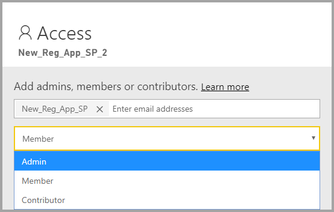
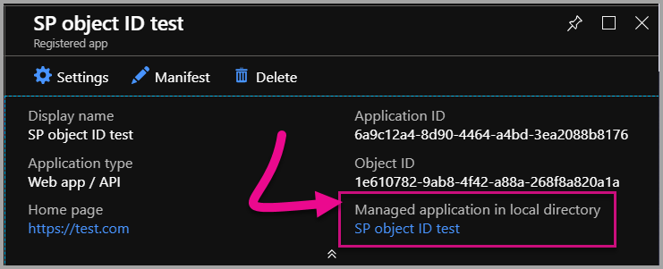
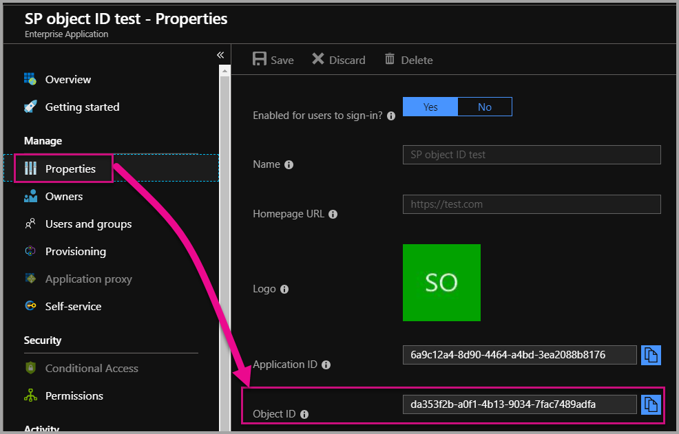

# Service principal with Power BI (Preview)

With **service principal**, you can embed Power BI content into an application and use automation with Power BI using an **app-only** token. Service principal is beneficial when using **Power BI Embedded** or when **automating Power BI tasks and processes**.

When working with Power BI Embedded, there are advantages when using service principal. A primary advantage is you don't need a master account (Power BI Pro license that is merely a username and password to sign in) to authenticate into your application. Service principal uses an application ID and an application secret to authenticate the application.

When working to automate Power BI tasks, you can also script how to process and manage service principals to scale.

## Application and service principal relationship

To access resources that secure an Azure AD tenant, the entity that requires access represents a security principal. This action holds true for both users (user principal) and applications (service principal).

The security principal defines the access policy and permissions for users and applications in the Azure AD tenant. This access policy enables core features such as authentication of users and applications during sign-in, and authorization during resource access. For more information, reference [Application and service principal in Azure Active Directory (AAD)](https://docs.microsoft.com/azure/active-directory/develop/app-objects-and-service-principals).

When you register an Azure AD application in the Azure portal, two objects are created in your Azure AD tenant:

* An [application object](https://docs.microsoft.com/azure/active-directory/develop/app-objects-and-service-principals#application-object)
* A [service principal object](https://docs.microsoft.com/azure/active-directory/develop/app-objects-and-service-principals#service-principal-object)

Consider the application object as the *global* representation of your application for use across all tenants, and the service principal object as the *local* representation for use in a specific tenant.

The application object serves as the template from which common and default properties are *derived* for use in creating corresponding service principal objects.

A service principal is required per tenant where the application is used — enabling it to establish an identity for sign-in and access to resources that are secured by the tenant. A single-tenant application has only one service principal (in its home tenant), created and consented for use during application registration.

## Service principal with Power BI Embedded

With service principal, you can mask your master account information in your application by using an application ID and an application secret. You no longer need to hard-code a master account into your application to authenticate.

Since **Power BI APIs** and **Power BI .NET SDK** now support calls using service principal, you can use the [Power BI REST APIs](https://docs.microsoft.com/rest/api/power-bi/) with service principal. For example, you can make changes to workspaces such as create workspaces, add or remove users from workspaces, and import content into workspaces.

You can only use service principal if your Power BI artifacts and resources are stored in the [new Power BI workspace](../service-create-the-new-workspaces.md).

## Service principal vs. master account

There are differences between using a service principal and a standard master account (Power BI Pro license) for authentication. The below table highlights some significant differences.

| Function | Master User Account <br> (Power BI Pro license) | Service Principal <br> (app-only token) |
|------------------------------------------------------|---------------------|-------------------|
| Can sign in to the Power BI service  | Yes | No |
| Enabled in the Power BI Admin portal | No | Yes |
| [Works with app workspaces (v1)](../service-create-workspaces.md) | Yes | No |
| [Works with the new app workspaces (v2)](../service-create-the-new-workspaces.md) | Yes | Yes |
| Needs to be a workspace admin if used with Power BI Embedded | Yes | Yes |
| Can use Power BI REST APIs | Yes | Yes |
| Needs a global admin to create | Yes | No |
| Can install and manage an On-premises data gateway | Yes | No |

## Get started with a service principal

Different from the traditional use of a master account, using the service principal (app-only token) requires a few different pieces to set up. To get started with service principal (app-only token), you need to set up the right environment.

1. [Register a server-side web application](register-app.md) in Azure Active Directory (AAD) to use with Power BI. After registering an application you can capture an application ID, an application secret, and the service principal object ID to access your Power BI content. You can create a service principal with [PowerShell](https://docs.microsoft.com/powershell/azure/create-azure-service-principal-azureps?view=azps-1.1.0).

    Below is a sample script to create a new Azure Active Directory application.

    ```powershell
    # The app id - $app.appid
    # The service principal object id - $sp.objectId
    # The app key - $key.value

    # Sign in as a user that is allowed to create an app.
    Connect-AzureAD

    # Create a new AAD web application
    $app = New-AzureADApplication -DisplayName "testApp1" -Homepage "https://localhost:44322" -ReplyUrls "https://localhost:44322"

    # Creates a service principal
    $sp = New-AzureADServicePrincipal -AppId $app.AppId

    # Get the service principal key.
    $key = New-AzureADServicePrincipalPasswordCredential -ObjectId $sp.ObjectId
    ```

   > [!Important]
   > Once you enable service principal to be used with Power BI, the application's AD permissions don't take effect anymore. The application's permissions are then managed through the Power BI admin portal.

2. Create a [security group in Azure Active Directory (AAD)](https://docs.microsoft.com/azure/active-directory/fundamentals/active-directory-groups-create-azure-portal), and add the application you created to that security group. You can create an AAD security group with [PowerShell](https://docs.microsoft.com/powershell/azure/create-azure-service-principal-azureps?view=azps-1.1.0).

    Below is a sample script to create a new security group and add an application to that security group.

    ```powershell
    # Required to sign in as a tenant admin
    Connect-AzureAD

    # Create an AAD security group
    $group = New-AzureADGroup -DisplayName <Group display name> -SecurityEnabled $true -MailEnabled $false -MailNickName notSet

    # Add the service principal to the group
    Add-AzureADGroupMember -ObjectId $($group.ObjectId) -RefObjectId $($sp.ObjectId)
    ```

3. As a Power BI admin, you need to enable service principal in the **Developer settings** in the Power BI admin portal. Add the security group that you created in Azure AD to the **Specific security group** section in the **Developer settings**.

   > [!Important]
   > Service principals have access to any tenant settings that are enabled for the entire organization or enabled for security groups that have service principals as a part of the group. To restrict service principal access to specific tenant settings, allow access only to specific security groups, or create a dedicated security group for service principals and exclude it.

    

4. Set up your [Power BI environment](embed-sample-for-customers.md#set-up-your-power-bi-environment).

5. Add the service principal as an **admin** to the new workspace you created. You can manage this task through the [APIs](https://docs.microsoft.com/rest/api/power-bi/groups/addgroupuser) or with the Power BI service.

    

6. Now choose to embed your content within a sample application, or within your own application.

    * [Embed content using the sample application](embed-sample-for-customers.md#embed-content-using-the-sample-application)
    * [Embed content within your application](embed-sample-for-customers.md#embed-content-within-your-application)

7. Now you're ready to [move to production](embed-sample-for-customers.md#move-to-production).

## Migrate to service principal

You can migrate to use service principal if you're currently using a master account with Power BI or with Power BI Embedded.

Complete the first three steps in section [Get started with a service principal](#get-started-with-a-service-principal), and once complete, follow the information below.

If you're already using the [new workspaces](../service-create-the-new-workspaces.md) in Power BI, then add the service principal as an **admin** to the workspaces with your Power BI artifacts. However, if you're using the [traditional workspaces](../service-create-workspaces.md), copy or move your Power BI artifacts and resources into the new workspaces, and then add the service principal as an **admin** to those workspaces.

There's no UI feature to move Power BI artifacts and resources from one workspace to another, so you need to use [APIs](https://powerbi.microsoft.com/pt-br/blog/duplicate-workspaces-using-the-power-bi-rest-apis-a-step-by-step-tutorial/) to accomplish this task. When using the APIs with service principal, you need the service principal object ID.

### How to get the service principal object ID

To assign a service principal to a new app workspace, you use the [Power BI REST APIs](https://docs.microsoft.com/rest/api/power-bi/groups/addgroupuser). To reference a service principal for operations or to make changes you use the **service principal object ID** — for example, applying a service principal as an admin to a workspace.

Below are steps to get the service principal object ID from the Azure portal.

1. Create a new App registration in the Azure portal.  

2. Then under **Managed application in local directory**, select the name of the application you created.

   

    > [!Note]
    > The object Id in the image above is not the one used with service principal.

3. Select **Properties** to see the Object ID.

    

Below is a sample script to retrieve the service principal object ID with PowerShell.

   ```powershell
   Get-AzureADServicePrincipal -Filter "DisplayName eq '<application name>'"
   ```

## Considerations and limitations

* Service principal only works with [new app workspaces](../service-create-the-new-workspaces.md).
* **My Workspace** isn't supported when using service principal.
* Dedicated Premium capacity is required when moving to production.
* You can't sign into the Power BI portal using service principal.
* Power BI admin rights are required to enable service principal in developer settings within the Power BI admin portal.
* You can't install or manage an on-premises data gateway using service principal.
* [Embed for your organization](embed-sample-for-your-organization.md) applications are unable to use service principal.
* [Dataflows](../service-dataflows-overview.md) management is not supported.
* Service principal currently does not support any admin APIs.

## Next steps

* [Register an app](register-app.md)
* [Power BI Embedded for your customers](embed-sample-for-customers.md)
* [Application and service principal objects in Azure Active Directory](https://docs.microsoft.com/azure/active-directory/develop/app-objects-and-service-principals)
* [Row-level security using on-premises data gateway with service principal (Preview)](embedded-row-level-security.md#on-premises-data-gateway-with-service-principal-preview)
