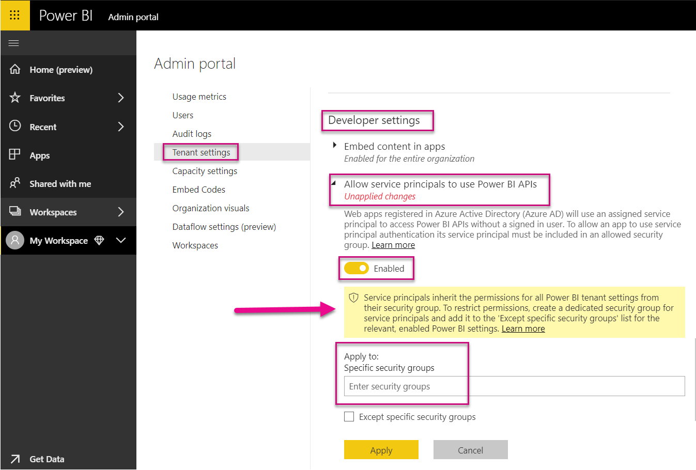

# Service principal with Power BI (Preview)

With **service principal**, you can embed Power BI content into an application and use automation with Power BI using an **app-only** token. Service principal is beneficial when using **Power BI Embedded** or when **automating Power BI tasks and processes**.

When working with Power BI Embedded, there are advantages when using a service principal application.  A primary advantage is you do not need a master user account (Power BI Pro license that is merely a username and password to sign in) to authenticate into your application. Service principal uses an application ID and an application secret to authenticate the application.

When working to automate Power BI tasks, you can also script how to process and manage service principals to scale.

## Application and service principal relationship

To access resources that secure an Azure AD tenant, the entity that requires access represents a security principal. This action holds true for both users (user principal) and applications (service principal).

The security principal defines the access policy and permissions for users and applications in the Azure AD tenant. This access policy enables core features such as authentication of users and applications during sign-in, and authorization during resource access. For more information, reference [service principal object](https://docs.microsoft.com/azure/active-directory/develop/app-objects-and-service-principals#service-principal-object).

When you [register an Azure AD application](register-app.md) in the Azure portal, two objects are created in your Azure AD tenant:

* An application object
* A [service principal object]((https://docs.microsoft.com/azure/active-directory/develop/app-objects-and-service-principals#service-principal-object))

Consider the application object as the *global* representation of your application for use across all tenants, and the service principal object as the *local* representation for use in a specific tenant.

The application object serves as the template from which common and default properties are *derived* for use in creating corresponding service principal objects.

A service principal is required per tenant where the application is used, enabling it to establish an identity for sign-in and access to resources that are secured by the tenant. A single-tenant application has only one service principal (in its home tenant), created and consented for use during application registration.

## Service principal with Power BI Embedded

With service principal, you can mask your master user account information in your application by using an application ID and an application secret. You no longer need to hard-code a master user account into your application to authenticate.

Since **Power BI APIs** and **Power BI .NET SDK** now support calls using service principal, you can use the [Power BI APIs](https://docs.microsoft.com/rest/api/power-bi/) with service principal. For example, you can make changes to workspaces such as create workspaces, add or remove users from workspaces, and import content into workspaces.

You can only use a service principal application if your Power BI artifacts and resources are stored in the [new Power BI workspace](../service-create-the-new-workspaces.md).

## Service principal vs. master user account

There are differences between using a service principal and a standard master user account (Power BI Pro license) for authentication. The below table highlights some significant differences.

| Function | Master User Account   (Power BI Pro license) | Service Principal   (app-only token) |
|------------------------------------------------------|---------------------|-------------------|
| Can sign in to the Power BI service  | Yes | No |
| Needs to be enabled in the Power BI Admin portal | No | Yes |
| [Works with app workspaces (v1)](../service-create-workspaces.md) | Yes | No |
| [Works with the new app workspaces (v2)](../service-create-the-new-workspaces.md) | Yes | Yes |
| Needs to be a workspace admin if used with Power BI Embedded | Yes | Yes |
| Can use multi-factor authentication (MFA) in Azure | No | Yes |
| Can use Power BI REST APIs | Yes | Yes |
| Needs a global admin to create | Yes | No |
| Can install and manage an On-premises data gateway | Yes | No |

## Get started with a service principal

Different from the traditional use of a master user account, using the service principal (app-only token) requires a few different pieces to set up. Now to get started with the service principal (app-only token) you need to set up the right environment.

1. You need to [register an Azure AD application](register-app.md) to capture an Application ID and an Application secret to access your Power BI content.  When you use the [register app tool](https://dev.powerbi.com/apps), choose **Server-side web application** to go through the process of gathering an Application ID and an Application secret.

   > [!Important]
   > Once you enable service principals to be used with Power BI, your AD permissions don't take effect anymore. Permissions are managed through the Power BI admin portal.

2. Create a [security group in Azure](https://docs.microsoft.com/azure/virtual-network/security-overview), and add the application you created to that security group.

3. Sign into Power BI as an admin and enable the service principal developer setting in the Power BI admin portal.

   > [!Important]
   > Service principals inherit the permissions for all Power BI tenant settings from their security group. To restrict permissions create a dedicated security group for service principals and add it to the 'Except specific security groups' list for the relevant, enabled Power BI settings.

    

4. Set up your Power BI environment with a collection of steps from this [article](embed-sample-for-customers.md#set-up-your-power-bi-environment).

5. Add the service principal as an admin to the new workspace you created. You can manage this task through the [APIs](https://docs.microsoft.com/rest/api/power-bi/groups/addgroupuser), or through the Power BI service.

6. Now choose to embed your content within a sample application, or within your application.

    * [Embed content using the sample application](embed-sample-for-customers.md#embed-content-using-the-sample-application)
    * [Embed content within your application](embed-sample-for-customers.md#embed-content-within-your-application)

7. Now you're ready to [move to production](embed-sample-for-customers.md#move-to-production).

You can also create a service principal application (app-only token) with a [PowerShell script](https://docs.microsoft.com/powershell/azure/create-azure-service-principal-azureps?view=azps-1.1.0).

## Migrate to service principal

You can take steps to migrate to use a service principal application if you're currently using a master user account with Power BI or with Power BI Embedded.

Follow the steps from the [Get started section](#get-started-with-service-principal) with some minor changes.

In the article mentioned in step 4, there is a change you need to make. Instead of [Create and publish your reports](embed-sample-for-customers.md#create-and-publish-your-reports), you need to copy or move your Power BI artifacts and resources into [new workspaces](../service-create-the-new-workspaces.md). If you are already using new workspaces in Power BI then you need to add the service principal as an admin to those workspaces.

Currently, there's no UI feature to move over Power BI artifacts and resources from one workspace to another, so you need to use [APIs](https://powerbi.microsoft.com/pt-br/blog/duplicate-workspaces-using-the-power-bi-rest-apis-a-step-by-step-tutorial/) to accomplish this task.

## Considerations and limitations

* Service principal only works with [new app workspaces](../service-create-the-new-workspaces.md).
* **My Workspace** isn't supported when using service principal.
* [Dedicated capacity](../service-admin-premium-manage.md) is required when moving to production.
* You can't sign into the Power BI portal using service principal.
* Power BI admin rights are required to enable service principal in developer settings within the Power BI admin portal.
* You can't install or manage an on-premises data gateway using service principal.
* [Embed for your organization](embed-sample-for-your-organization.md) applications are unable to use service principal.

## Next steps

* [Register an app](register-app.md)
* [Power BI Embedded for your customers](embed-sample-for-customers.md)
* [Application and service principal objects in Azure Active Directory](https://docs.microsoft.com/azure/active-directory/develop/app-objects-and-service-principals)
