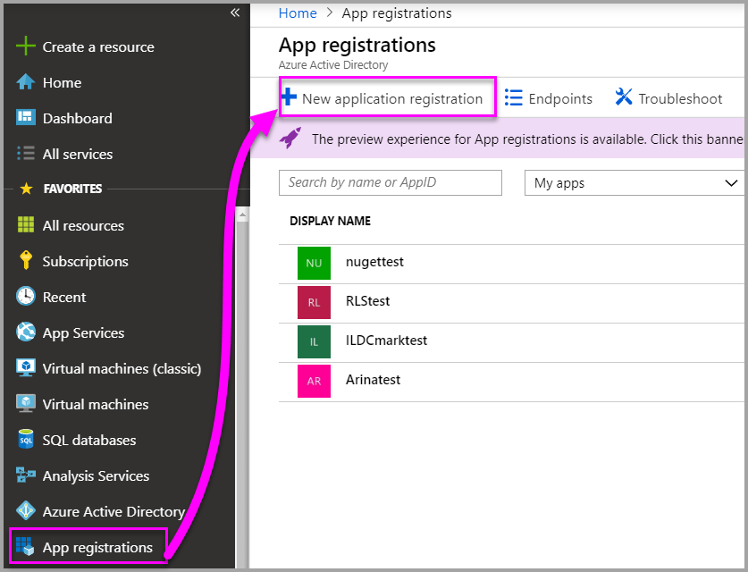
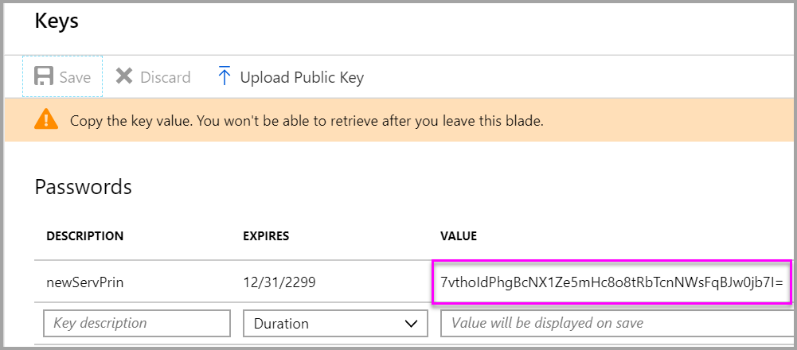

# Service principal for use with Power BI Embedded applications

To access resources that secure an Azure AD tenant, the entity that requires access represents a security principal. This action holds true for both users (user principal) and applications (service principal).

A security principal defines the access policy and permissions for the user/application in the Azure AD tenant. This access policy enables core features such as authentication of the user/application during sign-in, and authorization during resource access.

When an application gives permissions to access resources in Power BI upon registration or consent, a service principal object is created.
[Eli] - The above sentence is not correct, we don't have any scopes relvant to Power BI resources.

**Power BI APIs** and **Power BI .NET SDK** now support calls using service principal.

## Application registration

When you [register an Azure AD application](register-app.md) in the Azure portal, two objects are created in your Azure AD tenant:

- An application object
- A service principal object

### Application and service principal relationship

Consider the application object as the *global* representation of your application for use across all tenants, and the service principal as the *local* representation for use in a specific tenant.

The application object serves as the template from which common and default properties are *derived* for use in creating corresponding service principal objects.

A service principal must be created in each tenant where the application is used, enabling it to establish an identity for sign-in and/or access to resources being secured by the tenant. A single-tenant application has only one service principal (in its home tenant), created and consented for use during application registration.

## Service principal with Power BI Embedded

With service principal, you can mask your account information in your application by using an application ID (app ID) and an application secret (app secret). You don't have to hard-code a master user account into your application to authenticate.

You can only use a service principal if your Power BI artifacts and resources are stored in a Power BI workspace version two.
[Eli] Consider adding a link to the documentation.

A service principal can't be used to sign in to the Power BI service.

You can't install an **On-premises data gateway** using just a service principal. However you can edit the credentials of the gateway using a service principal token.
[Eli] No, you can't edit the credentials of an On-prem datasources.

You can set up notifications using a service principal token to pull history.
[Eli] What do you mean by that?

You can generate embed tokens with a service principal token.

A service principal can't be used with an Analysis Services live connection data source, or an Azure Analysis Services data source.
[Eli] Not correct, let's discuss

A service principal doesn't replace `Effectiveidentity` with a user. A service principal has **Azure Resource Management API** capacities.
[Eli] What do you mean by that?

Currently, service principal doesn't allow multi-tenant applications. You can't import or export an application using service principal in Azure.

You can set up notifications using a service principal to pull history.
[Eli] repeating

You can generate embed tokens with service principal.
[Eli] repeating

If you have **[multi-factor authentication (MFA)](https://docs.microsoft.com/azure/active-directory/authentication/concept-mfa-howitworks)** enabled with your Azure application, you can only use a service principole token to authenticate.
[Eli] typo in principal, not sure this sentence delivers the right message.

Other functions that a service principal token provides:

- Work with APIs
- Can create workspaces
- Add users to workspaces
- Remove users from workspaces
- Can import reports
- Can be viewed in the PBI portal
[Eli] what the last line means? also, Work with APIs contains all the rest.

## Service principal vs. Power BI Pro account

There are differences between using a service principal token versus a standard Power BI Pro login (master) account for authenticating into your Power BI Embedded application.

The main difference between using service principal over a master account is that service principal can't be used to sign in to the Power BI service. It isn't required, but recommended that you have a master account to view your Power BI resources and to troubleshoot your resources in the Power BI service.

You can only use a service principal if your Power BI artifacts and resources are stored in a Power BI workspace version two. However, when using a master account you can still use either versions of a workspace.

Unlike a master account that can be used with just a Power BI pro license for testing, a service principal token requires a [dedicated capacity](azure-pbie-create-capacity.md) to be purchased.
[Eli] No, it has the same dev-trial functionality

You can't install an **On-premises data gateway** using just a service principal. Installing an On-premises data gateway still requires a Power BI account. However, you can edit the credentials of the gateway using the service principal.
[Eli] repeating

If your Azure tenant settings have **[multi-factor authentication (MFA)](https://docs.microsoft.com/azure/active-directory/authentication/concept-mfa-howitworks)** enabled then it is recommended to use a service prinipal token to authenticate, as a master account does nto allow you to authenticate yuor PBIE application.
[Eli] repeating, but better explanation that the previous

## Configure service principal in your application

### Azure portal

1. Create an application in Azure

    

    

    

2. Create nn application secret

    

    

3. A Power BI admin needs to login to the Power BI admin portal and allow the application (service principal) to have access to Power BI

    

4. Through the Rest APIs import Power BI content into the Workspace (V2)

    Need code here?

5. In your application, authenticate via service principle (application ID and application secret)

    Application code

### Powershell

1. Open Powershell as an administrator

2. Install the Azure AD module

    ```powershell
    Install-Module -Name AzureAD
    ```
3. THen run the command *Set-ExecutionPolicy -ExecutionPolicy Bypass*

    ```powershell
    Set-ExecutionPolicy -ExecutionPolicy Bypass
    ```
4. Run Powershell script

    ```powershell
    param (
    [string]$applicationName
    )

    # Login to Azure and be able to use the app cmdlets
    Connect-AzureAD
    Login-AzureRmAccount

    # Create a new AAD web application
    $App = New-AzureADApplication -DisplayName $applicationName -Homepage "https://localhost:44322" -ReplyUrls "https://localhost:44322"

    # Add service principal to the application (only for allowed users)
    New-AzureRmADServicePrincipal -ApplicationId $App.AppId
    ```

    > [!Note]
    > Once you exit out of the blade, it is not visible any more so save it. However, if you forget to save it, then you can just craete a new one.

## Limitations and considerations

- Only works with **app workspaces *version two (2)***
- **My Workspace** isn't supported.
- Assigning a workspace to a capacity API isn't implemented yet
    - You can do it from the Power BI admin portal, or using a user token API call
- Can't be a capacity admin
- Using an Analysis Services live connection data source, or using Azure Analysis Services aren't supported
[Eli] above 3 points are resolved for public preview
- Can't install an on-premises data gateway
- Can't be an on-premises data gateway admin
- Can't sign in to the Power BI portal
- No APIs can be used to create dashboards
[Eli] already existing limitation
- Can't import or export application
- Need dedicated capacity
- It isn't required to own a pro license

## Next steps

- [Power BI Embedded for your customers](embed-sample-for-customers.md)
- [Register an app](register-app.md)
- [Application and service principal objects in Azure Active Directory](https://docs.microsoft.com/en-us/azure/active-directory/develop/app-objects-and-service-principals)
