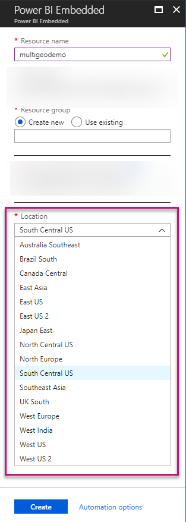
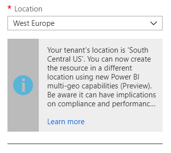
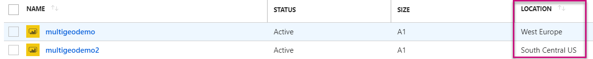
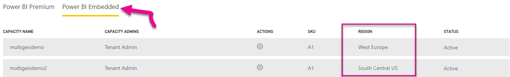

# Multi-Geo support in Power BI Embedded (Preview)

Multi-national ISVs and organizations building applications and using Power BI Embedded to embed analytics into their apps, can now deploy their data in multiple regions across the world to comply to different data residency requirements.

Based on the same feature set and limitations that Power BI Premium supports using Multi-Geo (Preview), now customers using. A capacities** can now use Multi-Geo. [Learn more on Multi-Geo capabilities and supported regions](../service-admin-premium-Multi-Geo.md).

## Creating new Power BI Embedded Capacity resource with Multi-Geo

In the **Create resource** blade, you need to choose the location of your capacity. Until now, it was limited only to the location of your Azure tenant, so only a single location was available. With the release of Multi-Geo, you can choose between different regions to deploy your capacity.

Notice that when opening the location drop-down menu, your home tenant is the default selection.
  

When choosing a different location, a message will be prompted to the user to make sure he is aware of his selection and the implications.

[Learn more on how to create a Power BI Embedded capacity in Azure](azure-pbie-what-is-power-bi-embedded.md).

## View Capacity location

You can see your capacities location easily when going to the main Power BI Embedded management page in Azure portal.

It’s also available in the Admin Portal in Powerbi.com. In the Admin portal, choose ‘Capacity settings’, and then switch to ‘Power BI Embedded’ tab.

## Manage existing capacities location

Once created, the location of Power BI Embedded resource cannot be changed, as other Azure resources. In order to move your Power BI content to a different region, you will need to create a new capacity in the desired region, assign the workspaces from the existing capacity to the new one, and delete or pause the existing capacity.

It’s also important to be aware that deleting a capacity without re-assigning it’s content, will move all the content residing in that capacity into shared capacity, which is in your home tenant.

## API support for Multi-Geo

To support management of capacities with Multi-Geo through API, we have made some changes to existing APIs:

1. ‘Get Capacities’- The API returns a list of capacities the user has access to. The response will now include additional property called ‘region’, that will specify the capacity’s location.
2. ‘Assign To Capacity’- The API allows assigning a given workspace to a capacity. This operation will now allow to assign workspaces to capacity outside of your home region or move workspaces between capacities in different regions. To perform this operation, the user still needs admin permissions on the workspace, and admin or assign permissions on the target capacity.

3. ARM API- all of the ARM API operations, including ‘Create’ and ‘Delete’, will support Multi-Geo.

## Multi-Geo support in Power BI Premium (Preview)

Based on the same feature sets and limitations, Multi-Geo is now available for Preview to customers using A capacities for Power BI Embedded. Learn more on Multi-Geo capabilities and supported regions.

## Limitations and considerations

Confirm that any movement you initiate between regions follows all corporate and government compliance requirements prior to initiating data transfer.

A cached query stored in a remote region stays in that region at rest. However, other data in transit may go back and forth between multiple geographies. 

When moving data from one region to another in a Multi-Geo environment, the source data may remain in the region from which the data was moved for up to 30 days. During that time end users don't have access to it. It's removed from this region and destroyed during the 30-day period.

Multi-Geo doesn't result in better performance in general. Loading reports and dashboards still involves requests to the home region for metadata.

## Next steps

[Power BI Embedded: What is it?](service-Embedded.md)

More questions? [Try asking the Power BI Community](http://community.powerbi.com/)
