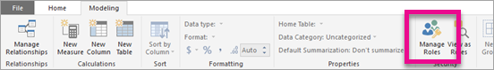

# Use row-level security with Power BI embedded content

Row level security (RLS) can be used to restrict user access to data within dashboards, tiles, reports, and datasets. Multiple, different users can work with those same artifacts all while seeing different data. Embedding supports RLS.

If you're embedding for non-Power BI users (app owns data), which is typically an ISV scenario, then this article is for you! You need to configure the embed token to account for the user and role. Read on to learn how to do this.

If you are embedding to Power BI users (user owns data), within your organization, RLS works the same as it does within the Power BI service directly. There is nothing more you need to do in your application. For more information, see [Row-Level security (RLS) with Power BI](../service-admin-rls.md).


To take advantage of RLS, it’s important you understand three main concepts; Users, Roles, and Rules. Let’s take a closer look at each:

**Users** – End users viewing the artifact (dashboard, tile, report, or dataset). In Power BI Embedded, users are identified by the username property in an embed token.

**Roles** – Users belong to roles. A role is a container for rules and can be named something like *Sales Manager* or *Sales Rep*. You create roles within Power BI Desktop. For more information, see [Row-level security (RLS) with Power BI Desktop](../desktop-rls.md).

**Rules** – Roles have rules, and those rules are the actual filters that are going to be applied to the data. This could be as simple as “Country = USA” or something much more dynamic.
For the rest of this article, there is an example of authoring RLS, and then consuming that within an embedded application. Our example uses the [Retail Analysis Sample](http://go.microsoft.com/fwlink/?LinkID=780547) PBIX file.


## Adding roles with Power BI Desktop

Our Retail Analysis sample shows sales for all the stores in a retail chain. Without RLS, no matter which district manager signs in and views the report, they’ll see the same data. Senior management has determined each district manager should only see the sales for the stores they manage, and to do this, we can use RLS.

RLS is authored in Power BI Desktop. When the dataset and report are opened, we can switch to diagram view to see the schema:


Here are a few things to notice with this schema:

* All measures, like **Total Sales**, are stored in the **Sales** fact table.
* There are four additional related dimension tables: **Item**, **Time**, **Store**, and **District**.
* The arrows on the relationship lines indicate which way filters can flow from one table to another. For example, if a filter is placed on **Time[Date]**, in the current schema it would only filter down values in the **Sales** table. No other tables would be affected by this filter since all the arrows on the relationship lines point to the sales table and not away.
* The **District** table indicates who the manager is for each district:
  
    

Based on this schema, if we apply a filter to the **District Manager** column in the **District** table, and if that filter matches the user viewing the report, that filter filters down the **Store** and **Sales** tables to only show data for that district manager.

Here's how:

1. On the **Modeling** tab, select **Manage Roles**.

    
2. Create a new role called **Manager**.

    
3. In the **District** table, enter the following DAX expression: **[District Manager] = USERNAME()**.

    
4. To make sure the rules are working, on the **Modeling** tab, select **View as Roles**, and then select both the **Manager** role you just created, along with **Other users**. Enter **AndrewMa** for the user.

    

    The reports show data as if you were signed in as **AndrewMa**.

Applying the filter, the way we did here, filters down all records in the **District**, **Store**, and **Sales** tables. However, because of the filter direction on the relationships between **Sales** and **Time**, **Sales** and **Item**, and **Item** and **Time** tables are not filtered down. To learn more about bidirectional cross-filtering, download the [Bidirectional cross-filtering in SQL Server Analysis Services 2016 and Power BI Desktop](http://download.microsoft.com/download/2/7/8/2782DF95-3E0D-40CD-BFC8-749A2882E109/Bidirectional%20cross-filtering%20in%20Analysis%20Services%202016%20and%20Power%20BI.docx) whitepaper.

## Applying user and role to an embed token

Now that you have your Power BI Desktop roles configured, there is some work needed in your application to take advantage of the roles.

Users are authenticated and authorized by your application and embed tokens are used to grant that user access to a specific Power BI Embedded report. Power BI Embedded doesn’t have any specific information on who your user is. For RLS to work, you’ll need to pass some additional context as part of your embed token in the form of identities. This is done by way [Embed Token](https://docs.microsoft.com/rest/api/power-bi/embedtoken) API.

The API accepts a list of identities with indication of the relevant datasets. For RLS to work, you need to pass the following as part of the identity.

* **username (mandatory)** – This is a string that can be used to help identify the user when applying RLS rules. Only a single user can be listed. Your username can be created with *ASCII* characters.
* **roles (mandatory)** – A string containing the roles to select when applying Row Level Security rules. If passing more than one role, they should be passed as a string array.
* **dataset (mandatory)** – The dataset that is applicable for the artifact you are embedding.

You can create the embed token by using the **GenerateTokenInGroup** method on **PowerBIClient.Reports**.

For example, you could change the [PowerBIEmbedded_AppOwnsData](https://github.com/Microsoft/PowerBI-Developer-Samples/tree/master/App%20Owns%20Data) sample. *Home\HomeController.cs line 76 and 77* could be updated from:

```csharp
// Generate Embed Token.
var generateTokenRequestParameters = new GenerateTokenRequest(accessLevel: "view");

var tokenResponse = await client.Reports.GenerateTokenInGroupAsync(GroupId, report.Id, generateTokenRequestParameters);
```

to

```csharp
var generateTokenRequestParameters = new GenerateTokenRequest("View", null, identities: new List<EffectiveIdentity> { new EffectiveIdentity(username: "username", roles: new List<string> { "roleA", "roleB" }, datasets: new List<string> { "datasetId" }) });

var tokenResponse = await client.Reports.GenerateTokenInGroupAsync("groupId", "reportId", generateTokenRequestParameters);
```

If you are calling the REST API, the updated API now accepts an additional JSON array, named **identities**, containing a user name, list of string roles and list of string datasets, e.g.:

```json
{
    "accessLevel": "View",
    "identities": [
        {
            "username": "EffectiveIdentity",
            "roles": [ "Role1", "Role2" ],
            "datasets": [ "fe0a1aeb-f6a4-4b27-a2d3-b5df3bb28bdc" ]
        }
    ]
}
```

Now, with all the pieces together, when someone logs into your application to view this artifact, they’ll only be able to see the data that they are allowed to see, as defined by our row-level security.

## Working with Analysis Services live connections

Row-level security can be used with Analysis Services live connections for on-premises servers. There are a few specific concepts that you should understand when using this type of connection.

The effective identity that is provided for the username property must be a Windows user with permissions on the Analysis Services server.

**On-premises data gateway configuration**

An [On-premises data gateway](../service-gateway-onprem.md) is used when working with Analysis Services live connections. When generating an embed token, with an identity listed, the master account needs to be listed as an admin of the gateway. If the master account is not listed, the row-level security is not applied to the property of the data. A non-admin of the gateway can provide roles, but must specify its own username for the effective identity.

**Use of roles**

Roles can be provided with the identity in an embed token. If no role is provided, the username that was provided can be used to resolve the associated roles.

**Using the CustomData feature**

The CustomData feature allows passing free text (string) using the CustomData connection string property, a value to be used by AS (via the CUSTOMDATA() function).
You can use this as an alternative way to customize data consumption.
You can use it inside the role DAX query, and you can use it without any role in a measure DAX query.
CustomData feature is part of our token generation functionality for the following artifacts: dashboard, report, and tile. Dashboards can have multiple CustomData identities (one per tile/model).

> [!NOTE]
> The CustomData feature will only work for models that reside in Azure Analysis Services, and it only works in live mode. Unlike users and roles, the custom data feature can't be set inside a .pbix file. When generating a token with the custom data feature you must a have user name.

**CustomData SDK Additions**

CustomData string property was added to our effective identity in the token generation scenario.

        [JsonProperty(PropertyName = "customData")]
        public string CustomData { get; set; }

The identity can be created with custom data using the following call:

        public EffectiveIdentity(string username, IList<string> datasets, IList<string> roles = null, string customData = null);

**CustomData SDK Usage**

If you are calling the REST API, you can add custom data inside each identity, e.g.:

```json
{
    "accessLevel": "View",
    "identities": [
        {
            "username": "EffectiveIdentity",
            "roles": [ "Role1", "Role2" ],
            "customData": "MyCustomData",
            "datasets": [ "fe0a1aeb-f6a4-4b27-a2d3-b5df3bb28bdc" ]
        }
    ]
}
```

## Considerations and limitations

* Assignment of users to roles within the Power BI service does not affect RLS when using an embed token.
* While the Power BI service will not apply RLS setting to admins or members with edit permissions, when you supply an identity with an embed token, it will be applied to the data.
* Analysis Services live connections are supported for on-premises servers.
* Azure Analysis Services live connections support filtering by roles. Dynamic filtering can be done using CustomData.
* If the underlying dataset doesn’t require RLS, the GenerateToken request must **not** contain an effective identity.
* If the underlying dataset is a cloud model (cached model or DirectQuery), the effective identity must include at least one role,  otherwise role assignment will not occur.
* A list of identities enables multiple identity tokens for dashboard embedding. For all others artifacts, the list contains a single identity.

More questions? [Try asking the Power BI Community](https://community.powerbi.com/)
