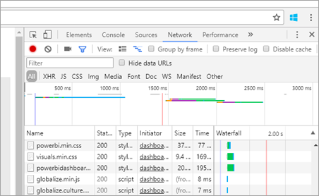
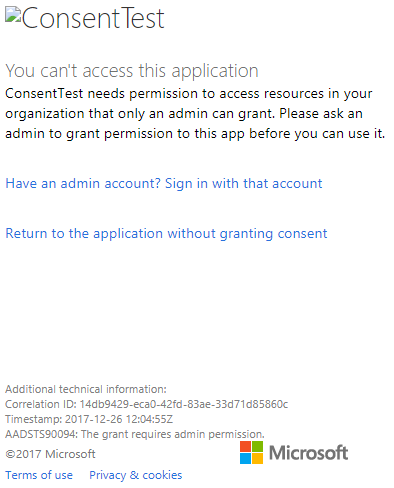
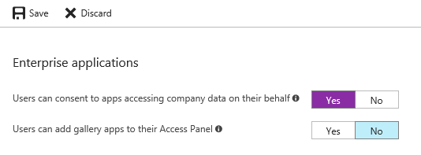

# Troubleshooting your embedded application

This article discusses some common issues you may get when embedding content from Power BI.

## Tools for troubleshooting

### Fiddler Trace

[Fiddler](http://www.telerik.com/fiddler) is a free tool from Telerik that monitors HTTP traffic.  You can see the traffic with the Power BI APIs from the client machine. This tool may show errors and other related information.


### F12 in Browser for front-end debugging

F12 launches the developer window within your browser. This tool provides the ability to look at network traffic and other information.



### Extracting error details from Power BI response

This code snippet shows how to extract the error details from HTTP exception:

```csharp
public static string GetExceptionText(this HttpOperationException exc)
{
    var errorText = string.Format("Request: {0}\r\nStatus: {1} ({2})\r\nResponse: {3}",
    exc.Request.Content, exc.Response.StatusCode, (int)exc.Response.StatusCode, exc.Response.Content);
    if (exc.Response.Headers.ContainsKey("RequestId"))
    {
        var requestId = exc.Response.Headers["RequestId"].FirstOrDefault();
        errorText += string.Format("\r\nRequestId: {0}", requestId);
    }

    return errorText;
}
```

We recommend logging the Request ID (and error details for troubleshooting).
Provide the Request ID when approaching Microsoft support.

## App registration

**App registration failure**

Error messages within the Azure portal or the Power BI app registration page mention insufficient privileges. To register an application, you must be an admin in the Azure AD tenant or application registrations must be enabled for non-admin users.

**Power BI Service does not appear in the Azure portal when registering a new App**

At least one user must be signed up for Power BI. If you do not see **Power BI Service** listed within the API list, no user is signed up for Power BI.

## REST API

**API call returning 401**

A fiddler capture may be required to investigate further. The required permission scope may be missing for the registered application within Azure AD. Verify the required scope is present within the app registration for Azure AD within the Azure portal.

**API call returning 403**

A fiddler capture may be required to investigate further. There could be several reasons for a 403 error.

* The user has exceeded the amount of embed token that can be generated on a shared capacity. You need to purchase Azure capacities to generate embed tokens and assign the workspace to that capacity. See [Create Power BI Embedded capacity in the Azure portal](https://docs.microsoft.com/azure/power-bi-embedded/create-capacity).
* The Azure AD auth token expired.
* The authenticated user is not a member of the group (app workspace).
* The authenticated user is not an admin of the group (app workspace).
* The authorization header may not be listed correctly. Make sure there are no typos.

The backend of the application may need to refresh the auth token before calling GenerateToken.

    ```
    GET https://wabi-us-north-central-redirect.analysis.windows.net/metadata/cluster HTTP/1.1
    Host: wabi-us-north-central-redirect.analysis.windows.net
    ...
    Authorization: Bearer eyJ0eXAiOi...
    ...

    HTTP/1.1 403 Forbidden
    ...

    {"error":{"code":"TokenExpired","message":"Access token has expired, resubmit with a new access token"}}
    ```

## Authentication

### Authentication failed with AADSTS70002 or AADSTS50053

**(AADSTS70002: Error validating credentials. AADSTS50053: You've tried to sign in too many times with an incorrect User ID or password)**

If you are using Power BI Embedded and utilizing Azure AD Direct Authentication, and you are receiving messages logging in such as ***error:unauthorized_client, error_description:AADSTS70002: Error validating credentials. AADSTS50053: You've tried to sign in too many times with an incorrect User ID or password***, that is because direct authentication has been turned off as of 6/14/2018 by default.

There is a way to turn this back on using an [Azure AD Policy](https://docs.microsoft.com/azure/active-directory/manage-apps/configure-authentication-for-federated-users-portal#enable-direct-authentication-for-legacy-applications) that can either be scoped to the organization or a [service principal](https://docs.microsoft.com/azure/active-directory/develop/active-directory-application-objects#service-principal-object).

We recommend you enable this only as a per-app basis.

To create this policy, you need to be a **Global Administrator** for the directory where you’re creating the policy and assigning. Here is a sample script for creating the policy and assigning it to the SP for this application:

1. Install the [Azure AD Preview PowerShell Module](https://docs.microsoft.com/powershell/azure/active-directory/install-adv2?view=azureadps-2.0).

2. Run the following PowerShell commands line-by-line (making sure the variable $sp doesn’t have more than 1 application as a result).

```powershell
Connect-AzureAD
```

```powershell
$sp = Get-AzureADServicePrincipal -SearchString "Name_Of_Application"
```

```powershell
$policy = New-AzureADPolicy -Definition @("{`"HomeRealmDiscoveryPolicy`":{`"AllowCloudPasswordValidation`":true}}") -DisplayName EnableDirectAuth -Type HomeRealmDiscoveryPolicy -IsOrganizationDefault $false
```

```powershell
Add-AzureADServicePrincipalPolicy -Id $sp.ObjectId -RefObjectId $policy.Id 
```

After assigning the policy, please wait approximately 15-20 seconds for propagation before testing.

**Generate token fails when providing effective identity**

GenerateToken can fail, with effective identity supplied, for a few different reasons.

* Dataset does not support effective identity
* Username was not provided
* Role was not provided
* DatasetId was not provided
* User doesn't have the correct permissions

To verify which it is, try the following.

* Execute [get dataset](https://docs.microsoft.com/rest/api/power-bi/datasets). Is the property IsEffectiveIdentityRequired true?
* Username is mandatory for any EffectiveIdentity.
* If IsEffectiveIdentityRolesRequired is true, Role is required.
* DatasetId is mandatory for any EffectiveIdentity.
* For Analysis Services, the master user has to be a gateway admin.

### AADSTS90094: The grant requires admin permission

**_Symptoms:_**</br>
When a non-admin user attempts to sign in to an application for the first and grant consent she gets the following error:
* ConsentTest needs permission to access resources in your organization that only an admin can grant. Please ask an admin to grant permission to this app before you can use it.
* AADSTS90094: The grant requires admin permission.

    

An admin user can sign-in and grant consent successfully.

**_Root cause:_**</br>
User consent is disabled for the tenant.

**_Several fixes are possible:_**

*Enable user consent for the entire tenant (all users, all applications)*
1. In the Azure portal navigate to "Azure Active Directory" => "Users and groups" => "User settings"
2. Enable the "Users can consent to apps accessing company data on their behalf" setting and save the changes

    

*Grant permissions by an admin*
Grant permissions to the application by an admin - either for the entire tenant or a specific user.

## Data sources

**ISV wants to have different credentials for the same data source**

A data source can have a single set of credentials for one master user. If you need to use different credentials, create additional master users. Then, assign the different credentials in each of the master users contexts, and embed using the Azure AD token of that user.

## Content rendering

**Rendering, or consumption, of embedded content, fails or times out**

Make sure the embed token did not expire. Make sure you are checking the embed token expiration and refreshing it. For more information, see [Refresh token using JavaScript SDK](https://github.com/Microsoft/PowerBI-JavaScript/wiki/Refresh-token-using-JavaScript-SDK-example).

**Report or dashboard does not load**

If the user is unable to see the report or dashboard, make sure the report or dashboard loads correctly within powerbi.com. The report or dashboard doesn't work within your application if it doesn't load within powerbi.com.

**Report or dashboard is performing slowly**

Open the file from Power BI Desktop, or within powerbi.com, and verify that performance is acceptable to rule out issues with your application or the embedding APIs.

## Troubleshooting your embedded application with the IError object

Use the [**IError object** returned by the *error* event from the **JavaScript SDK**](https://github.com/Microsoft/PowerBI-JavaScript/wiki/Troubleshooting-and-debugging-of-embedded-parts) to debug your application and better understand the cause of your errors.

After acquiring the IError object, you should look at the appropriate common errors table that fits the embed type you're using. Compare the **IError properties** with the ones in the table and find the possible reason(s) for the failure.

### Typical errors when embedding for Power BI users

| Message | Detailed Message | Error Code | Possible reason(s) |
|-------------------------------------------------------|-----------------------------------------------------------------------------------------------------------------------------|-----------|--------------------------------------------------------|
| TokenExpired | Access token has expired, resubmit with a new access token | 403 | Expired token  |
| PowerBIEntityNotFound | Get report failed | 404 | <li> Wrong Report ID <li> Report doesn’t exist  |
| Invalid parameters | powerbiToken parameter not specified | N/A | <li> No access token provided <li> No Report ID provided |
| LoadReportFailed | Fail to initialize - Could not resolve cluster | 403 | * Bad access token * Embed type does not match token type |
| PowerBINotAuthorizedException | Get report failed | 401 | <li> Wrong group Id <li> Unauthorized group |
| TokenExpired | Access token has expired, resubmit with a new access token. Could not render a report visual titled: <visual title> | N/A | Query data Expired token |
| OpenConnectionError | Can't display the visual. Could not render a report visual titled: <visual title> | N/A | Capacity paused or deleted while a report related to the capacity was open in a session |
| ExplorationContainer_FailedToLoadModel_DefaultDetails | Couldn't load the model schema associated with this report. Make sure you have a connection to the server and try again. | N/A | <li> Capacity paused <li> Capacity deleted |

### Typical errors when embedding for non-Power BI users (using an Embed Token)

| Message | Detailed Message | Error Code | Reason(s) |
|-------------------------------------------------------|-------------------------------------------------------------------------------------------------------------------------------|------------|-------------------------------------------------|
| TokenExpired | Access token has expired, resubmit with a new access token | 403 | Expired token  |
| LoadReportFailed | Get report failed | 404 | <li> Wrong Report ID <li> Report doesn’t exist  |
| LoadReportFailed | Get report failed | 403 | Report ID does not match token |
| LoadReportFailed | Get report failed | 500 | Report provided ID is not a guid |
| Invalid parameters | powerbiToken parameter not specified | N/A | <li> No access token provided <li> No Report ID provided |
| LoadReportFailed | Fail to initialize - Could not resolve cluster | 403 | Wrong token type, Bad Token |
| PowerBINotAuthorizedException | Get   report failed | 401 | Wrong/unauthorize group Id |
| TokenExpired | Access token has expired, resubmit with a new access token. Could not render a report visual titled: <visual title> | N/A | Query data Expired token |
| OpenConnectionError | Can't display the visual. Could not render a report visual titled: <visual title> | N/A | Capacity paused or deleted while a report related to the capacity was open in a session |
| ExplorationContainer_FailedToLoadModel_DefaultDetails | Couldn't load the model schema associated with this report. Make sure you have a connection to the server and try again. | N/A | <li> Capacity paused <li> Capacity deleted |

## Performance

In this section, you can find recommendations in order to get faster rendering of reports, dashboards and tiles in your application.

Embed parameters
Powerbi.embed() method receives few parameters to embed a report, a dashboard to a tile. These parameters have performance implications.

### Embed URL

Please avoid generating the embed URL yourself. Instead, make sure you get the Embed URL by calling the [Get reports](https://na01.safelinks.protection.outlook.com/?url=https%3A%2F%2Fdocs.microsoft.com%2Fen-us%2Frest%2Fapi%2Fpower-bi%2Freports%2Fgetreportsingroup&data=02%7C01%7CMark.Ghanayem%40microsoft.com%7C07ca68ceb37a48e3f3de08d64968707a%7C72f988bf86f141af91ab2d7cd011db47%7C1%7C0%7C636777110256168308&sdata=22lkqRM2w1MQfrM8dooedaPqqIU8PufTq9TT4VDzRo0%3D&reserved=0), the [Get dashboards](https://na01.safelinks.protection.outlook.com/?url=https%3A%2F%2Fdocs.microsoft.com%2Fen-us%2Frest%2Fapi%2Fpower-bi%2Fdashboards%2Fgetdashboardsingroup&data=02%7C01%7CMark.Ghanayem%40microsoft.com%7C07ca68ceb37a48e3f3de08d64968707a%7C72f988bf86f141af91ab2d7cd011db47%7C1%7C0%7C636777110256168308&sdata=nfWRgbSoXVF42Rg%2Ba9491u19uksXp%2FAyz%2Fa%2Ba7%2FCtdA%3D&reserved=0), or the [Get tiles](https://na01.safelinks.protection.outlook.com/?url=https%3A%2F%2Fdocs.microsoft.com%2Fen-us%2Frest%2Fapi%2Fpower-bi%2Fdashboards%2Fgettilesingroup&data=02%7C01%7CMark.Ghanayem%40microsoft.com%7C07ca68ceb37a48e3f3de08d64968707a%7C72f988bf86f141af91ab2d7cd011db47%7C1%7C0%7C636777110256178318&sdata=LgZ27TynNpqQJDrb3aHWGQXIS%2FzichAO9De5M2uhF1Q%3D&reserved=0) API. We added a new parameter to the URL called **_config_**, used for performance improvements.

### Permissions

Please provide **View** permissions if you are not intending to embed a report in **Edit mode**. This way embed code will not initialize components which is used for Edit mode.

### Filters, bookmarks and slicers

Usually, reports visuals are saved with cached data. These cached data is used to give preserved performance. Reports will render cached data while queries are executed. If filters, bookmarks or slicers are provided, cached data will not be relevant. Then, the visuals will be rendered only after running the visual query.

> [!Recommendation]
> If you always embed a report with the same filters, it’s better to save the report with the filters applied. That way you can avoid passing a list of filters in load configuration.

### Update tools and SDKs

To enjoy the recent enhancements, Keep Tools and SDKs up to date.

* It’s better to use the latest version of Power BI Desktop.

* install the latest powerbi-client SDK version. We continue to release more enhancement, so make sure to follow-up from time to time. 

* Packages to install:
    * Npm package: powerbi-client
    * Nuget package: Microsoft.PowerBI.JavaScript

### Preloading

You may Use ‘Preload’ JavaScript API to improve the end-user perceived performance.
Powerbi.preload() downloads javascript, css files and other artifacts which will be used later to embed a report.

* There is no point of calling powerbi.preload() and then immediately calling powerbi.embed().
* Call preload if you are not embedding the report immediately.
    * Example: if you embed a report on a button click, it’s better to call preload when the page loads. Then, when the application user clicks the button, the rendering will be faster.

### Measuring performance

To measure performance, you can use the two events we provide:

1. Loaded: time until report is initialized (user will see no spinny).
2. Rendered: time until fully report is rendered using actual data. The rendered event is fired each time the report is re-rendered (i.e. after applying filters). To measure a report first, render duration please make sure you do the calculations in the first raised event.

> [!Note]
> Cached data is rendered when available, but we don’t have an event for this yet.

> [!Important]
> Remember that loading time mainly depends on elements relevant to the report and data itself, such as number of visuals, size of data and complexity of the queries and calculated measures. Please follow best practices document to improve the report’s loading time.

## Embedding setup tool

You can go through the [Embedding setup tool](https://aka.ms/embedsetup) to quickly download a sample application. Then you can compare your application to the sample.

### Prerequisites

Verify that you have all the proper prerequisites before using the Embedding setup tool. You need a **Power BI Pro** account and a **Microsoft Azure** subscription.

* If you're not signed up for **Power BI Pro**, [sign up for a free trial](https://powerbi.microsoft.com/en-us/pricing/) before you begin.
* If you don’t have an Azure subscription, create a [free account](https://azure.microsoft.com/free/?WT.mc_id=A261C142F) before you begin.
* You need to have your own [Azure Active Directory tenant ](create-an-azure-active-directory-tenant.md) setup.
* You need [Visual Studio](https://www.visualstudio.com/) installed (version 2013 or later).

### Common Issues

Some common issues you might encounter while testing with the Embedding setup tool are:

#### Using the Embed for your customers sample application

If you are working with the **Embed for your customers** experience, save and unzip the *PowerBI-Developer-Samples.zip* file. Then open the *PowerBI-Developer-Samples-master\App Owns Data* folder and run the *PowerBIEmbedded_AppOwnsData.sln* file.

When selecting **Grant permissions** (the Grant permissions step), you get the following error:

    AADSTS70001: Application with identifier <client ID> was not found in the directory <directory ID>

The solution is to close the popup, wait a few seconds and try again. You might need to repeat this action a few times. A time interval causes the issue from completing the application registration process to when it is available to external APIs.

The following error message appears when running the sample app:

    Password is empty. Please fill password of Power BI username in web.config.

This error occurs because the only value that is not being injected into the sample application is your user password. Open the Web.config file in the solution and fill the pbiPassword field with your user's password.

If you get the error - AADSTS50079: The user is required to use multi-factor authentication.

    Need to use an AAD account that does not have MFA enabled.

#### Using the Embed for your organization sample application

If you are working with the **Embed for your organization** experience, save and unzip the *PowerBI-Developer-Samples.zip* file. Then open the *PowerBI-Developer-Samples-master\User Owns Data\integrate-report-web-app* folder and run the *pbi-saas-embed-report.sln* file.

When you run the **Embed for your organization** sample app, you get the following error:

    AADSTS50011: The reply URL specified in the request does not match the reply URLs configured for the application: <client ID>

This is because the redirect URL specified for the web-server application is different from the sample's URL. If you want to register the sample application, then use `http://localhost:13526/` as the redirect URL.

If you would like to edit the registered application, then learn how to edit the [AAD registered application](https://docs.microsoft.com/azure/active-directory/develop/active-directory-integrating-applications#updating-an-application), so the application can provide access to the web APIs.

If you would like to edit your Power BI user profile or data, then learn how to edit your [Power BI data](https://docs.microsoft.com/power-bi/service-basic-concepts).

If you get the error - AADSTS50079: The user is required to use multi-factor authentication.

    Need to use an AAD account that does not have MFA enabled.

For more information, please see [Power BI Embedded FAQ](embedded-faq.md).

More questions? [Try the Power BI Community](http://community.powerbi.com/)

If you require further assistance, then please [contact support](https://powerbi.microsoft.com/en-us/support/pro/?Type=documentation&q=power+bi+embedded) or [create a support ticket via the Azure portal](https://ms.portal.azure.com/#blade/Microsoft_Azure_Support/HelpAndSupportBlade/newsupportrequest) and provide the error message(s) you encounter.