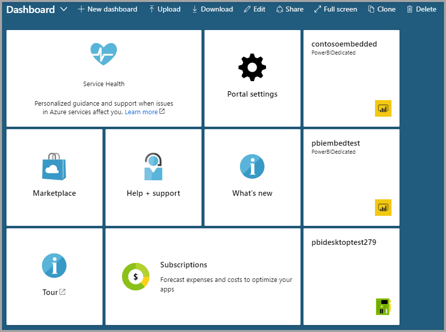

# Create Power BI Embedded capacity in the Azure portal

This article walks through how to create a [Power BI Embedded](azure-pbie-what-is-power-bi-embedded.md) capacity in Microsoft Azure. Power BI Embedded simplifies Power BI capabilities by helping you quickly add stunning visuals, reports, and dashboards to your apps.

If you don't have an Azure subscription, create a [free account](https://azure.microsoft.com/free/) before you begin.

> [!VIDEO https://www.youtube.com/embed/aXrvFfg_iSk]

## Before you begin

To complete this quickstart, you need:

* **Azure subscription:** Visit [Azure Free Trial](https://azure.microsoft.com/free/) to create an account.
* **Azure Active Directory:** Your subscription must be associated with an Azure Active Directory (AAD) tenant. Also, ***you need to be signed in to Azure with an account in that tenant***. Microsoft accounts aren't supported. To learn more, see [Authentication and user permissions](https://docs.microsoft.com/azure/analysis-services/analysis-services-manage-users).
* **Power BI tenant:** At least one account in your AAD tenant must have signed up for Power BI.
* **Resource group:** Use a resource group you already have or [create a new one](https://docs.microsoft.com/azure/azure-resource-manager/resource-group-overview).

## Create a capacity

# [Portal](#tab/portal)

1. Sign into the [Azure portal](https://portal.azure.com/).

2. In the search box, search for *Power BI Embedded*.

3. Within Power BI Embedded, select **Create**.

4. Fill in the required information and then select **Create**.

    

    |Setting |Description |
    |---------|---------|
    |**Resource name**|A name to identify the capacity. The resource name is displayed within the Power BI admin portal in addition to the Azure portal.|
    |**Subscription**|The subscription you would like to create the capacity against.|
    |**Resource group**|The resource group that contains this new capacity. Pick from an existing resource group, or create another. For more information, see [Azure Resource Manager overview](https://docs.microsoft.com/azure/azure-resource-manager/resource-group-overview).|
    |**Power BI capacity administrator**|Power BI capacity administrators can view the capacity in the Power BI admin portal and give assignment permissions to other users. By default, the capacity administrator is your account. The capacity administrator must be within your Power BI tenant.|
    |**Location**|The location where Power BI is hosted for your tenant. Your default location is your home region, but you can change the location using [Multi-Geo options](embedded-multi-geo.md).
    |**Pricing tier**|Select the SKU (v-core count and memory size) that meets your needs.  For details, see [Power BI Embedded pricing](https://azure.microsoft.com/pricing/details/power-bi-embedded/)|

# [Azure CLI](#tab/CLI)

### Use Azure Cloud Shell

Azure hosts Azure Cloud Shell, an interactive shell environment that you can use through your browser. You can use either Bash or PowerShell with Cloud Shell to work with Azure services. You can use the Cloud Shell preinstalled commands to run the code in this article without having to install anything on your local environment.

To start Azure Cloud Shell:

| Option | Example/Link |
|-----------------------------------------------|---|
| Select **Try It** in the upper-right corner of a code block. Selecting **Try It** doesn't automatically copy the code to Cloud Shell. |  |
| Go to [https://shell.azure.com](https://shell.azure.com), or select the **Launch Cloud Shell** button to open Cloud Shell in your browser. | [](https://shell.azure.com) |
| Select the **Cloud Shell** button on the menu bar at the upper right in the [Azure portal](https://portal.azure.com). |  |

To run the code in this article in Azure Cloud Shell:

1. Start Cloud Shell.

2. Select the **Copy** button on a code block to copy the code.

3. Paste the code into the Cloud Shell session by selecting **Ctrl**+**Shift**+**V** on Windows and Linux or by selecting **Cmd**+**Shift**+**V** on macOS.

4. Select **Enter** to run the code.

### Create a capacity with Azure CLI

Use the [az powerbi embedded-capacity create](https://docs.microsoft.com/cli/azure/ext/powerbidedicated/powerbi/embedded-capacity?view=azure-cli-latest#ext-powerbidedicated-az-powerbi-embedded-capacity-create) command to create a capacity.

```azurecli
az powerbi embedded-capacity create --location
                                    --name
                                    --resource-group
                                    --sku-name {A1, A2, A3, A4, A5, A6}
                                    [--administration-members]
                                    [--no-wait]
                                    [--sku-tier {PBIE_Azure}]
                                    [--tags]
```

### Delete a capacity with Azure CLI

To delete a capacity using Azure CLI, use the [az powerbi embedded-capacity delete](https://docs.microsoft.com/cli/azure/ext/powerbidedicated/powerbi/embedded-capacity?view=azure-cli-latest#ext-powerbidedicated-az-powerbi-embedded-capacity-delete) command.

```azurecli
az powerbi embedded-capacity delete --name
                                    --resource-group
                                    [--no-wait]
                                    [--yes]
```

### Manage your capacity with Azure CLI

You can view all the Power BI Embedded Azure CLI commands, in [az powerbi](https://docs.microsoft.com/cli/azure/ext/powerbidedicated/powerbi?view=azure-cli-latest).

---

## View your capacity

You can navigate to **All services** > **Power BI Embedded** to see if your capacity is ready. Alternatively, you can select **Pin to dashboard** from the notifications section or from within the blade, to navigate to your dashboard to see your new capacity.



## Next steps

* To use your new Power BI Embedded capacity, browse to the Power BI admin portal to assign workspaces. For more information, see [Manage capacities within Power BI Premium and Power BI Embedded](https://powerbi.microsoft.com/documentation/powerbi-admin-premium-manage/).

* If you don't need to use this capacity, you can pause it to stop billing. For more information, see [Pause and start your Power BI Embedded capacity in the Azure portal](azure-pbie-pause-start.md).

* To begin embedding Power BI content within your application, see [How to embed your Power BI dashboards, reports, and tiles](https://powerbi.microsoft.com/documentation/powerbi-developer-embedding-content/).

* More questions? [Try asking the Power BI Community](https://community.powerbi.com/)