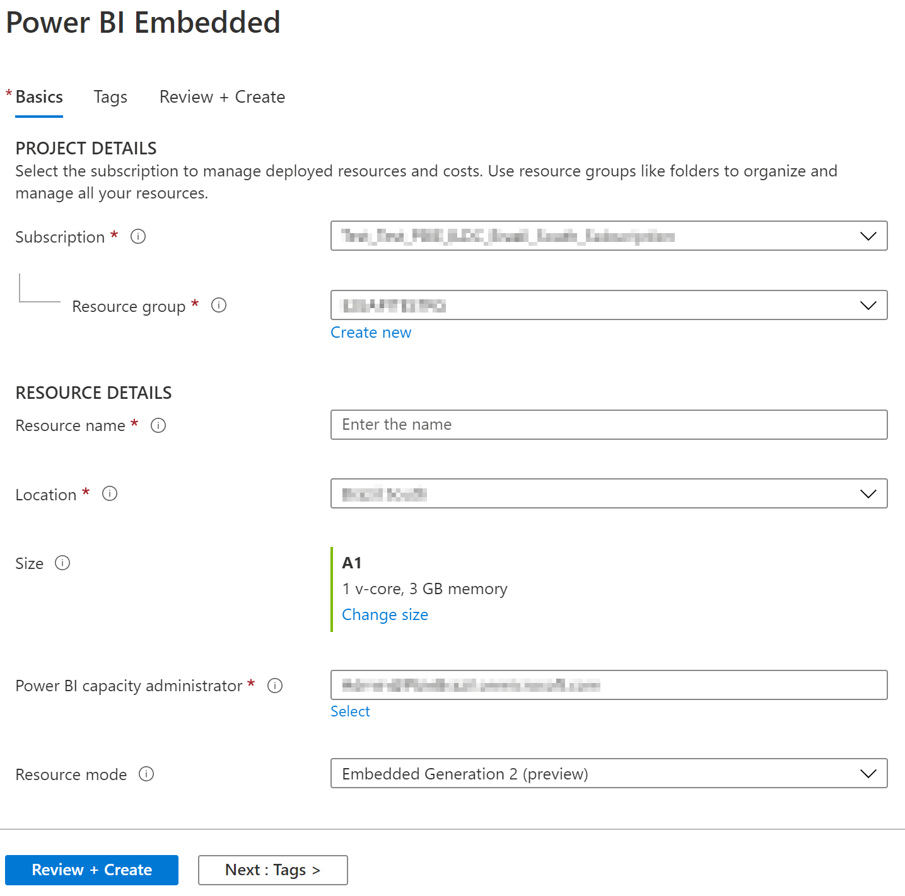
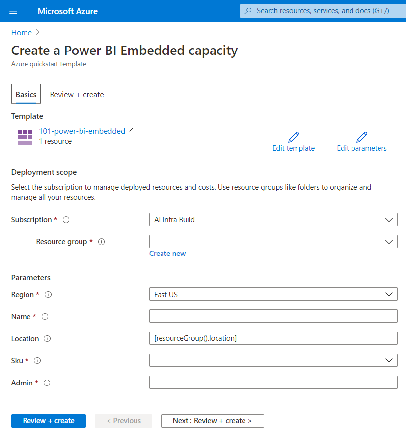

# Create Power BI Embedded capacity in the Azure portal

This article walks you through how to create a [Power BI Embedded](embedded-analytics-power-bi.md) capacity in Microsoft Azure. Power BI Embedded simplifies Power BI capabilities by helping you quickly add stunning visuals, reports, and dashboards to your apps.

## Prerequisites

Before you can create a capacity, you need the following:

1. An **Microsoft Entra ID:** Your subscription must be associated with a Microsoft Entra *organizational* tenant. Also, ***you need to be signed in to Azure with an account in that tenant***. Microsoft personal accounts aren't supported. To learn more, see [Authentication and user permissions](/azure/analysis-services/analysis-services-manage-users).

2. A **Power BI tenant:** At least one account in your Microsoft Entra tenant must be signed up for Power BI. Sign into Power BI from that account.

3. **Azure subscription:** Visit [Azure Free Trial](https://azure.microsoft.com/free/) to create an account, if you don't already have one.

4. **Resource group:** Use a resource group you already have or [create a new one](/azure/azure-resource-manager/resource-group-overview).

## Create a capacity

>[!NOTE]
>To create or manage a capacity, you must have the built-in role of [contributor](/azure/role-based-access-control/rbac-and-directory-admin-roles#azure-roles) or higher.

Before creating a Power BI Embedded capacity, make sure you're signed into Power BI at least once.

### [Portal](#tab/portal)

1. Sign into the [Azure portal](https://portal.azure.com/).

2. Under **Azure services**, select *Power BI Embedded*.

3. Within Power BI Embedded, select **Create**.

4. Fill in the required information and then select **Review + Create**.

    > [!div class="mx-imgBorder"]
    >

    * **Subscription** - The subscription you would like to create the capacity against.

    * **Resource group** - The resource group that contains this new capacity. Pick from an existing resource group, or create another. For more information, see [Azure Resource Manager overview](/azure/azure-resource-manager/resource-group-overview).

    * **Resource name** - The resource name of the capacity.

    * **Location** - The location where Power BI is hosted for your tenant. Your default location is your home region, but you can change the location using [Multi-Geo options](embedded-multi-geo.md).

    * **Size** - The [A SKU](/power-bi/enterprise) you require. For more information, see [SKU memory and computing power](./embedded-capacity.md).

    * **Power BI capacity administrator** - An admin for the capacity.
        >[!NOTE]
        >
        >* By default, the capacity administrator is the user creating the capacity.
        >* You can select a different user or service principal, as capacity administrator.
        >* The capacity administrator must belong to the tenant where the capacity is provisioned. Business to business (B2B) users cannot be capacity administrators.

### [Azure CLI](#tab/CLI)

#### Use Azure Cloud Shell

Azure hosts Azure Cloud Shell, an interactive shell environment that you can use through your browser. You can use either Bash or PowerShell with Cloud Shell to work with Azure services. You can use the Cloud Shell preinstalled commands to run the code in this article without having to install anything on your local environment.

To start Azure Cloud Shell:

| Option | Example/Link |
|-----------------------------------------------|---|
| Select **Try It** in the upper-right corner of a code block. Selecting **Try It** doesn't automatically copy the code to Cloud Shell. |  |
| Go to [https://shell.azure.com](https://shell.azure.com), or select the **Launch Cloud Shell** button to open Cloud Shell in your browser. | [](https://shell.azure.com) |
| Select the **Cloud Shell** button on the menu bar at the upper right in the [Azure portal](https://portal.azure.com). |  |

To run the code in this article in Azure Cloud Shell:

1. Start Cloud Shell.

2. Select the **Copy** button on a code block to copy the code.

3. Paste the code into the Cloud Shell session by selecting <kbd>Ctrl</kbd>+<kbd>Shift</kbd>+<kbd>V</kbd> on Windows and Linux or by selecting <kbd>Cmd</kbd>+<kbd>Shift</kbd>+<kbd>V</kbd> on macOS.

4. Select <kbd>Enter</kbd> to run the code.

#### Prepare your environment

Power BI embedded capacity commands require version 2.3.1 or later of the Azure CLI. Run `az --version` to find the version and dependent libraries that are installed. To install or upgrade, see [Install Azure CLI](/cli/azure/install-azure-cli).

1. Sign in.

   Sign in using the [az login](/cli/azure/reference-index#az-login) command if you're using a local install of the CLI.

    ```azurecli
    az login
    ```

    Follow the steps displayed in your terminal to complete the authentication process.

2. Install the Azure CLI extension.

    When working with extension references for the Azure CLI, you must first install the extension.  Azure CLI extensions give you access to experimental and pre-release commands that haven't yet shipped as part of the core CLI.  To learn more about extensions including updating and uninstalling, see [Use extensions with Azure CLI](/cli/azure/azure-cli-extensions-overview).

    Install the extension for Power BI embedded capacity by running the following command:

    ```azurecli
    az extension add --name powerbidedicated
    ```

### Create a capacity with Azure CLI

Use the [az Power BI embedded-capacity create](/cli/azure/powerbi/embedded-capacity#az-powerbi-embedded-capacity-create) command to create a capacity.

```azurecli
az powerbi embedded-capacity create --location westeurope
                                    --name
                                    --resource-group
                                    --sku-name "A1"
                                    --sku-tier "PBIE_Azure"
```

### Delete a capacity with Azure CLI

To delete a capacity using Azure CLI, use the [Azure Power BI embedded-capacity delete](/cli/azure/powerbi/embedded-capacity#az-powerbi-embedded-capacity-delete) command.

```azurecli
az powerbi embedded-capacity delete --name
                                    --resource-group
```

### Manage your capacity with Azure CLI

You can view all the Power BI Embedded Azure CLI commands, in [Azure Power BI](/cli/azure/powerbi).

### [ARM template](#tab/ARM-template)

### Use Resource Manager template

[Resource Manager template](/azure/azure-resource-manager/templates/overview) is a JavaScript Object Notation (JSON) file that defines the infrastructure and configuration for your project. The template uses declarative syntax, which lets you state what you intend to deploy without having to write the sequence of programming commands to create it. If you want to learn more about developing Resource Manager templates, see [Resource Manager documentation](/azure/azure-resource-manager/) and the [template reference](/azure/templates/).

If you don't have an Azure subscription, create a [free](https://azure.microsoft.com/free/) account before you begin.

### Review the template

The templates used in this quickstart are from [Azure Quickstart Templates](https://azure.microsoft.com/resources/templates/power-bi-embedded/).

Once Azure resource is defined in the template, [Microsoft.PowerBIDedicated/capacities Az](/azure/templates/microsoft.powerbidedicated/allversions) - create a Power BI Embedded capacity.

Use this template to create a Power BI Embedded resource.

```json
{
    "$schema": "https://schema.management.azure.com/schemas/2019-04-01/deploymentTemplate.json#",
    "contentVersion": "1.0.0.0",
    "parameters": {
        "name": {
            "type": "string",
            "metadata": {
                "description": "The capacity name, which is displayed in the Azure portal and the Power BI admin portal"
            }
        },
        "location": {
            "type": "string",
            "defaultValue": "[resourceGroup().location]",
            "metadata": {
                "description": "The location where Power BI is hosted for your tenant"
            }
        },
        "sku": {
            "type": "string",
            "allowedValues": [
                "A1",
                "A2",
                "A3",
                "A4",
                "A5",
                "A6"
            ],
            "metadata": {
                "description": "The pricing tier, which determines the v-core count and memory size for the capacity"
            }
        },
        "admin": {
            "type": "string",
            "metadata": {
                "description": "A user within your Power BI tenant, who will serve as an admin for this capacity"
            }
        }
    },
    "resources": [
        {
            "type": "Microsoft.PowerBIDedicated/capacities",
            "apiVersion": "2021-01-01",
            "name": "[parameters('name')]",
            "location": "[parameters('location')]",
            "sku": {
                "name": "[parameters('sku')]"
            },
            "properties": {
                "administration": {
                    "members": [
                        "[parameters('admin')]"
                    ]
                }
            }
        }
    ]
}
```

### Deploy the template

1. Select the following link to sign in to Azure and open a template. The template creates a Power BI Embedded capacity.

    [](https://portal.azure.com/#create/Microsoft.Template/uri/https%3a%2f%2fraw.githubusercontent.com%2fAzure%2fazure-quickstart-templates%2fmaster%2f101-power-bi-embedded%2fazuredeploy.json)

2. Fill in the required information and then select **Review + Create**.

    

    * **Subscription** - The subscription you would like to create the capacity against.

    * **Resource group** - The resource group that contains this new capacity. Pick from an existing resource group, or create another. For more information, see [Azure Resource Manager overview](/azure/azure-resource-manager/resource-group-overview).

    * **Region** - The region the capacity will belong to.

    * **Name** - The capacity name.

    * **Location** - The location where Power BI is hosted for your tenant. Your default location is your home region, but you can change the location using [Multi-Geo options](./embedded-multi-geo.md
).

    * **SKU** - The [A SKU](/power-bi/enterprise) you require. For more information, see [SKU memory and computing power](./embedded-capacity.md).

    * **Admin** - An admin for the capacity.
        >[!NOTE]
        >
        >* By default, the capacity administrator is the user creating the capacity.
        >* You can select a different user or service principal, as capacity administrator.
        >* The capacity administrator must belong to the tenant where the capacity is provisioned. Business to business (B2B) users cannot be capacity administrators.

### Validate the deployment

To validate the deployment, do the following:

1. Sign into the [Azure portal](https://portal.azure.com/).

2. In the search box, search for *Power BI Embedded*.

3. Review the list of Power BI Embedded capacities, and verify that the new capacity you created is listed.

    :::image type="content" source="media/azure-pbie-create-capacity/capacity-list.png" alt-text="Screenshot of a Power BI Embedded capacity list in the Azure portal.":::

### Clean up resources

To delete the capacity you created, follow these steps:

1. Sign into the [Azure portal](https://portal.azure.com/).

2. In the search box, search for *Power BI Embedded*.

3. Open the context menu of the capacity you created and select **Delete**.

    :::image type="content" source="media/azure-pbie-create-capacity/delete-capacity.png" alt-text="Screenshot of the delete capacity option available from the context menu on the right of each capacity listing.":::

4. In the confirmation page, enter the name of the capacity and select **Delete**.

    :::image type="content" source="media/azure-pbie-create-capacity/confirm-delete-capacity.png" alt-text="Screenshot of the delete capacity warning and confirmation page in the Azure portal.":::

---

## Considerations and limitations

Your subscription must be associated with a Microsoft Entra organizational account. Microsoft personal accounts aren't supported

## Related content

* [Manage capacities](../../enterprise/service-admin-premium-manage.md)
* [Pause and start your Power BI Embedded capacity in the Azure portal](azure-pbie-pause-start.md)
* [Embed Power BI content into an application for your customers](embed-sample-for-customers.md)

[More questions? Try asking the Power BI Community](https://community.powerbi.com/)
