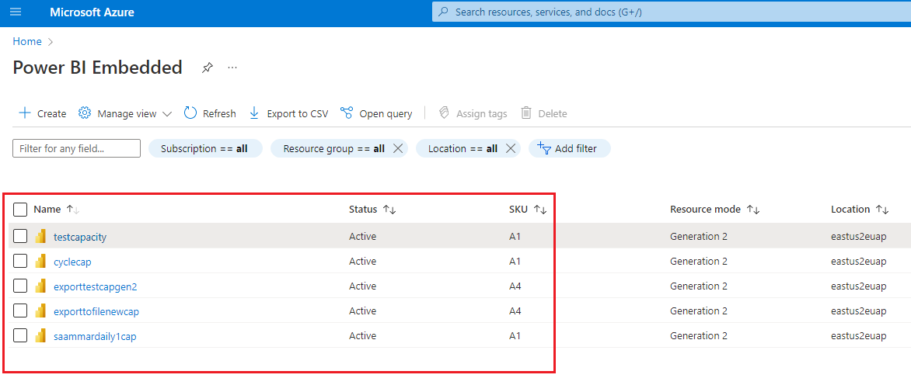
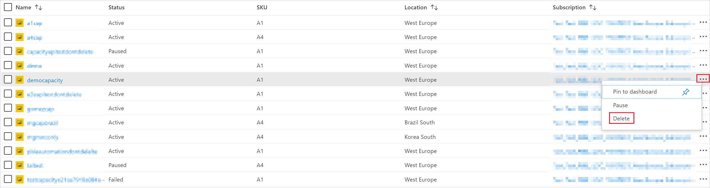
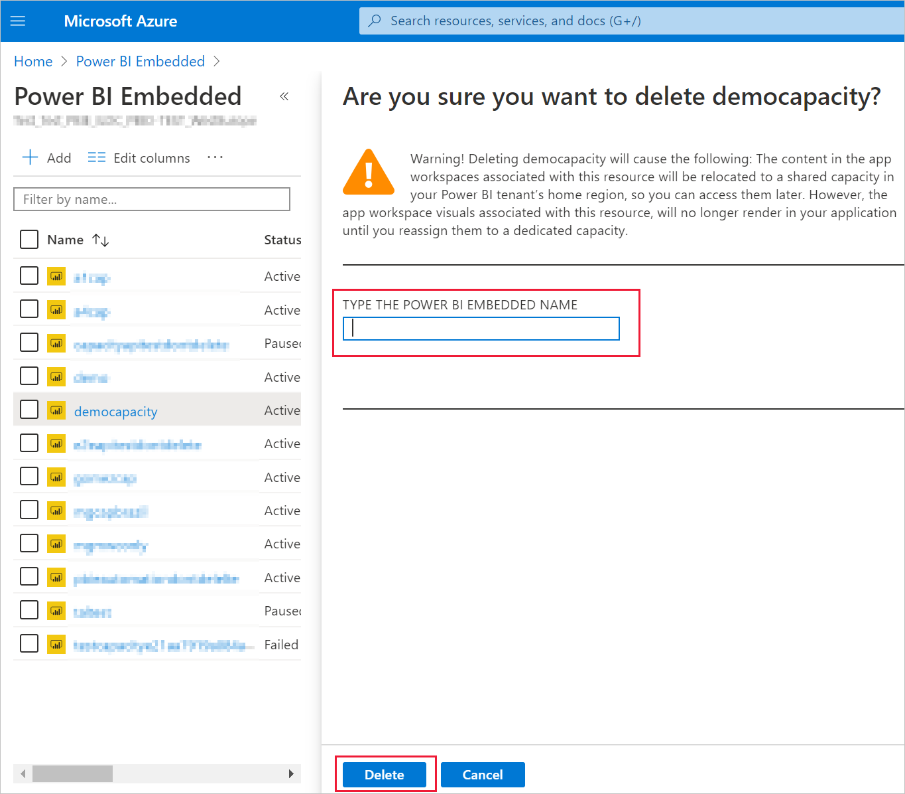

# Create Power BI Embedded capacity in the Azure portal

This article walks through how to create a [Power BI Embedded](azure-pbie-what-is-power-bi-embedded.md) capacity in Microsoft Azure. Power BI Embedded simplifies Power BI capabilities by helping you quickly add stunning visuals, reports, and dashboards to your apps.

## Before you begin

To complete this quickstart, you need:

* **Azure subscription:** Visit [Azure Free Trial](https://azure.microsoft.com/free/) to create an account.

* **Azure Active Directory:** Your subscription must be associated with an Azure Active Directory (Azure AD) tenant. Also, ***you need to be signed in to Azure with an account in that tenant***. Microsoft accounts aren't supported. To learn more, see [Authentication and user permissions](https://docs.microsoft.com/azure/analysis-services/analysis-services-manage-users).

* **Power BI tenant:** At least one account in your Azure AD tenant must have signed up for Power BI.

* **Resource group:** Use a resource group you already have or [create a new one](https://docs.microsoft.com/azure/azure-resource-manager/resource-group-overview).

## Create a capacity

Before creating a Power BI Embedded capacity, make sure you have signed into Power BI at least once.

# [Portal](#tab/portal)

1. Sign into the [Azure portal](https://portal.azure.com/).

2. In the search box, search for *Power BI Embedded*.

3. Within Power BI Embedded, select **Add**.

4. Fill in the required information and then click **Review + Create**.

    

    * **Subscription** - The subscription you would like to create the capacity against.

    * **Resource group** - The resource group that contains this new capacity. Pick from an existing resource group, or create another. For more information, see [Azure Resource Manager overview](https://docs.microsoft.com/azure/azure-resource-manager/resource-group-overview).

    * **Resource name** - The resource name of the capacity.

    * **Location** - The location where Power BI is hosted for your tenant. Your default location is your home region, but you can change the location using [Multi-Geo options](embedded-multi-geo.md).

    * **Size** - The [A SKU](../../admin/service-admin-premium-purchase.md#purchase-a-skus-for-testing-and-other-scenarios) you require. For more information see [SKU memory and computing power](/embedded/embedded-capacity.md#sku-memory-and-computing-power).

    * **Power BI capacity administrator** - An admin for the capacity.
        >[!NOTE]
        >* By default, the capacity administrator is the user creating the capacity.
        >* You can select a different user or service principal, as capacity administrator.
        >* The capacity administrator must belong to the tenant where the capacity is provisioned. Business to business (B2B) users cannot be capacity administrators.

# [Azure CLI](#tab/CLI)

### Use Azure Cloud Shell

Azure hosts Azure Cloud Shell, an interactive shell environment that you can use through your browser. You can use either Bash or PowerShell with Cloud Shell to work with Azure services. You can use the Cloud Shell preinstalled commands to run the code in this article without having to install anything on your local environment.

To start Azure Cloud Shell:

| Option | Example/Link |
|-----------------------------------------------|---|
| Select **Try It** in the upper-right corner of a code block. Selecting **Try It** doesn't automatically copy the code to Cloud Shell. |  |
| Go to [https://shell.azure.com](https://shell.azure.com), or select the **Launch Cloud Shell** button to open Cloud Shell in your browser. | [](https://shell.azure.com) |
| Select the **Cloud Shell** button on the menu bar at the upper right in the [Azure portal](https://portal.azure.com). |  |

To run the code in this article in Azure Cloud Shell:

1. Start Cloud Shell.

2. Select the **Copy** button on a code block to copy the code.

3. Paste the code into the Cloud Shell session by selecting **Ctrl**+**Shift**+**V** on Windows and Linux or by selecting **Cmd**+**Shift**+**V** on macOS.

4. Select **Enter** to run the code.

## Prepare your environment

PowerBI embedded capacity commands require version 2.3.1 or later of the Azure CLI. Run `az --version` to find the version and dependent libraries that are installed. To install or upgrade, see [Install Azure CLI](/cli/azure/install-azure-cli).

1. Sign in.

   Sign in using the [az login](/cli/azure/reference-index#az-login) command if you're using a local install of the CLI.

    ```azurecli
    az login
    ```

    Follow the steps displayed in your terminal to complete the authentication process.

2. Install the Azure CLI extension.

    When working with extension references for the Azure CLI, you must first install the extension.  Azure CLI extensions give you access to experimental and pre-release commands that have not yet shipped as part of the core CLI.  To learn more about extensions including updating and uninstalling, see [Use extensions with Azure CLI](/cli/azure/azure-cli-extensions-overview).

    Install the extension for PowerBI embedded capacity by running the following command:

    ```azurecli
    az extension add --name powerbidedicated
    ```

### Create a capacity with Azure CLI

Use the [az powerbi embedded-capacity create](https://docs.microsoft.com/cli/azure/ext/powerbidedicated/powerbi/embedded-capacity?view=azure-cli-latest#ext-powerbidedicated-az-powerbi-embedded-capacity-create) command to create a capacity.

```azurecli
az powerbi embedded-capacity create --location westeurope
                                    --name
                                    --resource-group
                                    --sku-name "A1"
                                    --sku-tier "PBIE_Azure"
```

### Delete a capacity with Azure CLI

To delete a capacity using Azure CLI, use the [az powerbi embedded-capacity delete](https://docs.microsoft.com/cli/azure/ext/powerbidedicated/powerbi/embedded-capacity?view=azure-cli-latest#ext-powerbidedicated-az-powerbi-embedded-capacity-delete) command.

```azurecli
az powerbi embedded-capacity delete --name
                                    --resource-group
```

### Manage your capacity with Azure CLI

You can view all the Power BI Embedded Azure CLI commands, in [az powerbi](https://docs.microsoft.com/cli/azure/ext/powerbidedicated/powerbi?view=azure-cli-latest).

# [ARM template](#tab/ARM-template)

### Use Resource Manager template

[Resource Manager template](https://docs.microsoft.com/azure/azure-resource-manager/templates/overview) is a JavaScript Object Notation (JSON) file that defines the infrastructure and configuration for your project. The template uses declarative syntax, which lets you state what you intend to deploy without having to write the sequence of programming commands to create it. If you want to learn more about developing Resource Manager templates, see [Resource Manager documentation](https://docs.microsoft.com/azure/azure-resource-manager/) and the [template reference](https://docs.microsoft.com/azure/templates/).

If you don't have an Azure subscription, create a [free](https://azure.microsoft.com/free/) account before you begin.

### Review the template

The template used in this quickstart is from [Azure Quickstart Templates](https://azure.microsoft.com/resources/templates/101-power-bi-embedded).

:::code language="json" source="~/azure-quickstart-templates/101-power-bi-embedded/azuredeploy.json" range="1-57" highlight="1-57":::

One Azure resource is defined in the template, [Microsoft.PowerBIDedicated/capacities Az](https://docs.microsoft.com/azure/templates/microsoft.powerbidedicated/allversions) - Create a Power BI Embedded capacity.

### Deploy the template

1. Select the following link to sign in to Azure and open a template. The template creates a Power BI Embedded capacity.

    [](https://portal.azure.com/#create/Microsoft.Template/uri/https%3a%2f%2fraw.githubusercontent.com%2fAzure%2fazure-quickstart-templates%2fmaster%2f101-power-bi-embedded%2fazuredeploy.json)

2. Fill in the required information and then click **Review + Create**.

    

    * **Subscription** - The subscription you would like to create the capacity against.

    * **Resource group** - The resource group that contains this new capacity. Pick from an existing resource group, or create another. For more information, see [Azure Resource Manager overview](https://docs.microsoft.com/azure/azure-resource-manager/resource-group-overview).

    * **Region** - The region the capacity will belong to.

    * **Name** - The capacity name.

    * **Location** - The location where Power BI is hosted for your tenant. Your default location is your home region, but you can change the location using [Multi-Geo options](/embedded/embedded-multi-geo.md).

    * **SKU** - The [A SKU](../../admin/service-admin-premium-purchase.md#purchase-a-skus-for-testing-and-other-scenarios) you require. For more information see [SKU memory and computing power](/embedded/embedded-capacity.md#sku-memory-and-computing-power).

    * **Admin** - An admin for the capacity.
        >[!NOTE]
        >* By default, the capacity administrator is the user creating the capacity.
        >* You can select a different user or service principal, as capacity administrator.
        >* The capacity administrator must belong to the tenant where the capacity is provisioned. Business to business (B2B) users cannot be capacity administrators.

### Validate the deployment

To validate the deployment, do the following:

1. Sign into the [Azure portal](https://portal.azure.com/).

2. In the search box, search for *Power BI Embedded*.

3. Review the list of Power BI Embedded capacities, and verify that the new capacity you created is listed.

    

### Clean up resources

To delete the capacity you created, follow these steps:

1. Sign into the [Azure portal](https://portal.azure.com/).

2. In the search box, search for *Power BI Embedded*.

3. Open the context menu of the capacity you created and click **Delete**.

    

4. In the confirmation page, enter the name of the capacity and click **Delete**.

    

---

## Next steps

* To use your new Power BI Embedded capacity, browse to the Power BI admin portal to assign workspaces. For more information, see [Manage capacities within Power BI Premium and Power BI Embedded](https://powerbi.microsoft.com/documentation/powerbi-admin-premium-manage/).

* If you don't need to use this capacity, you can pause it to stop billing. For more information, see [Pause and start your Power BI Embedded capacity in the Azure portal](azure-pbie-pause-start.md).

* To begin embedding Power BI content within your application, see [How to embed your Power BI dashboards, reports, and tiles](https://powerbi.microsoft.com/documentation/powerbi-developer-embedding-content/).

* More questions? [Try asking the Power BI Community](https://community.powerbi.com/)