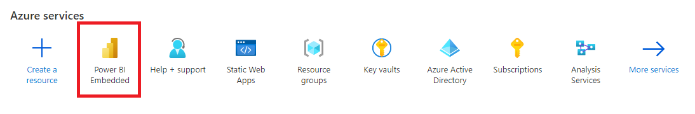
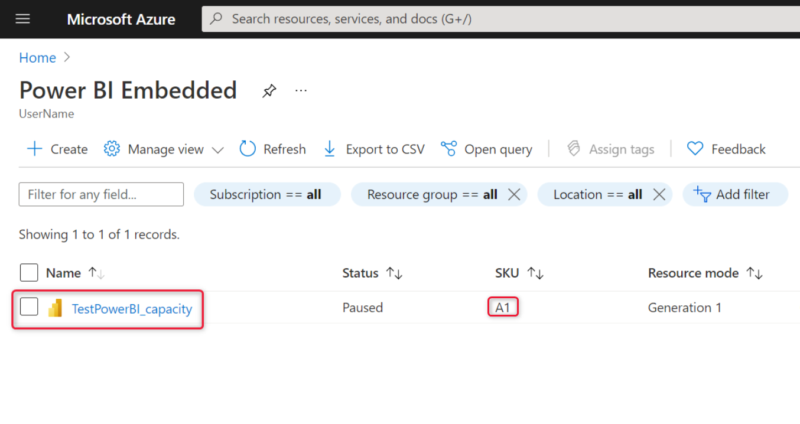
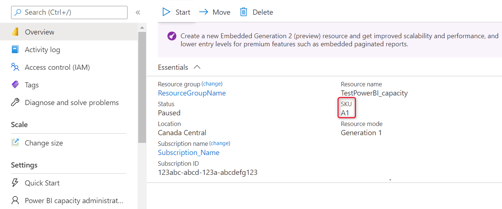
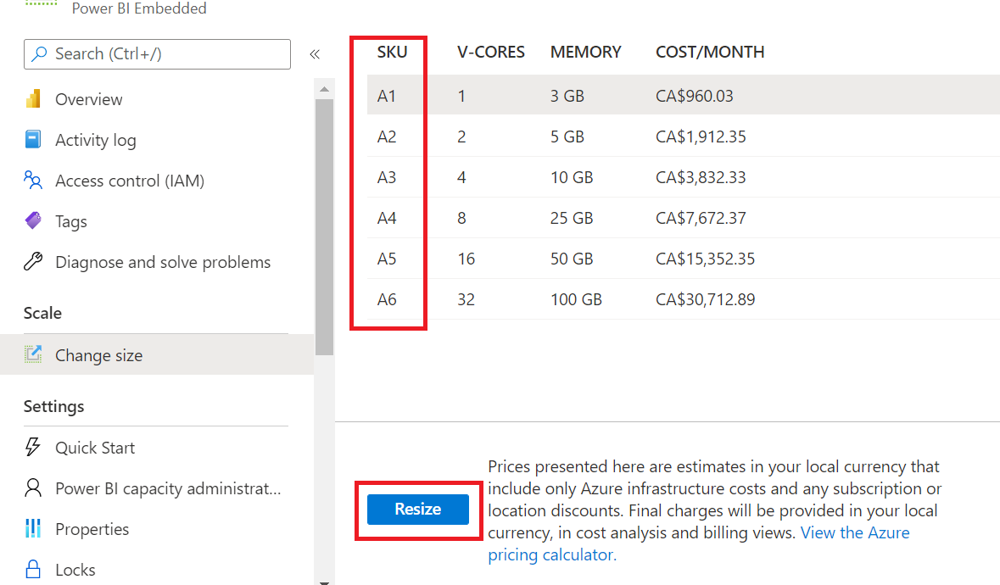
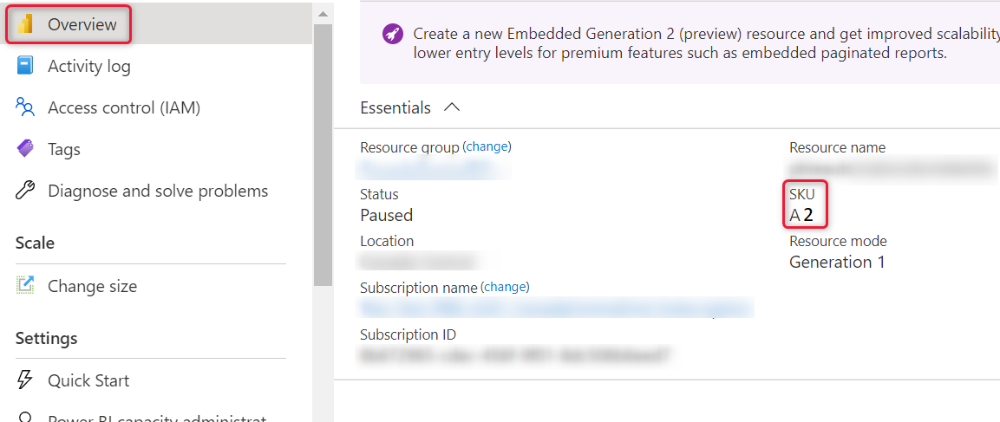

# Scale your Power BI Embedded capacity in the Azure portal

This article walks through how to scale a Power BI Embedded capacity in Microsoft Azure. Scaling allows you to increase or decrease the size of your capacity.

This assumes you created a Power BI Embedded capacity (**A SKU**). If you haven't, see [Create Power BI Embedded capacity in the Azure portal](azure-pbie-create-capacity.md) to get started.

> [!NOTE]
> This article describes the process for vertically scaling A SKUs. It doesn't talk about horizontal scaling or P SKUs.

## Scale a capacity

1. Sign into the [Azure portal](https://portal.azure.com/).

2. Under **Azure services**, select **Power BI Embedded** to see your capacities.

    > [!div class="mx-imgBorder"]
    > 

3. Select the capacity you want to scale. Notice that the current scale for each capacity is listed under **SKU**.

    > [!div class="mx-imgBorder"]
    > 

    When you make your selection, information about that capacity is displayed next to it. This information again includes the current scaling under **SKU**.

    > [!div class="mx-imgBorder"]
    > 

4. Under **Scale**, select **Change size**.

    > [!div class="mx-imgBorder"]
    > 

5. Select a scale and click **Resize**.

    > [!div class="mx-imgBorder"]
    > 

6. Confirm your tier by viewing the overview tab. The current pricing tier is listed.

    > [!div class="mx-imgBorder"]
    > 

## Autoscale your capacity

Use one of the autoscaling techniques described here to elastically resize your capacity and address its memory and CPU needs.

* [Power BI Embedded Azure Resource Manager REST APIs](/rest/api/power-bi-embedded/), for example [Capacities - Update](/rest/api/power-bi-embedded/capacities/update).  See this [runbook PowerShell script capacity scale-up sample](https://github.com/microsoft/PowerBI-Developer-Samples/blob/master/PowerShell%20Scripts/ScaleUp-Automation-RunBook.ps1) on how to use this API call can create your own versions of upscale and down-scale scripts.

* Use [Azure alerts](/azure/azure-monitor/alerts/alerts-overview) to track Power BI [capacity metrics](monitor-power-bi-embedded-reference.md#capacities) such as:
  * *Overload* - 1 if capacity's CPU surpassed 100% and is in an overloaded state. Otherwise, 0.
  * *CPU* utilization in percentage
  * *CPU Per Workload* if specific workloads are used, such as paginated reports
  
   When these metrics reach the value specified in the Azure Monitor Alert rules, the rule will trigger an upscale or downscale runbook script.

   For example, you can create a rule that if Overload = 1 or if CPU = 95%, then the upscale capacity runbook script will be invoked to update the capacity to a higher SKU.  
   You can also create a rule that if the CPU drops below 50%, a down-scale runbook script will be invoked to update the capacity to a lower CPU.  
   Use the Power BI Embedded [sample script](monitor-power-bi-embedded-reference.md#example-script-for-scaling-a-capacity) as a reference for scaling a capacity.

## Considerations and limitations

Scaling capacities may involve a small amount of downtime.

## Related content

* [Pause and start your Power BI Embedded capacity in the Azure portal](azure-pbie-pause-start.md)
* [How to embed your Power BI dashboards, reports, and tiles](https://powerbi.microsoft.com/documentation/powerbi-developer-embedding-content/).

More questions? [Try asking the Power BI Community](https://community.powerbi.com/)
