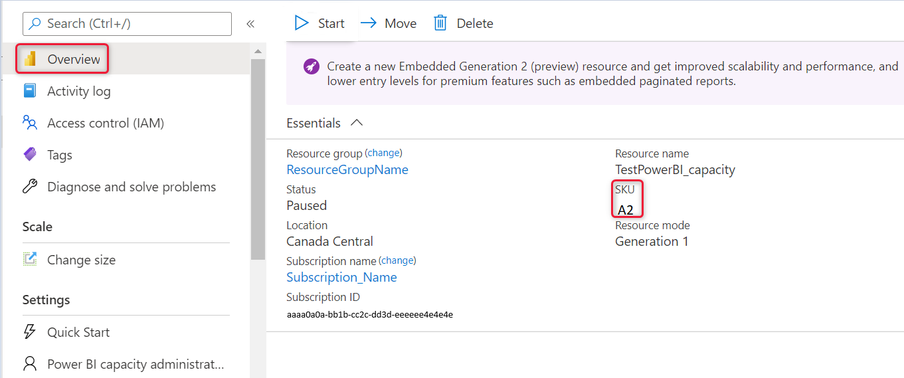

# Scale your Power BI Embedded capacity in the Azure portal

This article walks through how to scale a Power BI Embedded capacity in Microsoft Azure. Scaling allows you to increase or decrease the size of your capacity.

This assumes you have created a Power BI Embedded capacity. If you have not, see [Create Power BI Embedded capacity in the Azure portal](azure-pbie-create-capacity.md) to get started.

For information about autoscaling in Embedded Gen 2, see [Autoscaling in Embedded Gen 2](power-bi-embedded-generation-2.md#autoscaling-in-embedded-gen2).

> [!NOTE]
> A scaling operation can take about a minute. During this time, the capacity will not be available. Embedded content may fail to load.

## Scale a capacity

1. Sign into the [Azure portal](https://portal.azure.com/).

2. Select **All services** > **Power BI Embedded** to see your capacities.

    > [!div class="mx-imgBorder"]
    > 

3. Select the capacity you want to scale. Notice that the current scale for each capacity is listed under **SKU**.

    > [!div class="mx-imgBorder"]
    > 

    When you make your selection, information about that capacity is displayed next to it. This information again includes the current scaling under **SKU**.

    > [!div class="mx-imgBorder"]
    > 

4. Select **Change size** under **Scale** within your capacity.

    > [!div class="mx-imgBorder"]
    > 

5. Select a scale and click **Resize**.

    > [!div class="mx-imgBorder"]
    > 

    Scaling your capacity may take a minute or two to complete.

6. Confirm your tier by viewing the overview tab. The current pricing tier is listed.

    > [!div class="mx-imgBorder"]
    > 

## Next steps

> [!div class="nextstepaction"]
> [Pause and start your Power BI Embedded capacity in the Azure portal](azure-pbie-pause-start.md)

> [!div class="nextstepaction"]
> [How to embed your Power BI dashboards, reports, and tiles](https://powerbi.microsoft.com/documentation/powerbi-developer-embedding-content/).

More questions? [Try asking the Power BI Community](https://community.powerbi.com/)
