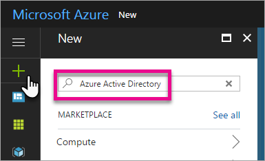

# Create an Azure Active Directory tenant to use with Power BI

Learn how to create a new Azure Active Directory (Azure AD) tenant for a custom application that calls [Power BI REST APIs](../automation/rest-api-reference.md).

A tenant represents an organization in Azure Active Directory. It's a reserved Azure AD service instance that an organization receives and owns when it signs up for a Microsoft cloud service such as Azure, Microsoft Intune, or Microsoft 365. Each Azure AD tenant is distinct and separate from other Azure AD tenants.

Once you have an Azure AD tenant, you can define an application and assign it permissions so it can call [Power BI REST APIs](../automation/rest-api-reference.md).

Your organization may already have an Azure AD tenant that you can use for your application. You can also create a new tenant specifically for your application. This article shows how to create a new tenant.

## Create an Azure Active Directory tenant

To integrate Power BI into your custom application, you need to define an application within Azure AD, which requires an Azure AD directory. This directory is your *tenant*. If your organization doesn't have a tenant yet, because they aren't using Power BI or Microsoft 365, then [you need to set up a dev environment](/azure/active-directory/develop/active-directory-howto-tenant). You also need to create one if you don't want your application mixing with your organization's tenant, allowing you to keep things isolated. Or, you may just want to create a tenant for testing purposes.

To create a new Azure AD tenant:

1. Browse to the [Azure portal](https://portal.azure.com) and sign in with an account that has an Azure subscription.

2. Select the **plus icon (+)** and search for **Azure Active Directory**.

    

3. Select **Azure Active Directory** in the search results.

    

4. Select **Create**.

5. Provide an **Organization name** and an **Initial domain name**. Then select **Create**. Your directory is created.

    

   > [!NOTE]
   > Your initial domain is part of onmicrosoft.com. You can add other domain names later. A tenant directory can have multiple domains assigned to it.

6. After directory creation is complete, select the information box to manage your new directory.

Next, you're going to add tenant users.

## Create Azure Active Directory tenant users

Now that you have a directory, let's create at least two users. One is a tenant Global Admin and another is a master user for embedding. You can think of the latter as a service account.

1. In the Azure portal, make sure you are on the Azure Active Directory fly out.

    

    If not, select the Azure Active Directory icon from the left services navigation.

    

2. Under **Manage**, select **Users**.

    

3. Select **All users** and then select **+ New user**.

4. Provide a **Name** and **User name** for your tenant Global Admin. Change the **Directory role** to **Global administrator**. You can also show the temporary password. When you're done, select **Create**.

    

5. Do the same thing for a regular tenant user. You can use this account for your master embedding account. This time, for **Directory role**, leave it as **User**. Note the password, then select **Create**.

    

6. Sign up for Power BI with the user account that you created in step 5. Go to [powerbi.com](https://powerbi.microsoft.com/get-started/) and select **Try free** under **Power BI - Cloud collaboration and sharing**.

    

    When you sign up, you're prompted to try Power BI Pro free for 60 days. You can opt into that to become a Pro user, which gives you the option to [start developing an embedded solution](embed-sample-for-customers.md).

   > [!NOTE]
   > Make sure you sign up with your user account's email address.

## Next steps

Now that you have an Azure AD tenant, you can use this tenant to test items within Power BI. You can also embed Power BI dashboards and reports in your application. For more information, see [How to embed your Power BI dashboards, reports, and tiles](embed-sample-for-customers.md).

[What is an Azure Active directory?](/azure/active-directory/active-directory-whatis) 
 
[Quickstart: Set up a dev environment](/azure/active-directory/develop/active-directory-howto-tenant)  

More questions? [Try asking the Power BI Community](https://community.powerbi.com/)
