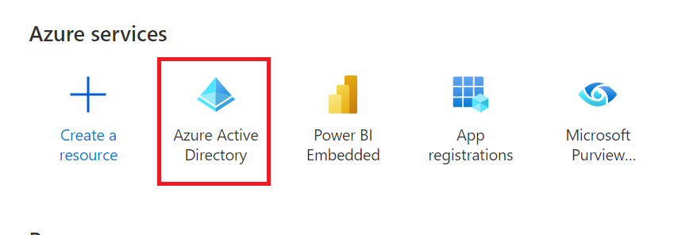
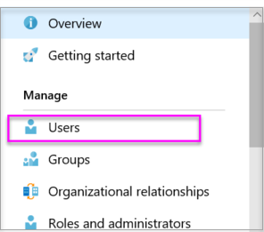
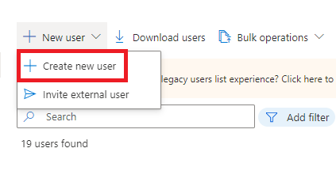
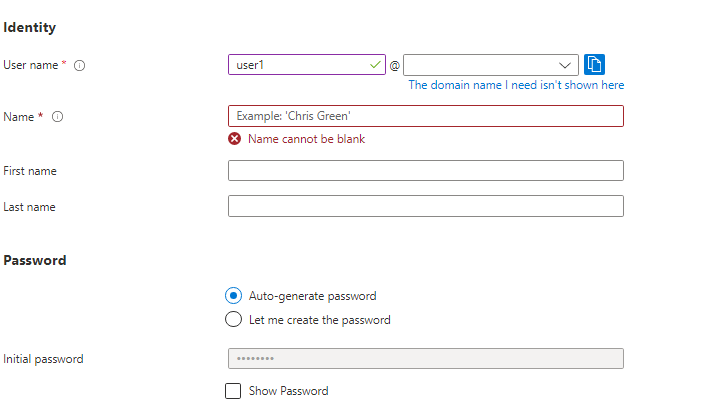
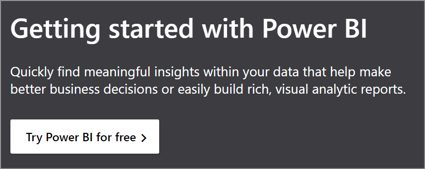

# Create a Microsoft Entra tenant to use with Power BI

**APPLIES TO:** :::image type="icon" source="../../includes/media/yes-icon.svg" border="false":::&nbsp;App&nbsp;owns&nbsp;data :::image type="icon" source="../../includes/media/yes-icon.svg" border="false":::&nbsp;User&nbsp;owns&nbsp;data

This article shows you how to create a new Microsoft Entra tenant to use when creating a custom app that calls [Power BI REST APIs](/rest/api/power-bi/).

A Microsoft Entra tenant is a reserved Microsoft Entra service instance that an organization receives and owns once it signs up for a Microsoft cloud service such as Azure, Microsoft Intune, or Microsoft 365. Each tenant represents an organization, and is distinct and separate from other Microsoft Entra tenants.

Once you have a Microsoft Entra tenant, you can define an application and assign it permissions so it can call [Power BI REST APIs](/rest/api/power-bi/).

Your organization may already have a Microsoft Entra tenant that you can use for your app, or you can create a new tenant specifically for your app. This article shows how to create a new tenant.

## Create a Microsoft Entra tenant

To integrate Power BI into your custom app, you need a Microsoft Entra directory. This directory is your *tenant*. If your organization doesn't have a tenant, [you need create one as part of your dev environment](/azure/active-directory/develop/active-directory-howto-tenant). You should also create a tenant if you want to keep things isolated and don't want your app mixing with your organization's tenant. Or, you may just want to create a tenant for testing purposes.

To create a new Microsoft Entra tenant:

Follow the directions in [Quickstart: Create a new tenant in Microsoft Entra ID](/azure/active-directory/fundamentals/active-directory-access-create-new-tenant) to create a new **Microsoft Entra ID**.

Provide the relevant **Organization name**, **Initial domain name** and **Country/Region**.

   > [!NOTE]
   > Your initial domain is part of onmicrosoft.com. You can add other domain names later. A tenant directory can have multiple domains assigned to it.

## Create Microsoft Entra tenant users

When you create a new Microsoft Entra tenant, you become the first user of that tenant. As the first user, you're automatically assigned the [Global Admin](/azure/active-directory/roles/permissions-reference#global-administrator) role. Add new users by navigating to the [Users](https://portal.azure.com/#blade/Microsoft_AAD_IAM/UsersManagementMenuBlade/MsGraphUsers) page.

Create a master user to use as your master embedding account. You can think of the master user account as a service account.

1. In the home page of the Azure portal, select the Microsoft Entra ID tab.

    > [!div class="mx-imgBorder"]
    >

2. Under **Manage**, select **Users**.

    > [!div class="mx-imgBorder"]
    >

3. Under **+ New user** select **+ Create new user**.

    > [!div class="mx-imgBorder"]
    >

4. Provide a **Display Name** and **User name** for your tenant Global Admin. Leave **Directory role** as **user**. Note the password, then select **Create**.

    > [!div class="mx-imgBorder"]
    >

5. Sign up for Power BI with the user account that you created in step 4. Go to [powerbi.com](https://powerbi.microsoft.com/getting-started-with-power-bi/) and select **Try Power BI for free**.

    > [!div class="mx-imgBorder"]
    >

    When you sign up, you're prompted to try Power BI Pro free for 60 days. You can opt into that to become a Pro user, which gives you the option to [start developing an embedded solution](embed-sample-for-customers.md).

   > [!NOTE]
   > Make sure you sign up with your user account's email address.

## Related content

Now that you have a Microsoft Entra tenant, you can use this tenant to test items within Power BI. You can also embed Power BI dashboards and reports in your app. For more information, see [How to embed your Power BI dashboards, reports, and tiles](embed-sample-for-customers.md).

* [Register an app](register-app.md)
* [Quickstart: Set up a dev environment](/azure/active-directory/develop/active-directory-howto-tenant)  

More questions? [Try asking the Power BI Community](https://community.powerbi.com/)
