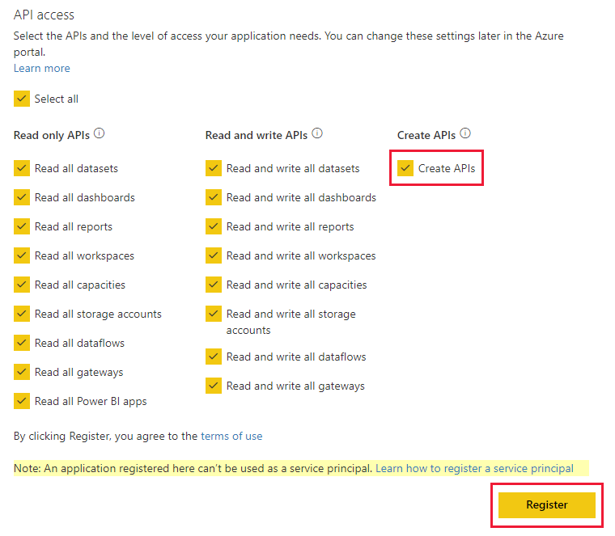

# Auto-install Power BI apps when embedding for your organization

To embed content from an app, the user that is embedding must have [access to the app](../../collaborate-share/service-create-distribute-apps.md). If the app is installed for the user, then embedding works smoothly. For more information, see [Embed reports or dashboards from app](./index.yml). It's possible to define in PowerBI.com that all apps can be [installed automatically](https://powerbi.microsoft.com/blog/automatically-install-apps/). However, this action is done at the tenant level and applies to all apps.

## Auto-install app on embedding

If a user has access to an app, but the app isn't installed, then embedding fails. So you can avoid these failures when embedding from an app, you can allow auto installation of the app upon embedding. This action means if the app the user tries to embed isn't installed, it's automatically installed for you. So the content you want gets embedded immediately, resulting in a smooth experience for the user.

## Embed for Power BI users (User owns data)

To allow auto install of apps for your users, you need to give your application the 'Content Create' permission when [registering your application](register-app.md#register-an-azure-ad-app), or add it if you already registered your app.

Next, you need to provide the app ID in the embed URL. To provide the app ID, the app creator first needs to install the app then use one of the supported [Power BI Rest API](/rest/api/power-bi/) calls - [Get Reports](/rest/api/power-bi/reports/getreports) or [Get Dashboards](/rest/api/power-bi/dashboards/getdashboards). Then the app creator needs to take the embed Url from the REST API response. The app ID appears in the URL if the content is from an app.  After you have the embed URL, you can use it to embed regularly.

## Secure Embed

To use auto install of apps, the app creator first needs to install the app then go to the app on PowerBI.com, navigate to the report, and get the link in a usual fashion. All other users with access to the app that can use the link can embed the report.

## Considerations and limitations

* You can only embed reports and dashboards for this scenario.

* This feature is currently not supported for app owns data and SharePoint embed scenarios.