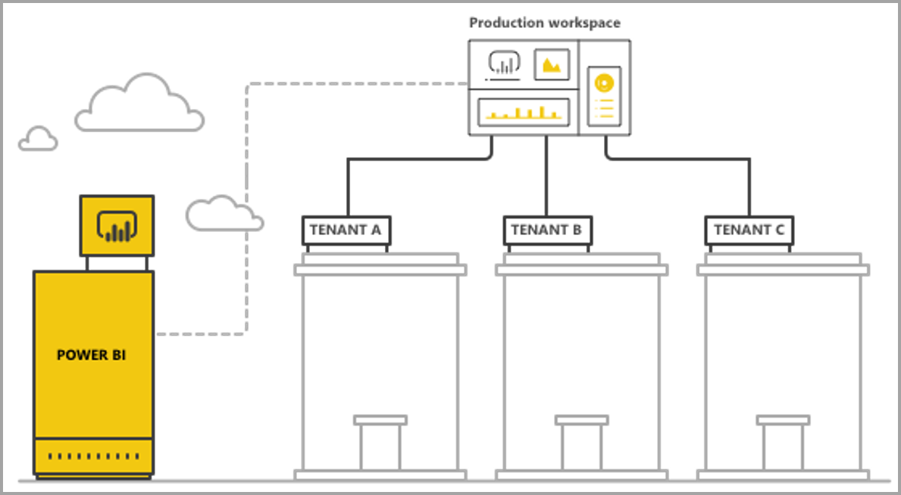

# Multi-tenancy solutions with Power BI embedded analytics

When designing a multi-tenant application as part of your *embed for your customers* solution, you must carefully choose the tenancy model that best fits your needs. A tenancy model determines how each tenant's data is mapped and managed within Power BI. Your tenancy model impacts application design and management. Switching to a different model later may become costly and disruptive.

In this article we refer to tenants as an organization or a company. A multi-tenant solution, is an embedded application used by a number of companies, where each company is referred to as a Power BI tenant.

This article describes the two different approaches and analyzes them according to several evaluation criteria. The recommended approach is the *workspace separation* solution, which is described on the left tab throughout the article. The *row-level security separation* solution, also known as *RLS*, is described on the right tab. You can also view a [summary](#comparison-summary) of this evaluation, at the end of the article.

>[!TIP]
>* **Workspace separation** is the recommended embedded analytics **multi-tenancy** solution.
>* Within each tenant, **RLS** is the recommended embedded analytics solution for securely filtering data.

## Separation method

# [Workspace](#tab/workspace)

With Power BI workspace-based separation, your app supports multiple tenants from a single Power BI tenant. The separation of tenants is done at the Power BI workspace level, by creating multiple workspaces. Each workspace contains the relevant datasets, reports, and dashboards for that tenant. Also, each workspace is connected only to that tenant's data.

>[!TIP]
>If you require additional separation, create a *service principal* or a *master user* for each workspace and its content.

# [RLS](#tab/rls)

With row-level security-based separation, your multi-tenant app uses a single workspace to host multiple tenants. Each Power BI item (such as reports, dashboards and datasets) is created once and is used by all tenants. Data separation between tenants is accomplished using [row-level security](embedded-row-level-security.md) on the multi-tenant dataset. When end users log into the app and open content, an embed token is generated for that user's session, with the roles and filters that ensure that users only see the data they're permitted to see. If users from the same tenant are not permitted to view the same data, the application developer needs to implement hierarchical roles both between tenants and within the same tenant.

---

## Data architecture

# [Workspace](#tab/workspace)

There are two main approaches for managing tenant's data.

* **A separate database per tenant** - If your multi-tenant app storage is keeping separate databases per tenant, then the natural choice is to use single-tenant datasets in Power BI, with the connection string for each dataset pointing to the matching database.

* **A single multi-tenant database** - If your multi-tenant app storage is using a multi-tenancy database for all tenants, it's easy to separate tenants by workspaces. You can configure the database connection for the Power BI dataset with a parameterized database query that only retrieves the relevant tenant's data. You can update the connection using [Power BI Desktop](../../transform-model/desktop-query-overview.md), the Power BI service or with [APIs](/rest/api/power-bi/datasets/updatedatasourcesingroup) and [parameters](/rest/api/power-bi/datasets/updateparametersingroup).

# [RLS](#tab/rls)

Implementing row-level security separation is most comfortable when all tenants' data is stored in a single data warehouse. In this case, the application developer can pass only the relevant data from the data warehouse into the Power BI dataset, either via Direct Query or data import. If data in the database is separated per tenant, it needs to be combined into a single dataset, which results in a lower degree of separation between tenants that existed in the database.

---

### Data separation

# [Workspace](#tab/workspace)

Data in this tenancy model is separated at the workspace level. A simple mapping between a workspace and a tenant prevents users from one tenant seeing content from another tenant. Using a single *service principal* or *master user* allows you to have access to all the different workspaces. The configuration of which data to show an end user is defined during the [generation of the embed token](/rest/api/power-bi/embedtoken), a backend-only process which end users can't see, or change.

To achieve additional separation, an application developer can define a *service principal*, *master user* or an application per workspace, rather than a single *service principal*, *master user* or application with access to multiple workspaces.

>[!TIP]
>With highly sensitive data, we recommend using a service principal per workspace.

# [RLS](#tab/rls)

With row-level security-based separation, data separation is accomplished using [row-level security definitions](embedded-row-level-security.md) on the dataset. In this solution, all the data coexist in the same dataset. This form of data separation is more susceptible to data leakage through developer error. Even though row-level security is done on the backend and secured from an end user, if the data is highly sensitive or customers are asking for data separation, it might be better to use workspace-based separation.

---

### Scalability

# [Workspace](#tab/workspace)

One advantage of the *workspace-based separation* model is that separating the data into multiple datasets for each tenant overcomes the [size limits of a single dataset](../../admin/service-premium-what-is.md#large-datasets). When the capacity is overloaded, it can evict unused datasets to free memory for active datasets. This task isn't possible with a single large dataset. Using multiple datasets, it is also possible to separate tenants into multiple Power BI capacities if needed.

A *service principal* or a *master user* is limited to 1,000 workspaces. By creating a new service principal or master user per each tenant, you’re not only getting additional separation between tenants, you’re also making sure that you won’t reach the 1,000 workspaces limitation, when onboarding new tenants.

Despite these advantages, consider the scale that your multi-tenant app can reach in the future. The capacity SKU used introduces a limit on the size of memory that datasets need to fit in. When using a *Gen 1* capacity, you also have to consider how many refreshes can run at the same time and the maximum frequency of data refreshes. We recommend that you test your app when managing hundreds or thousands of datasets. It is also recommended to consider the average and peak volume of usage, as well as any specific tenants with large datasets, or different usage patterns, that are managed differently than other tenants.

# [RLS](#tab/rls)

With row-level security-based separation, the data needs to fit within the dataset size limit. With the introduction of [incremental refresh](../../connect-data/incremental-refresh-overview.md) and the release of an XMLA endpoint for Power BI datasets, the dataset size limit is expected to increase significantly. However, the data still needs to fit into the capacity's memory, with enough remaining memory for data refreshes to run. Large-scale deployments need a large capacity to avoid users experiencing issues due to memory exceeding the limits of the current capacity. Alternative ways to handle scale include using [aggregations](../../admin/aggregations-auto.md) or connecting to the data source directly using DirectQuery or Live connection, rather than caching all the data in the Power BI capacity.

---

### Automation and operational complexity

# [Workspace](#tab/workspace)

With Power BI workspace-based separation, an application developer might need to manage hundreds or thousands of Power BI items. It's essential to define the processes that frequently happen in your application lifecycle management, and ensure you have the right set of tools to perform these operations at scale in this tenancy model. Some example operations include:

   * Adding a new tenant (customer)
   * Updating a report or dashboard for some or all the tenants
   * Updating the dataset schema for some or all the tenants
   * Unplanned customizations for specific tenants
   * Frequency of dataset refreshes

When using the same report for multiple tenants, you can simplify your workspace-base separation deployment using [dynamic binding](embed-dynamic-binding.md). Dynamic binding lets you bind a report to multiple datasets, allowing you to use one report for all tenants, instead of a copy of the same report in each tenant.

# [RLS](#tab/rls)

Managing Power BI items is easier using row-level security separation, as there is only one version of a Power BI item for each environment, instead of a version per tenant.

Adding or changing roles can only be done manually in the Power BI Desktop. Applying an RLS hierarchy can be complicated and error-prone to manage.

---

### Multi-Geo needs

# [Workspace](#tab/workspace)

Multi-geo involves purchasing capacity in the desired regions and assigning a workspace to that capacity. If you need to support different tenants in different regions, you need to assign the tenant's workspace to a capacity in the desired region. This task is a simple operation and one where the cost is not more than having all workspaces in the same capacity. However, if you have tenants that need data to reside in multiple regions, all Power BI items in the workspace need to be duplicated in each regional capacity, increasing both cost and management complexity.

# [RLS](#tab/rls)

Since all the data is stored in a single dataset, it is challenging to meet data residency requirements that require certain data to be bound to specific locations. It can also significantly increase the cost of using multiple regions as all the data is replicated and stored in each region.

If only a limited number of tenants need different geographies, consider keeping only those tenants' data in a different region, using the *workspace-based separation* model.

---

### Cost

Both [Power BI Embedded](./embedded-analytics-power-bi.md) and **Power BI Premium** have a resource-based purchase model. You purchase one or more capacities with fixed computing power and memory. There's no limit on the number of users using the capacity. The only limit is the performance of the capacity. If you're using a *master user* instead of a *service principal*, a [Power BI Pro license](../../admin/service-admin-licensing-organization.md) is required.

We recommend testing and measuring the expected load on your capacity by simulating live environment and usage. You can measure the load and performance with the various metrics available in the Azure capacity or [Premium capacity metrics app](../../admin/service-admin-premium-monitor-capacity.md).

# [Workspace](#tab/workspace)

The workspace-based separation model sits well with capacities for the following reasons:

   * By separating tenants by workspaces, you get full flexibility in managing each tenant and its performance needs, and optimizing capacity utilization by scaling up or down. For example, large and essential tenants with high volume and volatility can be managed in a separate capacity to ensure a consistent service level, while grouping smaller tenants in another capacity to optimize costs.

   * Separating workspaces also means separating datasets between tenants so that data models can be in smaller chunks, rather than in a single large dataset. This task allows the capacity to manage memory usage better, evicting small, and unused datasets when not needed, while keeping users satisfied with the performance.

>[!TIP]
>Consider the number of parallel refreshes you require, as refresh processes might need extra capacity when you have multiple datasets.

# [RLS](#tab/rls)

The primary cost driver with row-level security-based separation is the memory footprint of the dataset. You need enough capacity to store the dataset and keep some additional memory buffer for any peaks in memory demand. One way to mitigate this situation is to store the data in a SQL Server database or SQL Server Analysis Services cube, and use a Direct Query or a Live connection to retrieve the data from the data source in real time. This approach increases the cost of the data sources, but reduces the need for a large capacity because of memory needs, therefore reducing the cost of Power BI capacity.

---

### Content customization and authoring

# [Workspace](#tab/workspace)

For the primary use cases of content creation, the application developer needs to carefully consider which tenants can have editing capabilities, and how many users in each tenant can edit. Permitting multiple users to edit in each tenant, can result in a lot of content being generated. Generating a lot of content, may cause reaching a dataset limitation such as the number of reports per dataset, or the number of Power BI items in a workspace. If you give users editing capabilities, we recommend monitoring the content generation closely and scaling up as needed. For the same reasons and to allow report updates, we don't recommend using the editing capability for content personalization, where each user can make small changes to a report and save it. If your multi-tenant app allows content personalization, consider introducing and communicating workspace retention policies for user-specific content, to facilitate the flow of content deletion when end users move to a new position, leave the company, or stop using the platform. If you allow users to edit content, you'll also need to remap the newly created content so that the new version is available for your customers in your app.

# [RLS](#tab/rls)

As end users edit or create reports, they can use the production multi-tenant dataset. We advise only using the embedded iFrame option to [edit or create reports](/javascript/api/overview/powerbi/create-edit-report-embed-view), as it relies on the same dataset, with row-level security applied. Having users uploading PBIX files with additional datasets can be costly and difficult to manage with row-level security separation. Also, you need to build a robust mechanism to distinguish which content is connected to which tenant, so that when users generate new content that is in the same workspace, you can make sure the production workspace doesn't hit its limits.

---

## Comparison summary

The table below provides a summary of the detailed comparison between the two separation methods.

|| Workspace (recommended)   | RLS  |
|---------------------|-------------------|---------------------------|
| **Data architecture** | Easiest when there's a separate database per tenant.  | Easiest when all the data for all tenants is in a single data warehouse.   |
| **Data separation** |  Good. Each tenant has a dedicated dataset.  |  Moderate.  All data is in the same shared dataset which is managed through access-control.  |
| **Scalability** |  Moderate.  Breaking data into multiple datasets enables optimization.  |  Lowest. Constrained by dataset limits.  |
| **Multi-Geo needs** |  Good.  Data and capacity should be in the same geo.  |  Not recommended.  You'll have to keep the entire dataset stored in multiple regions.  |
| **Automation and operational complexity** | Good automation for the individual tenant.  Complex to manage many artifacts at scale.  When using the same report for all tenets, use [dynamic binding](embed-dynamic-binding.md) to simplify deployments.  | Easy to manage Power BI items.  Complex to manage RLS at scale.  |
| **Cost** | Low-medium.  You can optimize utilization to reduce cost-per-tenant. Cost might increase when frequent refreshes are needed.  | Medium-high if using Import mode.  Low- medium if using Direct Query mode.  |
| **Content customization and authoring** |  Good.  Might hit limitations at large scale.  |  Moderate.  Use content generation in embedded iFrame only.  |

## Deployment considerations and limitations

Before selecting the separation model that best suits your needs, review the following considerations and limitations.

### Power BI items

Power BI items include reports, dashboards and datasets.

* The number of classic workspaces that a single user or application can be a member or admin of is 250.

* The number of the [new workspaces](../../collaborate-share/service-new-workspaces.md#new-and-classic-workspace-differences) that a single user or application can be a member or admin of is 1000.

* The number of datasets in a single workspace is 1000.

* The number of reports or dashboards connected to a single dataset is 1000.

* The dataset memory size limit to upload a PBIX file is 10 GB.

### Power BI capacity

Considerations and limitations for Power BI [capacities](embedded-capacity.md).

* Each capacity can only use its allocated memory and V-cores, according to the [SKU purchased](embedded-capacity.md#which-sku-should-i-use).

* To establish the recommended dataset size for each SKU, reference [Premium large datasets](../../admin/service-premium-what-is.md#large-datasets).

* To establish the number of refreshes that can run concurrently on a capacity, reference [resource management and optimization](../../admin/service-premium-what-is.md#capacity-nodes).

* The average time of scaling a capacity is between one to two minutes. During that time, the capacity isn't available. We recommend using a scale-out approach to [avoid downtime](https://powerbi.microsoft.com/blog/power-bi-developer-community-november-update-2018/#scale-script).

## Next steps

>[!div class="nextstepaction"]
>[Embedded analytics with Power BI](./embedded-analytics-power-bi.md)

>[!div class="nextstepaction"]
>[Power BI Embedded](./embedded-analytics-power-bi.md)

>[!div class="nextstepaction"]
>[Power BI Premium](../../admin/service-premium-what-is.md)

>[!div class="nextstepaction"]
>[Row-level security](embedded-row-level-security.md)