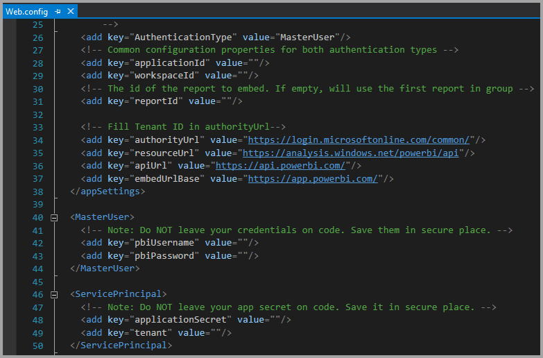
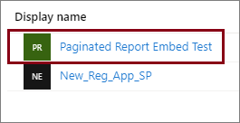
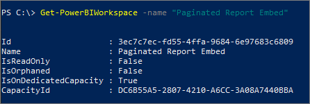
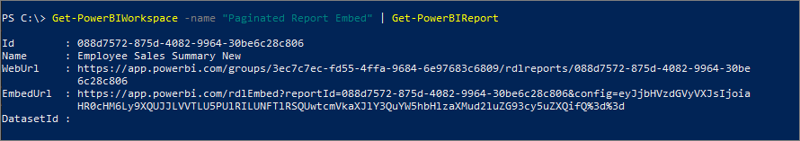

# Tutorial: Embed Power BI paginated reports into an application for your customers

With **Power BI Embedded in Azure** or **Power BI embedding in Office**, you can embed paginated reports into an application using app owns data. **App owns data** is about having an application that uses Power BI as its embedded analytics platform. As an **ISV** or a **developer**, you can create Power BI content that displays paginated reports in an application that is fully integrated and interactive, without requiring users to have a Power BI license. This tutorial demonstrates how to integrate a paginated report into an application using the Power BI .NET SDK with the Power BI Client APIs.


In this tutorial, you learn how to:
> [!div class="checklist"]
> * Register an application in Azure.
> * Embed a Power BI paginated report into an application.

## Prerequisites

To get started, you're required to have:

* A [service principal (app-only token)](embed-service-principal.md)
* A [Microsoft Azure](https://azure.microsoft.com/) subscription
* Your own [Azure Active Directory tenant](create-an-azure-active-directory-tenant.md) setup
* At least an A4 or a P1 [capacity](#create-a-capacity), with [paginated reports](../../admin/service-admin-premium-workloads.md#paginated-reports) workload enabled

If you don't have an Azure subscription, create a [free account](https://azure.microsoft.com/free/?WT.mc_id=A261C142F) before you begin.

> [!IMPORTANT]
> * You must use a **service principal**. Master user is not supported.
>* [Premium Per User (PPU)](../../admin/service-premium-per-user-faq.yml) is not supported. You can use PPU to experiment with the solution, but you'll not be able to [move to production](move-to-production.md).
> * Datasources that require single sign-on (SSO), are not supported. For a list of supported datasets and their authentication methods, see [Supported data sources for Power BI paginated reports](../../paginated-reports/paginated-reports-data-sources.md). 
> * Power BI dataset is not supported as a [datasource](../../connect-data/service-get-data.md).

## Set up your Power BI environment

Embedding a paginated report requires assigning a workspace to a capacity, and uploading the report to the workspace.

### Create an app workspace

As you're using a [service principal](embed-service-principal.md) to sign into your application, you're required to use the [new workspaces](../../collaborate-share/service-create-the-new-workspaces.md). As a *service principal*, you must also be an admin or member of the app workspaces involved with your application.

### Create a capacity

Before you import or upload a paginated report to embed, the workspace containing the report must be assigned to at least an A4 or P1 capacity. There are two types of capacity you can choose from:
* **Power BI Premium** - For embedding a paginated report, a *P* SKU capacity is required. When embedding Power BI content, this solution is referred to as *Power BI embedding*. For more information regarding this subscription, see [What is Power BI Premium?](../../admin/service-premium-what-is.md)
* **Azure Power BI Embedded** - You can purchase a capacity from the [Microsoft Azure portal](https://portal.azure.com). This subscription uses the *A* SKUs. For embedding paginated reports you need at least an *A4* subscription. For details on how to create a Power BI Embedded capacity, see [Create Power BI Embedded capacity in the Azure portal](azure-pbie-create-capacity.md).

    >[!NOTE]
    >Power BI Embedded recently released a new version, called **Embedded Gen2**. Embedded Gen2 will simplify the management of embedded capacities, and improve the Power BI Embedded experience. For more information, see [Power BI Embedded Generation 2](power-bi-embedded-generation-2.md).

The table below describes the resources and limits of each SKU. To determine which capacity best fits your needs, see the [which SKU should I purchase for my scenario](./embedded-faq.yml#which-solution-should-i-choose-) table.

| Capacity Nodes | Total v-cores | Backend v-cores | RAM (GB) | Frontend v-cores | 
| --- | --- | --- | --- | --- |
| A1 with [Embedded Gen2](power-bi-embedded-generation-2.md) | 1 | 0.5 | 2.5 | 0.5 |
| A2 with [Embedded Gen2](power-bi-embedded-generation-2.md) | 2 | 1 | 5 | 1 |
| A3 with [Embedded Gen2](power-bi-embedded-generation-2.md) | 4 | 2 | 10 | 2 |
| P1/A4 | 8 | 4 | 25 | 4 |
| P2/A5 | 16 | 8 | 50 | 8 |
| P3/A6 | 32 | 16 | 100 | 16 |
| | | | | |

### Assign an app workspace to a capacity

Once you create a capacity, you can assign your app workspace to that capacity.

To assign a capacity to a workspace using [service principal](embed-service-principal.md), use the [Power BI REST API](/rest/api/power-bi/capacities/groups_assigntocapacity). When you are using the Power BI REST APIs, make sure to use the [service principal object ID](embed-service-principal.md).

### Create and upload your paginated reports

You can create your paginated report using [Power BI Report Builder](../../paginated-reports/paginated-reports-report-builder-power-bi.md#create-reports-in-power-bi-report-builder), and then [upload the report to the service](../../paginated-reports/paginated-reports-quickstart-aw.md#upload-the-report-to-the-service).

You can import paginated reports into the new workspaces using the [Power BI REST APIs](/rest/api/power-bi/imports/postimportingroup).

## Embed content using the sample application

This sample is deliberately kept simple for demonstration purposes. It's up to you or your developers to protect the application secret.

Follow the steps below to start embedding your content using the sample application.

1. Download [Visual Studio](https://www.visualstudio.com/) (version 2013 or later). Make sure to download the latest [NuGet package](https://www.nuget.org/profiles/powerbi).

2. Download the [App Owns Data sample](https://github.com/Microsoft/PowerBI-Developer-Samples) from GitHub to get started.

    

3. Open the **Web.config** file in the sample application. There are fields you need to fill in to run the application. Choose **ServicePrincipal** for the **AuthenticationType**.

    Fill in the following fields:
    * [applicationId](#application-id)
    * [workspaceId](#workspace-id)
    * [reportId](#report-id)
    * [applicationsecret](#application-secret)
    * [tenant](#tenant)

    > [!Note]
    > The default **AuthenticationType** in this sample is MasterUser. Make sure you change it to **ServicePrincipal**. 


    

### Application ID

Fill in the **applicationId** information with the **Application ID** from **Azure**. The **applicationId** is used by the application to identify itself to the users from which you're requesting permissions.

To get the **applicationId**, follow these steps:

1. Sign into the [Azure portal](https://portal.azure.com).

2. In the left-hand nav pane, select **All Services**, and search for **App Registrations**.

    

3. Select the application that needs the **applicationId**.

    

4. There's an **Application ID** that is listed as a GUID. Use this **Application ID** as the **applicationId** for the application.

    

### Workspace ID

Fill in the **workspaceId** information with the app workspace (group) GUID from Power BI. You can get this information either from the URL when signed into the Power BI service or using PowerShell.

URL <br>


PowerShell <br>

```powershell
Get-PowerBIworkspace -name "Paginated Report Embed"
```

   

### Report ID

Fill in the **reportId** information with the report GUID from Power BI. You can get this information either from the URL when signed into the Power BI service or using PowerShell.

URL<br>


PowerShell <br>

```powershell
Get-PowerBIworkspace -name "Paginated Report Embed" | Get-PowerBIReport
```



### Application secret

Fill in the **ApplicationSecret** information from the **Keys** section of your **App registrations** section in **Azure**.

To get the **ApplicationSecret**, follow these steps:

1. Sign in to the [Azure portal](https://portal.azure.com).

2. In the left-hand nav pane, select **All services** and search for **App registrations**.

    

3. Select the application that needs to use the **ApplicationSecret**.

    

4. Select **Certificates and secrets** under **Manage**.

5. Select **New client secrets**.

6. Enter a name in the **Description** box and select a duration. Then select **Save** to get the **Value** for your application. When you close the **Keys** pane after saving the key value, the value field shows only as hidden. At that point, you aren't able to retrieve the key value. If you lose the key value, create a new one in the Azure portal.

    

### Tenant

Fill in the **tenant** information with your Azure tenant ID. You can get this information from the [Azure AD admin center](/onedrive/find-your-office-365-tenant-id) when signed into the Power BI service or by using PowerShell.

### Run the application

1. Select **Run** in **Visual Studio**.

    

2. Then select **Embed Report**.

    

3. Now you can view the report in the sample application.

    

## Embed Power BI paginated reports within your application

Even though the steps to embed your Power BI paginated reports are done with the [Power BI REST APIs](/rest/api/power-bi/), the example codes described in this article are made with the **.NET SDK**.

Embedding Power BI paginated reports for your customers within your application, requires you to have an **Azure AD** [service principal](embed-service-principal.md) and get an [Azure AD access token](generate-embed-token.md) for your Power BI application, before you make calls to the [Power BI REST APIs](/rest/api/power-bi/).

To create the Power BI Client with your **access token**, create a Power BI client object, which allows you to interact with the [Power BI REST APIs](/rest/api/power-bi/). You create the Power BI client object by wrapping the **AccessToken** with a ***Microsoft.Rest.TokenCredentials*** object.

```csharp
using Microsoft.IdentityModel.Clients.ActiveDirectory;
using Microsoft.Rest;
using Microsoft.PowerBI.Api.V2;

var tokenCredentials = new TokenCredentials(authenticationResult.AccessToken, "Bearer");

// Create a Power BI Client object. it's used to call Power BI APIs.
using (var client = new PowerBIClient(new Uri(ApiUrl), tokenCredentials))
{
    // Your code to embed items.
}
```

### Get the paginated report you want to embed

You can use the Power BI client object to retrieve a reference to the item you want to embed.

Here is a code sample of how to retrieve the first report from a given workspace.

*A sample of getting a content item whether it's a report, dashboard, or tile that you want to embed is available within the Services\EmbedService.cs file in the [sample application](https://github.com/Microsoft/PowerBI-Developer-Samples).*

```csharp
using Microsoft.PowerBI.Api.V2;
using Microsoft.PowerBI.Api.V2.Models;

// You need to provide the workspaceId where the dashboard resides.
ODataResponseListReport reports = await client.Reports.GetReportsInGroupAsync(workspaceId);

// Get the first report in the group.
Report report = reports.Value.FirstOrDefault();
```

### Create the embed token

Generate an embed token, which can be used from the Power BI embedded analytics Client APIs. To create an embedded token for embedding Power BI paginated reports, use the [Reports GenerateTokenInGroup](/rest/api/power-bi/embedtoken/reports_generatetokeningroup) API.

A sample of creating an embed token is available within the *Services\EmbedService.cs* file in the [sample application](https://github.com/Microsoft/PowerBI-Developer-Samples).

```csharp
using Microsoft.PowerBI.Api.V2;
using Microsoft.PowerBI.Api.V2.Models;

// Generate Embed Token.
var generateTokenRequestParameters = new GenerateTokenRequest(accessLevel: "view");
EmbedToken tokenResponse = client.Reports.GenerateTokenInGroup(workspaceId, report.Id, generateTokenRequestParameters);

// Generate Embed Configuration.
var embedConfig = new EmbedConfig()
{
    EmbedToken = tokenResponse,
    EmbedUrl = report.EmbedUrl,
    Id = report.Id
};
```

### Load an item using the Client APIs

You can use the Power BI embedded analytics Client APIs to load a paginated report into a div element on your web page.

For a full sample of using the Client API, you can use the [Playground tool](https://microsoft.github.io/PowerBI-JavaScript/demo). The Playground tool is a quick way to play with different types of Power BI Embedded samples. You can also get more Information about the Power BI embedded analytics Client API by visiting the [Power BI embedded analytics Client APIs](/javascript/api/overview/powerbi/) page.

## Next steps

In this tutorial, you've learned how to embed Power BI paginated reports into an application for your customers. You can also try to embed Power BI content for your customers or your organization.

> [!div class="nextstepaction"]
>[Embed content for your customers](embed-sample-for-customers.md)

> [!div class="nextstepaction"]
>[Embed content for your organization](embed-sample-for-your-organization.md)

More questions? [Try asking the Power BI Community](https://community.powerbi.com/)