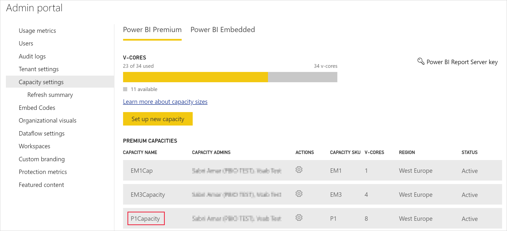
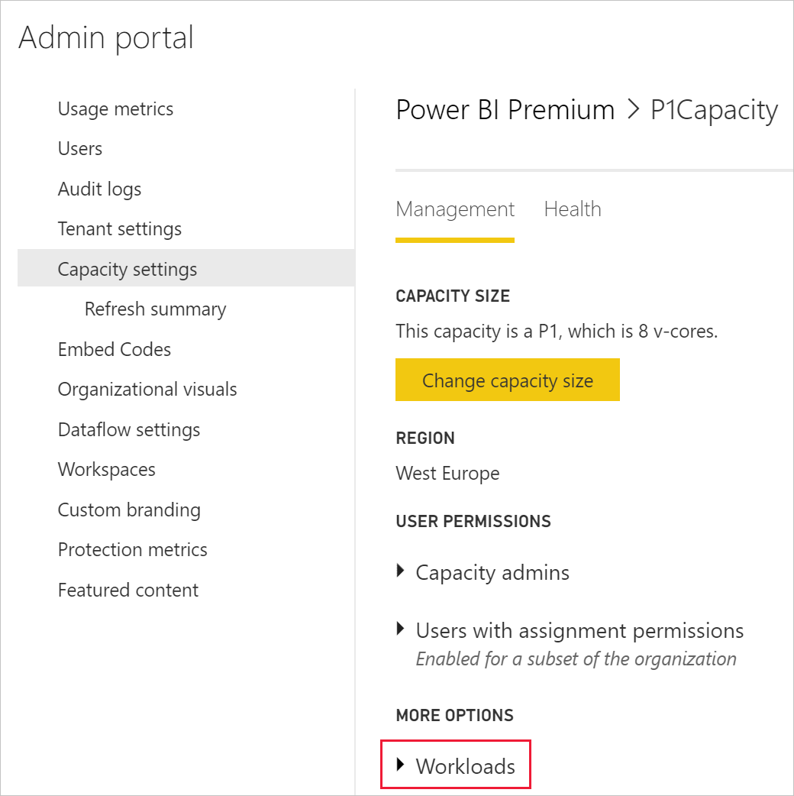
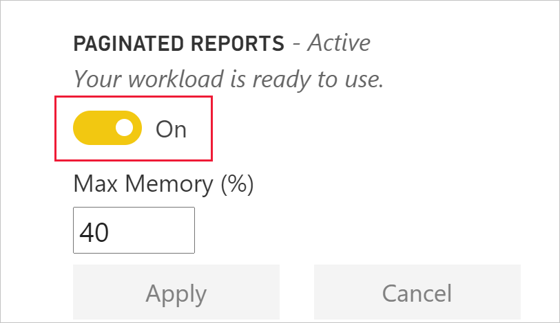

# Tutorial: Embed Power BI paginated reports into an application for your organization

In **Power BI**, you can embed paginated reports into an application for your organization by using the *user owns data* scenario.

Paginated reports are reports designed for high-quality printing. Usually these reports contain a lot of data, rendered in a way that makes it fit printed pages.
To understand how Power BI supports paginated reports, see [What are paginated reports in Power BI Premium?](../../paginated-reports/paginated-reports-report-builder-power-bi.md)

**User owns data** lets your application extend the Power BI service so it can use embedded analytics. This tutorial demonstrates how to integrate a paginated report into an application.

You use the Power BI .NET SDK with the Power BI JavaScript API to embed Power BI into an application for your organization.


In this tutorial, you learn the following tasks:
> [!div class="checklist"]
> * Register an application in Azure.
> * Embed a Power BI paginated report into an application using your Power BI tenant.

## Prerequisites
To get started, you're required to have:

* A [Power BI Pro license](../../admin/service-admin-purchasing-power-bi-pro.md) or Premium Per User (PPU) license.

* You need to have your own [Azure Active Directory tenant](create-an-azure-active-directory-tenant.md) setup.

* At least a P1 capacity. See [What size Premium capacity do I need for paginated reports?](../../paginated-reports/paginated-reports-faq.yml#what-size-premium-capacity-do-i-need-for-paginated-reports-)

If you're not signed up for **Power BI Pro**, [sign up for a free trial](https://powerbi.microsoft.com/pricing/) before you begin.

>[!NOTE]
>[Premium Per User (PPU)](../../admin/service-premium-per-user-faq.yml) is supported. However, if you're using PPU, only PPU users in your organization will be able to access your solution.

## Set up your Power BI environment

Follow the instructions in this section to set up Power BI for embedding your paginated reports.

### Register a server-side web application app

Follow the instructions in [Register an Azure AD application to use with Power BI](register-app.md) to register a server-side web application app.

>[!NOTE]
>When registering the app, make sure to do the following:
>* Get the application secret
>* Apply the **Report.ReadAll** permissions (scope) to your app.

### Create a capacity

By creating a capacity, you can take advantage of having a resource for the content in your app workspace. For paginated reports, you must back your app workspace with at least a P1 capacity. You can create a capacity by using [Power BI Premium](../../admin/service-premium-what-is.md).

The following table lists the Power BI Premium SKUs that can be used to create a capacity for paginated reports in [Microsoft Office 365](../../admin/service-admin-premium-purchase.md):

| Capacity node | Total vCores<br/>(back end + front end) | Back-end vCores | Front-end vCores | DirectQuery/live connection limits |
| --- | --- | --- | --- | --- | --- |
| P1 |8 vCores |4 vCores, 25 GB of RAM |4 vCores |30 per second |
| P2 |16 vCores |8 vCores, 50 GB of RAM |8 vCores |60 per second |
| P3 |32 vCores |16 vCores, 100 GB of RAM |16 vCores |120 per second |
| P4 |64 vCores |32 vCores, 200 GB of RAM |32 vCores |240 per second |
| P5 |128 vCores |64 vCores, 400 GB of RAM |64 vCores |480 per second |
|||||

### Enable paginated reports workload

You need to enable the paginated report workload on your capacity.

1. Sign into [Power BI > Admin portal > Capacity settings](https://app.powerbi.com/admin-portal/capacities).

2. Select the capacity that has the workspace you want to upload the paginated report to.

    

3. Expand **Workloads**.

    

4. Activate the paginated reports workload.

    

### Assign an app workspace to a capacity

After you create a capacity, you can assign your app workspace to that capacity. To complete this process, follow these steps:

1. Within the Power BI service, expand workspaces and select **More** for the workspace you're using for embedding your content. Then select **Workspace settings**.

    

2. Select **Premium** and enable **Capacity**. Select the capacity you created. Then select **Save**.

    

3. After you select **Save**, you should see a diamond next to the app workspace name.

    

### Create and publish your Power BI paginated reports

You can create your paginated reports by using the [Power BI Report Builder](../../paginated-reports/paginated-reports-report-builder-power-bi.md#create-reports-in-power-bi-report-builder). Then you can [upload the report](../../paginated-reports/paginated-reports-quickstart-aw.md#upload-the-report-to-the-service) to an app workspace assigned to at least a P1 capacity, and turn on the [paginated reports workload](#enable-paginated-reports-workload). The end user uploading the report must have a Power BI Pro or Premium Per User (PPU) license to publish to an app workspace.
   
## Embed your content by using the sample application

This sample is deliberately kept simple for demonstration purposes.

Follow the steps below to start embedding your content using the sample application.

1. Download [Visual Studio](https://www.visualstudio.com/) (version 2013 or later). Make sure to download the latest [NuGet package](https://www.nuget.org/profiles/powerbi).

2. Download [PowerBI-Developer-Samples](https://github.com/Microsoft/PowerBI-Developer-Samples), and open .NET Framework > Embed for your organization > integrate-web-app > **PBIWebApp**.

    

3. Open the **Cloud.config** file in the sample application, and fill in the following fields to run your application:
    * [Application ID](#application-id)
    * [Workspace ID](#workspace-id)
    * [Report ID](#report-id)
    * [AADAuthorityUrl](#aadauthorityurl)

    

### Application ID

Fill in the **applicationId** information with the **Application ID** from **Azure**. The **applicationId** is used by the application to identify itself to the users from which you're requesting permissions.

To get the **applicationId**, follow these steps:

1. Sign into the [Azure portal](https://portal.azure.com).

2. In the left-hand navigation pane, select **All Services**, and select **App Registrations**.

3. Select the application that needs the **applicationId**.

    

4. There's an **Application ID** that is listed as a GUID. Use this **Application ID** as the **applicationId** for the application.

    

### Workspace ID

Fill in the **workspaceId** information with the app workspace (group) GUID from Power BI. You can get this information either from the URL when signed into the Power BI service or using PowerShell.

URL <br>


PowerShell <br>

```powershell
Get-PowerBIworkspace -name "User Owns Embed Test"
```

   

### Report ID

Fill in the **reportId** information with the report GUID from Power BI. You can get this information either from the URL when signed into the Power BI service or using PowerShell.


PowerShell <br>

```powershell
Get-PowerBIworkspace -name "User Owns Embed Test" | Get-PowerBIReport -Name "Sales Paginated Report"
```


### AADAuthorityUrl

Fill in the **AADAuthorityUrl** information with the URL that either allows you to embed within your organizational tenant or embed with a guest user.

For embedding with your organizational tenant, use the URL - *https://login.microsoftonline.com/common/oauth2/authorize*.

For embedding with a guest, use the URL - *`https://login.microsoftonline.com/report-owner-tenant-id`* - where you add the tenant ID of the report owner in replacement of *report-owner-tenant-id*.

### Run the application

1. Select **Run** in **Visual Studio**.

    

2. Then select **Embed Report**. Depending on which content you choose to test with - reports, dashboards or tiles - then select that option in the application.

    

3. Now you can view the report in the sample application.

    

## Next steps

In this tutorial, you learned how to embed Power BI paginated reports into an application by using your Power BI organization account. 

> [!div class="nextstepaction"]
> [Embed from apps](./index.yml)

> [!div class="nextstepaction"]
>[Embed Power BI content for your customers](embed-sample-for-customers.md)

> [!div class="nextstepaction"]
>[Embed Power BI paginated reports for your customers](embed-paginated-reports-customers.md)

If you have more questions, [try asking the Power BI Community](http://community.powerbi.com/).
