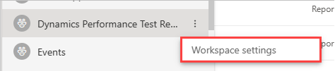
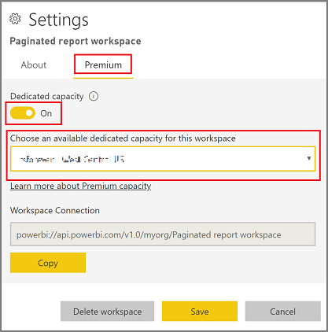
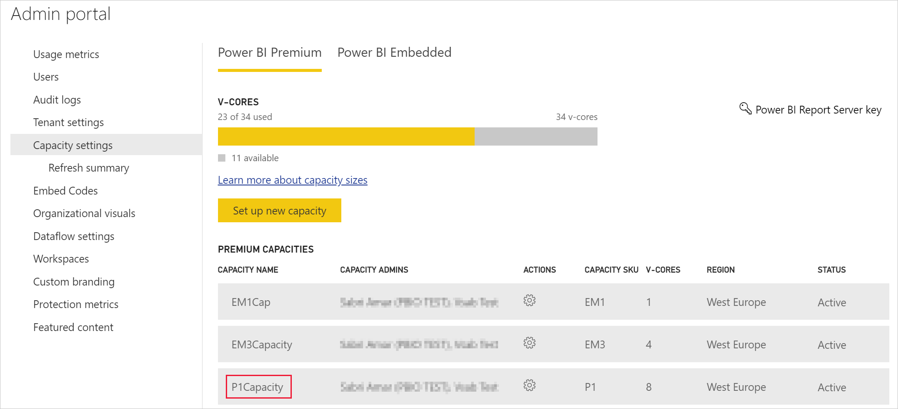
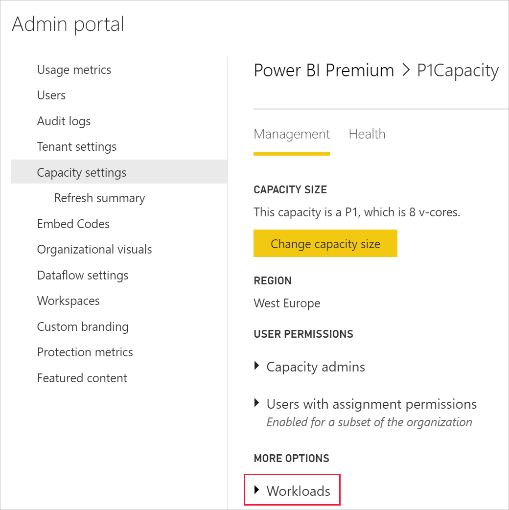

# Embed Power BI paginated reports

With Power BI embedded analytics you can create Power BI content that displays [paginated reports](../../paginated-reports/paginated-reports-report-builder-power-bi.md) in an application that is fully integrated and interactive. You can embed paginated reports using the solution that best works for you, [embed for your customers](embedded-analytics-power-bi.md#embed-for-your-customers) or [embed for your organization](embedded-analytics-power-bi.md#embed-for-your-organization).

This article describes how to embed paginated reports using the embedding sample tutorials.

## Prerequisites

To get started, you're required to have:

# [Embed for your customers](#tab/customers)

* A [service principal](embed-service-principal.md)

* A [Microsoft Azure](https://azure.microsoft.com/) subscription

* Your own [Azure Active Directory tenant](create-an-azure-active-directory-tenant.md) setup

* A [capacity](#create-a-capacity), with [paginated reports](../../admin/service-admin-premium-workloads.md#paginated-reports) workload enabled

If you don't have an Azure subscription, create a [free account](https://azure.microsoft.com/free/?WT.mc_id=A261C142F) before you begin.

> [!IMPORTANT]
> * You must use a **service principal**. Master user is not supported.
>* [Premium Per User (PPU)](../../admin/service-premium-per-user-faq.yml) is not supported. You can use PPU to experiment with the solution, but you'll not be able to [move to production](move-to-production.md).
> * Datasources that require single sign-on (SSO), are not supported. For a list of supported datasets and their authentication methods, see [Supported data sources for Power BI paginated reports](../../paginated-reports/paginated-reports-data-sources.md). 
> * Power BI dataset is not supported as a [datasource](../../connect-data/service-get-data.md).

# [Embed for your organization](#tab/organization)

* A [Power BI Pro license](../../admin/service-admin-purchasing-power-bi-pro.md) or Premium Per User (PPU) license.

* You need to have your own [Azure Active Directory tenant](create-an-azure-active-directory-tenant.md) setup.

* A Premium capacity. See [What size Premium capacity do I need for paginated reports?](../../paginated-reports/paginated-reports-faq.yml#what-size-premium-capacity-do-i-need-for-paginated-reports-)

If you're not signed up for **Power BI Pro**, [sign up for a free trial](https://powerbi.microsoft.com/pricing/) before you begin.

>[!NOTE]
>[Premium Per User (PPU)](../../admin/service-premium-per-user-faq.yml) is supported. However, if you're using PPU, only PPU users in your organization will be able to access your solution.

---

## Method

To embed a paginated report using the sample app, follow these steps:

1. [Create a workspace](#step-1---create-a-workspace).

2. [Create and upload your paginated reports](#step-2---create-and-upload-your-paginated-reports).

3. [Create a capacity](#step-3---create-a-capacity).

4. [Assign a workspace to a capacity](#step-4---assign-a-workspace-to-a-capacity).

5. [Enable paginated reports workload](#step-5---enable-paginated-reports-workload).

6. [Embed content using the sample application](#step-6---embed-content-using-the-sample-application).

## Step 1 - Create a workspace

# [Embed for your customers](#tab/customers)

As you're using a [service principal](embed-service-principal.md) to sign into your application, you'll need to create a [new workspaces](../../collaborate-share/service-create-the-new-workspaces.md).

As a *service principal*, you must also be an admin or member of the Power BI workspaces involved with your application.

# [Embed for your organization](#tab/organization)

In Power BI service, create a workspace for your paginated report.

---

## Step 2 - Create and upload your paginated reports

You can create your paginated report using [Power BI Report Builder](../../paginated-reports/paginated-reports-report-builder-power-bi.md#create-reports-in-power-bi-report-builder), and then [upload the report to the service](../../paginated-reports/paginated-reports-quickstart-aw.md#upload-the-report-to-the-service).

>[!NOTE]
>The end user uploading the paginated report must have a Power BI Pro or Premium Per User (PPU) license to publish to a workspace.

## Step 3 - Create a capacity

# [Embed for your customers](#tab/customers)

Before you import or upload a paginated report to embed, the workspace containing the report must be assigned to a capacity. There are two types of capacity you can choose from:
* **Power BI Premium** - For embedding a paginated report, an *EM* or *P* SKU is required. When embedding Power BI content, this solution is referred to as *Power BI embedding*. For more information regarding this subscription, see [What is Power BI Premium?](../../admin/service-premium-what-is.md)
* **Azure Power BI Embedded** - You can purchase a capacity from the [Microsoft Azure portal](https://portal.azure.com). This subscription uses the *A* SKUs. For details on how to create a Power BI Embedded capacity, see [Create Power BI Embedded capacity in the Azure portal](azure-pbie-create-capacity.md).

    >[!NOTE]
    >Power BI Embedded recently released a new version, called **Embedded Gen2**. Embedded Gen2 will simplify the management of embedded capacities, and improve the Power BI Embedded experience. For more information, see [Power BI Embedded Generation 2](power-bi-embedded-generation-2.md).

The table below describes the resources and limits of each SKU. To determine which capacity best fits your needs, see the [which SKU should I purchase for my scenario](./embedded-faq.yml#which-solution-should-i-choose-) table.

| Capacity Nodes | Total v-cores | Backend v-cores | Frontend v-cores | RAM (GB) | 
| --- | --- | --- | --- | --- |
| EM1/A1 with [Embedded Gen2](power-bi-embedded-generation-2.md) | 1 | 0.5 | 0.5 | 2.5 |
| EM2/A2 with [Embedded Gen2](power-bi-embedded-generation-2.md) | 2 | 1 | 1 | 5 |
| EM3/A3 with [Embedded Gen2](power-bi-embedded-generation-2.md) | 4 | 2 | 2 | 10 |
| P1/A4 | 8 | 4 | 4 | 25 |
| P2/A5 | 16 | 8 | 8 | 50 |
| P3/A6 | 32 | 16 | 16 | 100 |
| | | | | |

# [Embed for your organization](#tab/organization)

By creating a capacity, you can take advantage of having a resource for the content in your app workspace. For paginated reports, you must back your app workspace with an *EM* or a *P* capacity. You can create a capacity by using [Power BI Premium](../../admin/service-premium-what-is.md).

The following table lists the Power BI Premium SKUs that can be used to create a capacity for paginated reports in [Microsoft Office 365](../../admin/service-admin-premium-purchase.md):

| Capacity node | Total vCores | Back-end vCores | Front-end vCores | DirectQuery/live connection limits (per sec) |
| --- | --- | --- | --- | --- | --- |
| EM1 with [Embedded Gen2](power-bi-embedded-generation-2.md) | 1 | 0.5 | 0.5 | 3.75 per second |
| EM2 with [Embedded Gen2](power-bi-embedded-generation-2.md) | 2 | 1 | 1 | 7.5 |
| EM3 with [Embedded Gen2](power-bi-embedded-generation-2.md) | 4 | 2 | 2 | 15 |
| P1 |8 vCores |4 vCores, 25 GB of RAM |4 vCores |30 |
| P2 |16 vCores |8 vCores, 50 GB of RAM |8 vCores |60 |
| P3 |32 vCores |16 vCores, 100 GB of RAM |16 vCores |120 |
| P4 |64 vCores |32 vCores, 200 GB of RAM |32 vCores |240 |
| P5 |128 vCores |64 vCores, 400 GB of RAM |64 vCores |480 |
|||||

---

## Step 4 - Assign a workspace to a capacity

# [Embed for your customers](#tab/customers)

Once you create a capacity, you can assign your app workspace to that capacity.

To assign a capacity to a workspace using [service principal](embed-service-principal.md), use the [Power BI REST API](/rest/api/power-bi/capacities/groups_assigntocapacity). When you are using the Power BI REST APIs, make sure to use the [service principal object ID](embed-service-principal.md).

>[!NOTE]
>You can import paginated reports into the new workspaces using the [Power BI REST APIs](/rest/api/power-bi/imports/postimportingroup).

# [Embed for your organization](#tab/organization)

After you create a capacity, you need to assign your workspace to that capacity. To complete this process, follow these steps:

1. Within the Power BI service, expand workspaces and select **More** for the workspace you're using for embedding your content. Then select **Workspace settings**.

    

2. Select **Premium** and enable **Capacity**. Select the capacity you created. Then select **Save**.

    

3. After you select **Save**, you should see a diamond next to the app workspace name.

    

---

## Step 5 - Enable paginated reports workload

After creating a capacity and assigning your workspace to it, you need to enable the paginated report workload on your capacity.

1. Sign into [Power BI > Admin portal > Capacity settings](https://app.powerbi.com/admin-portal/capacities).

2. Select the capacity that has the workspace you want to upload the paginated report to.

    

3. Expand **Workloads**.

    

4. Activate the paginated reports workload.

    

## Step 6 - Embed content using the sample application

## Next steps

> [!div class="nextstepaction"]
>[Embed content for your customers](embed-sample-for-customers.md)

> [!div class="nextstepaction"]
>[Embed content for your organization](embed-sample-for-your-organization.md)

More questions? [Try asking the Power BI Community](https://community.powerbi.com/)