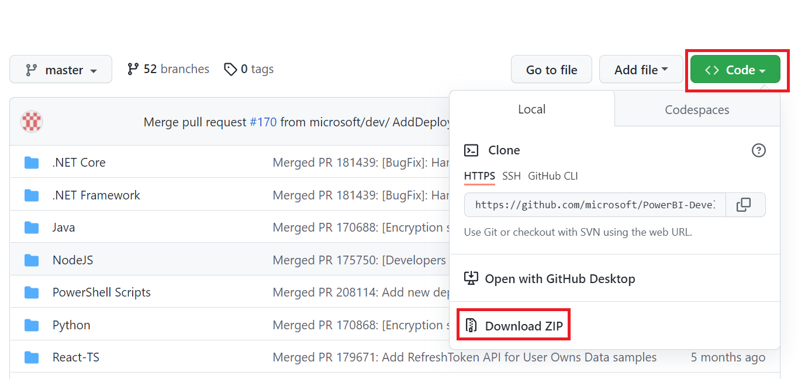

# Tutorial: Embed a Power BI content into your application for national clouds

Learn how to embed analytical content within your business process applications for the national cloud. You can use the Power BI .NET SDK with the Power BI JavaScript API to embed a report, dashboard, or tile, into your web applications.

Power BI also supports [national clouds](/azure/active-directory/develop/authentication-national-cloud).

The different national clouds are:

* U.S. Government Community Cloud (GCC)

* U. S. Government Community Cloud High (GCC High)

* U. S. Military Contractors (DoDCON)

* U. S. Military (DoD)

* Power BI for Germany cloud

* Power BI for China cloud


To get started with this walkthrough, you need a **Power BI account**. If you don't have an account set up, then depending on the type of government or country you can choose the right national cloud for you. You can sign up for a [U. S. government Power BI account](../../admin/service-govus-signup.md), a [Power BI for Germany cloud account](https://powerbi.microsoft.com/power-bi-germany/?ru=https%3A%2F%2Fapp.powerbi.de%2F%3FnoSignUpCheck%3D1) or a [Power BI for China cloud account](https://www.21vbluecloud.com/powerbi/).

> [!NOTE]
> Looking to embed a dashboard for your organization instead? See, [Integrate a dashboard into an app for your organization](embed-sample-for-your-organization.md).

To integrate a dashboard into a web app, you use the **Power BI** API, and an Azure Active Directory (AD) authorization **access token** to get a dashboard. Then, you load the dashboard using an embed token. The **Power BI** API provides programmatic access to specific **Power BI** resources. For more information, see [Power BI REST API](/rest/api/power-bi/), [Power BI .NET SDK, and the [Power BI JavaScript API](https://github.com/Microsoft/PowerBI-JavaScript).

## Download the sample

This article shows the code used in the [App Owns Data sample](https://github.com/Microsoft/PowerBI-Developer-Samples) on GitHub. To follow along with this walkthrough, you can download the sample. 



* Government Community Cloud (GCC):

    > [!NOTE]
    > Embedding Power BI content from a Government Community Cloud (GCC), can only be done with a Microsoft 365 SKU. Other national cloud customers can use [Microsoft 365 or Azure SKUs](embedded-faq.yml).

1. Overwrite Cloud.config file with GCCCloud.config content.

2. Update applicationId (Native app applicationId), workspaceId, the user (your master user), and password in Web.config file.

3. Add the GCC parameters in the web.config file as follows.

```xml
<add key="authorityUrl" value="https://login.microsoftonline.com/common/" />
<add key="resourceUrl" value="https://analysis.usgovcloudapi.net/powerbi/api" />
<add key="apiUrl" value="https://api.powerbigov.us/" />
<add key="embedUrlBase" value="https://app.powerbigov.us" />
```

* Military Contractors (DoDCON):

1. Overwrite Cloud.config file with TBCloud.config content.

2. Update applicationId (Native app applicationId), workspaceId, the user (your master user), and password in Web.config file.

3. Add the DoDCON parameters in the web.config file as follows.

```xml
<add key="authorityUrl" value="https://login.microsoftonline.us/common/" />
<add key="resourceUrl" value="https://high.analysis.usgovcloudapi.net/powerbi/api" />
<add key="apiUrl" value="https://api.high.powerbigov.us/" />
<add key="embedUrlBase" value="https://app.high.powerbigov.us" />
```

* Military (DoD):

1. Overwrite Cloud.config file with PFCloud.config content.

2. Update applicationId (Native app applicationId), workspaceId, the user (your master user), and password in Web.config file.

3. Add the DoDCON parameters in the web.config file as follows.

```xml
<add key="authorityUrl" value="https://login.microsoftonline.us/common/" />
<add key="resourceUrl" value="https://mil.analysis.usgovcloudapi.net/powerbi/api" />
<add key="apiUrl" value="https://api.mil.powerbigov.us/" />
<add key="embedUrlBase" value="https://app.mil.powerbigov.us" />
```

* Power BI for Germany cloud parameters

1. Overwrite Cloud.config file with Power BI for Germany cloud content.

2. Update applicationId (Native app applicationId), workspaceId, the user (your master user), and password in Web.config file.

3. Add the Power BI for Germany cloud parameters in the web.config file as follows.

```xml
<add key="authorityUrl" value="https://login.microsoftonline.de/common/" />
<add key="resourceUrl" value="https://analysis.cloudapi.de/powerbi/api" />
<add key="apiUrl" value="https://api.powerbi.de/" />
<add key="embedUrlBase" value="https://app.powerbi.de" />
```

* Power BI for China cloud parameters

1. Overwrite Cloud.config file with [Power BI for China](https://github.com/microsoft/PowerBI-Developer-Samples/blob/master/.NET%20Framework/Embed%20for%20your%20organization/CloudConfigs/Power%20BI%20operated%20by%2021Vianet%20in%20China/Cloud.config) cloud content.

2. Update applicationId (Native app applicationId), workspaceId, the user (your master user), and password in Web.config file.

3. Add the Power BI for China cloud parameters in the web.config file as follows.

```xml
<add key="authorityUrl" value="https://login.chinacloudapi.cn/common/" />
<add key="resourceUrl" value="https://analysis.chinacloudapi.cn/powerbi/api" />
<add key="apiUrl" value="https://api.powerbi.cn/" />
<add key="embedUrlBase" value="https://app.powerbi.cn" />
```

## Step 1 - register an app in Azure AD

Register your application with Azure AD to make REST API calls. For more information, see [Register an Azure AD app to embed Power BI content](register-app.md). Since there are different national cloud affiliations, there are distinct URLs to register your application.

* Government Community Cloud (GCC) - ```https://app.powerbigov.us/apps```

* Military Contractors (DoDCON) - ```https://app.high.powerbigov.us/apps```

* Military (DoD) - ```https://app.mil.powerbigov.us/apps```

* Power BI for Germany cloud - ```https://app.powerbi.de/apps```

* Power BI for China cloud - ```https://app.powerbi.cn/apps```

If you downloaded the [Embedding for your customer sample](https://github.com/microsoft/PowerBI-Developer-Samples/tree/master/.NET%20Core/Embed%20for%20your%20customers/AppOwnsData), you would use the **applicationId** you get, so that the sample can authenticate to Azure AD. To configure the sample, change the **applicationId** in the *web.config* file.

## Step 2 - get an access token from Azure AD

Within your application, you need to get an **access token**, from Azure AD, before you can make calls to the Power BI REST API. For more information, see [Authenticate users and get an Azure AD access token for your Power BI app](generate-embed-token.md). Since there are different national cloud affiliations, there are distinct URLs to get an access token for your application.

* Government Community Cloud (GCC) - ```https://login.microsoftonline.com```

* Military Contractors (DoDCON) - ```https://login.microsoftonline.us```

* Military (DoD) - ```https://login.microsoftonline.us```

* Power BI for Germany cloud - ```https://login.microsoftonline.de```

* Power BI for China cloud - ```https://login.chinacloudapi.cn```

You can see examples of these access tokens within each content item task in the **Controllers\HomeController.cs** file.

## Step 3 - get a content item

To embed your Power BI content, you need to do a couple of things to make sure it embeds correctly. While all of these steps can be done with the REST API directly, the sample application and the examples here use the .NET SDK.

### Create the Power BI Client with your access token

With your access token, you want to create your Power BI client object, which allows you to interact with the Power BI APIs. You create your Power BI client object by wrapping the AccessToken with a *Microsoft.Rest.TokenCredentials* object.

```csharp
using Microsoft.IdentityModel.Clients.ActiveDirectory;
using Microsoft.Rest;
using Microsoft.PowerBI.Api.V2;

var tokenCredentials = new TokenCredentials(authenticationResult.AccessToken, "Bearer");

// Create a Power BI Client object. This is used to call the Power BI APIs.
using (var client = new PowerBIClient(new Uri(ApiUrl), tokenCredentials))
{
    // Your code to embed items.
}
```

### Get the content item you want to embed

Use the Power BI client object to retrieve a reference to the item you want to embed. You can embed dashboards, tiles, or reports. Here is an example of how to retrieve the first dashboard, tile, or report from a given workspace.

A sample is available within **Controllers\HomeController.cs** of the [App Owns Data sample](https://github.com/microsoft/PowerBI-Developer-Samples/tree/master/.NET%20Core/Embed%20for%20your%20customers/AppOwnsData).

#### Reports

```csharp
using Microsoft.PowerBI.Api.V2;
using Microsoft.PowerBI.Api.V2.Models;

// You need to provide the workspaceId where the dashboard resides.
ODataResponseListReport reports = client.Reports.GetReportsInGroupAsync(workspaceId);

// Get the first report in the group.
Report report = reports.Value.FirstOrDefault();
```

#### Dashboards

```csharp
using Microsoft.PowerBI.Api.V2;
using Microsoft.PowerBI.Api.V2.Models;

// You need to provide the workspaceId where the dashboard resides.
ODataResponseListDashboard dashboards = client.Dashboards.GetDashboardsInGroup(workspaceId);

// Get the first report in the group.
Dashboard dashboard = dashboards.Value.FirstOrDefault();
```

#### Tiles

```csharp
using Microsoft.PowerBI.Api.V2;
using Microsoft.PowerBI.Api.V2.Models;

// To retrieve the tile, you first need to retrieve the dashboard.

// You need to provide the workspaceId where the dashboard resides.
ODataResponseListDashboard dashboards = client.Dashboards.GetDashboardsInGroup(workspaceId);

// Get the first report in the group.
Dashboard dashboard = dashboards.Value.FirstOrDefault();

// Get a list of tiles from a specific dashboard
ODataResponseListTile tiles = client.Dashboards.GetTilesInGroup(workspaceId, dashboard.Id);

// Get the first tile in the group.
Tile tile = tiles.Value.FirstOrDefault();
```

### Create the embed token

Using the JavaScript API, you can generate an embed token. The embed token is specific to the item you're embedding. Anytime you embed a piece of Power BI content, you need to create a new embed token for it. For more information, including which **accessLevel** to use, see [Embed Token](/rest/api/power-bi/embedtoken).

> [!IMPORTANT]
> Because embed tokens are intended for developer testing only, the number of embed tokens a Power BI master account can generate is limited. A [capacity must be purchased](/power-bi/developer/embedded/embedded-faq#technical) for production embedding scenarios. There is no limit to embed token generation when a capacity is purchased.

A sample is available within **Controllers\HomeController.cs** of the [Embedding for your organization sample](https://github.com/microsoft/PowerBI-Developer-Samples/tree/master/.NET%20Core/Embed%20for%20your%20customers/AppOwnsData).

A class is created for **EmbedConfig** and **TileEmbedConfig**. A sample is available within **Models\EmbedConfig.cs** and **Models\TileEmbedConfig.cs**.

#### Reports

```csharp
using Microsoft.PowerBI.Api.V2;
using Microsoft.PowerBI.Api.V2.Models;

// Generate Embed Token.
var generateTokenRequestParameters = new GenerateTokenRequest(accessLevel: "view");
EmbedToken tokenResponse = client.Reports.GenerateTokenInGroup(workspaceId, report.Id, generateTokenRequestParameters);

// Generate Embed Configuration.
var embedConfig = new EmbedConfig()
{
    EmbedToken = tokenResponse,
    EmbedUrl = report.EmbedUrl,
    Id = report.Id
};
```

#### Dashboards

```csharp
using Microsoft.PowerBI.Api.V2;
using Microsoft.PowerBI.Api.V2.Models;

// Generate Embed Token.
var generateTokenRequestParameters = new GenerateTokenRequest(accessLevel: "view");
EmbedToken tokenResponse = client.Dashboards.GenerateTokenInGroup(workspaceId, dashboard.Id, generateTokenRequestParameters);

// Generate Embed Configuration.
var embedConfig = new EmbedConfig()
{
    EmbedToken = tokenResponse,
    EmbedUrl = dashboard.EmbedUrl,
    Id = dashboard.Id
};
```

#### Tiles

```csharp
using Microsoft.PowerBI.Api.V2;
using Microsoft.PowerBI.Api.V2.Models;

// Generate Embed Token for a tile.
var generateTokenRequestParameters = new GenerateTokenRequest(accessLevel: "view");
EmbedToken tokenResponse = client.Tiles.GenerateTokenInGroup(workspaceId, dashboard.Id, tile.Id, generateTokenRequestParameters);

// Generate Embed Configuration.
var embedConfig = new TileEmbedConfig()
{
    EmbedToken = tokenResponse,
    EmbedUrl = tile.EmbedUrl,
    Id = tile.Id,
    dashboardId = dashboard.Id
};
```

## Step 4 - load an item using JavaScript

You can use JavaScript to load a dashboard into a div element on your web page. The sample uses an EmbedConfig/TileEmbedConfig model along with views for a dashboard, tile, or report. For a full sample of using the JavaScript API, you can use the [Microsoft Power BI Embedded Sample](https://microsoft.github.io/PowerBI-JavaScript/demo).

An application sample is available within the [Embedding for your organization sample](https://github.com/microsoft/PowerBI-Developer-Samples/tree/master/.NET%20Core/Embed%20for%20your%20customers/AppOwnsData).

### Views\Home\EmbedDashboard.cshtml

```csharp
<script src="~/scripts/powerbi.js"></script>
<div id="dashboardContainer"></div>
<script>
    // Read embed application token from Model
    var accessToken = "@Model.EmbedToken.Token";

    // Read embed URL from Model
    var embedUrl = "@Html.Raw(Model.EmbedUrl)";

    // Read dashboard Id from Model
    var embedDashboardId = "@Model.Id";

    // Get models. models contains enums that can be used.
    var models = window['powerbi-client'].models;

    // Embed configuration used to describe the what and how to embed.
    // This object is used when calling powerbi.embed.
    // This also includes settings and options such as filters.
    // You can find more information at https://github.com/Microsoft/PowerBI-JavaScript/wiki/Embed-Configuration-Details.
    var config = {
        type: 'dashboard',
        tokenType: models.TokenType.Embed,
        accessToken: accessToken,
        embedUrl: embedUrl,
        id: embedDashboardId
    };

    // Get a reference to the embedded dashboard HTML element
    var dashboardContainer = $('#dashboardContainer')[0];

    // Embed the dashboard and display it within the div container.
    var dashboard = powerbi.embed(dashboardContainer, config);
</script>
```

### Views\Home\EmbedTile.cshtml

```csharp
<script src="~/scripts/powerbi.js"></script>
<div id="tileContainer"></div>
<script>
    // Read embed application token from Model
    var accessToken = "@Model.EmbedToken.Token";

    // Read embed URL from Model
    var embedUrl = "@Html.Raw(Model.EmbedUrl)";

    // Read tile Id from Model
    var embedTileId = "@Model.Id";

    // Read dashboard Id from Model
    var embedDashboardId = "@Model.dashboardId";

    // Get models. models contains enums that can be used.
    var models = window['powerbi-client'].models;

    // Embed configuration used to describe the what and how to embed.
    // This object is used when calling powerbi.embed.
    // This also includes settings and options such as filters.
    // You can find more information at https://github.com/Microsoft/PowerBI-JavaScript/wiki/Embed-Configuration-Details.
    var config = {
        type: 'tile',
        tokenType: models.TokenType.Embed,
        accessToken: accessToken,
        embedUrl: embedUrl,
        id: embedTileId,
        dashboardId: embedDashboardId
    };

    // Get a reference to the embedded tile HTML element
    var tileContainer = $('#tileContainer')[0];

    // Embed the tile and display it within the div container.
    var tile = powerbi.embed(tileContainer, config);
</script>
```

### Views\Home\EmbedReport.cshtml

```csharp
<script src="~/scripts/powerbi.js"></script>
<div id="reportContainer"></div>
<script>
    // Read embed application token from Model
    var accessToken = "@Model.EmbedToken.Token";

    // Read embed URL from Model
    var embedUrl = "@Html.Raw(Model.EmbedUrl)";

    // Read report Id from Model
    var embedReportId = "@Model.Id";

    // Get models. models contains enums that can be used.
    var models = window['powerbi-client'].models;

    // Embed configuration used to describe the what and how to embed.
    // This object is used when calling powerbi.embed.
    // This also includes settings and options such as filters.
    // You can find more information at https://github.com/Microsoft/PowerBI-JavaScript/wiki/Embed-Configuration-Details.
    var config = {
        type: 'report',
        tokenType: models.TokenType.Embed,
        accessToken: accessToken,
        embedUrl: embedUrl,
        id: embedReportId,
        permissions: models.Permissions.All,
        settings: {
            filterPaneEnabled: true,
            navContentPaneEnabled: true
        }
    };

    // Get a reference to the embedded report HTML element
    var reportContainer = $('#reportContainer')[0];

    // Embed the report and display it within the div container.
    var report = powerbi.embed(reportContainer, config);
</script>
```

## Next steps

* A sample application is available on GitHub for you to review. The above examples are based on that sample. For more information, see [Embedding for your organization sample](https://github.com/microsoft/PowerBI-Developer-Samples/tree/master/.NET%20Core/Embed%20for%20your%20customers/AppOwnsData).

* For more information about JavaScript API, reference [Power BI JavaScript API](https://github.com/Microsoft/PowerBI-JavaScript).

* For more information about for Power BI for Germany cloud, reference [Microsoft Cloud Deutschland transition](https://www.microsoft.com/cloud-platform/germany-cloud-regions)

Considerations and limitations

More questions? [Try asking the Power BI Community](https://community.powerbi.com/)