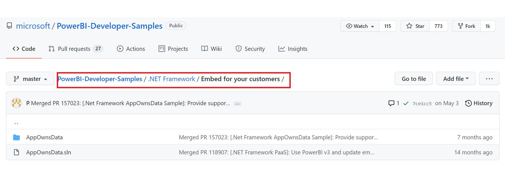

# Tutorial: Embed Power BI content into your application for national clouds

Learn how to embed analytical content within your business process applications for the [national cloud](/azure/active-directory/develop/authentication-national-cloud). You can use the Power BI .NET SDK with the Power BI JavaScript API to embed a report, dashboard, or tile, into your web applications.

Power BI supports the following national clouds:

* U.S. Government Community Cloud (GCC)

* U. S. Government Community Cloud High (GCC High)

* U. S. Military Contractors (DoDCON)

* U. S. Military (DoD)

* Power BI for China cloud


To get started with this walkthrough, you need a **Power BI account**. If you don't have an account set up, then depending on the type of government or country you can choose the right national cloud for you. You can sign up for a [U. S. government Power BI account](../../admin/service-govus-signup.md), or a [Power BI for China cloud account](https://www.21vbluecloud.com/powerbi/).

> [!NOTE]
> Looking to embed a dashboard for your organization instead? See, [Integrate a dashboard into an app for your organization](embed-sample-for-your-organization.md).

To integrate a dashboard into a web app, you use the **Power BI** API, and an Azure Active Directory (AD) authorization **access token** to get a dashboard. Then, you load the dashboard using an embed token. The **Power BI** API provides programmatic access to specific **Power BI** resources. For more information, see [Power BI REST API](/rest/api/power-bi/), [Power BI .NET SDK, and the [Power BI JavaScript API](https://github.com/Microsoft/PowerBI-JavaScript).

## Download the sample

This article shows the code used in the [App Owns Data sample](https://github.com/microsoft/PowerBI-Developer-Samples/tree/master/.NET%20Framework/Embed%20for%20your%20customers) on GitHub. To follow along with this walkthrough, you can download the sample. We'll be using the `.NET Framework/Embed for your customers` directory.

> [!IMPORTANT]
> Embedding Power BI content from a Government Community Cloud (GCC), can only be done with a Microsoft 365 SKU. Other national cloud customers can use [Microsoft 365 or Azure SKUs](embedded-capacity.md#which-sku-should-i-use).




* Government Community Cloud (GCC):

    1. Update applicationId (Native app applicationId), workspaceId, the username (your master user), and password in Web.config file.

    2. Add the GCC parameters in the web.config file as follows.

    ```xml
    <add key="authorityUrl" value="https://login.microsoftonline.com/organizations/" />
    <add key="scope" value="https://analysis.usgovcloudapi.net/powerbi/api/.default" />
    <add key="urlPowerBiServiceApiRoot" value="https://api.powerbigov.us/" />
    ```

* Military Contractors (DoDCON):

    1. Update applicationId (Native app applicationId), workspaceId, the username (your master user), and password in Web.config file.

    2. Add the DoDCON parameters in the web.config file as follows.

    ```xml
    <add key="authorityUrl" value="https://login.microsoftonline.us/organizations/" />
    <add key="scope" value="https://high.analysis.usgovcloudapi.net/powerbi/api/.default" />
    <add key="urlPowerBiServiceApiRoot" value="https://api.high.powerbigov.us/" />
    ```

* Military (DoD):

    1. Update applicationId (Native app applicationId), workspaceId, the username (your master user), and password in Web.config file.

    2. Add the DoDCON parameters in the web.config file as follows.

    ```xml
    <add key="authorityUrl" value="https://login.microsoftonline.us/organizations/" />
    <add key="scope" value="https://mil.analysis.usgovcloudapi.net/powerbi/api/.default" />
    <add key="urlPowerBiServiceApiRoot" value="https://api.mil.powerbigov.us/" />
    ```

* Power BI for China cloud parameters

    1. Update applicationId (Native app applicationId), workspaceId, the username (your master user), and password in Web.config file.

    2. Add the Power BI for China cloud parameters in the web.config file as follows.

    ```xml
    <add key="authorityUrl" value="https://login.chinacloudapi.cn/organizations/" />
    <add key="scope" value="https://analysis.chinacloudapi.cn/powerbi/api/.default" />
    <add key="urlPowerBiServiceApiRoot" value="https://api.powerbi.cn/" />
    ```

## Step 1 - register an app in Azure AD

Register your application with Azure AD to make REST API calls. For more information, see [Register an Azure AD app to embed Power BI content](register-app.md). Since there are different national cloud affiliations, there are distinct URLs to register your application.

* Government Community Cloud (GCC) - refer to [Register a GCC application](register-app.md#register-a-gcc-application)

* Military Contractors (DoDCON) - ```https://app.high.powerbigov.us/apps```

* Military (DoD) - ```https://app.mil.powerbigov.us/apps```

* Power BI for China cloud - ```https://app.powerbi.cn/apps```

If you downloaded the [Embedding for your customer sample](https://github.com/microsoft/PowerBI-Developer-Samples/tree/master/.NET%20Core/Embed%20for%20your%20customers/AppOwnsData), you would use the **applicationId** you get, so that the sample can authenticate to Azure AD. To configure the sample, change the **applicationId** in the *web.config* file.

## Step 2 - get an access token from Azure AD

Within your application, you need to get an **access token**, from Azure AD, before you can make calls to the Power BI REST API. For more information, see [Authenticate users and get an Azure AD access token for your Power BI app](generate-embed-token.md). Since there are different national cloud affiliations, there are distinct URLs to get an access token for your application.

* Government Community Cloud (GCC) - ```https://login.microsoftonline.com```

* Military Contractors (DoDCON) - ```https://login.microsoftonline.us```

* Military (DoD) - ```https://login.microsoftonline.us```

* Power BI for China cloud - ```https://login.chinacloudapi.cn```

You can see examples of these access tokens within each content item task in the **Controllers\HomeController.cs** file.

## Step 3 - embed content

Now that you have an access token, you can continue embedding as you would on any other platform.

* [Embed content for customers](embed-sample-for-customers.md#step-8---embed-your-content)
* [Embed content for your organization](embed-sample-for-your-organization.md#step-5---embed-your-content)

## Next steps

* A sample application is available on GitHub for you to review. The above examples are based on that sample. For more information, see [Embedding for your customers sample](https://github.com/microsoft/PowerBI-Developer-Samples/tree/master/.NET%20Core/Embed%20for%20your%20customers/AppOwnsData).

* For more information about JavaScript API, reference [Power BI JavaScript API](https://github.com/Microsoft/PowerBI-JavaScript).

More questions? [Try asking the Power BI Community](https://community.powerbi.com/)