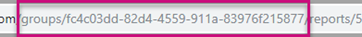
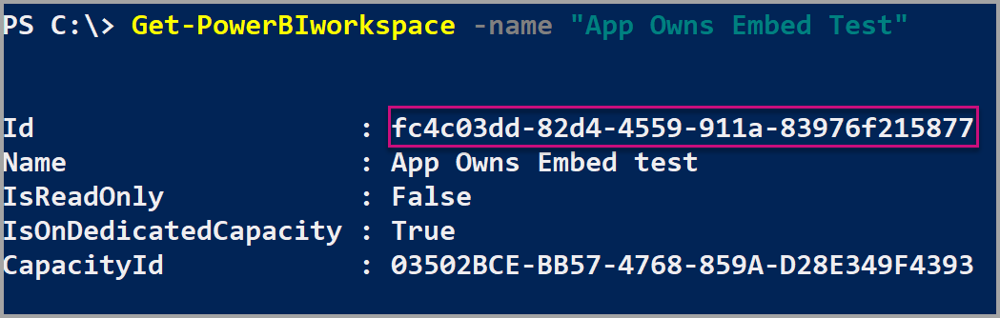
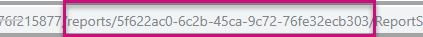

# Tutorial: Embed Power BI content into an application for your customers

**Embedded analytics** and **Power BI Embedded** (the Azure offer) allow you to embed reports, dashboards and tiles, into your application or web app.

In this tutorial you'll learn how to create an *embed for your customers* (also known as *app owns data*) application. Users will not need to sign in to Power BI or have a Power BI license, to use your application. Your application will use one of the following methods to authenticate against Power BI:

* **Master user** account (a Power BI Pro license used for signing in to Power BI)

* [Service principal](embed-service-principal.md)

Use the *embed for your customers* method of embedding Power BI content, if you're an independent software vendor (ISV) or a developer, who wants to create applications for third parties.

## Prerequisites

To get started, you're required to have:

* Your own [Azure Active Directory tenant](create-an-azure-active-directory-tenant.md).

* To authenticate your app against Power BI, you'll need one of the following:

    * [Service principal](embed-service-principal.md) - An Azure Active Directory (Azure AD) [service principal object](azure/active-directory/develop/app-objects-and-service-principals#service-principal-object) that allows Azure AD to authenticate your app.

    * [Power BI Pro account](../../fundamentals/service-self-service-signup-for-power-bi.md) - This will be your **master user** and your app will use it to sign in to your Power BI Pro account.

>[!NOTE]
>To experiment with embedding, you can use one of these methods:
>* Sign up for a [free *Power BI pro* trial](https://powerbi.microsoft.com/pricing/).
>* Use a Premium Per User (PPU) license. You'll not be able to [move to production](embed-sample-for-customers.md#move-to-production).

## Method

To create an *embed for your customers* sample app, follow these steps:

1. Register an Azure AD app.

2. Create a Power BI workspace.

3. Create and publish a Power BI report.

4. Embed your content.

5. Test your application.

>[!TIP]
>You can crete a ready made sample app using the the [embedding setup tool](https://app.powerbi.com/embedsetup). This tool replicates the steps described in this tutorial, and produces a .NET sample app that you can experiment with.

## Register an Azure AD application

Registering your application with Azure AD allows you to:

* Establish an identity for your app

* Specify your app's [Power BI REST permissions](/azure/active-directory/develop/v2-permissions-and-consent)

* Let your app access the [Power BI REST APIs](/rest/api/power-bi/)

To register your application with Azure AD, follow the instructions in [Register your application](register-app.md).

>[!NOTE]
>Before registering your application, you'll need to decide which authentication method to use, *service principal* or *master user*.

## Create a Power BI workspace

Power BI keeps your reports, dashboards and tiles in a workspace. To embed these items, you'll need to create them or upload them into a workspace.

>[!TIP]
>If you already have a workspace, you can skip this stage.

To create a workspace, do the following:

1. Sign in to Power BI.

2. Select **Workspaces**.

3. Select **Create a workspace**.

4. Name your workspace and select **Save**.

## Create and publish a Power BI report

Your next step is to create a report and upload it to your workspace.

* [Create your report](fundamentals/desktop-getting-started.md#build-reports) using Power BI Desktop, and then [publish](fundamentals/desktop-getting-started.md#share-your-work) it to your workspace.

* Upload a sample report to your workspace.

To download a sample report and publish it to your workspace, follow these steps:

1. Open the GitHub [Power BI Desktop samples](https://github.com/microsoft/PowerBI-Developer-Samples) folder.

2. Select the **Code arrow** and then select **Download zip**.

    :::image type="content" source="media/embed-sample-for-customers/download-sample-report.png" alt-text="A screenshot showing the ZIP download option in the Power BI desktop samples GitHub":::

3. Extract the downloaded zip and navigate to the **Samples Reports** folder.

4. Select a report to embed, and [publish](fundamentals/desktop-getting-started.md#share-your-work) it to your workspace.

## Embed your content

tabs...


## Embed content using the sample application

This sample is deliberately kept simple for demonstration purposes. It's up to you or your developers to protect the application secret or the master account credentials.

Follow the steps below to start embedding your content using the sample application.

1. Download [Visual Studio](https://www.visualstudio.com/) (version 2013 or later). Make sure to download the latest [NuGet package](https://www.nuget.org/profiles/powerbi).

2. Download the [App Owns Data sample](https://github.com/Microsoft/PowerBI-Developer-Samples) from GitHub to get started.

    

3. Open the **Web.config** file in the sample application. There are fields you need to fill in to run the application. You can choose **MasterUser** or **ServicePrincipal** for the **AuthenticationType**. Depending on which type of authentication method you choose there are different fields to complete.

    > [!Note]
    > The default **AuthenticationType** in this sample is MasterUser.

    <center>

    | **MasterUser** <br> (Power BI Pro license) | **ServicePrincipal** <br> (app-only token)|
    |---------------|-------------------|
    | [applicationId](#application-id) | [applicationId](#application-id) |
    | [workspaceId](#workspace-id) | [workspaceId](#workspace-id) |
    | [reportId](#report-id) | [reportId](#report-id) |
    | [pbiUsername](#power-bi-username-and-password) |  |
    | [pbiPassword](#power-bi-username-and-password) |  |
    |  | [applicationsecret](#application-secret) |
    |  | [tenant](#tenant) |

   </center>

    

### Application ID

This attribute is needed for both AuthenticationTypes (master account and [service principal](embed-service-principal.md)).

Fill in the **applicationId** information with the **Application ID** from **Azure**. The **applicationId** is used by the application to identify itself to the users from which you're requesting permissions.

To get the **applicationId**, follow these steps:

1. Sign into the [Azure portal](https://portal.azure.com).

2. In the left-hand nav pane, select **All Services**, and select **App Registrations**.

    

3. Select the application that needs the **applicationId**.

    

4. There's an **Application ID** that is listed as a GUID. Use this **Application ID** as the **applicationId** for the application.

    

### Workspace ID

This attribute is needed for both AuthenticationTypes (master account and [service principal](embed-service-principal.md)).

Fill in the **workspaceId** information with the workspace (group) GUID from Power BI. You can get this information either from the URL when signed into the Power BI service or using PowerShell.

URL <br>



PowerShell <br>

```powershell
Get-PowerBIworkspace -name "App Owns Embed Test"
```

   

### Report ID

This attribute is needed for both AuthenticationTypes (master account and [service principal](embed-service-principal.md)).

Fill in the **reportId** information with the report GUID from Power BI. You can get this information either from the URL when signed into the Power BI service or using PowerShell.

URL<br>



PowerShell <br>

```powershell
Get-PowerBIworkspace -name "App Owns Embed Test" | Get-PowerBIReport
```


### Power BI username and password

These attributes are needed only for the master account AuthenticationType.

If you're using [service principal](embed-service-principal.md) to authenticate, then you don't need to fill in the username or password attributes.

* Fill in the **pbiUsername** with the Power BI master account.
* Fill in the **pbiPassword** with the password for the Power BI master account.

### Application secret

This attribute is needed only for the [service principal](embed-service-principal.md) AuthenticationType.

Fill in the **ApplicationSecret** information from the **Keys** section of your **App registrations** section in **Azure**.  This attribute works when using [service principal](embed-service-principal.md).

To get the **ApplicationSecret**, follow these steps:

1. Sign in to the [Azure portal](https://portal.azure.com).

2. In the left-hand nav pane, select **All services** and then select **App registrations**.

    

3. Select the application that needs to use the **ApplicationSecret**.

    

4. Select **Certificates and secrets** under **Manage**.

5. Select **New client secrets**.

6. Enter a name in the **Description** box and select a duration. Then select **Save** to get the **Value** for your application. When you close the **Keys** pane after saving the key value, the value field shows only as hidden. At that point, you aren't able to retrieve the key value. If you lose the key value, create a new one in the Azure portal.

    

### Tenant

This attribute is needed only for the [service principal](embed-service-principal.md) AuthenticationType.

Fill in the **tenant** information with your Azure tenant ID. You can get this information from the [Azure AD admin center](/onedrive/find-your-office-365-tenant-id) when signed into the Power BI service or by using PowerShell.

### Run the application

1. Select **Run** in **Visual Studio**.

    

2. Then select **Embed Report**. Depending on which content you choose to test with - reports, dashboards or tiles - then select that option in the application.

    

3. Now you can view the report in the sample application.

    

## Embed content within your application

Even though the steps to embed your content are done with the [Power BI REST APIs](/rest/api/power-bi/), the example codes described in this article are made with the **.NET SDK**.

Embedding for your customers within your application requires you to get an **access token** for your master account or [service principal](embed-service-principal.md) from **Azure AD**. You're required to get an [Azure AD access token](get-azuread-access-token.md#access-token-for-non-power-bi-users-app-owns-data) for your Power BI application before you make calls to the [Power BI REST APIs](/rest/api/power-bi/).

To create the Power BI Client with your **access token**, you want to create your Power BI client object, which allows you to interact with the [Power BI REST APIs](/rest/api/power-bi/). You create the Power BI client object by wrapping the **AccessToken** with a ***Microsoft.Rest.TokenCredentials*** object.

```csharp
using Microsoft.IdentityModel.Clients.ActiveDirectory;
using Microsoft.Rest;
using Microsoft.PowerBI.Api.V2;

var tokenCredentials = new TokenCredentials(authenticationResult.AccessToken, "Bearer");

// Create a Power BI Client object. it's used to call Power BI APIs.
using (var client = new PowerBIClient(new Uri(ApiUrl), tokenCredentials))
{
    // Your code to embed items.
}
```

### Get the content item you want to embed

You can use the Power BI client object to retrieve a reference to the item you want to embed.

Here is a code sample of how to retrieve the first report from a given workspace.

*A sample of getting a content item whether it's a report, dashboard, or tile that you want to embed is available within the Services\EmbedService.cs file in the [sample application](https://github.com/Microsoft/PowerBI-Developer-Samples).*

```csharp
using Microsoft.PowerBI.Api.V2;
using Microsoft.PowerBI.Api.V2.Models;

// You need to provide the workspaceId where the dashboard resides.
ODataResponseListReport reports = await client.Reports.GetReportsInGroupAsync(workspaceId);

// Get the first report in the group.
Report report = reports.Value.FirstOrDefault();
```

### Create the embed token
Generate an embed token, which can be used from the JavaScript API. There are two types of APIs, the first group contains five APIs, each generates an embed token for a specific item. The second group, which contains only one API, generates a token that can be used to embed multiple items.

**APIs for generating an embed token for a specific item**

The embed token created with these APIs is specific to the item you're embedding. Any time you embed a Power BI item (such as a report, dashboard, or tile) with these APIs, you need to create a new embed token for it.
* [Dashboards GenerateTokenInGroup](/rest/api/power-bi/embedtoken/dashboards_generatetokeningroup)
* [Datasets GenerateTokenInGroup](/rest/api/power-bi/embedtoken/datasets_generatetokeningroup)
* [Reports GenerateTokenForCreateInGroup](/rest/api/power-bi/embedtoken/reports_generatetokenforcreateingroup)
* [Reports GenerateTokenInGroup](/rest/api/power-bi/embedtoken/reports_generatetokeningroup)
* [Tiles GenerateTokenInGroup](/rest/api/power-bi/embedtoken/tiles_generatetokeningroup)

Samples of creating an embed token for a report, dashboard, or tile, are available from the following files in the [sample application](https://github.com/Microsoft/PowerBI-Developer-Samples).
* Services\EmbedService.cs
* Models\EmbedConfig.cs
* Models\TileEmbedConfig.cs

Below is a code example for using the reports GenerateTokenInGroup embed token API.
```csharp
using Microsoft.PowerBI.Api.V2;
using Microsoft.PowerBI.Api.V2.Models;

// Generate Embed Token.
var generateTokenRequestParameters = new GenerateTokenRequest(accessLevel: "view");
EmbedToken tokenResponse = client.Reports.GenerateTokenInGroup(workspaceId, report.Id, generateTokenRequestParameters);

// Generate Embed Configuration.
var embedConfig = new EmbedConfig()
{
    EmbedToken = tokenResponse,
    EmbedUrl = report.EmbedUrl,
    Id = report.Id
};
```

**API for generating an embed token for multiple items**<a id="multiEmbedToken"></a>

The [Generate Token](/rest/api/power-bi/embedtoken/generatetoken) embed API generates a token that can be used for embedding multiple items.

It can also be used for dynamically selecting a dataset while embedding a report. For more information about this use of the API, see [dynamic binding](embed-dynamic-binding.md).


Below is an example of using this API.
 
```csharp
using Microsoft.PowerBI.Api.V2;
using Microsoft.PowerBI.Api.V2.Models;

var reports = new List<GenerateTokenRequestV2Report>()
{ 
    new GenerateTokenRequestV2Report()
    {
        AllowEdit = false,
        Id = report1.Id
    },
    new GenerateTokenRequestV2Report()
    {
        AllowEdit = true,
        Id = report2.Id
    }
};

var datasets= new List<GenerateTokenRequestV2Dataset>()
{
    new GenerateTokenRequestV2Dataset(dataset1.Id),
    new GenerateTokenRequestV2Dataset(dataset2.Id),
    new GenerateTokenRequestV2Dataset(dataset3.Id),
};

var targetWorkspaces = new List<GenerateTokenRequestV2TargetWorkspace>()
{
    new GenerateTokenRequestV2TargetWorkspace(workspace1.Id),
    new GenerateTokenRequestV2TargetWorkspace(workspace2.Id),
};

var request = new GenerateTokenRequestV2()
{
    Datasets = datasets,
    Reports = reports,
    TargetWorkspaces = targetWorkspaces,
};

var token = client.GetClient().EmbedToken.GenerateToken(request);
```

### Load an item using JavaScript

You can use JavaScript to load a report into a div element on your web page.

For a full sample of using the JavaScript API, you can use the [Playground tool](https://microsoft.github.io/PowerBI-JavaScript/demo). The Playground tool is a quick way to play with different types of Power BI Embedded samples. You can also get more Information about the JavaScript API by visiting the [PowerBI-JavaScript wiki](https://github.com/Microsoft/powerbi-javascript/wiki) page.

Here is a sample that uses an **EmbedConfig** model and a **TileEmbedConfig** model along with views for a report.

*A sample of adding a view for a report, dashboard, or tile is available within the Views\Home\EmbedReport.cshtml, Views\Home\EmbedDashboard.cshtml, or Views\Home\Embedtile.cshtml files in the [sample application](#embed-content-using-the-sample-application).*

```javascript
<script src="~/scripts/powerbi.js"></script>
<div id="reportContainer"></div>
<script>
    // Read embed application token from Model
    var accessToken = "@Model.EmbedToken.Token";

    // Read embed URL from Model
    var embedUrl = "@Html.Raw(Model.EmbedUrl)";

    // Read report Id from Model
    var embedReportId = "@Model.Id";

    // Get models. models contains enums that can be used.
    var models = window['powerbi-client'].models;

    // Embed configuration used to describe what and how to embed.
    // This object is used when calling powerbi.embed.
    // This also includes settings and options such as filters.
    // You can find more information at https://github.com/Microsoft/PowerBI-JavaScript/wiki/Embed-Configuration-Details.
    var config = {
        type: 'report',
        tokenType: models.TokenType.Embed,
        accessToken: accessToken,
        embedUrl: embedUrl,
        id: embedReportId,
        permissions: models.Permissions.All,
        settings: {
            filterPaneEnabled: true,
            navContentPaneEnabled: true
        }
    };

    // Get a reference to the embedded report HTML element
    var reportContainer = $('#reportContainer')[0];

    // Embed the report and display it within the div container.
    var report = powerbi.embed(reportContainer, config);
</script>
```

## Move to production

Now that you've completed developing your application, it's time to back your workspace with a capacity.

> [!Important]
> A capacity is required to move to production. All workspaces (the ones containing the reports or dashboards, and the ones containing the datasets) must be assigned to a capacity.

### Create a capacity

By creating a capacity, you can take advantage of having a resource for your customer. There are two types of capacity you can choose from:
* **Power BI Premium** - A tenant-level Office 356 subscription available in two SKU families, *EM* and *P*. When embedding Power BI content, this solution is referred to as *Power BI embedding*. For more information regarding this subscription, see [What is Power BI Premium?](../../admin/service-premium-what-is.md)
* **Azure Power BI Embedded** - You can purchase a capacity from the [Microsoft Azure portal](https://portal.azure.com). This subscription uses the *A* SKUs. For details on how to create a Power BI Embedded capacity, see [Create Power BI Embedded capacity in the Azure portal](azure-pbie-create-capacity.md).
> [!NOTE]
> With A SKUs, you can't access Power BI content with a FREE Power BI license.

The table below describes the resources and limits of each SKU. To determine which capacity best fits your needs, see the [which SKU should I purchase for my scenario](./embedded-faq.md#which-solution-should-i-choose) table.

| Capacity Nodes | Total v-cores | Backend v-cores | RAM (GB) | Frontend v-cores | DirectQuery/Live Connection (per sec) | Model Refresh Parallelism |
| --- | --- | --- | --- | --- | --- | --- |
| EM1/A1 | 1 | 0.5 | 2.5 | 0.5 | 3.75 | 1 |
| EM2/A2 | 2 | 1 | 5 | 1 | 7.5 | 2 |
| EM3/A3 | 4 | 2 | 10 | 2 | 15 | 3 |
| P1/A4 | 8 | 4 | 25 | 4 | 30 | 6 |
| P2/A5 | 16 | 8 | 50 | 8 | 60 | 12 |
| P3/A6 | 32 | 16 | 100 | 16 | 120 | 24 |
| | | | | | | |

### Development testing

For development testing, you can use embed trial tokens with a Pro license. To embed in a production environment, use a capacity.

The number of embed trial tokens a Power BI service principal or master account can generate is limited. Use the [Available Features](/rest/api/power-bi/availablefeatures/getavailablefeatures) API to check the percentage of your current embedded usage. The usage amount is displayed per service principal or master account.

If you run out of embed tokens while testing, you need to purchase a Power BI Embedded or Premium [capacity](embedded-capacity.md). There's no limit to the number of embed tokens you can generate with a capacity.


### Assign a workspace to a capacity

Once you create a capacity, you can assign your workspace to that capacity.

All the workspaces that contain Power BI resources related to the embedded content (including datasets, reports, and dashboards), must be assigned to capacities. For example, if an embedded report and the dataset bound to it reside in different workspaces, both workspaces must be assigned to capacities.

To assign a capacity to a workspace using [service principal](embed-service-principal.md), use the [Power BI REST API](/rest/api/power-bi/capacities/groups_assigntocapacity). When you are using the Power BI REST APIs, make sure to use the [service principal object ID](embed-service-principal.md).

Follow the steps below to assign a capacity to a workspace using a **master account**.

1. Within the **Power BI service**, expand workspaces and select the ellipsis for the workspace you're using for embedding your content. Then select **Edit workspaces**.

    

2. Expand **Advanced**, then enable **Capacity**, then select the capacity you created. Then select **Save**.

    

3. After you select **Save**, you should see a **diamond** next to the workspace name.

    

## Next steps

In this tutorial, you've learned how to embed Power BI content into an application for your customers. You can also try to embed Power BI content for your organization.

> [!div class="nextstepaction"]
>[Embed for your organization](embed-sample-for-your-organization.md)

More questions? [Try asking the Power BI Community](https://community.powerbi.com/)