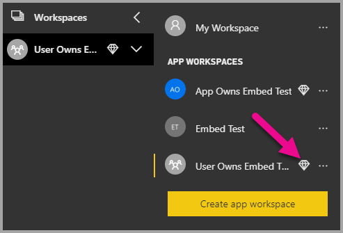

# Tutorial: Embed Power BI content using a sample *embed for your organization* application

[!INCLUDE[embedded analytics overview](../../includes/embed-tutorial-overview.md)]

>[!div class="checklist"]
>* Set up your embedded environment.
>* Configure an *embed for your organization* (also known as *user owns data*) sample application.

To use your application, your users will need to sign in to Power BI.

The embed for your organization solution is usually used by enterprises and big organizations, and is intended for internal users.

[!INCLUDE[embedded analytics specifications](../../includes/embed-tutorial-specs1.md)]

* .NET Framework
* .NET Core
* React TS

[!INCLUDE[embedded analytics specifications and prerequisites](../../includes/embed-tutorial-specs2.md)]

    * One of the following licenses:

        * [Power BI Pro](../../admin/service-admin-purchasing-power-bi-pro.md)

        * [Premium Per User (PPU)](../../admin/service-premium-per-user-faq.md)

[!INCLUDE[move to production note](../../includes/embed-tutorial-production-note.md)]

* **Code dependencies**

    # [.NET Core](#tab/net-core)

    [!INCLUDE[.NET Core dependencies](../../includes/embed-tutorial-core-dependencies.md)]

    # [.NET Framework](#tab/net-framework)

    [!INCLUDE[.NET Framework dependencies](../../includes/embed-tutorial-net-dependencies.md)]

    # [React](#tab/react)

---

## Method

To create an *embed for your organization* sample app, follow these steps:

1. [Register an Azure AD application](#step-1---register-an-azure-ad-application).

2. [Create a Power BI workspace](#step-2---create-a-power-bi-workspace).

3. [Create and publish a Power BI report](#step-3---create-and-publish-a-power-bi-report).

4. [Get the embedding parameter values](#step-4---get-the-embedding-parameter-values).

5. [Embed your content](#step-5---embed-your-content).

## Step 1 - Register an Azure AD application

[!INCLUDE[Register Azure AD app part 1](../../includes/embed-tutorial-register-app1.md)]

[!INCLUDE[Register Azure AD app part 2](../../includes/embed-tutorial-register-app2.md)]

## Step 2 - Create a Power BI workspace

[!INCLUDE[Create a Power BI workspace](../../includes/embed-tutorial-create-workspace.md)]

## Step 3 - Create and publish a Power BI report

[!INCLUDE[Create a Power BI report](../../includes/embed-tutorial-create-report.md)]

## Step 4 - Get the embedding parameter values

To embed your content, you'll need to obtain certain parameter values. Before you embed your content, make sure you have all the values listed below.

* [Client ID](#client-id)
* [Workspace ID](#workspace-id)
* [Report ID](#report-id)
* [Azure AD authority URL](azure-ad-authority-url)

### Client ID

[!INCLUDE[Get the client ID](../../includes/embed-tutorial-client-id.md)]

### Workspace ID

[!INCLUDE[Get the workspace ID](../../includes/embed-tutorial-workspace-id.md)]

### Report ID

[!INCLUDE[Get the report ID](../../includes/embed-tutorial-report-id.md)]

### Azure AD authority URL

The Azure AD authority URL lets you embed Power BI content. You can 

* Embed with your organizational tenant - use the URL `https://login.microsoftonline.com/common/oauth2/authorize`
* Embed with a guest - use the URL `https://login.microsoftonline.com/<report-owner-tenant-id>` and replace `<report-owner-tenant-id> with the tenant ID of the report owner.


   


### AADAuthorityUrl

Fill in the **AADAuthorityUrl** information with the URL that either allows you to embed within your organizational tenant or embed with a guest user.

For embedding with your organizational tenant, use the URL - *https://login.microsoftonline.com/common/oauth2/authorize*.

For embedding with a guest, use the URL - `https://login.microsoftonline.com/report-owner-tenant-id` - where you add the tenant ID of the report owner in replacement of *report-owner-tenant-id*.

### Run the application

1. Select **Run** in **Visual Studio**.

    

2. Then select **Embed Report**. Depending on which content you choose to test with - reports, dashboards or tiles - then select that option in the application.

    

3. Now you can view the report in the sample application.

    

## Embed your content within your application

Even though the steps to embed your content can be done with the [Power BI REST APIs](/rest/api/power-bi/), the example codes described in this article are made with the .NET SDK.

To integrate a report into a web app, you use the Power BI REST API or the Power BI C# SDK. You also use an Azure Active Directory authorization access token to get a report. Then you load the report by using the same access token. The Power BI Rest API provides programmatic access to specific Power BI resources. For more information, see [Power BI REST APIs](/rest/api/power-bi/) and the [Power BI JavaScript API](https://github.com/Microsoft/PowerBI-JavaScript).

### Get an access token from Azure AD

Within your application, you must get an access token from Azure AD before you can make calls to the Power BI REST API. For more information, see [Authenticate users and get an Azure AD access token for your Power BI app](get-azuread-access-token.md).

### Get a report

To get a Power BI or paginated report, you use the [Get Reports](/rest/api/power-bi/reports/getreports) operation, which gets a list of Power BI and paginated reports. From the list of reports, you can get a report ID.

### Get reports by using an access token

The [Get Reports](/rest/api/power-bi/reports/getreports) operation returns a list of reports. You can get a single report from the list of reports.

To make the REST API call, you must include an *Authorization* header in the format of *Bearer {access token}*.

#### Get reports with the REST API

The following code sample shows you how to retrieve reports with the REST API:

> [!Note]
> A sample of getting a content item that you want to embed is available in the Default.aspx.cs file in the [sample application](https://github.com/Microsoft/PowerBI-Developer-Samples). Examples are a report, dashboard, or tile.

```csharp
using Newtonsoft.Json;

//Get a Report. In this sample, you get the first Report.
protected void GetReport(int index)
{
    //Configure Reports request
    System.Net.WebRequest request = System.Net.WebRequest.Create(
        String.Format("{0}/Reports",
        baseUri)) as System.Net.HttpWebRequest;

    request.Method = "GET";
    request.ContentLength = 0;
    request.Headers.Add("Authorization", String.Format("Bearer {0}", accessToken.Value));

    //Get Reports response from request.GetResponse()
    using (var response = request.GetResponse() as System.Net.HttpWebResponse)
    {
        //Get reader from response stream
        using (var reader = new System.IO.StreamReader(response.GetResponseStream()))
        {
            //Deserialize JSON string
            PBIReports Reports = JsonConvert.DeserializeObject<PBIReports>(reader.ReadToEnd());

            //Sample assumes at least one Report.
            //You could write an app that lists all Reports
            if (Reports.value.Length > 0)
            {
                var report = Reports.value[index];

                txtEmbedUrl.Text = report.embedUrl;
                txtReportId.Text = report.id;
                txtReportName.Text = report.name;
            }
        }
    }
}

//Power BI Reports used to deserialize the Get Reports response.
public class PBIReports
{
    public PBIReport[] value { get; set; }
}
public class PBIReport
{
    public string id { get; set; }
    public string reportType { get; set }
    public string name { get; set; }
    public string webUrl { get; set; }
    public string embedUrl { get; set; }
}
```

#### Get reports by using the .NET SDK

You can use the .NET SDK to retrieve a list of reports instead of calling the REST API directly. The following code sample shows you how to list reports:

```csharp
using Microsoft.IdentityModel.Clients.ActiveDirectory;
using Microsoft.PowerBI.Api.V2;
using Microsoft.PowerBI.Api.V2.Models;

var tokenCredentials = new TokenCredentials(<ACCESS TOKEN>, "Bearer");

// Create a Power BI Client object. It is used to call Power BI APIs.
using (var client = new PowerBIClient(new Uri(ApiUrl), tokenCredentials))
{
    // Get the first report all reports in that workspace
    ODataResponseListReport reports = client.Reports.GetReports();

    Report report = reports.Value.FirstOrDefault();

    var embedUrl = report.EmbedUrl;
}
```

### Load a report by using JavaScript

You can use JavaScript to load a report into a div element on your web page. The following code sample shows you how to retrieve a report from a given workspace:

> [!NOTE]  
> A sample of loading a content item that you want to embed is available in the **Default.aspx** file in the [sample application](https://github.com/Microsoft/PowerBI-Developer-Samples).

```javascript
<!-- Embed Report-->
<div> 
    <asp:Panel ID="PanelEmbed" runat="server" Visible="true">
        <div>
            <div><b class="step">Step 3</b>: Embed a report</div>

            <div>Enter an embed url for a report from Step 2 (starts with https://):</div>
            <input type="text" id="tb_EmbedURL" style="width: 1024px;" />
            <br />
            <input type="button" id="bEmbedReportAction" value="Embed Report" />
        </div>

        <div id="reportContainer"></div>
    </asp:Panel>
</div>
```

#### Site.master

```javascript
window.onload = function () {
    // client side click to embed a selected report.
    var el = document.getElementById("bEmbedReportAction");
    if (el.addEventListener) {
        el.addEventListener("click", updateEmbedReport, false);
    } else {
        el.attachEvent('onclick', updateEmbedReport);
    }

    // handle server side post backs, optimize for reload scenarios
    // show embedded report if all fields were filled in.
    var accessTokenElement = document.getElementById('MainContent_accessTokenTextbox');
    if (accessTokenElement !== null) {
        var accessToken = accessTokenElement.value;
        if (accessToken !== "")
            updateEmbedReport();
    }
};

// update embed report
function updateEmbedReport() {

    // check if the embed url was selected
    var embedUrl = document.getElementById('tb_EmbedURL').value;
    if (embedUrl === "")
        return;

    // get the access token.
    accessToken = document.getElementById('MainContent_accessTokenTextbox').value;

    // Embed configuration used to describe the what and how to embed.
    // This object is used when calling powerbi.embed.
    // You can find more information at https://github.com/Microsoft/PowerBI-JavaScript/wiki/Embed-Configuration-Details.
    var config = {
        type: 'report',
        accessToken: accessToken,
        embedUrl: embedUrl
    };

    // Grab the reference to the div HTML element that will host the report.
    var reportContainer = document.getElementById('reportContainer');

    // Embed the report and display it within the div container.
    var report = powerbi.embed(reportContainer, config);

    // report.on will add an event handler which prints to Log window.
    report.on("error", function (event) {
        var logView = document.getElementById('logView');
        logView.innerHTML = logView.innerHTML + "Error<br/>";
        logView.innerHTML = logView.innerHTML + JSON.stringify(event.detail, null, "  ") + "<br/>";
        logView.innerHTML = logView.innerHTML + "---------<br/>";
    }
  );
}
```

## Using a Power BI Premium capacity

Now that you've completed developing your application, it's time to back your workspace with a capacity.

### Create a capacity

By creating a capacity, you can take advantage of having a resource for the content in your workspace. For paginated reports you must back your workspace with at least a P1 capacity. You can create a capacity by using [Power BI Premium](../../admin/service-premium-what-is.md).

The following table lists the Power BI Premium SKUs available in [Microsoft 365](../../admin/service-admin-premium-purchase.md):

| Capacity node | Total vCores<br/>(back end + front end) | Back-end vCores | Front-end vCores | DirectQuery/live connection limits |
| --- | --- | --- | --- | --- | --- |
| EM1 |1 vCore |0.5 vCore, 3 GB of RAM |0.5 vCore |3.75 per second |
| EM2 |2 vCores |1 vCore, 5 GB of RAM |1 vCores |7.5 per second |
| EM3 |4 vCores |2 vCores, 10 GB of RAM |2 vCores |15 per second |
| P1 |8 vCores |4 vCores, 25 GB of RAM |4 vCores |30 per second |
| P2 |16 vCores |8 vCores, 50 GB of RAM |8 vCores |60 per second |
| P3 |32 vCores |16 vCores, 100 GB of RAM |16 vCores |120 per second |
| P4 |64 vCores |32 vCores, 200 GB of RAM |32 vCores |240 per second |
| P5 |128 vCores |64 vCores, 400 GB of RAM |64 vCores |480 per second |

> [!NOTE]
> - When you're trying to embed with Microsoft Office apps, you can use EM SKUs to access content with a free Power BI license. 
But you can't access content with a free Power BI license when you're using Powerbi.com or Power BI mobile.
> - When you're trying to embed with Microsoft Office apps by using Powerbi.com or Power BI mobile, you can access content with a free Power BI license.

### Assign a workspace to a capacity

After you create a capacity, you can assign your workspace to that capacity. To complete this process, follow these steps:

1. Within the Power BI service, expand workspaces and select the ellipsis for the workspace you're using for embedding your content. Then select **Edit workspaces**.

    

2. Expand **Advanced** and enable **Capacity**. Select the capacity you created. Then select **Save**.

    

3. After you select **Save**, you should see a diamond next to the workspace name.

    

## Admin settings

Global admins or Power BI service administrators can turn the ability to use the REST APIs on or off for a tenant. Power BI admins can set this setting for the entire organization or for individual security groups. It's enabled for the entire organization by default. You can make these changes in the [Power BI admin portal](../../admin/service-admin-portal.md).

## Next steps

In this tutorial, you learned how to embed Power BI content into an application by using your Power BI organization account. You can now try to embed Power BI content into an application by using apps. You can also try to embed Power BI content for your customers (not supported yet for embedding paginated reports):

> [!div class="nextstepaction"]
> [Embed from apps](embed-from-apps.md)

> [!div class="nextstepaction"]
>[Embed for your customers](embed-sample-for-customers.md)

If you have more questions, [try asking the Power BI Community](https://community.powerbi.com/).