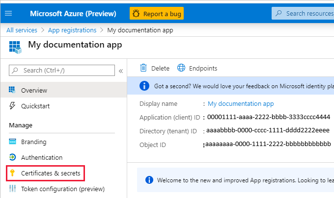

# Embed Power BI content with service principal and a certificate

[!INCLUDE[service principal overview](../../includes/service-principal-overview.md)]

## What is certificate-based authentication?

Certificate-based authentication enables you to be authenticated by Azure Active Directory (Azure AD) with a client certificate on a Windows, Android or iOS device, or in an [Azure Key Vault](https://docs.microsoft.com/azure/key-vault/basic-concepts).

Certificate-based authentication offers a strong security solution. This is because a signed certificate makes it possible to connect only to an approved server.

The secure connection is achieved by authenticating both the client and the server against a trusted Certification Authority (CA), during the TLS handshake.

Using this method of authentication allows managing certificates from a central place, using the CA, for rotation or revocation.

You can learn more about certificates in Azure AD in the [Client credential flows](https://github.com/AzureAD/microsoft-authentication-library-for-dotnet/wiki/Client-credential-flows) GitHub page.

## Certificate types

In this tutorial you'll learn how to create and download a .cer certificate using Azure AD. When authenticating using service principal, you can either use a .cer certificate, or a .pfx file. It's important to understand the difference between them.

* **.cer certificate** - A [X.509](https://wikipedia.org/wiki/X.509) certificate that contains only the public key. It's used to authenticate during the secure handshake between an HTTP client and a server.

* **. pfx certificate** - A file that includes both private and public key. You can use it to authenticate against a trusted sub service.

## Method

To use service principal and a certificate with embedded analytics, follow these steps:

1. Create a certificate.

2. Set up certificate authentication.

3. Authenticate using the certificate.

## Step 1 - Creating a certificate

You can procure a certificate from a trusted *Certificate Authority*, or generate a certificate yourself.

This section describes creating a certificate using [Azure Key Vault](https://docs.microsoft.com/azure/key-vault/create-certificate).

1. Log into [Microsoft Azure](https://ms.portal.azure.com/#allservices).

2. Search for **Key Vaults** and click the **Key Vaults** link.

    

3. Click the key vault you want to add a certificate to.

    

4. Click **Certificates**.

    

5. Click **Generate/Import**.

    

6. Configure the **Create a certificate** fields as follows:

    * **Method of Certificate Creation** - General

    * **Certificate Name** - Enter a name for your certificate

    * **Type of Certificate Authority (CA)** - Self-signed certificate

    * **Subject** - An [X.500](https://wikipedia.org/wiki/X.500) distinguished name

    * **DNS Names** - 0 DNS names

    * **Validity Period (in months)** - Enter the certificate's validity duration

    * **Content Type** - PKCS #12

    * **Lifetime Action Type** - Automatically renew at a given percentage lifetime

    * **Percentage Lifetime** - 80

    * **Advanced Policy Configuration** - Not configured

7. Click **Create**. The newly created certificate is disabled by default. It can take up to five minutes to become enabled.

8. Select the certificate you created.

9. Click **Download in CER format**.

    

## Step 2 - Create an Azure AD Application

[!INCLUDE[service principal create app](../../includes/service-principal-create-app.md)]

## Step 3 - Set up certificate authentication

1. In your Azure AD application, click the **Certificates & secrets** tab.

     

2. Click **Upload certificate** and upload the certificate you created and downloaded in the [first step](#step-1---creating-a-certificate) of this tutorial.

## Step 4 - Get the certificate from Azure Key Vault

Use Managed Service Identity (MSI) to get the certificate from Azure Key Vault. To do this, follow the instructions in [Use Key Vault from App Service with Managed Service Identity](https://docs.microsoft.com/samples/azure-samples/app-service-msi-keyvault-dotnet/keyvault-msi-appservice-sample/).

Refer to the code example for reading the certificate from Azure Key Vault.

```csharp
private X509Certificate2 ReadCertificateFromVault(string certName)
{
    var serviceTokenProvider = new AzureServiceTokenProvider();
    var keyVaultClient = new KeyVaultClient(new KeyVaultClient.AuthenticationCallback(serviceTokenProvider.KeyVaultTokenCallback));
    CertificateBundle certificate = null;
    SecretBundle secret = null;
    try
    {
        certificate = keyVaultClient.GetCertificateAsync($"https://{KeyVaultName}.vault.azure.net/", certName).Result;
        secret = keyVaultClient.GetSecretAsync(certificate.SecretIdentifier.Identifier).Result;
    }
    catch (Exception)
    {
        return null;
    }

    return new X509Certificate2(Convert.FromBase64String(secret.Value));
}
```

## Step 5 - Authenticate using service principal and a certificate

You can authenticate your app using service principal and a certificate, with a certificate thumbprint or with Azure Key Vault details. Depending on your needs, insert one of the following to the *service principal* section in the *Web.config* file.

* Certificate thumbprint - `certificateThumbprint`

* Azure Key Vault details - `keyVaultName` and `certificateName`

```aspx-csharp
<ServicePrincipal>
    <add key="tenant" value="" />

    <!-- Note: Do NOT leave your app secret on code. Save it in secure place like Key Vault. -->
    <add key="applicationSecret" value="" />
    
    <!--OR-->
    <!--Loads certificate from a Windows client on which the app is running-->
    <add key="certificateThumbprint" value="" />
    
    <!--OR-->
    <!--Loads certificate from a Azure Key Vault using Managed Service Identity-->
    <add key="keyVaultName" value="" />
    <add key="certificateName" value="" />
</ServicePrincipal>

```

## Configure Visual Studio to use your certificate

When creating your embedded solution, it may be useful to configure Visual Studio to use your Azure Key Vault certificate. [Managed Service Identity](https://docs.microsoft.com/azure/active-directory/managed-identities-azure-resources/overview) is a feature that enables you to manage your Azure AD identity. Once configured, it will let Visual Studio authenticate against your Azure Key Vault.

1. Open your project in Visual Studio.

2. Click **Tools** > **Options**.

     

3. Search for **Account Selection** and click **Account Selection**.

    

4. Add the account that has access to your Azure Key Vault.

[!INCLUDE[service principal limitations](../../includes/service-principal-limitations.md)]

## Next steps

> [!div class="nextstepaction"]
>[Register an app](register-app.md)

> [!div class="nextstepaction"]
>[Power BI Embedded for your customers](embed-sample-for-customers.md)

> [!div class="nextstepaction"]
>[Application and service principal objects in Azure Active Directory](https://docs.microsoft.com/azure/active-directory/develop/app-objects-and-service-principals)

> [!div class="nextstepaction"]
>[Row-level security using on-premises data gateway with service principal](embedded-row-level-security.md#on-premises-data-gateway-with-service-principal)

> [!div class="nextstepaction"]
>[Embed Power BI content with service principal and an application secret](embed-service-principal.md)