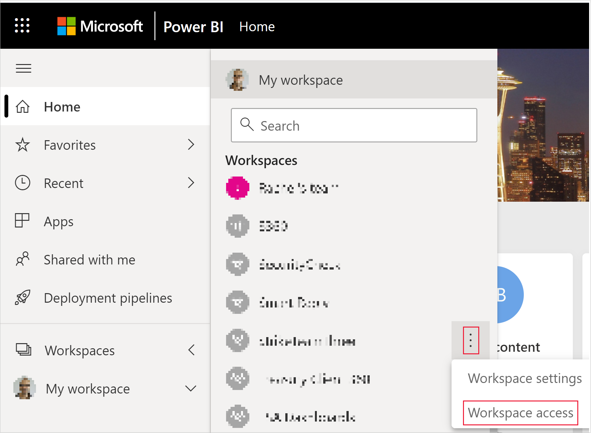
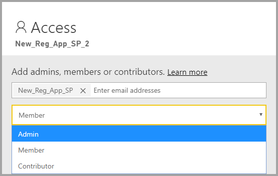

# Embed Power BI content with service principal and an application secret

[!INCLUDE[service principal overview](../../includes/service-principal-overview.md)]

This article describes service principal authentication using *Application ID* and *Application secret*.

>[!NOTE]
>We recommend that you secure your backend services using certificates, rather than secret keys.
>* [Learn more about getting access tokens from Azure AD using secret keys or certificates](/azure/architecture/multitenant-identity/client-assertion).
>* [Embed Power BI content with service principal and a certificate](embed-service-principal-certificate.md).

## Method

To use service principal and an application ID with embedded analytics, follow these steps:

1. Create an [Azure AD app](/azure/active-directory/manage-apps/what-is-application-management).

    1. Create the Azure AD app's secret.
    
    2. Get the app's *Application ID* and *Application secret*.

    >[!NOTE]
    >These steps are described in **step 1**. For more information about creating an Azure AD app, see the [create an Azure AD app](/azure/active-directory/develop/howto-create-service-principal-portal) article.

2. Create an Azure AD security group.

3. Enable the Power BI service admin settings.

4. Add the service principal to your workspace.

5. Embed your content.

> [!IMPORTANT]
> Once you enable service principal to be used with Power BI, the application's AD permissions don't take effect anymore. The application's permissions are then managed through the Power BI admin portal.

## Step 1 - Create an Azure AD app

Create an Azure AD app using one of these methods:
* Create the app in the [Microsoft Azure portal](https://portal.azure.com/#allservices)
* Create the app using [PowerShell](/powershell/azure/create-azure-service-principal-azureps?view=azps-3.6.1).

### Creating an Azure AD app in the Microsoft Azure portal

[!INCLUDE[service create app](../../includes/service-principal-create-app.md)]

7. Click the **Certificates & secrets** tab.

     


8. Click **New client secret**

    

9. In the *Add a client secret* window, enter a description, specify when you want the client secret to expire, and click **Add**.

10. Copy and save the *Client secret* value.

    

    >[!NOTE]
    >After you leave this window, the client secret value will be hidden, and you'll not be able to view or copy it again.

### Creating an Azure AD app using PowerShell

This section includes a sample script to create a new Azure AD app using [PowerShell](/powershell/azure/create-azure-service-principal-azureps?view=azps-1.1.0).

```powershell
# The app ID - $app.appid
# The service principal object ID - $sp.objectId
# The app key - $key.value

# Sign in as a user that's allowed to create an app
Connect-AzureAD

# Create a new Azure AD web application
$app = New-AzureADApplication -DisplayName "testApp1" -Homepage "https://localhost:44322" -ReplyUrls "https://localhost:44322"

# Creates a service principal
$sp = New-AzureADServicePrincipal -AppId $app.AppId

# Get the service principal key
$key = New-AzureADServicePrincipalPasswordCredential -ObjectId $sp.ObjectId
```

## Step 2 - Create an Azure AD security group

Your service principal doesn't have access to any of your Power BI content and APIs. To give the service principal access, create a security group in Azure AD, and add the service principal you created to that security group.

There are two ways to create an Azure AD security group:
* Manually (in Azure)
* Using PowerShell

### Create a security group manually

To create an Azure security group manually, follow the instructions in the [Create a basic group and add members using Azure Active Directory](/azure/active-directory/fundamentals/active-directory-groups-create-azure-portal) article. 

### Create a security group using PowerShell

Below is a sample script for creating a new security group, and adding an app to that security group.

>[!NOTE]
>If you want to enable service principal access for the entire organization, skip this step.

```powershell
# Required to sign in as admin
Connect-AzureAD

# Create an Azure AD security group
$group = New-AzureADGroup -DisplayName <Group display name> -SecurityEnabled $true -MailEnabled $false -MailNickName notSet

# Add the service principal to the group
Add-AzureADGroupMember -ObjectId $($group.ObjectId) -RefObjectId $($sp.ObjectId)
```

## Step 3 - Enable the Power BI service admin settings

For an Azure AD app to be able to access the Power BI content and APIs, a Power BI admin needs to enable service principal access in the Power BI admin portal.

Add the security group you created in Azure AD, to the specific security group section in the **Developer settings**.

>[!IMPORTANT]
>Service principals have access to any tenant settings they're enabled for. Depending on your admin settings, this includes specific security groups or the entire organization.
>
>To restrict service principal access to specific tenant settings, allow access only to specific security groups. Alternatively, you can create a dedicated security group for service principals, and exclude it from the desired tenant settings.


## Step 4 - Add the service principal to your workspace

To enable your Azure AD app access artifacts such as reports, dashboards and datasets in the Power BI service, add the service principal entity as a member or admin to your workspace.

>[!NOTE]
>This section provides UI instructions. You can also add a service principal to a workspace using the [Groups - add group user API](/rest/api/power-bi/groups/addgroupuser).

1. Scroll to the workspace you want to enable access for, and from the **More** menu, select **Workspace access**.

    

2. Add the service principal as an **Admin** or **Member** to the workspace.

    

## Step 5 - Embed your content

You can embed your content within a sample application, or within your own application.

* [Embed content using the sample application](embed-sample-for-customers.md#embed-content-using-the-sample-application)
* [Embed content within your application](embed-sample-for-customers.md#embed-content-within-your-application)

Once your content is embedded, you're ready to [move to production](embed-sample-for-customers.md#move-to-production).

[!INCLUDE[service principal limitations](../../includes/service-principal-limitations.md)]

## Next steps

>[!div class="nextstepaction"]
>[Register an app](register-app.md)

> [!div class="nextstepaction"]
>[Power BI Embedded for your customers](embed-sample-for-customers.md)

>[!div class="nextstepaction"]
>[Application and service principal objects in Azure Active Directory](/azure/active-directory/develop/app-objects-and-service-principals)

>[!div class="nextstepaction"]
>[Row-level security using on-premises data gateway with service principal](embedded-row-level-security.md#on-premises-data-gateway-with-service-principal)

>[!div class="nextstepaction"]
>[Embed Power BI content with service principal and a certificate](embed-service-principal-certificate.md)