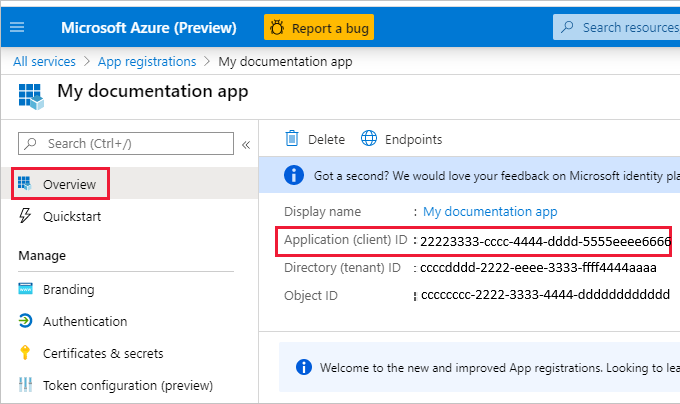

# Embed Power BI content with service principal and an application secret

Service principal is an authentication method that can be used to let an Azure AD application access Power BI service content and APIs.

When you create an Azure Active Directory (Azure AD) app, a [service principal object](/azure/active-directory/develop/app-objects-and-service-principals#service-principal-object) is created. The service principal object, also known simply as *service principal*, allows Azure AD to authenticate your app. Once authenticated, the app can access Azure AD tenant resources.

To authenticate, the service principal uses the Azure AD app's *Application ID*, and one of the following:

* Certificate
* Application secret

This article describes service principal authentication using *Application ID* and *Application secret*.

>[!NOTE]
>Azure AD recommends that you secure your backend services using certificates, rather than secret keys.
>* [Learn more about getting access tokens from Azure AD using secret keys or certificates](/azure/architecture/multitenant-identity/client-assertion).
>* To secure your solution using a certificate, complete the instructions in this article and then follow the steps described in [Embed Power BI content with service principal and a certificate](embed-service-principal-certificate.md).

## Method

To use service principal and an application ID  embedded analytics, follow these steps:

1. Create an [Azure AD app](/azure/active-directory/manage-apps/what-is-application-management).

    1. Create the Azure AD app's secret.
    
    2. Get the app's *Application ID* and *Application secret*.

    >[!NOTE]
    >These steps are described in **step 1**. For more information about creating an Azure AD app, see the [create an Azure AD app](/azure/active-directory/develop/howto-create-service-principal-portal) article.

2. Create an Azure AD security group.

3. Enable the Power BI service admin settings.

4. Add the service principal to your workspace.

5. Embed your content.

> [!IMPORTANT]
> Once you enable service principal to be used with Power BI, the application's AD permissions don't take effect anymore. The application's permissions are then managed through the Power BI admin portal.

## Step 1 - Create an Azure AD app

Create an Azure AD app using one of these methods:

* [Create the app in the Microsoft Azure portal](embed-service-principal.md#creating-an-azure-ad-app-in-the-microsoft-azure-portal)

* [Create the app using PowerShell](embed-service-principal.md#creating-an-azure-ad-app-using-powershell)

### Creating an Azure AD app in the Microsoft Azure portal

1. Log into [Microsoft Azure](https://ms.portal.azure.com/#allservices).

2. Search for **App registrations** and click the **App registrations** link.

    

3. Click **New registration**.

    

4. Fill in the required information:
    * **Name** - Enter a name for your application
    * **Supported account types** - Select supported account types
    * (Optional) **Redirect URI** - Enter a URI if needed

5. Click **Register**.

6. After registering, the *Application ID* is available from the **Overview** tab. Copy and save the *Application ID* for later use.

    

7. Click the **Certificates & secrets** tab.

     

8. Click **New client secret**

    

9. In the *Add a client secret* window, enter a description, specify when you want the client secret to expire, and click **Add**.

10. Copy and save the *Client secret* value.

    

    >[!NOTE]
    >After you leave this window, the client secret value will be hidden, and you'll not be able to view or copy it again.

### Creating an Azure AD app using PowerShell

This section includes a sample script to create a new Azure AD app using [PowerShell](/powershell/azure/create-azure-service-principal-azureps).

```powershell
# The app ID - $app.appid
# The service principal object ID - $sp.objectId
# The app key - $key.value

# Sign in as a user that's allowed to create an app
Connect-AzureAD

# Create a new Azure AD web application
$app = New-AzureADApplication -DisplayName "testApp1" -Homepage "https://localhost:44322" -ReplyUrls "https://localhost:44322"

# Creates a service principal
$sp = New-AzureADServicePrincipal -AppId $app.AppId

# Get the service principal key
$key = New-AzureADServicePrincipalPasswordCredential -ObjectId $sp.ObjectId
```

## Step 2 - Create an Azure AD security group

Your service principal doesn't have access to any of your Power BI content and APIs. To give the service principal access, create a security group in Azure AD, and add the service principal you created to that security group.

There are two ways to create an Azure AD security group:
* [Manually (in Azure)](embed-service-principal.md#create-a-security-group-manually)
* [Using PowerShell](embed-service-principal.md#create-a-security-group-using-powershell)

### Create a security group manually

To create an Azure security group manually, follow the instructions in the [Create a basic group and add members using Azure Active Directory](/azure/active-directory/fundamentals/active-directory-groups-create-azure-portal) article. 

### Create a security group using PowerShell

Below is a sample script for creating a new security group, and adding an app to that security group.

>[!NOTE]
>If you want to enable service principal access for the entire organization, skip this step.

```powershell
# Required to sign in as admin
Connect-AzureAD

# Create an Azure AD security group
$group = New-AzureADGroup -DisplayName <Group display name> -SecurityEnabled $true -MailEnabled $false -MailNickName notSet

# Add the service principal to the group
Add-AzureADGroupMember -ObjectId $($group.ObjectId) -RefObjectId $($sp.ObjectId)
```

## Step 3 - Enable the Power BI service admin settings

For an Azure AD app to be able to access the Power BI content and APIs, a Power BI admin needs to enable service principal access in the Power BI admin portal.

Add the security group you created in Azure AD, to the specific security group section in the **Developer settings**.

>[!IMPORTANT]
>Service principals have access to any tenant settings they're enabled for. Depending on your admin settings, this includes specific security groups or the entire organization.
>
>To restrict service principal access to specific tenant settings, allow access only to specific security groups. Alternatively, you can create a dedicated security group for service principals, and exclude it from the desired tenant settings.

>[!div class="mx-imgBorder"]
>:::image type="content" source="media/embed-service-principal/admin-portal.png" alt-text="Screenshot showing the developer settings in the admin options in Power B I service.":::

## Step 4 - Add the service principal to your workspace

To enable your Azure AD app access artifacts such as reports, dashboards and datasets in the Power BI service, add the service principal entity, or the security group that includes your service principal, as a member or admin to your workspace.

>[!NOTE]
>This section provides UI instructions. You can also add a service principal or a security group to a workspace, using the [Groups - add group user API](/rest/api/power-bi/groups/addgroupuser).

1. Scroll to the workspace you want to enable access for, and from the **More** menu, select **Workspace access**.

    :::image type="content" source="media/embed-service-principal/workspace-access.png" alt-text="Screenshot showing the workspace access button in the more menu of a Power BI workspace.":::

2. In the **Access** pane, text box, add one of the following:

    * Your **service principal**. The name of your service principal is the *Display name* of your Azure AD app, as it appears in your Azure AD app's overview tab.

    * The **security group** that includes your service principal.

3. From the drop-down menu, select **Member** or **Admin**.

4. Select **Add**.

### Add a service principal as a workspace member using PowerShell

This section includes a sample script to add a service principal as a workspace member using [PowerShell](/powershell/azure/create-azure-service-principal-azureps).

```powershell
Login-PowerBI

# Service Principal Object ID for the created Service Principal
$SPObjectId = 'XXXXXXXX-XXXX-XXXX-XXXX-XXXXXXXXXXXX'

$pbiWorkspace = Get-PowerBIWorkspace -Name "YourWorkspaceName"

Add-PowerBIWorkspaceUser -Id $pbiWorkspace.Id -AccessRight Member -PrincipalType App -Identifier $SPObjectId 

```

### Add a security group as a workspace member using PowerShell

This section includes a sample script to add a security group as a workspace member using [PowerShell](/powershell/azure/create-azure-service-principal-azureps).

```powershell
Login-PowerBI

# Security Group Object ID for the created Security Group
$SGObjectId = 'XXXXXXXX-XXXX-XXXX-XXXX-XXXXXXXXXXXX'

$pbiWorkspace = Get-PowerBIWorkspace -Name "YourWorkspaceName"

Add-PowerBIWorkspaceUser -Id $pbiWorkspace.Id -AccessRight Member -PrincipalType Group -Identifier $SGObjectId 

```

## Step 5 - Embed your content

You can [embed your content within a sample application](embed-sample-for-customers.md), or within your own application.

Once your content is embedded, you're ready to [move to production](move-to-production.md).

>[!NOTE]
>To secure your content using a certificate, follow the steps described in [Embed Power BI content with service principal and a certificate](embed-service-principal-certificate.md).

## Considerations and limitations

* Service principal only works with [new workspaces](../../collaborate-share/service-create-the-new-workspaces.md).
* **My Workspace** isn't supported when using service principal.
* A capacity is required when moving to production.
* You can't sign into the Power BI portal using service principal.
* Power BI admin rights are required to enable service principal in developer settings within the Power BI admin portal.
* [Embed for your organization](embed-sample-for-your-organization.md) applications can't use service principal.
* [Dataflows](../../transform-model/dataflows/dataflows-introduction-self-service.md) management is not supported.
* Service principal only supports some read-only admin APIs. To enable service principal support for read-only admin APIs, you have to enable the Power BI service admin settings in your tenant. For more information, see [Enable service principal authentication for read-only admin APIs](../../admin/read-only-apis-service-principal-authentication.md).
* When using service principal with an [Azure Analysis Services](/azure/analysis-services/analysis-services-overview) data source, the service principal itself must have an Azure Analysis Services instance permissions. Using a security group that contains the service principal for this purpose, doesn't work.

## Next steps

>[!div class="nextstepaction"]
>[Register an app](register-app.md)

> [!div class="nextstepaction"]
>[Power BI Embedded for your customers](embed-sample-for-customers.md)

>[!div class="nextstepaction"]
>[Embed using a service principal and a certificate](embed-service-principal-certificate.md)

>[!div class="nextstepaction"]
>[Application and service principal objects in Azure Active Directory](/azure/active-directory/develop/app-objects-and-service-principals)

>[!div class="nextstepaction"]
>[Row-level security using on-premises data gateway with service principal](embedded-row-level-security.md#on-premises-data-gateway-with-service-principal)