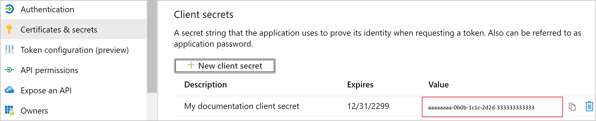

# Embed Power BI content with service principal and an application secret

Service principal is an authentication method that can be used to let an Azure AD application access Power BI service content and APIs.

When you create an Azure Active Directory (Azure AD) app, a [service principal object](/azure/active-directory/develop/app-objects-and-service-principals#service-principal-object) is created. The service principal object, also known simply as *service principal*, allows Azure AD to authenticate your app. Once authenticated, the app can access Azure AD tenant resources.

To authenticate, the service principal uses the Azure AD app's *Application ID*, and one of the following:

* Application secret
* Certificate

>[!NOTE]
>We recommend that you secure your backend services using certificates, rather than secret keys. [Learn more about getting access tokens from Azure AD using secret keys or certificates](/azure/architecture/multitenant-identity/client-assertion).

## Method

# [Certificate](#tab/certificate)

To use service principal and a certificate with embedded analytics, follow these steps:

1. Create an Azure AD Application.

2. Create an Azure AD security group.

3. Enable the Power BI service admin settings.

4. Add the service principal to your workspace.

5. Create a certificate.

6. Set up certificate authentication.

7. Get the certificate from Azure Key Vault.

8. Authenticate using service principal and a certificate.

# [Application secret](#tab/secret)

To use service principal and an application ID  embedded analytics, follow these steps:

1. Create an [Azure AD app](/azure/active-directory/manage-apps/what-is-application-management).

    1. Create the Azure AD app's secret.
    
    2. Get the app's *Application ID* and *Application secret*.

    >[!NOTE]
    >These steps are described in **step 1**. For more information about creating an Azure AD app, see the [create an Azure AD app](/azure/active-directory/develop/howto-create-service-principal-portal) article.

2. Create an Azure AD security group.

3. Enable the Power BI service admin settings.

4. Add the service principal to your workspace.

5. Embed your content.

> [!IMPORTANT]
> Once you enable service principal to be used with Power BI, the application's AD permissions don't take effect anymore. The application's permissions are then managed through the Power BI admin portal.

---

## Step 1 - Create an Azure AD app

# [Certificate](#tab/certificate)

[!INCLUDE[service principal create app](../../includes/service-principal-create-app.md)]

# [Application secret](#tab/secret)

Create an Azure AD app using one of these methods:

* Create the app in the [Microsoft Azure portal](https://portal.azure.com/#allservices)

* Create the app using [PowerShell](/powershell/azure/create-azure-service-principal-azureps).

### Creating an Azure AD app in the Microsoft Azure portal

[!INCLUDE[service create app](../../includes/service-principal-create-app.md)]

7. Click the **Certificates & secrets** tab.

     


8. Click **New client secret**

    

9. In the *Add a client secret* window, enter a description, specify when you want the client secret to expire, and click **Add**.

10. Copy and save the *Client secret* value.

    

    >[!NOTE]
    >After you leave this window, the client secret value will be hidden, and you'll not be able to view or copy it again.

### Creating an Azure AD app using PowerShell

This section includes a sample script to create a new Azure AD app using [PowerShell](/powershell/azure/create-azure-service-principal-azureps).

```powershell
# The app ID - $app.appid
# The service principal object ID - $sp.objectId
# The app key - $key.value

# Sign in as a user that's allowed to create an app
Connect-AzureAD

# Create a new Azure AD web application
$app = New-AzureADApplication -DisplayName "testApp1" -Homepage "https://localhost:44322" -ReplyUrls "https://localhost:44322"

# Creates a service principal
$sp = New-AzureADServicePrincipal -AppId $app.AppId

# Get the service principal key
$key = New-AzureADServicePrincipalPasswordCredential -ObjectId $sp.ObjectId
```

---

[!INCLUDE[service create steps two, three and four](../../includes/service-principal-create-steps.md)]

# [Application secret](#tab/secret)

## Step 5 - Embed your content

You can embed your content within a sample application, or within your own application.

* [Embed content using the sample application](embed-sample-for-customers.md#embed-content-using-the-sample-application)
* [Embed content within your application](embed-sample-for-customers.md#embed-content-within-your-application)

Once your content is embedded, you're ready to [move to production](embed-sample-for-customers.md#move-to-production).

# [Certificate](#tab/certificate)

## Step 5 - Create a certificate

You can procure a certificate from a trusted *Certificate Authority*, or generate a certificate yourself.

This section describes creating a certificate using [Azure Key Vault](/azure/key-vault/create-certificate), and downloading the *.cer* file which contains the public key.

1. Log into [Microsoft Azure](https://ms.portal.azure.com/#allservices).

2. Search for **Key Vaults** and click the **Key Vaults** link.

    

3. Click the key vault you want to add a certificate to.

    

4. Click **Certificates**.

    

5. Click **Generate/Import**.

    

6. Configure the **Create a certificate** fields as follows:

    * **Method of Certificate Creation** - General

    * **Certificate Name** - Enter a name for your certificate

    * **Type of Certificate Authority (CA)** - Self-signed certificate

    * **Subject** - An [X.500](https://wikipedia.org/wiki/X.500) distinguished name

    * **DNS Names** - 0 DNS names

    * **Validity Period (in months)** - Enter the certificate's validity duration

    * **Content Type** - PKCS #12

    * **Lifetime Action Type** - Automatically renew at a given percentage lifetime

    * **Percentage Lifetime** - 80

    * **Advanced Policy Configuration** - Not configured

7. Click **Create**. The newly created certificate is disabled by default. It can take up to five minutes to become enabled.

8. Select the certificate you created.

9. Click **Download in CER format**. The downloaded file contains the public key.

    

## Step 6 - Set up certificate authentication

1. In your Azure AD application, click the **Certificates & secrets** tab.

     

2. Click **Upload certificate** and upload the *.cer* file you created and downloaded in the [first step](#step-5---create-a-certificate) of this tutorial. The *.cer* file contains the public key.

## Step 7 - Get the certificate from Azure Key Vault

Use Managed Service Identity (MSI) to get the certificate from Azure Key Vault. This process involves getting the *.pfx* certificate that contains both the public and private keys.

Refer to the code example for reading the certificate from Azure Key Vault. If you want to use Visual Studio, refer to [Configure Visual Studio to use MSI](#configure-visual-studio-to-use-msi).

```csharp
private X509Certificate2 ReadCertificateFromVault(string certName)
{
    var serviceTokenProvider = new AzureServiceTokenProvider();
    var keyVaultClient = new KeyVaultClient(new KeyVaultClient.AuthenticationCallback(serviceTokenProvider.KeyVaultTokenCallback));
    CertificateBundle certificate = null;
    SecretBundle secret = null;
    try
    {
        certificate = keyVaultClient.GetCertificateAsync($"https://{KeyVaultName}.vault.azure.net/", certName).Result;
        secret = keyVaultClient.GetSecretAsync(certificate.SecretIdentifier.Identifier).Result;
    }
    catch (Exception)
    {
        return null;
    }

    return new X509Certificate2(Convert.FromBase64String(secret.Value));
}
```

## Step 8 - Authenticate using service principal and a certificate

You can authenticate your app using service principal and a certificate that's stored in Azure Key Vault, by connecting to Azure Key Vault.

To connect and read the certificate from Azure Key Vault, refer to the code below.

>[!NOTE]
>If you already have a certificate created by your organization, upload the *.pfx* file to Azure Key Vault.

```csharp
// Preparing needed variables
var Scope = "https://analysis.windows.net/powerbi/api/.default"
var ApplicationId = "{YourApplicationId}"
var tenantSpecificURL = "https://login.microsoftonline.com/{YourTenantId}/"
X509Certificate2 certificate = ReadCertificateFromVault(CertificateName);

// Authenticating with a SP and a certificate
public async Task<AuthenticationResult> DoAuthentication(){
    IConfidentialClientApplication clientApp = null;
    clientApp = ConfidentialClientApplicationBuilder.Create(ApplicationId)
                                                    .WithCertificate(certificate)
                                                    .WithAuthority(tenantSpecificURL)
                                                    .Build();
    try
    {
        authenticationResult = await clientApp.AcquireTokenForClient(Scope).ExecuteAsync();
    }
    catch (MsalException)
    {
        throw;
    }
    return authenticationResult
}
```

## Configure Visual Studio to use MSI

When creating your embedded solution, it may be useful to configure Visual Studio to use Managed Service Identity (MSI). [MSI](/azure/active-directory/managed-identities-azure-resources/overview) is a feature that enables you to manage your Azure AD identity. Once configured, it will let Visual Studio authenticate against your Azure Key Vault.

1. Open your project in Visual Studio.

2. Click **Tools** > **Options**.

     

3. Search for **Account Selection** and click **Account Selection**.

    

4. Add the account that has access to your Azure Key Vault.

---

[!INCLUDE[service principal limitations](../../includes/service-principal-limitations.md)]

## Next steps

>[!div class="nextstepaction"]
>[Register an app](register-app.md)

> [!div class="nextstepaction"]
>[Power BI Embedded for your customers](embed-sample-for-customers.md)

>[!div class="nextstepaction"]
>[Application and service principal objects in Azure Active Directory](/azure/active-directory/develop/app-objects-and-service-principals)

>[!div class="nextstepaction"]
>[Row-level security using on-premises data gateway with service principal](embedded-row-level-security.md#on-premises-data-gateway-with-service-principal)