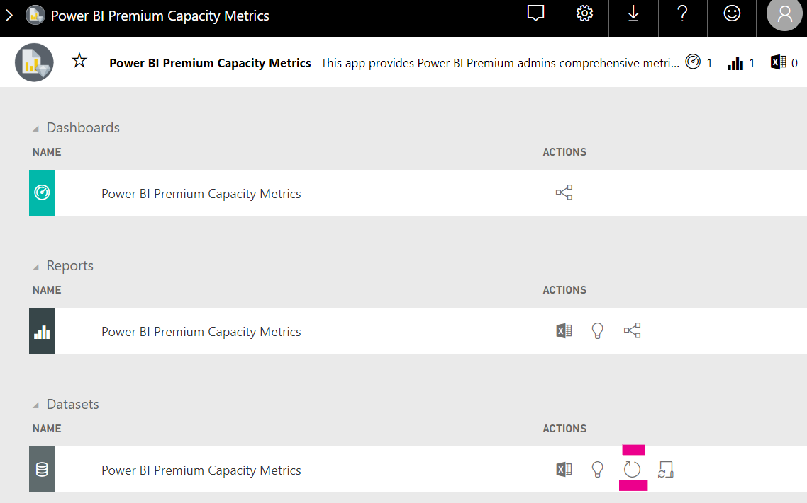

# Capacity planning in Power BI embedded analytics

Calculating what type of capacity is needed for a Power BI embedded analytics deployment, can be complicated. This is because this calculation is based on multiple parameters, some of them hard to predict.

Some of the things to take into consideration when planning your capacity are:

* The data models you're using
* The number and complexity of required queries
* The hourly distribution of the usage of your application
* Data refresh rates
* Additional usage patterns that are hard to predict.

This article is designed to make capacity planning for Power BI embedded analytics easier, by introducing the [Power BI Capacity Load Assessment Tool](https://github.com/microsoft/PowerBI-Tools-For-Capacities/tree/master/LoadTestingPowerShellTool/), created for automating load testing for Power BI embedded analytics capacities (*A*, *EM* or *P* SKUs).

## Planning tool

 The [Power BI Capacity Load Assessment Tool](https://github.com/microsoft/PowerBI-Tools-For-Capacities/tree/master/LoadTestingPowerShellTool/) can help you understand how much user load your capacity can handle. It uses PowerShell to create automated load tests against your capacities, and lets you choose which reports to test, and how many concurrent users to simulate.

The tool generates load on a capacity by continuously rendering each report with new filter values (to prevent unrealistically good performance due to report caching), until the token required for authenticating the tool against the service, expires.

### Using the planning tool

When running the tool, be mindful of the existing load on your capacities and make sure not to run load tests during top usage times.

Here are some examples of how you can use the planning tool.

* Capacity administrators can get a better understanding of how many users their capacity can handle in a given time frame.
* Report authors can understand the user load effect, as measured with Power BI desktop's [Performance Analyzer](../../create-reports/desktop-performance-analyzer.md).
* You can see renders happening in real time on your browser.
* Using SQL Server Profiler, you can [connect to the XMLA endpoints](https://powerbi.microsoft.com/blog/power-bi-open-platform-connectivity-with-xmla-endpoints-public-preview/) of the capacities being measured, to see the queries being executed.
* The load test effects are visible in the premium capacity metrics app's Datasets page. Capacity admins can use this tool to generate load, and see how that load shows up.

### Reviewing the test results

To see the effects of the load test in the metrics app after the test runs, follow the instructions below. Expect up to a 15 minutes lag from the time the test starts generating load, until the time the load is visible in the metrics.

1. Expand the **Datasets** tab of your [metrics app](../../admin/service-admin-premium-monitor-capacity.md) landing page.
2. Initiate an on-demand refresh by clicking **refresh now**. Admins should.

    

## Power BI capacity tools GitHub repository

The [Power BI capacity tools GitHub repository](https://github.com/microsoft/PowerBI-Tools-For-Capacities) was created to host the capacity planning tool and other future tools and utilities.

The repository is open source and users are encouraged to contribute, add additional tools related to Power BI Premium and Embedded capacities, and improve the existing ones.

## Next steps

> [!div class="nextstepaction"]
>[Capacity and SKUs in Power BI embedded analytics](embedded-capacity.md)

> [!div class="nextstepaction"]
>[Power BI Embedded performance best practices](embedded-performance-best-practices.md)