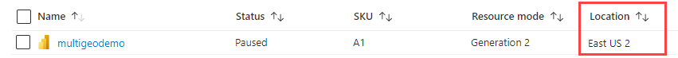

# Multi-Geo support for Power BI Embedded

**Multi-Geo support for Power BI Embedded** means that ISVs and organizations that build applications using Power BI Embedded to embed analytics into their apps can now deploy their data in different regions around the world.

Now customers using **Power BI Embedded** can set up an **A capacity** using **Multi-Geo** options, based on the same features and limitations that [Power BI Premium supports using Multi-Geo](../../admin/service-admin-premium-Multi-Geo.md).

## Creating new Power BI Embedded Capacity resource with Multi-Geo

In the **Create resource** screen, you need to choose the location of your capacity. Until now, it was limited only to the location of your Power BI tenant, so only a single location was available. With Multi-Geo, you can choose between different regions to deploy your capacity.

Notice that when opening the location drop-down menu, your home tenant is the default selection.
  

When choosing a different location, a message prompts you to make sure you're aware of the selection.

## View Capacity location

You can see your capacities location easily when going to the main Power BI Embedded management page in the Azure portal.

It's also available in the Admin Portal in Powerbi.com. In the Admin portal, choose 'Capacity settings,' and then switch to 'Power BI Embedded' tab.

[Learn more about creating capacities with Power BI Embedded.](azure-pbie-create-capacity.md)

## Manage existing capacities location

You can't change a Power BI Embedded resource location once you've created a new capacity.

To move your Power BI content to a different region, follow these steps:

1. [Create a new capacity](azure-pbie-create-capacity.md) in a different region.

2. Assign all workspaces from the existing capacity to the new capacity.

3. Delete or pause the old capacity.

It's important to note that if you decide to delete a capacity without reassigning its content, all the content in that capacity moves to a shared capacity, which is in your home region.

## API support for Multi-Geo

To support management of capacities with Multi-Geo through API, we have made some changes to existing APIs:

1. **[Get Capacities](/rest/api/power-bi/capacities/getcapacities)** - The API returns a list of capacities with access to the user. The response now includes an additional property called 'region,' that specifies the capacity's location.

2. **[Assign To Capacity](/rest/api/power-bi/capacities)** - The API allows assigning a given workspace to a capacity. This operation doesn't allow you to assign workspaces to a capacity outside of your home region or move workspaces between capacities in different regions. To perform this operation, the user or [service principal](embed-service-principal.md) still needs admin permissions on the workspace, and admin or assign permissions on the target capacity.

3. **[Azure Resource Manager API](/rest/api/power-bi-embedded/capacities)** - all of the Azure Resource Manager API operations, including *Create* and *Delete*, supports Multi-Geo.

## Limitations and considerations

* Confirm that any movement you initiate between regions follows all corporate and government compliance requirements before initiating data transfer.

* A cached query stored in a remote region stays in that region at rest. However, other data in transit can go back and forth between different geographies.

* When moving data from one region to another in a Multi-Geo environment, the source data may stay in the region from which the data was moved for up to 30 days. During that time, users don't have access to it. It's removed from this region and destroyed within 30 days.

* Multi-Geo doesn't result in better performance in general. Loading reports and dashboards still involves requests to the home region for metadata.

## Next steps

>[!div class="nextstepaction"]
>[What is Power BI Embedded?](embedded-analytics-power-bi.md)

>[!div class="nextstepaction"]
>[Create a Power BI Embedded capacity](azure-pbie-create-capacity.md)

>[!div class="nextstepaction"]
>[Multi-Geo in Power BI Premium capacities](../../admin/service-admin-premium-multi-geo.md)

More questions? [Try asking the Power BI Community](https://community.powerbi.com/)