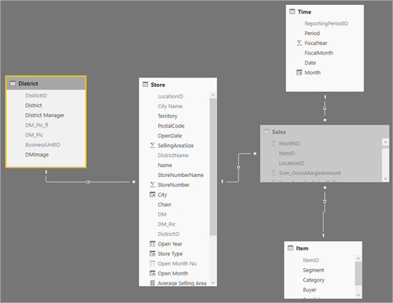
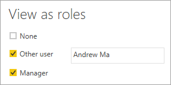
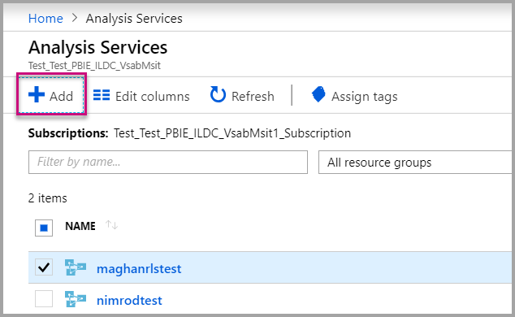
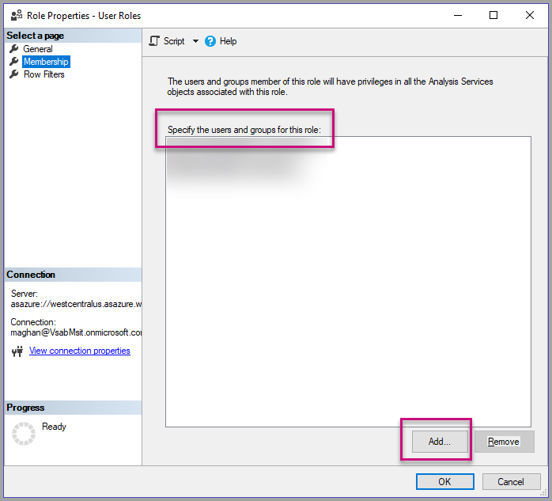
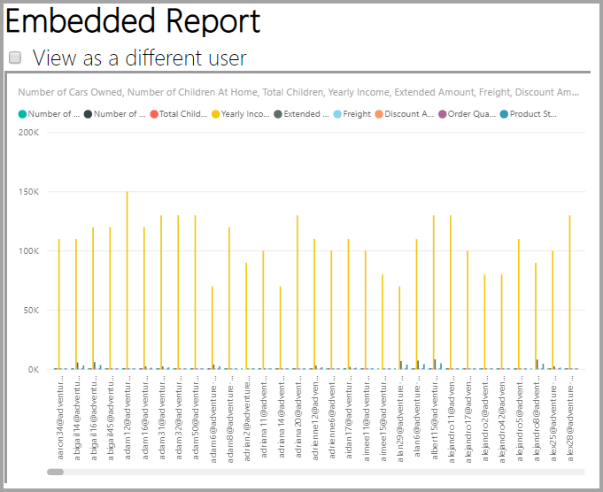
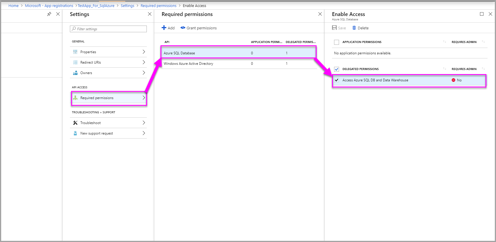

# Row-level security with Power BI Embedded

**Row-level security (RLS)** can be used to restrict user access to data within dashboards, tiles, reports, and datasets. Different users can work with those same artifacts all while seeing different data. Embedding supports RLS.

If you're embedding for non-Power BI users (app owns data), which is typically an ISV scenario, then this article is for you! Configure the embed token to account for the user and role.

If you're embedding to Power BI users (user owns data), within your organization, RLS works the same as it does within the Power BI service directly. There's nothing more you need to do in your application. For more information, see [Row-Level security (RLS) with Power BI](../../admin/service-admin-rls.md).


To take advantage of RLS, it's important you understand three main concepts; Users, Roles, and Rules. Let's take a closer look at these concepts:

**Users** – End users viewing the artifact (dashboard, tile, report, or dataset). In Power BI Embedded, users are identified by the username property in an embed token.

**Roles** – Users belong to roles. A role is a container for rules and can be named something like *Sales Manager* or *Sales Rep*. You create roles within Power BI Desktop. For more information, see [Row-level security (RLS) with Power BI Desktop](../../create-reports/desktop-rls.md).

**Rules** – Roles have rules, and those rules are the actual filters that are going to be applied to the data. The rules could be as simple as "Country = USA" or something much more dynamic.
For the rest of this article, there's an example of authoring RLS, and then consuming that within an embedded application. Our example uses the [Retail Analysis Sample](https://go.microsoft.com/fwlink/?LinkID=780547) PBIX file.


## Adding roles with Power BI Desktop

Our **Retail Analysis sample** shows sales for all the stores in a retail chain. Without RLS, no matter which district manager signs in and views the report, they all see the same data. Senior management has determined each district manager should only see the sales for the stores they manage. Using RLS allows Senior management to restrict data based on a district manager.

RLS is authored in Power BI Desktop. When the dataset and report are opened, we can switch to diagram view to see the schema:



Here are a few things to notice with this schema:

* All measures, like **Total Sales**, are stored in the **Sales** fact table.
* There are four additional related dimension tables: **Item**, **Time**, **Store**, and **District**.
* The arrows on the relationship lines indicate which way filters can flow from one table to another. For example, if a filter is placed on **Time[Date]**, in the current schema it would only filter down values in the **Sales** table. No other tables are affected by this filter since all the arrows on the relationship lines point to the sales table and not away.
* The **District** table indicates who the manager is for each district:
  
    

Based on this schema, if we apply a filter to the **District Manager** column in the **District** table, and if that filter matches the user viewing the report, that filter down the **Store** and **Sales** tables to show data for that district manager.

Here's how:

1. On the **Modeling** tab, select **Manage Roles**.

    
2. Create a new role called **Manager**.

    
3. In the **District** table, enter this DAX expression: **[District Manager] = USERNAME()**.

    
4. To make sure the rules are working, on the **Modeling** tab, select **View as Roles**, and then select both the **Manager** role you created, along with **Other users**. Enter **Andrew Ma** for the user.

    

    The reports show data as if you're signed in as **Andrew Ma**.

Applying the filter, the way we did here, filters down all records in the **District**, **Store**, and **Sales** tables. However, because of the filter direction on the relationships between **Sales** and **Time**, **Sales** and **Item**, and **Item** and **Time** tables aren't filtered down. To learn more about bidirectional cross-filtering, download the [Bidirectional cross-filtering in SQL Server Analysis Services 2016 and Power BI Desktop](https://download.microsoft.com/download/2/7/8/2782DF95-3E0D-40CD-BFC8-749A2882E109/Bidirectional%20cross-filtering%20in%20Analysis%20Services%202016%20and%20Power%20BI.docx) whitepaper.

## Applying user and role to an embed token

Now that you have your Power BI Desktop roles configured, some more work needs to be done in your application to take advantage of the roles.

Users are authenticated and authorized by your application and embed tokens are used to grant a user access to a specific Power BI Embedded report. Power BI Embedded doesn't have any specific information on who your user is. For RLS to work, you need to pass some additional context as part of your embed token in the form of identities. You can pass the identities by using the [Embed Token](/rest/api/power-bi/embedtoken) API.

The API accepts a list of identities with indication of the relevant datasets. For RLS to work, you need to pass the below pieces as part of the identity.

* **username (mandatory)** – A string that can be used to help identify the user when applying RLS rules. Only a single user can be listed. Your username can be created with *ASCII* characters.
* **roles (mandatory)** – A string containing the roles to select when applying Row Level Security rules. If passing more than one role, they should be passed as a string array.
* **dataset (mandatory)** – The dataset that is applicable for the artifact you're embedding.

You can create the embed token by using the **GenerateTokenInGroup** method on **PowerBIClient.Reports**.

For example, you could change the *[PowerBI-Developer-Samples](https://github.com/Microsoft/PowerBI-Developer-Samples) > .NET Framework > Embed for your customers > **PowerBIEmbedded_AppOwnsData*** sample.

```csharp
public EmbedToken GetEmbedToken(Guid reportId, IList<Guid> datasetIds, [Optional] Guid targetWorkspaceId)
    {
        PowerBIClient pbiClient = this.GetPowerBIClient();

        // Create a request for getting an embed token
        // This method works only with new Power BI V2 workspace experience
        var tokenRequest = new GenerateTokenRequestV2(
            reports: new List<GenerateTokenRequestV2Report>() { new GenerateTokenRequestV2Report(reportId) },
            datasets: datasetIds.Select(datasetId => new GenerateTokenRequestV2Dataset(datasetId.ToString())).ToList(),
            targetWorkspaces: targetWorkspaceId != Guid.Empty ? new List<GenerateTokenRequestV2TargetWorkspace>() { new GenerateTokenRequestV2TargetWorkspace(targetWorkspaceId) } : null,
            identities: new List<EffectiveIdentity> { rls }
        );

        // Generate an embed token
        var embedToken = pbiClient.EmbedToken.GenerateToken(tokenRequest);

        return embedToken;
    }
```

If you're calling the REST API, the updated API now accepts an additional JSON array, named **identities**, containing a username, list of string roles and list of string datasets. 

Use the following code below as an example:

```json
{
    "accessLevel": "View",
    "identities": [
        {
            "username": "EffectiveIdentity",
            "roles": [ "Role1", "Role2" ],
            "datasets": [ "fe0a1aeb-f6a4-4b27-a2d3-b5df3bb28bdc" ]
        }
    ]
}
```

Now, with all the pieces together, when someone logs into your application to view this artifact, they'll only see the data that they're allowed to see, as defined by our row-level security.

## Working with Analysis Services live connections

Row-level security can be used with Analysis Services live connections for on-premises servers. There are a few specific concepts that you should understand when using this type of connection.

The effective identity that is provided for the username property must be a Windows user with permissions on the Analysis Services server.

>[!NOTE]
> When using service principal with an [Azure Analysis Services](/azure/analysis-services/analysis-services-overview) data source, the service principal itself must have an Azure Analysis Services instance permissions. Using a security group that contains the service principal for this purpose, doesn't work.

### On-premises data gateway configuration

An [On-premises data gateway](../../connect-data/service-gateway-onprem.md) is used when working with Analysis Services live connections. When generating an embed token, with an identity listed, the master account needs to be listed as an admin of the gateway. If the master account isn't listed, the row-level security isn't applied to the property of the data. A non-admin of the gateway can provide roles, but must specify its own username for the effective identity.

### Use of roles

Roles can be provided with the identity in an embed token. If no role is provided, the username that was provided can be used to resolve the associated roles.

### Using the CustomData feature

The CustomData feature allows you to add a Row filter by passing a free text (string) using the CustomData connection string property. Unlike users and roles, CustomData can't be set within a .pbix file.

CustomData can be used in a *role* DAX query, and can be used without a role in a *measure* DAX query.

The CustomData feature is part of token generation functionality for dashboard, report, and tile artifacts. Dashboards can have multiple CustomData identities (one per tile/model or dataset).

> [!NOTE]
> When generating a token with the CustomData feature, you must specify a username of no more than 256 characters.

#### CustomData SDK Additions

The CustomData string property was added to our effective identity in the token generation scenario.

```json
[JsonProperty(PropertyName = "customData")]
public string CustomData { get; set; }
```

The identity can be created with custom data using the following call:

```csharp
public EffectiveIdentity(string username, IList<string> datasets, IList<string> roles = null, string customData = null);
```

#### CustomData SDK Usage

If you're calling the REST API, you can add custom data inside each identity, for example:

```json
{
    "accessLevel": "View",
    "identities": [
        {
            "username": "EffectiveIdentity",
            "roles": [ "Role1", "Role2" ],
            "customData": "MyCustomData",
            "datasets": [ "fe0a1aeb-f6a4-4b27-a2d3-b5df3bb28bdc" ]
        }
    ]
}
```

Here are the steps to begin setting up the CustomData() feature with your Power BI Embedded application.

1. Create your Azure Analysis Services database. Then sign in to your Azure Analysis Services server via [SQL Server Management Studio](/sql/ssms/download-sql-server-management-studio-ssms).

    

    

2. Create a Role in the Analysis Services server.

    

3. Set your **General** settings.  Here you give the **Role Name** and set the database permissions to **Read** only.

    

4. Set the **Membership** settings. Here you add te users that are affected by this role.

    

5. Set your **Row filters** DAX query using the *CUSTOMDATA()* function.

    

6. Build a PBI report and publish it to a workspace with capacity.

    

7. Use the Power BI APIs to use the CustomData feature in your application.  When generating a token with the Custom data feature, you need to have a username. The username must be equal to the UPN of the master user. The master user must be a member of the role(s) you created. If no role(s) are specified, then all the roles the master user is a member of are used for RLS evaluation.

    When working with a [service principal](embed-service-principal.md), you also need to do the above steps in place of using a master account. When generating embed token, use the [service principal object ID](embed-service-principal.md) as the username.

    > [!Note]
    > When you're ready to deploy your application to production, the master user account field or option should not be visible to the end user.

    View the [code](#customdata-sdk-additions) to add the CustomData feature.

8. Now you can view the report in your application before applying the Custom data value(s) to see all the data your report holds.

    

    Then apply the Custom data value(s) to see how the report displays a different set of data.
    

## Using RLS vs. JavaScript filters

When deciding on filtering your data in a report, you can use **row-level security (RLS)** or **JavaScript filters**.

[Row-level security](../../admin/service-admin-rls.md) is a feature that filters data at the data model level. Your backend data source controls your RLS settings. Based on your data model, the embed token generation sets the username and the roles for the session. It cannot be overridden, removed, or controlled by the client-side code and that's why it's considered secure. We recommend using RLS for filtering data securely. You can filter data with RLS by using one of the options below.

* [Configuring roles in a Power BI report](../../create-reports/desktop-rls.md).
* Configuring roles at the data source level (Analysis Services live connection only).
* Programmatically with an [Embed Token](/rest/api/power-bi/embedtoken/datasets_generatetokeningroup) using `EffectiveIdentity`. When using an embed token, the actual filter passes through the embed token for a specific session.

[JavaScript filters](https://github.com/Microsoft/PowerBI-JavaScript/wiki/Filters#page-level-and-visual-level-filters) are used to allow the user to consume reduced, scoped, or a filtered view of the data. However, the user still has access to the model schema tables, columns, and measures and potentially can access any data there. Restricted access to the data can only be applied with RLS and not through client-side filtering APIs.

## Token-based Identity with Azure SQL Database

The **token-based identity** allows you to specify the effective identity for an embed token using an [Azure Active Directory (AAD) access token](/azure/databricks/dev-tools/api/latest/aad/app-aad-token) for an **Azure SQL Database**.

Customers that hold their data in **Azure SQL Database** can now enjoy a new capability to manage users and their access to data in Azure SQL when integrating with **Power BI Embedded**.

When you're generating the embed token, you can specify the effective identity of a user in Azure SQL. You can specify the effective identity of a user by passing the AAD access token to the server. The access token is used to pull only the relevant data for that user from Azure SQL, for that specific session.

It can be used to manage each user's view in Azure SQL or to sign in to Azure SQL as a specific customer in a multi-tenant DB. It can also apply row-level security on that session in Azure SQL and retrieve only the relevant data for that session, removing the need to manage RLS in Power BI.

Such effective identity issues apply to RLS rules directly on the Azure SQL Server. Power BI Embedded uses the provided access token when querying data from the Azure SQL Server. The UPN of the user (for which the access token was provided) is accessible as a result of the USER_NAME() SQL function.

The token-based identity only works for DirectQuery models on a capacity - connected to an Azure SQL Database, which is configured to allow AAD authentication ([learn more about AAD authentication for Azure SQL Database](/azure/sql-database/sql-database-manage-logins)). The dataset's data source must be configured to use end users' OAuth2 credentials, to use a token-based identity.

   

### Token-based Identity SDK additions

The identity blob property was added to our effective identity in the token generation scenario.

```JSON
[JsonProperty(PropertyName = "identityBlob")]
public IdentityBlob IdentityBlob { get; set; }
```

The IdentityBlob type is a simple JSON structure holding a value string property

```JSON
[JsonProperty(PropertyName = "value")]
public string value { get; set; }
```

The EffectiveIdentity can be created with identity blob using the following call:

```C#
public EffectiveIdentity(string username, IList<string> datasets, IList<string> roles = null, string customData = null, IdentityBlob identityBlob = null);
```

Identity blob can be created using the following call.

```C#
public IdentityBlob(string value);
```

### Token-based Identity REST API Usage

If you're calling the [REST API](/rest/api/power-bi/embedtoken/reports_generatetokeningroup#definitions), you can add identity blob inside each identity.

```JSON
{
    "accessLevel": "View",
    "identities": [
        {
            "datasets": ["fe0a1aeb-f6a4-4b27-a2d3-b5df3bb28bdc"],
        "identityBlob": {
            "value": "eyJ0eXAiOiJKV1QiLCJh…."
         }
        }
    ]
}
```

The value provided in the identity blob should be a valid access token to Azure SQL Server (with a resource URL of (<https://database.windows.net/>).

   > [!Note]
   > To be able to create an access token for Azure SQL, the application must have **Access Azure SQL DB and Data Warehouse** delegated permission to **Azure SQL Database** API on AAD app registration configuration in the Azure portal.

   

## On-premises data gateway with service principal

Customers that are using SQL Server Analysis Services (SSAS) on-premises live connection data source, can enjoy the [service principal](embed-service-principal.md) capability to manage users and their access to data in SSAS when integrating with **Power BI Embedded**.

Using [Power BI REST APIs](/rest/api/power-bi/), allows you to specify the effective identity for SSAS on-premises live connections for an embed token using a [service principal object](/azure/active-directory/develop/app-objects-and-service-principals#service-principal-object).

Until now, to be able to specify the effective identity for SSAS on-premises live connection, the *master user* generating the embed token had to be a gateway admin. Now, instead of requiring the user to be gateway admin, the gateway admin can give the user dedicated permission to that data source, that allows the user to override the effective identity when generating the embed token. This new ability enables embedding with service principal for a live SSAS connection.

To enable this scenario, the gateway admin uses the [Add Datasource User REST API](/rest/api/power-bi/gateways/adddatasourceuser) to give the service principal the *ReadOverrideEffectiveIdentity* permission for the SSAS data source.

You can't set this permission using the admin portal. This permission is only set with the API. In the admin portal, you see an indication for users and SPNs with such permissions.

>[!NOTE]
>If you are connected to an SSAS database without RLS configured on it, you still need to supply an effective identity (the identity of the SSAS server admin) in the embed token generation call.

## Considerations and limitations

* Assignment of users to roles within the Power BI service doesn't affect RLS when using an embed token.
* While the Power BI service doesn't apply RLS setting to admins or members with edit permissions, when you supply an identity with an embed token, it applies to the data.
* Analysis Services live connections are supported for on-premises servers.
* Azure Analysis Services live connections support filtering by roles. Dynamic filtering can be done using CustomData.
* If the underlying dataset doesn't require RLS, the GenerateToken request must **not** contain an effective identity.
* If the underlying dataset is a cloud model (cached model or DirectQuery), the effective identity must include at least one role, otherwise role assignment doesn't occur.
* A list of identities enables multiple identity tokens for dashboard embedding. For all others artifacts, the list contains a single identity.

### Token-based Identity limitations

* You can use RLS only if you have a capacity.
* RLS doesn't work with SQL Server on-premises.

More questions? [Try asking the Power BI Community](https://community.powerbi.com/)
