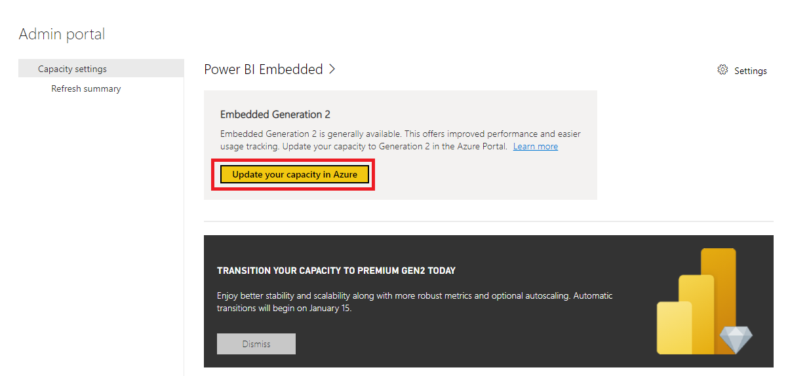

# Plan your transition to Power BI Embedded Gen2

This article provides information about key dates for migrating Power BI Embedded capacity to the latest platform.

Over the last several months, we've been working to make many improvements to Power BI Embedded. Changes include updates to licensing, performance, scaling, management overhead, and improved insight to utilization metrics. This next generation of Power BI Embedded, referred to as Power BI Embedded Gen2, has officially moved from preview to general availability as of October 4, 2021. You can read the announcement about this release in the [Power BI blog](https://powerbi.microsoft.com/blog/).

If your organization is using the previous version of Power BI Embedded, you're required to migrate capacities to the modern Gen2 platform. The key dates for you to be aware of are listed below:

* **October 4, 2021** - Power BI Embedded Gen2 is generally available.
* **November 15, 2021** - We start sending notifications reminding customers to migrate.
* **January 15, 2022** - Microsoft begins migration of Embedded capacities to the modern Gen2 platform for all organizations.

## Self-migration to Embedded Generation 2

If you want to perform your own migration to the latest platform before January 15, 2022, it's easy to transition. You simply need to enable Embedded Gen2 in the Power BI admin portal. Migrating doesn't interrupt your Power BI service. The change typically completes within a minute and won't take more than 10 minutes.

Ready for the next generation? Follow these steps:

1. Sign in to the [Power BI service](https://app.powerbi.com) as a Power BI capacity admin.
1. From the navigation bar, select **Settings** > **Admin portal** > **Capacity settings**.

    :::image type="content" source="media/embedded-transition-gen1-to-gen2/gen1-to-gen2-migration-capacity-settings.png" alt-text="Screen capture showing how to get to capacity settings.":::

1. Select **Power BI Embedded**.
1. If you have already allocated capacity, select it.
1. Select **Update your capacity in Azure**

    

## Transition from preview to Embedded Gen 2 general availability

Customers using Power BI Embedded Gen2 in preview don't need to take any action to transition to the general availability release. However, there are some key dates to consider if you've been using **Autoscale** to balance your capacity needs.

To date, organizations that have enabled Autoscale for capacities have gotten the burst processing benefits of Autoscale for free. Beginning **November 4, 2021** we'll begin charging for Autoscale cores. Take one of the following actions:

* You can continue to use Autoscale to enable the automatic use of additional cores during periods of higher-than normal demand on your capacities. Review the [pricing details for Embedded per capacity add-ons](https://powerbi.microsoft.com/pricing/#premium-add-on-card-autoscale) so that you're aware of upcoming charges.
* Or, to avoid Autoscale charges, disable the feature. Autoscale is an optional feature and benefit of the Embedded Gen2 platform. You can choose to not use it.

## Migration timeline summary

The following image summarizes each of the key milestones detailed in this article.

  :::image type="content" source="media/embedded-transition-gen1-to-gen2/gen2-timeline.png" alt-text="Image summarizing key dates for migration to Embedded Gen 2.":::

## Next steps

* [What is Power BI Embedded Gen2?](power-bi-embedded-generation-2.md)
