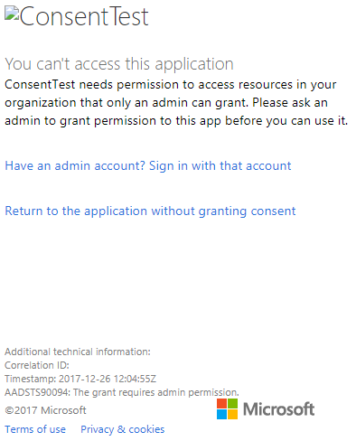

# Troubleshoot your embedded application

This article discusses some common issues you may get when embedding content from Power BI.

## Tools to troubleshoot

### Fiddler Trace

[Fiddler](https://www.telerik.com/fiddler) is a free tool from Telerik that monitors HTTP traffic.  You can see the traffic with the Power BI APIs from the client machine. This tool may show errors and other related information.


### F12 in Browser for front-end debugging

F12 launches the developer window within your browser. This tool provides the ability to look at network traffic and other information.


### Extract error details from Power BI response

This code snippet shows how to extract the error details from HTTP exception:

```csharp
public static string GetExceptionText(this HttpOperationException exc)
{
    var errorText = string.Format("Request: {0}\r\nStatus: {1} ({2})\r\nResponse: {3}",
    exc.Request.Content, exc.Response.StatusCode, (int)exc.Response.StatusCode, exc.Response.Content);
    if (exc.Response.Headers.ContainsKey("RequestId"))
    {
        var requestId = exc.Response.Headers["RequestId"].FirstOrDefault();
        errorText += string.Format("\r\nRequestId: {0}", requestId);
    }

    return errorText;
}
```

We recommend logging the Request ID (and error details for troubleshooting).
Provide the Request ID when approaching Microsoft support.

## App registration

### App registration failure

Error messages within the Azure portal or the Power BI app registration page mention insufficient privileges. To register an application, you must be an admin in the Azure AD tenant or application registrations must be enabled for non-admin users.

### Power BI Service doesn't appear in the Azure portal when registering a new App

At least one user must be signed up for Power BI. If you don't see **Power BI Service** listed within the API list, no user is signed up for Power BI.

### What is the difference between application object ID and principal object ID?

When you register an Azure AD app, there are a two parameters called *object ID*. This section explains the purpose of each parameter, and how to obtain it.

:::row:::
    :::column span="":::

        #### Application object ID

        The [application object](/azure/active-directory/develop/app-objects-and-service-principals#application-object) ID, also know simply as *object ID*, is the unique ID of your Azure AD application object.

        To get the application object ID, navigate to your Azure AD app, and copy it from the *Overview*.

        :::image type="content" source="media/embedded-troubleshoot/object-id.png" alt-text="A screenshot showing the object I D in the overview blade of an Azure A D application":::

    :::column-end:::
    :::column span="":::

        #### Principal object ID

        The principal object ID, also known simply as *object ID*, is the unique ID of the [service principal object](/azure/active-directory/develop/app-objects-and-service-principals#service-principal-object) associated with your Azure AD application.

        To get your principal object ID, navigate to your Azure AD app, and from the *Overview* select the app link in **Managed application in local directory**.
        
            :::image type="content" source="media/embedded-troubleshoot/azure-overview-blade.png" alt-text="A screenshot showing the managed application in local directory option in the overview blade of an Azure A D application":::
        
        From the *Properties* section, copy the **Object ID**.
        
            :::image type="content" source="media/embedded-troubleshoot/principal-object-id.png" alt-text="A screenshot showing the principal object I D in the properties section in the overview blade of an Azure A D application":::

    :::column-end:::
:::row-end:::

## REST API

### API call returning 401

A fiddler capture may be required to investigate further. The required permission scope may be missing for the registered application within Azure AD. Verify the required scope is present within the app registration for Azure AD within the Azure portal.

### API call returning 403

A fiddler capture may be required to investigate further. There could be several reasons for a 403 error.

* The user has exceeded the amount of embed token that can be generated on a shared capacity. Purchase Azure capacities to generate embed tokens and assign the workspace to that capacity. See [Create Power BI Embedded capacity in the Azure portal](/azure/power-bi-embedded/create-capacity).
* The Azure AD auth token expired.
* The authenticated user isn't a member of the group (workspace).
* The authenticated user isn't an admin of the group (workspace).
* The authenticated user doesn't have permissions. Permissions can be updated using [refreshUserPermissions API](/rest/api/power-bi/users/refreshuserpermissions)
* The authorization header may not be listed correctly. Make sure there are no typos.

The backend of the application may need to refresh the auth token before calling GenerateToken.

```console
GET https://wabi-us-north-central-redirect.analysis.windows.net/metadata/cluster HTTP/1.1
Host: wabi-us-north-central-redirect.analysis.windows.net
...
Authorization: Bearer eyJ0eXAiOi...
...

HTTP/1.1 403 Forbidden
...

{"error":{"code":"TokenExpired","message":"Access token has expired, resubmit with a new access token"}}
```

### How to fix timeout exceptions when using import and export APIs?

When you're sending a [Power BI REST API](/rest/api/power-bi/) request, it might arrive at a cluster that doesn't contain your tenant's data. In such cases, redirecting the request may fail due to a timeout.

To fix the timeout exception, you can resend the request with the `preferClientRouting` parameter set to `true`. If your request arrives at the wrong cluster, the Power BI service returns a *307 Temporary Redirect* HTTP response. In such cases, you need to redirect your request to the new address specified in the response *HTTPS Location header*.

## Authentication

### Authentication failed with AADSTS90002: Tenant 'authorize' not found

 If you're receiving messages logging in such as ***error: invalid_request, error_description: AADSTS90002: Tenant 'authorize' not found***, that is because ADAL 4.x doesn't support "https://login.microsoftonline.com/{Tenant}/oauth2/authorize/" as an authority url.
 
To resolve this issue you should trim "oauth2/authorize/" from the end of your authority url, see [Power BI Developer Samples](https://github.com/Microsoft/PowerBI-Developer-Samples) for reference.

 Check [Better Authority validation](https://github.com/AzureAD/azure-activedirectory-library-for-dotnet/wiki/Changes-adalnet-4.0#better-authority-validation) from ADAL 4.x release notes.

### Authentication failed with AADSTS70002 or AADSTS50053

**_(AADSTS70002: Error validating credentials. AADSTS50053: You've tried to sign in too many times with an incorrect User ID or password)_**

If you're using Power BI Embedded and using Azure AD Direct authentication, and you're receiving messages logging in such as ***error:unauthorized_client, error_description:AADSTS70002: Error validating credentials. AADSTS50053: You've tried to sign in too many times with an incorrect User ID or password***, that is because direct authentication is no longer in use.

There's a way to turn this back on using an [Azure AD Policy](/azure/active-directory/manage-apps/configure-authentication-for-federated-users-portal#enable-direct-authentication-for-legacy-applications) that is scoped to the organization or a [service principal](/azure/active-directory/develop/active-directory-application-objects#service-principal-object).

We recommend you enable this policy only as a per-app basis.

To create this policy, you need to be a **Global Administrator** for the directory where you're creating the policy and assigning. Here is a sample script for creating the policy and assigning it to the SP for this application:

1. Install the [Azure AD Preview PowerShell Module](/powershell/azure/active-directory/install-adv2).

2. Run the following PowerShell commands line-by-line (making sure the variable $sp doesn't have more than one application as a result).

```powershell
Connect-AzureAD
```

```powershell
$sp = Get-AzureADServicePrincipal -SearchString "Name_Of_Application"
```

```powershell
$policy = New-AzureADPolicy -Definition @("{`"HomeRealmDiscoveryPolicy`":{`"AllowCloudPasswordValidation`":true}}") -DisplayName EnableDirectAuth -Type HomeRealmDiscoveryPolicy -IsOrganizationDefault $false
```

```powershell
Add-AzureADServicePrincipalPolicy -Id $sp.ObjectId -RefObjectId $policy.Id 
```

After assigning the policy, wait approximately 15-20 seconds for propagation before testing.

### Generate token fails when providing effective identity

GenerateToken can fail, with effective identity supplied, for a few different reasons.

* Dataset doesn't support effective identity
* Username wasn't provided
* Role wasn't provided
* DatasetId wasn't provided
* User doesn't have the correct permissions

To verify which it is, try the steps below.

* Execute [get dataset](/rest/api/power-bi/datasets). Is the property IsEffectiveIdentityRequired true?
* Username is mandatory for any EffectiveIdentity.
* If IsEffectiveIdentityRolesRequired is true, Role is required.
* DatasetId is mandatory for any EffectiveIdentity.
* For Analysis Services, the master user has to be a gateway admin.

### AADSTS90094: The grant requires admin permission

**_Symptoms:_**<br>
When a non-admin user tries to sign in to an application for the first time while granting consent, then gets one of the following errors:

* ConsentTest needs permission to access resources in your organization that only an admin can grant. Ask an admin to grant permission to this app before you can use it.
* AADSTS90094: The grant requires admin permission.

    

An admin user can sign in and grant consent successfully.

**_Root cause:_**<br>
User consent is disabled for the tenant.

**_Several fixes are possible:_**

*Enable user consent for the entire tenant (all users, all applications)*

1. In the Azure portal, navigate to "Azure Active Directory" => "Users and groups" => "User settings"
2. Enable the "Users can consent to apps accessing company data on their behalf" setting and save the changes

    

*Grant permissions* to the application by an admin - either for the entire tenant or a specific user.

### CS1061 error

Download [Microsoft.IdentityModel.Clients.ActiveDirectory](https://www.nuget.org/packages/Microsoft.IdentityModel.Clients.ActiveDirectory/2.22.302111727) if you experience an "'AuthenticationContext' does not contain a definition for 'AcquireToken' and no accessible 'AcquireToken' accepting a first argument of type 'AuthenticationContext' could be found (are you missing a using directive or an assembly reference?)" error.

### Azure AD token for a different tenant (guest user)

When you *embed for your organization*, to allow Azure AD guest users access to your content, you need to specify the tenant ID in the `authorityUri` parameter.

* URL for authenticating in your organization's tenant:

    `https://login.microsoftonline.com/common/v2.0`

* URL for authenticating a guest Azure AD user:

    `https://login.microsoftonline.com/<tenant ID>`

To find your tenant ID, you can use the instructions in [Find the Microsoft Azure AD tenant ID and primary domain name](/partner-center/find-ids-and-domain-names#find-the-microsoft-azure-ad-tenant-id-and-primary-domain-name).

For more information, see [How to: Sign in any Azure Active Directory user using the multi-tenant application pattern](/azure/active-directory/develop/howto-convert-app-to-be-multi-tenant).

## Data sources

### ISV wants to have different credentials for the same data source

A data source can have a single set of credentials for one master user. If you need to use different credentials, create additional master users. Then, assign the different credentials in each of the master users contexts, and embed using the Azure AD token of that user.

## Troubleshoot your embedded application with the IError object

Use the [**IError object** returned by the *error* event from the **JavaScript SDK**](https://github.com/Microsoft/PowerBI-JavaScript/wiki/Troubleshooting-and-debugging-of-embedded-parts) to debug your application and better understand the cause of your errors.

After acquiring the IError object, you should look at the appropriate common errors table that fits the embed type you're using. Compare the **IError properties** with the ones in the table and find the possible reason(s) for the failure.

### Typical errors when embedding for Power BI users

| Message | Detailed Message | Error Code | Possible reason(s) |
|-------------------------------------------------------|-----------------------------------------------------------------------------------------------------------------------------|-----------|--------------------------------------------------------|
| TokenExpired | Access token has expired, resubmit with a new access token | 403 | Expired token  |
| PowerBIEntityNotFound | Get report failed | 404 | <li> Wrong Report ID <li> Report doesn't exist  |
| Invalid parameters | powerbiToken parameter not specified | N/A | <li> No access token provided <li> No Report ID provided |
| LoadReportFailed | Fail to initialize - Couldn't resolve cluster | 403 | * Bad access token * Embed type doesn't match token type |
| PowerBINotAuthorizedException | Get report failed | 401 | <li> Wrong group ID <li> Unauthorized group |
| TokenExpired | Access token has expired, resubmit with a new access token. Couldn't render a report visual titled: <visual title> | N/A | Query data Expired token |
| OpenConnectionError | Can't display the visual. Couldn't render a report visual titled: <visual title> | N/A | Capacity paused or deleted while a report related to the capacity was open in a session |
| ExplorationContainer_FailedToLoadModel_DefaultDetails | Couldn't load the model schema associated with this report. Make sure you have a connection to the server and try again. | N/A | <li> Capacity paused <li> Capacity deleted |

### Typical errors when embedding for non-Power BI users (using an Embed Token)

| Message | Detailed Message | Error Code | Reason(s) |
|-------------------------------------------------------|-------------------------------------------------------------------------------------------------------------------------------|------------|-------------------------------------------------|
| TokenExpired | Access token has expired, resubmit with a new access token | 403 | Expired token  |
| LoadReportFailed | Get report failed | 404 | <li> Wrong Report ID <li> Report doesn't exist  |
| LoadReportFailed | Get report failed | 403 | Report ID doesn't match token |
| LoadReportFailed | Get report failed | 500 | Report provided ID isn't a guid |
| Invalid parameters | powerbiToken parameter not specified | N/A | <li> No access token provided <li> No Report ID provided |
| LoadReportFailed | Fail to initialize - Couldn't resolve cluster | 403 | Wrong token type, Bad Token |
| PowerBINotAuthorizedException | Get   report failed | 401 | Wrong/unauthorize group ID |
| TokenExpired | Access token has expired, resubmit with a new access token. Couldn't render a report visual titled: <visual title> | N/A | Query data Expired token |
| OpenConnectionError | Can't display the visual. Couldn't render a report visual titled: <visual title> | N/A | Capacity paused or deleted while a report related to the capacity was open in a session |
| ExplorationContainer_FailedToLoadModel_DefaultDetails | Couldn't load the model schema associated with this report. Make sure you have a connection to the server and try again. | N/A | <li> Capacity paused <li> Capacity deleted |

## Datasets

### Manage which portion of the data your users can see

Any user with read permissions for a dataset can see the entire schema (tables, columns and measures) and all the data. You cannot separately control viewing permissions to raw and aggregated data in the same dataset.

To manage which portion of the data your users can view, use one of these methods:

* Row-level filtering using Power BI [row-level security (RLS)](/power-bi/service-admin-rls).

* [Object level security (OLS)](/analysis-services/tabular-models/object-level-security).

* Separate the data into different datasets. For example, you can create a dataset that only contains aggregated data and give your users access to that dataset only.

## Content rendering

To resolve performance problems such as slow rendering in embedded Power BI items (such as reports and dashboards), review this section.

### Verify that the Power BI item loads in the Power BI embedded analytics playground

To rule out issues with your application, verify that the Power BI item can be viewed in the [Power BI embedded analytics playground](https://aka.ms/pbieplayground).

### Verify that the Power BI item loads in Power BI service

To rule out issues with your application *or the embedding APIs*, verify that the item can be viewed in the Power BI service (powerbi.com).

### Verify that your access token didn't expire

For security purposes, access tokens (An Azure AD token or an embed token) have a limited lifetime. You should constantly monitor your access token and refresh it if needed. For more information see [Refresh the access token](/javascript/api/overview/powerbi/refresh-token).

### Performance

To get the best performing embedded content, we recommend that you follow the [Power BI embedded analytics best practices](embedded-performance-best-practices.md).

## Embed setup tool

You can go through the [Embedding setup tool](https://aka.ms/embedsetup) to quickly download a sample application. Then you can compare your application to the sample.

### Prerequisites

Verify that you have all the proper prerequisites before using the Embedding setup tool. You need a **Power BI Pro** account and a **Microsoft Azure** subscription.

* If you're not signed up for **Power BI Pro**, [sign up for a free trial](https://powerbi.microsoft.com/pricing/) before you begin.
* If you don't have an Azure subscription, create a [free account](https://azure.microsoft.com/free/?WT.mc_id=A261C142F) before you begin.
* You need to have your own [Azure Active Directory tenant ](create-an-azure-active-directory-tenant.md) setup.
* You need [Visual Studio](https://www.visualstudio.com/) installed (version 2013 or later).

### Common Issues

Some common issues you might encounter while testing with the Embed setup tool are:

#### Using the Embed for your customers sample application

If you're working with the **Embed for your customers** experience, save and unzip the *PowerBI-Developer-Samples.zip* file. Then open the *PowerBI-Developer-Samples-master\App Owns Data* folder and run the *PowerBIEmbedded_AppOwnsData.sln* file.

When selecting **Grant permissions** (the Grant permissions step), you get the following error:

```output
AADSTS70001: Application with identifier <client ID> wasn't found in the directory <directory ID>
```

The solution is to close the popup, wait a few seconds and try again. You might need to repeat this action a few times. A time interval causes the issue from completing the application registration process to when it's available to external APIs.

The following error message appears when running the sample app:

```output
Password is empty. Please fill password of Power BI username in web.config.
```

This error occurs because the only value that isn't being injected into the sample application is your user password. Open the Web.config file in the solution and fill the pbiPassword field with your user's password.

If you get the error - AADSTS50079: The user is required to use multi-factor authentication.

Need to use an AAD account that doesn't have MFA enabled.

#### Using the Embed for your organization sample application

If you're working with the **Embed for your organization** experience, save and unzip the *PowerBI-Developer-Samples.zip* file. Then open the *PowerBI-Developer-Samples-master\User Owns Data\integrate-report-web-app* folder and run the *pbi-saas-embed-report.sln* file.

When you run the **Embed for your organization** sample app, you get the following error:

```output
AADSTS50011: The reply URL specified in the request doesn't match the reply URLs configured for the application: <client ID>
```

This error is because the redirect URL specified for the web-server application is different from the sample's URL. If you want to register the sample application, then use `https://localhost:13526/` as the redirect URL.

If you'd like to edit the registered application, then learn how to [update the Azure AD-registered application](/azure/active-directory/develop/quickstart-v1-update-azure-ad-app), so the application can provide access to the web APIs.

If you would like to edit your Power BI user profile or data, then learn how to edit your [Power BI data](../../fundamentals/service-basic-concepts.md).

If you get the error - AADSTS50079: The user is required to use multi-factor authentication.

Need to use an AAD account that doesn't have MFA enabled.

For more information, please see [Power BI Embedded FAQ](embedded-faq.yml).

More questions? [Try the Power BI Community](https://community.powerbi.com/)

If you require further assistance, then [contact support](https://powerbi.microsoft.com/support/pro/?Type=documentation&q=power+bi+embedded) or [create a support ticket via the Azure portal](https://ms.portal.azure.com/#blade/Microsoft_Azure_Support/HelpAndSupportBlade/newsupportrequest) and provide the error messages you encounter.

## Next steps

For more information, see [FAQs](embedded-faq.yml).

More questions? [Try the Power BI Community](https://community.powerbi.com/)
