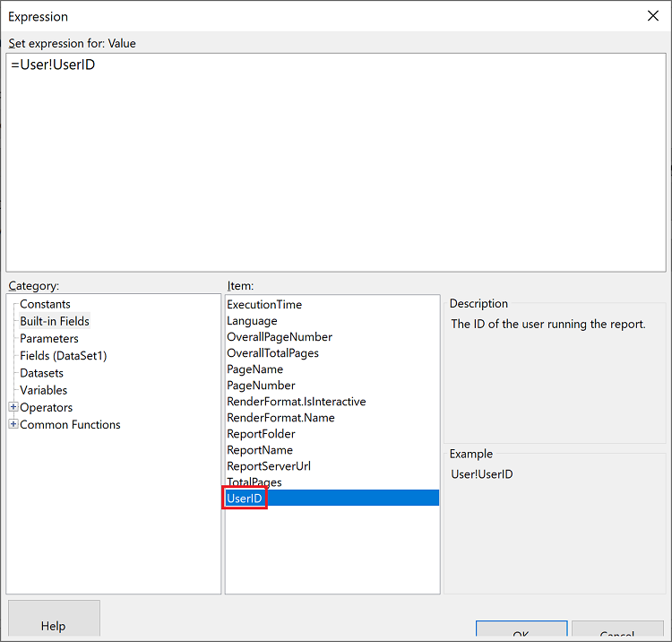
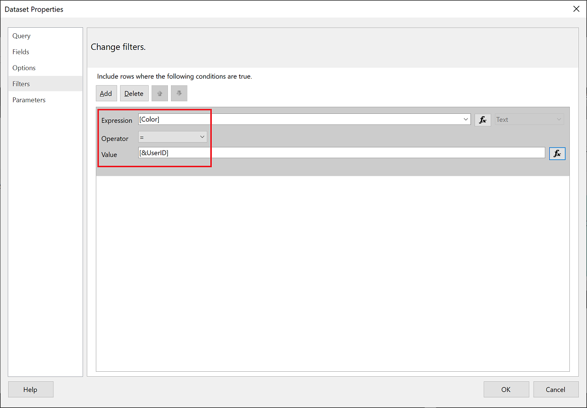

# Implementing row-level security in embedded paginated reports

[!INCLUDE[Customers yes Org no](../../includes/applies-embedded-app-yes-user-no.md)]

This article explains how to embed a paginated report that uses [**RLS** (row-level security)](embedded-row-level-security.md) into your *app owns data* application.

> [!NOTE]
> This article is only relevant for app owns data customers.

To use RLS for your paginated reports:

1. [Set up the environment](#set-up-the-environment) to filter the report
2. [Filter the data](#filter-the-data) at report or query level
3. [Pass the configured parameter](#generate-an-embed-token) using an embed token

## Prerequisites

* This article assumes that you know how to [embed a Power BI paginated report](embed-paginated-reports.md). It explains how to generate the embed token so that the report only shows what the user has permission to access.

* Paginated reports are created using the SQL Server Reporting Services engine, and not the Power BI (Analysis Services) engine, so the RLS filtering is set up in [Power BI Report Builder](../../paginated-reports/report-builder-power-bi.md).

## Set up the environment

To apply row-level security to a Power BI paginated report, use the built-in field **UserID** to assign a [parameter](../../paginated-reports/parameters/report-builder-parameters.md). This parameter will be used to [filter or query your data](#use-userid-as-a-filter-at-report-or-query-level).

Then, pass the **UserID** to the [Embed Token - Generate Token](/rest/api/power-bi/embed-token/generate-token) API to [get the embed token](#generate-an-embed-token).

## Use UserID as a filter at report or query level

You can use **UserId** as a *filter* or in a *query* to the data source.

### Filter the data

1. In the **Semantic model Properties** window, from the left pane, select **Filter**.

    

2. From the **Expression** dropdown menu, select the parameter you want to use for filtering the data.

     

3. Click the **Value** function button.

    

4. In the **Expression** window, from the **Category** list, select **Built-in Fields**.

    

5. From the **Item** list, select **UserID** and click **OK**.

    

6. In the **Semantic model Properties** window, verify that the expression is *your selected parameter = UserID*, and click **OK**.

    

### Using a query

1. In the **Semantic model Properties** window, from the left navigation pane, select **Parameters** and click **Add**.

    

2. In the **Parameter Name** field enter **\@UserID**, and in the **Parameter Value** add **[&UserID]**.

    

3. From the left pane, select  **Query**, in the Query add the **UserID** parameter as part of your query, and click **OK**.
    > [!NOTE]
    > In the screenshot below the color parameter is used as an example (WHERE FinalTable.Color = @UserID). If needed, you can create a more complex query.

    

## Generate an embed token

When you embed a paginated report for your customers, use the [Reports GenerateTokenInGroup](/rest/api/power-bi/embed-token/generate-token) API to get the embed token. This token can also be used to filter some data out of the paginated report.

You can only generate a token using a **service principal**. You can't generate a token as a master user. The service principal has to have at least member permissions to the workspace in the Power BI service. (If the service principal is a contributor or viewer it won't be able to generate a token).

To [generate a token](generate-embed-token.md#row-level-security), assign the `username` field with the information you want to display. For example, in a paginated report that has a color parameter, if you enter *green* in the `username` field, the embed token will restrict the embedded data to just the data that has *green* as its value in the color column.

```JSON
{
 "reports": [
 {
  "id": "8d57615e-cfed-4d60-bd21-7dc05727193c"
 }
 ],
 "identities": [
 {
  "username": "green",
  "reports": [
  "8d57615e-cfed-4d60-bd21-7dc05727193c"
  ]
 }
 ]
}
```

> [!NOTE]
> If you generate embed token without specifying a *user-id*, the *object-id* of service principal will be used.

## Considerations and limitations

* Master-user isn't supported with paginated reports for *embed for your customers*. Master-user **is** supported for *embed for your organization*.
* The service principal must have workspace permissions of member or above (not viewer or contributor).

## Related content

[Generate an embed token](generate-embed-token.md#row-level-security)
