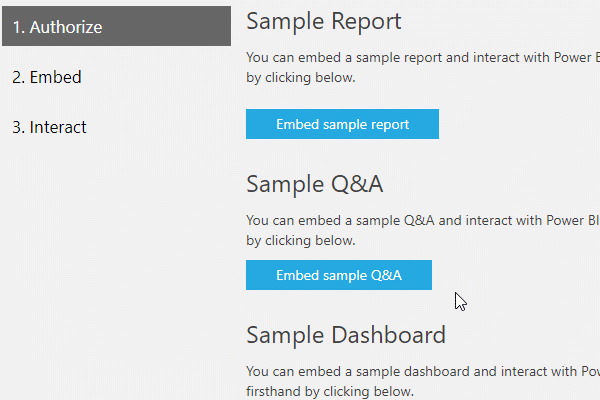

# Q&A in Power BI embedded analytics

Power BI embedded analytics offers you a way to incorporate Q&A into an application and allow your users to ask questions using natural language and receive immediate answers in the form of visuals like charts or graphs.



There are two modes for embedding Q&A within your application: **interactive** and **result only**. **Interactive** mode allows you to type in questions and have them displayed within the visual. If you have a saved question, or a set question you want to display, you can use the **result only** mode by populating the question in your embed config.

Here is a look at what the JavaScript code will look like.

```javascript
// Embed configuration used to describe the what and how to embed.
// This object is used when calling powerbi.embed within the JavaScript API.
// You can find more information at https://github.com/Microsoft/PowerBI-JavaScript/wiki/Embed-Configuration-Details.
var config= {
    type: 'qna',
    tokenType:   models.TokenType.Embed | models.TokenType.Aad,
    accessToken: access token value,
    embedUrl:    https://app.powerbi.com/qnaEmbed (groupId to be appended as query parameter if required),
    datasetIds:  array of requested data set ids (at the moment we support only one dataset),
    viewMode:    models.QnaMode.Interactive | models.QnaMode.ResultOnly,
    question:    optional parameter for Explore mode (QnaMode.Interactive) and mandatory for Render Result mode (QnaMode.ResultOnly)
};

// Get a reference to the embedded QNA HTML element
var qnaContainer = $('#qnaContainer')[0];

// Embed the QNA and display it within the div container.
var qna = powerbi.embed(qnaContainer, config);
```

## Set question

If you used **result mode** with a set question, you can inject additional questions into the frame and have them immediately answered replacing the previous result. A new visual is rendered matching the new question.

One example of this usage would be a frequently asked question list. The user could go through the questions and have them answered within the same embedded part.

**Code snippet for JS SDK usage:**  

```javascript
// Get a reference to the embedded Q&A HTML element
var qnaContainer = $('#qnaContainer')[0];

// Get a reference to the embedded Q&A.
qna = powerbi.get(qnaContainer);

qna.setQuestion("This year sales")
    .then(function (result) {
        …….
    })
    .catch(function (errors) {
        …….
    });
```

## Visual rendered event

For **interactive** mode, the application can be notified with a data changed event each time the rendered visual changes to target the updated input query as it is being typed.

Listening to the *visualRendered* event allows you to save questions for use later. 

**Code snippet for JS SDK usage:**  

```javascript
// Get a reference to the embedded Q&A HTML element
var qnaContainer = $('#qnaContainer')[0];

// Get a reference to the embedded Q&A.
qna = powerbi.get(qnaContainer);

// qna.off removes a given event listener if it exists.
qna.off("visualRendered");

// qna.on will add an event listener.
qna.on("visualRendered", function(event) {
     …….
});
```

## Embed token

Create an embed token off of a dataset to start a Q&A part. For more information, see [Generate token](/rest/api/power-bi/embedtoken).

## Next steps

To give Q&A embedding a try, check out the [JavaScript embed sample](https://microsoft.github.io/PowerBI-JavaScript/demo/).

More questions? [Try asking the Power BI Community](https://community.powerbi.com/)