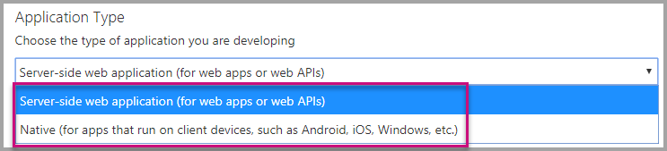
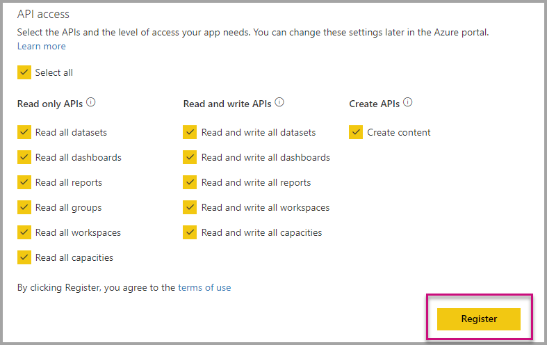
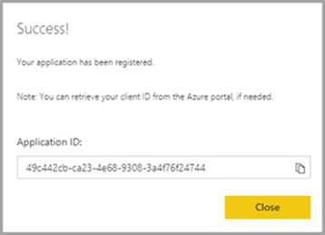
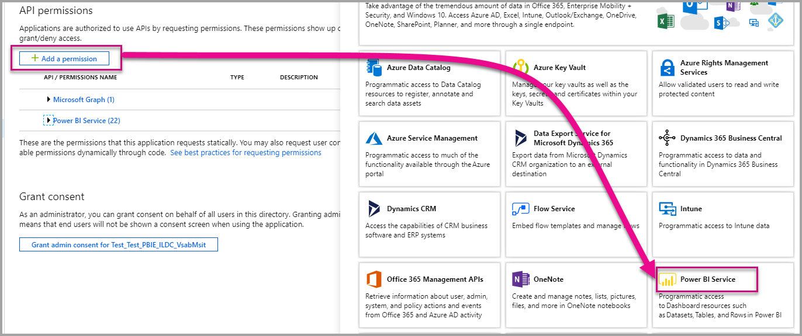

# Register an Azure AD application to use with Power BI

To use Power BI embedded analytics, you need to register an Azure Active Directory (Azure AD) application in Azure.

The Azure AD app establishes permissions for Power BI REST resources, and allows access to the [Power BI REST APIs](/rest/api/power-bi/).

## Determine your embedding solution

When you register an Azure AD app, its type is determined according to your embedding solution. Before creating your app, decide which one of the following solutions is best suited for you:

* Embed for your customers
* Embed for your organization

### Embed for your customers

Use the [embed for your customers](embed-sample-for-customers.md) solution, also known as *app owns data*, if you're planning to create an application that is designed for your customers. To use the application, users will not need to sign in. Your application will use a **master user** account (a Power BI Pro license used for signing in to Power BI), to authenticate against Azure.

### Embed for your organization

Use the [embed for your organization](embed-sample-for-your-organization.md) solution, also known as *user owns data*, if you're planning to create an application  that requires users to use their credentials to sign in.
To authenticate against Azure, you'll use a [service principal](embed-service-principal.md) or a [service principal with a certificate](embed-service-principal-certificate.md).

## Register an Azure AD app

The easiest way register an Azure AD app, is by using the  [Power BI embedding setup tool](https://app.powerbi.com/embedsetup). The tool offers a quick registration process for both embedding solutions, using a simple graphical interface.

If you're creating an *embed for your organization* application, and want more control over your Azure AD app, you can register it manually create it in Azure.

> [!IMPORTANT]
> Before you register a Power BI app you need an [Azure Active Directory tenant and an organizational user](create-an-azure-active-directory-tenant.md).

# [Embed for your customers](#tab/customers)

These steps describe how to register an Azure AD application for the Power BI [embed for your customers](embed-sample-for-customers.md) solution.

1. Open the [Power BI App Registration Tool](https://dev.powerbi.com/apps).

2. In *Step 1 - sign in to Power BI*, sign in with a user that belongs to your Power BI tenant. The Azure AD app will be registered under this user.

    If you're already signed in, verify that your signed in with the tenant user you want to use for creating the Azure AD app. To change a user, click the *sign out* link and once the tool restarts, sign in again.

3. 3. In the *Choose an embedding solution*, select **Embed for your customers**.

4. In *Step 2 - Register your application*

# [Embed for your organization](#tab/organization)

These steps describe how to register an Azure AD application for the Power BI [embed for your organization](embed-sample-for-your-organization.md) solution.

1. Open the [Power BI App Registration Tool](https://dev.powerbi.com/apps).

2. In *Step 1 - sign in to Power BI*, sign in with a user that belongs to your Power BI tenant. The Azure AD app will be registered under this user.

    If you're already signed in, verify that your signed in with the tenant user you want to use for creating the Azure AD app. To change a user, click the *sign out* link and once the tool restarts, sign in again.

3. In the *Choose an embedding solution* window, select **Embed for your organization**.

4. In *Step 2 - Register your application*, fill in the following fields:

    * **Application Name** - Give your application a name.

    * **Home Page URL** - Enter a URL for your home page.

    * **Redirect URL** - Upon singing in, your application users will be redirected here while your application receives an authentication code from Azure. Select one of these options:

        * **Use a default URL** - This option will automatically create and download a sample embedded analytics application. The default URL is **gsgsgsgsgsgsd**

        * **Use a custom URL** - Select this option if you already have an embedded analytics application, and know what you want to use as a redirect URL.

    * **API access** - Select the Power BI APIs that your application needs. You can use *Select all* to select all the APIs. For more information about Power BI access permissions, see [Permissions and consent in the Microsoft identity platform endpoint](/azure/active-directory/develop/v2-permissions-and-consent).

5. Select **Register**.

    Your Azure AD app **Application ID** and **Application secret** values are displayed in the *Summary* box. Copy these values for later use.

6. (Optional) In *Step 3 - Create a workspace*, create a workspace in Power BI service.

    * If you already have a Power BI workspace, select **Skip**.

    * To create a workspace, enter a name for your workspace and select **Create workspace**. Your Workspace name and ID appear in the *Summary* box. Copy these values for later use.

    >[!NOTE]
    >If you require an embedded analytics sample app, you have to create a workspace using the tool.

7. (Optional) In *Step 4 - Import content*, you choose one of following options:

    * If you have your own Power BI app, you can select **Skip**. This option will close the setup tool.

    * If you want to create a sample Power BI app using a sample report, select **Sample Power BI report** and then select **Import**.

    * If you want to create a sample Power BI app using your own report, select **Upload a .pbix** file, and after you upload your PBIX to the workspace, select **Import**.

8. (Optional) If you created a Power BI workspace and uploaded content to it using the tool, you can now select **Download sample application**. You can also copy the Report ID from the *Summary* Box.

# [Manual registration](#tab/manual)

---

### Register with the Power BI Application Registration Tool


Here's how to register your application with the [Power BI embedding setup tool](https://app.powerbi.com/embedsetup):

1. Open the [Power BI App Registration Tool](https://dev.powerbi.com/apps).

2. Select **Sign in** and sign in.

    >[!NOTE]
    >The Power BI user used for signing in must be in your tenant.

3. In *Step 1, Sign into Power BI*, select **Next**.

4. In *Step 2, Register your application*, fill in the following fields:

    * **Application Type** - Select *server side* for web apps and *native* for apps that run on a client's machine.

    

3. Provide an **Application Name**.

4. Provide an **Application Type**.

    Here are the differences for why you choose **Native** versus **Server-side web applications** for an application type.

    Native:
    * You plan on creating an application that is [designed for your customers](embed-sample-for-customers.md) using a master user account (a Power BI Pro license used for signing in to Power BI) to authenticate.

    Server-side web application:
    * You plan on creating an application [designed for your organization](embed-sample-for-your-organization.md).
    * You plan on creating an application [designed for your customers](embed-sample-for-customers.md) using service principal to authenticate.
    * You plan on creating web apps or web APIs.

    

5. If you selected **Server-side web application** for the application type, then continue with entering a value for **Home Page URL** and **Redirect URL**. The **Redirect URL** works with any valid URL and should correspond with the application you've created. If you selected **Native**, then continue to step 6.

6. Choose the Power BI APIs that your application needs. For more information about Power BI access permissions, see [Permissions and consent in the Microsoft identity platform endpoint](/azure/active-directory/develop/v2-permissions-and-consent). Then select **Register**.

    

    > [!Important]
    > If you enable service principals to be used with Power BI, the Azure Active Directory permissions don't take effect anymore. The permissions are managed through the Power BI admin portal.

7. If you choose **Native** for the application type, then you're then provided an **Application ID**. If you select **Server-side Web app** for the application type, then you receive an **Application ID** and an **Application secret**.

    > [!Note]
    > The **Application ID** can be retrieved from the Azure portal, at a later time, if needed. If you lose the **Application secret**, you need to create a new one within the Azure portal.

| Native | Server-side web application |
|--------|-----------------------------|
|  |  |

You can now use the registered application as part of your custom application to interact with the Power BI service and with your Power BI Embedded application.

### Register with the Azure portal

Your other option for registering your application is to do so directly in the Azure portal. To register your application, follow these steps.

1. Accept the [Microsoft Power BI API Terms](https://powerbi.microsoft.com/api-terms).

2. Sign into the [Azure portal](https://portal.azure.com).

3. Choose your Azure AD tenant by selecting your account in the top-right corner of the page.

4. In the left-hand nav pane, go to **All services**, select **App Registrations** and then select **New registration**.

5. Follow the prompts and create a new application.

   For more information about how to register applications in Azure Active Directory, see [Register an app with the Azure Active Directory](/azure/active-directory/develop/quickstart-v2-register-an-app)

## How to get the Application ID

When you register an application, you receive an [Application ID](embed-sample-for-customers.md#application-id).  The **Application ID** requests permissions to the users by the application to identify themselves.

## How to get the service principal object ID

When using the [Power BI APIs](/rest/api/power-bi/), make sure to define operations using the [service principal object ID](embed-service-principal.md) to reference the service principal - for example, applying a service principal as an admin to a workspace.

## Apply permissions to your application within Azure AD

Enable additional permissions to your application in addition to what the app registration page provides. You can accomplish this task through the Azure AD portal, or programmatically.

You want to be logged in with either the *master* account, used for embedding, or a Global admin account.

### Using the Azure AD portal

1. Browse to [App registrations](https://portal.azure.com/#blade/Microsoft_AAD_RegisteredApps/ApplicationsListBlade/quickStartType//sourceType/) within the Azure portal and select the app that you're using for embedding.

2. Select **API permissions** under **Manage**.

3. Within **API permissions**, select **Add a permission**, then select **Power BI Service**.

    

4. Select the specific permissions you need under **Delegated Permissions**. Select them one by one to save the selections. Select **Save** when done.

5. Select **Grant Consent**.

    The **Grant Consent** action needs for the *master account* to avoid being prompted for consent by Azure AD. If the account performing this action is a Global Admin, you grant permissions to all users within your organization for this application. If the account performing this action is the *master account* and isn't a Global Admin, you grant permissions only to the *master account* for this application.

### Applying permissions programmatically

1. You need to get the existing service principals (users) within your tenant. For information on how to do that, see [servicePrincipal](/graph/api/resources/serviceprincipal?view=graph-rest-beta).

    You can call the *Get servicePrincipal* API without {ID}, and it gets you all of the service principals within the tenant.

2. Check for a service principal with your app application ID as **appId** property.

3. Create a new service plan if missing from your app.

    ```json
    Post https://graph.microsoft.com/beta/servicePrincipals
    Authorization: Bearer ey..qw
    Content-Type: application/json
    {
    "accountEnabled" : true,
    "appId" : "{App_Client_ID}",
    "displayName" : "{App_DisplayName}"
    }
    ```

4. Grant App Permissions to Power BI API

   If you're using an existing tenant, and not interested in granting permissions on behalf of all tenant users, you can grant permissions to a specific user by replacing the value of **consentType** to **Principal**.

   The value for **consentType** can supply either **AllPrincipals** or **Principal**.

   * **AllPrincipals** can only be used by a Power BI admin to grant permissions on behalf of all users in the tenant.
   * **Principal** is used to grant permissions on behalf of a specific user. In this case, an additional property should be added to the request's body - *principalId={User_ObjectId}*.

     You need to *Grant permissions* for the master account to avoid being prompted for consent by Azure AD, which isn't possible when doing non-interactive sign-in.

     ```json
     Post https://graph.microsoft.com/beta/OAuth2PermissionGrants
     Authorization: Bearer ey..qw
     Content-Type: application/json
     {
     "clientId":"{Service_Plan_ID}",
     "consentType":"AllPrincipals",
     "resourceId":"c78a3685-1ce7-52cd-95f7-dc5aea8ec98e",
     "scope":"Dataset.ReadWrite.All Dashboard.Read.All Report.Read.All Group.Read Group.Read.All Content.Create Metadata.View_Any Dataset.Read.All Data.Alter_Any",
     "expiryTime":"2018-03-29T14:35:32.4943409+03:00",
     "startTime":"2017-03-29T14:35:32.4933413+03:00"
     }
     ```

    The **resourceId** *c78a3685-1ce7-52cd-95f7-dc5aea8ec98e* isn't universal but it's tenant dependent. This value is the objectId of the "Power BI Service" application in Azure Active Directory.

    The user can quickly get this value in the Azure portal:
    1. https://portal.azure.com/#blade/Microsoft_AAD_IAM/StartboardApplicationsMenuBlade/AllApps

    2. Search for "Power BI Service" in the SearchBox

5. Grant App Permissions to Azure Active Directory

   The value for **consentType** can supply either **AllPrincipals** or **Principal**.

   * **AllPrincipals** can only be used by a Power BI admin to grant permissions for all users in the tenant.
   * **Principal** is used to grant permissions for a specific user. In this case, an additional property should be added to the request's body - *principalId={User_ObjectId}*.

   You need to *Grant permissions* for the master account to avoid being prompted for consent by Azure AD, which isn't possible when doing non-interactive sign-in.

   ```json
   Post https://graph.microsoft.com/beta/OAuth2PermissionGrants
   Authorization: Bearer ey..qw
   Content-Type: application/json
   { 
   "clientId":"{Service_Plan_ID}",
   "consentType":"AllPrincipals",
   "resourceId":"61e57743-d5cf-41ba-bd1a-2b381390a3f1",
   "scope":"User.Read Directory.AccessAsUser.All",
   "expiryTime":"2018-03-29T14:35:32.4943409+03:00",
   "startTime":"2017-03-29T14:35:32.4933413+03:00"
   }
   ```

## Next steps

Now that you've registered your application within Azure AD, you need to authenticate users within your application. Have a look at [Authenticate users and get an Azure AD access token for your Power BI app](get-azuread-access-token.md) to learn more.

More questions? [Try asking the Power BI Community](https://community.powerbi.com/)