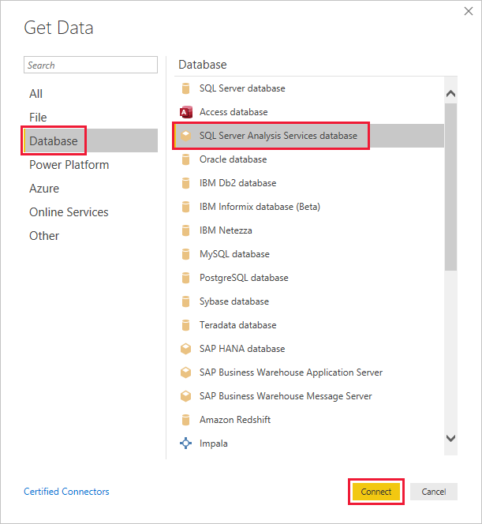

# Embed a report on an on-premises SQL Server Analysis Services (SSAS)

[!INCLUDE[Customers yes Org no](../../includes/applies-embedded-app-yes-user-no.md)]

This article explains how to embed Power BI content with an [on-premises](pbi-glossary.md#on-premises) *Analysis Services Tabular Model* live connection into a standard Power BI app owns data application. This article applies to **all** live connection SSAS models whether or not they implement RLS.

In this scenario, the database is on the SSAS (on-premises) model, and the Power BI engine connects to it via a [gateway](pbi-glossary.md#gateways-or-on-premises-data-gateways). The security roles (RLS) and permissions, if there are any, are defined in the SSAS model, and *not* in Power BI Desktop.

## Who this article is for

This article is mostly relevant for ISVs who already have an on-premises (SSAS) database setup (with or without RLS) and want to embed content directly from there.

## ISV setup

On-premises row level security is only available with a live connection, but you can create a live connection to any database whether or not it implements RLS. This includes:

* Databases with no RLS roles set up
* Databases with members who belong to one or more roles
* Databases with static or dynamic security roles

To embed a report from an SSAS model, you need to do the following actions:

1. [Set up the gateway](#set-up-the-gateway)
2. [Create a live connection](#create-a-live-connection)
3. [Generate an embed token](#generate-an-embed-token)

## Set up the gateway

[Add a data source connection to the SSAS gateway](../../connect-data/service-gateway-data-sources.md#add-a-data-source)

Enter the Datasource name, datasource type, Server, database, a username and password that the active directory recognizes.

For more information on creating and managing a gateway see [Add or remove a gateway data source](../../connect-data/service-gateway-enterprise-manage-ssas.md).

### Give service principal or master user permissions on the gateway

The user generating the embed token also needs **one** of the following permissions:

* Gateway admin permissions
* Datasource impersonate permission (ReadOverrideEffectiveIdentity)

  Users with impersonate (override) permission have a key icon next to their name.

  :::image type="content" source="media/rls-ssas/impersonate-override-permission.png" alt-text="Screenshot of a gateway member with a key icon next to their name.":::

Follow these instructions to grant gateway permissions to your master user, service principal, or service principal profile.

## [Master user](#tab/master-user)

Do **one** of the following:

* [Give the master user gateway admin permissions through the UI - recommended](/power-platform/admin/onpremises-data-gateway-management#manage-users)
* [Give the master user gateway admin permissions using the API](/powershell/module/datagateway/add-datagatewayclusteruser)
* [Give the master user impersonate permissions](/rest/api/power-bi/gateways/add-datasource-user)

## [Service principal](#tab/service-principal)

Give your service principal *admin* **or** *impersonate* permissions with one of the following APIs:

* [API to make the service principal an admin](/powershell/module/datagateway/add-datagatewayclusteruser)
* [API to give the service principal impersonate permissions](/rest/api/power-bi/gateways/add-datasource-user#assign-the-readoverrideeffectiveidentity-user-access-right-to-a-service-principal-example)

## [Service principal profile](#tab/service-principal-profile)

A service principal profile can't be an admin. If you're using a service principal profile, give it [impersonate permissions using this API](/rest/api/power-bi/gateways/add-datasource-user#assign-the-readoverrideeffectiveidentity-user-access-right-to-a-service-principal-example).

---

### Map User names

If the usernames on the on-premises directory and the Microsoft Entra directory are different and you want to view data in the portal, you need to create a user mapping table that maps each user or role in Microsoft Entra ID to users from the on-premises database. For instructions on mapping user names, go to [Manual user name remapping](../../connect-data/service-gateway-enterprise-manage-ssas.md#manual-user-name-remapping)

For more information see [Map user names for Analysis Services data sources](../../connect-data/service-gateway-enterprise-manage-ssas.md#map-user-names-for-analysis-services-data-sources).

## Create a live connection

Once the environment is set up, create a *live connection* between Power BI Desktop and the SQL server and create your report.

1. Start Power BI Desktop and select **Get data** > **Database**.

2. From the data sources list, select the **SQL Server Analysis Services Database** and select **Connect**.

   

3. Fill in your Analysis Services tabular instance details and select **Connect live**. Then select **OK**.

   :::image type="content" source="./media/rls-ssas/get-data-connect-live.png" alt-text="Screenshot of Analysis Services details.":::

## Generate an embed token

To embed your report in the *embed for your customers* scenario, [generate an embed token](./generate-embed-token.md#row-level-security) that passes the effective identity to Power BI. All live connections to AS engines need an effective identity even if there's no RLS implemented.

If there's no RLS set up, only the Admin has access to the database so you want to use the Admin as the effective identity.

The information needed to generate an embed token depends on if you're connected to Power BI using a service principal or as a master user, and also if the database has RLS.

## [Master user embed token](#tab/master-user-token)

To generate the embed token, provide the following information:

* **Username** (Optional if no RLS. Required for RLS) - A valid username recognized by the SSAS that will be used as the effective identity. If the database doesn't use RLS, and no username is provided, the master user's credentials are used.
* **Role** (required for RLS) - The report will only display data if the effective identity is a member of the role.

Example:  

```csharp
public EmbedToken GetEmbedToken(Guid reportId, IList<Guid> datasetIds, [Optional] Guid targetWorkspaceId)
{
    PowerBIClient pbiClient = this.GetPowerBIClient();

    // Define the user identity and roles. Use one of the following:

    var rlsidentity = new EffectiveIdentity(  //If no RLS
       username: "Domain\\Username", // can also be username@contoso.com
       datasets: new List<string>{ datasetId.ToString()}
    )

    var rlsidentity = new EffectiveIdentity(  // If RLS
       username: "username@contoso.com",
       roles: new List<string>{ "MyRole" },
       datasets: new List<string>{ datasetId.ToString()}
    )
    
    // Create a request for getting an embed token for the rls identity defined above
    var tokenRequest = new GenerateTokenRequestV2(
        reports: new List<GenerateTokenRequestV2Report>() { new GenerateTokenRequestV2Report(reportId) },
        datasets: datasetIds.Select(datasetId => new GenerateTokenRequestV2Dataset(datasetId.ToString())).ToList(),
        targetWorkspaces: targetWorkspaceId != Guid.Empty ? new List<GenerateTokenRequestV2TargetWorkspace>() { new GenerateTokenRequestV2TargetWorkspace(targetWorkspaceId) } : null,
        identities: new List<EffectiveIdentity> { rlsIdentity }
    );

    // Generate an embed token
    var embedToken = pbiClient.EmbedToken.GenerateToken(tokenRequest);

    return embedToken;
}
```

## [Service principal or service principal profile embed token](#tab/service-principal-token)

To generate the embed token, provide the following information:

* **Username** (required) - A valid username recognized by the SSAS that will be used as the effective identity.
* **Role** (required for RLS) - The report will only display data if the effective identity is a member of the role.

Example:

```csharp
public EmbedToken GetEmbedToken(Guid reportId, IList<Guid> datasetIds, [Optional] Guid targetWorkspaceId)
{
    PowerBIClient pbiClient = this.GetPowerBIClient();

    // Define the user identity and roles. Use one of the following:
    var rlsidentity = new EffectiveIdentity(   // If no RLS
       username: "Domain\\Username", // can also be username@contoso.com
       datasets: new List<string>{ datasetId.ToString()}
    );

    var rlsidentity = new EffectiveIdentity(  // If RLS
       username: "username@contoso.com",
       roles: new List<string>{ "MyRole" },
       datasets: new List<string>{ datasetId.ToString()}
    );
    
    // Create a request for getting an embed token for the rls identity defined above
    // This method works only with new Power BI V2 workspace experience
    var tokenRequest = new GenerateTokenRequestV2(
        reports: new List<GenerateTokenRequestV2Report>() { new GenerateTokenRequestV2Report(reportId) },
        datasets: datasetIds.Select(datasetId => new GenerateTokenRequestV2Dataset(datasetId.ToString())).ToList(),
        targetWorkspaces: targetWorkspaceId != Guid.Empty ? new List<GenerateTokenRequestV2TargetWorkspace>() { new GenerateTokenRequestV2TargetWorkspace(targetWorkspaceId) } : null,
        identities: new List<EffectiveIdentity> { rlsIdentity }
    );

    // Generate an embed token
    var embedToken = pbiClient.EmbedToken.GenerateToken(tokenRequest);

    return embedToken;
}
```

---

Now you can embed your report in your app, and your report will filter data according to the permissions of the user accessing the report.

## Considerations and limitations

CustomData isn't supported.

## Related content

[Generate an embed token](generate-embed-token.md#row-level-security)
