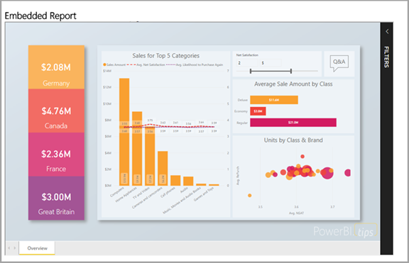
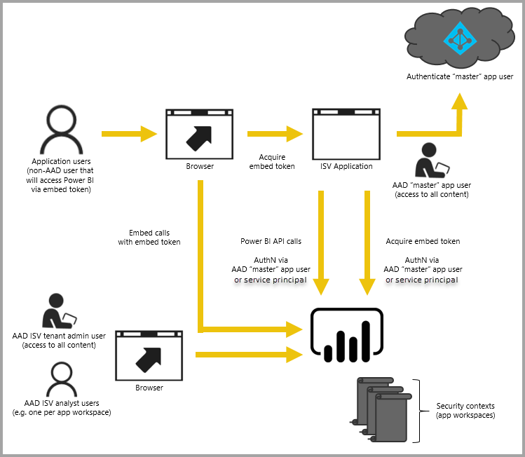

# Embedding with Power BI

The Power BI service (SaaS) and the Power BI Embedded service in Azure (PaaS) have APIs for embedding your dashboards and reports. This feature means you have a set of capabilities and access to the latest Power BI features – such as dashboards, gateways and app workspaces – when embedding your content.

You can go through the [Embedding setup tool](https://aka.ms/embedsetup) to quickly get started and download a sample application.

Choose the solution that is right for you:

* [Embedding for your organization](embedding.md#embedding-for-your-organization) allows you to extend the Power BI service. Run the [Embed for your organization](https://aka.ms/embedsetup/UserOwnsData) solution.
* [Embedding for your customers](embedding.md#embedding-for-your-customers) provides the ability to embed dashboards and reports to users who don't have an account for Power BI. Run the [Embed for your customers](https://aka.ms/embedsetup/AppOwnsData) solution.

## Using APIs

There are two main scenarios when embedding Power BI content.  Embedding for users in your organization (who have licenses for Power BI) and embedding for your users and customers without requiring them to have Power BI licenses. The Power BI REST API allows for both scenarios.

For customers and users without Power BI licenses, you can embed dashboards and reports into your custom application, using the same API to either service your organization or your customers. Your customers see the data that is managed by the application. Also, for Power BI users in your organization, they'll have the additional options to view *their data* directly in Power BI or the context of the embedded application. You can take full advantage of the JavaScript and REST APIs for your embedding needs.

To view a sample of how embedding works, see the [JavaScript embed sample](https://microsoft.github.io/PowerBI-JavaScript/demo/).

## Embedding for your organization

**Embedding for your organization** allows you to extend the Power BI service. Embedding for your organziation requires that users of your application sign into the Power BI service when they want to view their content. Once someone in your organization signs in, they will only have access to dashboards and reports that they own or that have been shared with them in the Power BI service.

*Examples of embedding for your organization include internal applications, such as [SharePoint Online](https://powerbi.microsoft.com/blog/integrate-power-bi-reports-in-sharepoint-online/), [Microsoft Teams integration (you must have Admin rights)](https://powerbi.microsoft.com/blog/power-bi-teams-up-with-microsoft-teams/), and [Microsoft Dynamics](https://docs.microsoft.com/dynamics365/customer-engagement/basics/add-edit-power-bi-visualizations-dashboard).*

For embedding for your organization, see the following:

* [Integrate a report into an app](embed-sample-for-your-organization.md)

Self-service capabilities, such as edit, save and more, are available through the [JavaScript API](https://github.com/Microsoft/PowerBI-JavaScript) when embedding for Power BI users.

You can go through the [Embedding setup tool](https://aka.ms/embedsetup/UserOwnsData) to embed for your organization to quickly get started and download a sample application that walks you through integrating a report for your organization.

## Embedding for your customers

**Embedding for your customers** lets you embed dashboards and reports for users who don't have an account for Power BI. Embedding for your customers is also known as **Power BI Embedded**.

[Power BI Embedded](azure-pbie-what-is-power-bi-embedded.md) is a **Microsoft Azure** service that lets independent software vendors (ISVs) and developers quickly embed visuals, reports, and dashboards into an application through a capacity-based, hourly metered model.

Power BI Embedded has benefits for an ISV, their developers, and customers. For example, an ISV can start creating visuals for free with Power BI Desktop. ISVs can achieve faster time to market by minimizing visual analytic development efforts and stand out among the competition with differentiated data experiences. ISVs also can opt to charge a premium for the additional value created with embedded analytics.

With Power BI Embedded, your customers don't need to know anything about Power BI. You only need one Power BI Pro account to create an embedded application. The Power BI Pro account acts as a master account for your application (think of this as a proxy account). The Power BI Pro account also allows you to generate embed tokens that provide access to dashboards and reports within the Power BI service that are owned/managed by your application.

Developers using Power BI Embedded can spend time focused on building the core competency of their application rather than spending time developing visuals and analytics. Developers can rapidly meet customer report and dashboard demands and can embed easily with fully documented APIs and SDKs. By enabling easy-to-navigate data exploration in apps, ISVs allow customers to make quick, data-driven decisions in context from any device.

> [!IMPORTANT]
> While embedding has a dependency on the Power BI service, there is not a dependency on Power BI for your customers. They do not need to sign up for Power BI to view the embedded content in your application.

When you are ready to move to production, your app workspace must be assigned to a dedicated capacity. Power BI Embedded in Microsoft Azure, offers [dedicated capacities](azure-pbie-create-capacity.md) to use with your applications.

For details on how to embed, see [How to embed your Power BI dashboards, reports and tiles](embed-sample-for-customers.md).

## Next steps

You can now try to embed Power BI content into an application, or try to embed Power BI content for your customers.

> [!div class="nextstepaction"]
> [Embed for your organization](embed-sample-for-your-organization.md)

> [!div class="nextstepaction"]
> [What is Power BI Embedded?](azure-pbie-what-is-power-bi-embedded.md)

> [!div class="nextstepaction"]
>[Embed for your customers](embed-sample-for-customers.md)

More questions? [Try asking the Power BI Community](http://community.powerbi.com/)