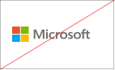
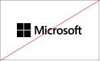
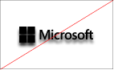

# Guidelines for Power BI visuals
Before you [publish](https://docs.microsoft.com/power-bi/developer/office-store) your Power BI visual to Microsoft AppSource for others to discover and use, make sure that you follow the guidelines to create a great experience for your users.

## Power BI visuals with additional purchases

You can submit Power BI visuals that are free to the Marketplace (Microsoft AppSource). You can also submit to Microsoft AppSource Power BI visuals that have an "additional purchase may be required" price tag. "Additional purchase may be required" Power BI visuals, are similar to in-app purchase (IAP) add-ins in the Office Store. 

Similarly to a free Power BI visual, an IAP Power BI visual can also be certified. Before submitting your IAP Power BI visual for certification, make sure it complies with the [certification requirements](../power-bi-custom-visuals-certified.md). 

### What is a Power BI visual with IAP features?

An IAP Power BI visual is a *free* visual that offers *free features*. It also has some advanced features for which extra charges may be applied. In the Power BI visual's description, developers must notify users about the features that require additional purchases to operate. Currently, Microsoft does not provide native APIs to support the purchase of apps and add-ins.

Developers may use any third-party payment system for these purchases. For more information, see [our store policy](https://docs.microsoft.com/office/dev/store/validation-policies#2-apps-or-add-ins-can-display-certain-ads).

>[!IMPORTANT]  
> If you update your Power BI visual from free to "Additional purchase may be required", users must receive the same level of free functionality  as before the update. You may add optional advanced paid features in addition to the existing free features.

### Watermarks

You can use watermarks so that customers continue using the IAP advanced features without paying. 

Watermarks can be used to showcase the full functionality of the Power BI visual, before a purchase is made. 

* Watermarks may only be used on paid features that are used without a valid license.
* Watermarks are not allowed in Power BI visuals with a *free* price tag.
* Watermarks are not allowed in IAP visuals, when the user uses free features. 

### Pop-up window

You can use a pop-up window to explain how to purchase a license, when an invalid (or expired) license is used with your Power BI IAP visual.

### Submission process

Developers upload their IAP Power BI visuals to Microsoft AppSource via the Seller Dashboard, as they've been doing for free visuals. To indicate that the submitted Power BI visual has IAP features, developers have to write in the Seller Dashboard notes, "Visual with in-app purchase." Also, developers need to provide a license key or token so that the validation team can validate the IAP features. After the Power BI visual is validated and approved, the Microsoft AppSource listing for the IAP Power BI visual states, "Additional purchase may be required" under the pricing options.

## Context menu
Context menu is the right-click menu that is displayed when the user is hovering over a visual.
All Power BI visuals should enable the context menu to bring a unified experience. 
Please check [this article](https://github.com/Microsoft/PowerBI-visuals/blob/gh-pages/tutorials/building-bar-chart/adding-context-menu-to-the-bar.md) to learn how to add a context menu.

## Commercial logo
This section describes the specifications for adding commercial logos in Power BI visuals. Commercial logos are not mandatory. If added they must follow these guidelines.

> [!NOTE]
> * In this article, 'commercial logo' refers to any commercial company icon as described in the pictures below.
> * The Microsoft commercial logo is used in this article only as an example. Use your own commercial logo with your Power BI visual.

> [!IMPORTANT]
> Commercial logos are allowed in *edit mode only*. Commercial logos *can't* be displayed in view mode.

### Commercial logo type

There are three types of commercial logos:
* **Logo** - A logo is comprised of two elements locked together, an icon and a name.

    

* **Symbol** - A graphic without any text.

    

* **Logotype** - A logo without an icon, comprised only from text.

    

### Commercial logo color

When using a commercial logo, the color of the logo must be grey (hex color #C8C8C8). Don't add effects such as gradients to the commercial logo.

* **Logo**

    

* **Symbol** - A graphic without any text.

    

* **Logotype** - A logo without an icon, comprised only from text.

    

> [!TIP]
> * If your Power BI visual contains a graphic, consider adding a white background with 10 px margins to your logo.
> * Consider adding dropshadow to your logo (30% opacity black).

### Commercial logo size

A Power BI visual requires two commercial logos, one for large tiles and one for small tiles. Place the logo within a bounding box placed at the top or bottom right corner, with 4 px margins.

The following table describes the size considerations for Power BI visuals.

|  |Small Power BI visual  |Large Power BI visual  |
|---------|---------|---------|
|*Logo width*    |Up to 240 px         |Greater than 240 px         |
|*Logo height*     |Up to 160 px         |Greater than 160 px         |
|*Bounding box size*     |40 x 15 px         |101 x 30 px         |
|*Commercial logo example*     |         |         |
|*Bounding box example*    |         |         |
|    |         |         |

### Commercial logo behavior

Commercial logos are only allowed in edit mode. When clicked, a commercial logo can only include the following functionality:

* Clicking the commercial logo redirects to your website.

* Clicking the commercial logo opens a popup window with additional information. The popup window should be divided into two sections:
    * A marketing area which can include the the commercial logo, a visual and market ratings.
    * An information area which can include information and links.    

### Things to avoid

* Commercial logos cannot be displayed in view mode.

* An animated commercial logo can display animation for up to five seconds.

* If your Power BI visual includes informative icons (i) in reading mode, they should comply to the color, size, and location of the commercial logo, as described above.

* Avoid a colorful or a black commercial logo. The commercial logo must be grey (hex color #C8C8C8).

     

* A commercial logo with effects such as gradients or strong shadows.

    

## Best practices

When publishing a Power BI visual, consider the following recommendations in order to provide users a great experience.

### Visual landing page

Use the landing page to clarify to users how they can use your Power BI visual and where to purchase the license. Don't include videos that are automatically triggered. Add only material that helps improve the user's experience, such as information or links to license purchasing details and how to use IAP features.

### License key and token

For the user's convenience, add the license key or token related fields at the top of the format pane.

## FAQ

For more information about Power BI visuals, see  [Frequently asked questions about Power BI visuals with additional purchases](https://docs.microsoft.com/power-bi/power-bi-custom-visuals-faq#visuals-with-additional-purchases).

## Next steps

Learn how you can publish your Power BI visual to [Microsoft AppSource](office-store.md) for others to discover and use.