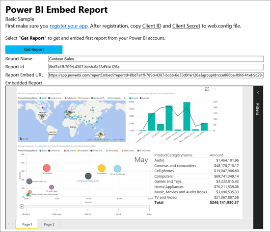

# Integrate a report into an app for your organization
Learn how to integrate, or embed, a report into a web app using REST API calls along with the Power BI JavaScript API when embedding for your organization.



To get started with this walkthrough, you need a **Power BI** account. If you don't have an account, you can [sign up for a free Power BI account](../service-self-service-signup-for-power-bi.md), or you can create your own [Azure Active Directory tenant ](create-an-azure-active-directory-tenant.md) for testing purposes.

> [!NOTE]
> Looking to embed a report for your customers, using an embedtoken, instead? See, [Integrate a dashboard, tile, or report into your application for your customers](embed-sample-for-customers.md).
> 
> 

To integrate a report into a web app, you use the **Power BI** REST API, or the Power BI C# SDK, and an Azure Active Directory (AD) authorization **access token** to get a report. Then, you load the report using the same access token. The **Power BI** API provides programmatic access to certain **Power BI** resources. For more information, see [Overview of Power BI REST API](https://msdn.microsoft.com/library/dn877544.aspx) and the [Power BI JavaScript API](https://github.com/Microsoft/PowerBI-JavaScript).

## Download the sample
This article shows the code used in the [integrate-report-web-app](https://github.com/Microsoft/PowerBI-Developer-Samples/tree/master/User%20Owns%20Data/integrate-report-web-app) on GitHub. To follow along with this walkthrough, you can download the sample.

## Step 1 - register an app in Azure AD
You will need to register your application with Azure AD in order to make REST API calls. For more information, see [Register an Azure AD app to embed Power BI content](register-app.md).

If you downloaded the [integrate-report-web-app](https://github.com/Microsoft/PowerBI-Developer-Samples/tree/master/User%20Owns%20Data/integrate-report-web-app), you use the **Client ID** and **Client Secret** you get, after registration, so that the sample can authenticate to Azure AD. To configure the sample, change the **Client ID** and **Client Secret** in the *cloud.config* file.


## Step 2 - get an access token from Azure AD
Within your application, you will first need to get an **access token**, from Azure AD, before you can make calls to the Power BI REST API. For more information, see [Authenticate users and get an Azure AD access token for your Power BI app](get-azuread-access-token.md).

## Step 3 - get a report
To get a **Power BI** report, you use the [Get Reports](https://msdn.microsoft.com/library/mt634543.aspx) operation which gets a list of **Power BI** reports. From the list of reports, you can get a report id.

### Get reports using an access token
With the **access token** you retrieved in [step 2](#step-2-get-an-access-token-from-azure-ad), you can call the [Get Reports](https://msdn.microsoft.com/library/mt634543.aspx) operation. The [Get Reports](https://msdn.microsoft.com/library/mt634543.aspx) operation returns a list of reports. You can get a single report from the list of reports. Below is a complete C# method to get a report. 

To make the REST API call, you must include an *Authorization* header in the format of *Bearer {access token}*.

#### Get reports with the REST API
**Default.aspx.cs**

```
using Newtonsoft.Json;

//Get a Report. In this sample, you get the first Report.
protected void GetReport(int index)
{
    //Configure Reports request
    System.Net.WebRequest request = System.Net.WebRequest.Create(
        String.Format("{0}/Reports",
        baseUri)) as System.Net.HttpWebRequest;

    request.Method = "GET";
    request.ContentLength = 0;
    request.Headers.Add("Authorization", String.Format("Bearer {0}", accessToken.Value));

    //Get Reports response from request.GetResponse()
    using (var response = request.GetResponse() as System.Net.HttpWebResponse)
    {
        //Get reader from response stream
        using (var reader = new System.IO.StreamReader(response.GetResponseStream()))
        {
            //Deserialize JSON string
            PBIReports Reports = JsonConvert.DeserializeObject<PBIReports>(reader.ReadToEnd());

            //Sample assumes at least one Report.
            //You could write an app that lists all Reports
            if (Reports.value.Length > 0)
            {
                var report = Reports.value[index];

                txtEmbedUrl.Text = report.embedUrl;
                txtReportId.Text = report.id;
                txtReportName.Text = report.name;
            }
        }
    }
}

//Power BI Reports used to deserialize the Get Reports response.
public class PBIReports
{
    public PBIReport[] value { get; set; }
}
public class PBIReport
{
    public string id { get; set; }
    public string name { get; set; }
    public string webUrl { get; set; }
    public string embedUrl { get; set; }
}
```

#### Get reports using the .NET SDK
You can use the .NET SDK to retrieve a list of reports instead of calling the REST API directly.

```
using Microsoft.IdentityModel.Clients.ActiveDirectory;
using Microsoft.PowerBI.Api.V2;
using Microsoft.PowerBI.Api.V2.Models;

var tokenCredentials = new TokenCredentials(<ACCESS TOKEN>, "Bearer");

// Create a Power BI Client object. It will be used to call Power BI APIs.
using (var client = new PowerBIClient(new Uri(ApiUrl), tokenCredentials))
{
    // Get the first report all reports in that workspace
    ODataResponseListReport reports = client.Reports.GetReports();

    Report report = reports.Value.FirstOrDefault();

    var embedUrl = report.EmbedUrl;
}
```

## Step 4 - load a report using JavaScript
You can use JavaScript to load a report into a div element on your web page.

**Default.aspx**

```
<!-- Embed Report-->
<div> 
    <asp:Panel ID="PanelEmbed" runat="server" Visible="true">
        <div>
            <div><b class="step">Step 3</b>: Embed a report</div>

            <div>Enter an embed url for a report from Step 2 (starts with https://):</div>
            <input type="text" id="tb_EmbedURL" style="width: 1024px;" />
            <br />
            <input type="button" id="bEmbedReportAction" value="Embed Report" />
        </div>

        <div id="reportContainer"></div>
    </asp:Panel>
</div>
```

**Site.master**

```
window.onload = function () {
    // client side click to embed a selected report.
    var el = document.getElementById("bEmbedReportAction");
    if (el.addEventListener) {
        el.addEventListener("click", updateEmbedReporte, false);
    } else {
        el.attachEvent('onclick', updateEmbedReport);
    }

    // handle server side post backs, optimize for reload scenarios
    // show embedded report if all fields were filled in.
    var accessTokenElement = document.getElementById('MainContent_accessTokenTextbox');
    if (accessTokenElement !== null) {
        var accessToken = accessTokenElement.value;
        if (accessToken !== "")
            updateEmbedReport();
    }
};

// update embed report
function updateEmbedReport() {

    // check if the embed url was selected
    var embedUrl = document.getElementById('tb_EmbedURL').value;
    if (embedUrl === "")
        return;

    // get the access token.
    accessToken = document.getElementById('MainContent_accessTokenTextbox').value;

    // Embed configuration used to describe the what and how to embed.
    // This object is used when calling powerbi.embed.
    // You can find more information at https://github.com/Microsoft/PowerBI-JavaScript/wiki/Embed-Configuration-Details.
    var config = {
        type: 'report',
        accessToken: accessToken,
        embedUrl: embedUrl
    };

    // Grab the reference to the div HTML element that will host the report.
    var reportContainer = document.getElementById('reportContainer');

    // Embed the report and display it within the div container.
    var report = powerbi.embed(reportContainer, config);

    // report.on will add an event handler which prints to Log window.
    report.on("error", function (event) {
        var logView = document.getElementById('logView');
        logView.innerHTML = logView.innerHTML + "Error<br/>";
        logView.innerHTML = logView.innerHTML + JSON.stringify(event.detail, null, "  ") + "<br/>";
        logView.innerHTML = logView.innerHTML + "---------<br/>";
    });
}
```

If you downloaded and ran the [integrate-report-web-app](https://github.com/Microsoft/PowerBI-Developer-Samples/tree/master/User%20Owns%20Data/integrate-report-web-app), the sample will look similar to below.


## Working with groups (app workspaces)
For embedding a report from a group (app workspace), you will want to get the list of all available reports within a group's dashboard using the following REST API call. To find more information about this REST API call, see [Get Reports](https://msdn.microsoft.com/library/mt634543.aspx). You will need to have permission in the group for the request to return results.

```
https://api.powerbi.com/v1.0/myorg/groups/{group_id}/reports
```

The above API returns the list of the available reports. Each report has an EmbedUrl property which is already constructed to support group embedding.

```
https://app.powerbi.com/reportEmbed?reportId={report_id}&groupId={group_id}
```

## Next steps
A sample application is available on GitHub for you to review. For more information, see [integrate-report-web-app](https://github.com/Microsoft/PowerBI-Developer-Samples/tree/master/User%20Owns%20Data/integrate-report-web-app).

More information is available for the JavaScript API, see [Power BI JavaScript API](https://github.com/Microsoft/PowerBI-JavaScript).

More questions? [Try asking the Power BI Community](http://community.powerbi.com/)

