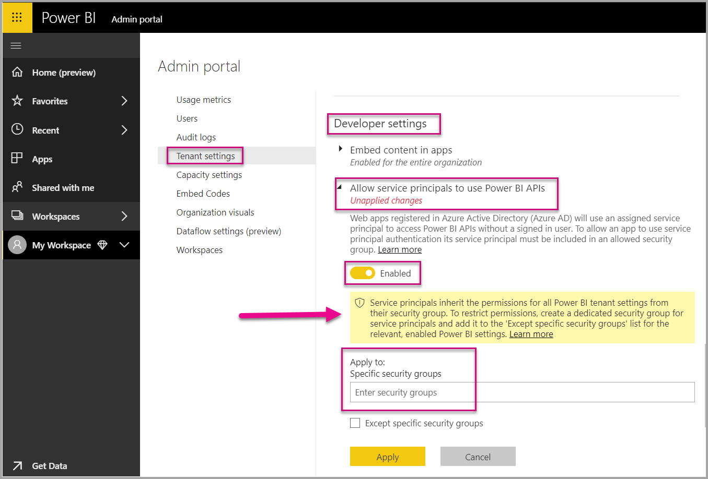

# Service principal with Power BI

New blabla

How to use Service Principal with the Power BI API.

1. (replace step 1) How to create an Azure Active Directory app registration. (GUI in Azure or PowerShell)

1. [Register a server-side web application](register-app.md) in Azure Active Directory (AAD) to use with Power BI. After registering an application you can capture an application ID, an application secret, and the service principal object ID to access your Power BI content. You can create a service principal with [PowerShell](https://docs.microsoft.com/powershell/azure/create-azure-service-principal-azureps?view=azps-1.1.0).

    Below is a sample script to create a new Azure Active Directory application.

    ```powershell
    # The app id - $app.appid
    # The service principal object id - $sp.objectId
    # The app key - $key.value

    # Sign in as a user that is allowed to create an app.
    Connect-AzureAD

    # Create a new AAD web application
    $app = New-AzureADApplication -DisplayName "testApp1" -Homepage "https://localhost:44322" -ReplyUrls "https://localhost:44322"

    # Creates a service principal
    $sp = New-AzureADServicePrincipal -AppId $app.AppId

    # Get the service principal key.
    $key = New-AzureADServicePrincipalPasswordCredential -ObjectId $sp.ObjectId
    ```

   > [!Important]
   > Once you enable service principal to be used with Power BI, the application's AD permissions don't take effect anymore. The application's permissions are then managed through the Power BI admin portal.

2.  **Recommended** - Create a security group in Azure Active Directory (AAD), and add the [application](https://docs.microsoft.com/azure/active-directory/develop/app-objects-and-service-principals) you created to that security group. You can create an AAD security group with [PowerShell](https://docs.microsoft.com/powershell/azure/create-azure-service-principal-azureps?view=azps-1.1.0).

    Below is a sample script to create a new security group and add an application to that security group.

    ```powershell
    # Required to sign in as a tenant admin
    Connect-AzureAD

    # Create an AAD security group
    $group = New-AzureADGroup -DisplayName <Group display name> -SecurityEnabled $true -MailEnabled $false -MailNickName notSet

    # Add the service principal to the group
    Add-AzureADGroupMember -ObjectId $($group.ObjectId) -RefObjectId $($sp.ObjectId)
    ```

3. As a Power BI admin, you need to enable service principal in the **Developer settings** in the Power BI admin portal. Add the security group that you created in Azure AD to the specific security group section in the **Developer settings**. You can also enable service principal access for the entire organization. In that case, step 2 is not needed.

   > [!Important]
   > Service principals have access to any tenant settings that are enabled for the entire organization or enabled for security groups that have service principals as a part of the group. To restrict service principal access to specific tenant settings, allow access only to specific security groups, or create a dedicated security group for service principals and exclude it.

    

4. Set up your [Power BI environment](embed-sample-for-customers.md#set-up-your-power-bi-environment).

    

## Example of using the API

Add to workspace...

1. Now choose to embed your content within a sample application, or within your own application.

    * [Embed content using the sample application](embed-sample-for-customers.md#embed-content-using-the-sample-application)
    * [Embed content within your application](embed-sample-for-customers.md#embed-content-within-your-application)

2. Now you're ready to [move to production](embed-sample-for-customers.md#move-to-production).

## Considerations and limitations

* Service principal only works with [new workspaces](../service-create-the-new-workspaces.md).
* **My Workspace** isn't supported when using service principal.
* Dedicated capacity is required when moving to production.
* You can't sign into the Power BI portal using service principal.
* Power BI admin rights are required to enable service principal in developer settings within the Power BI admin portal.
* You can't install or manage an on-premises data gateway using service principal.
* [Embed for your organization](embed-sample-for-your-organization.md) applications are unable to use service principal.
* [Dataflows](../service-dataflows-overview.md) management is not supported.
* Service principal currently does not support any admin APIs.
* When using service principal with an [Azure Analysis Services](https://docs.microsoft.com/azure/analysis-services/analysis-services-overview) data source, the service principal itself must have an Azure Analysis Services instance permissions. Using a security group that contains the service principal for this purpose, doesn't work.

## Next steps

* [Register an app](register-app.md)
* [Power BI Embedded for your customers](embed-sample-for-customers.md)
* [Application and service principal objects in Azure Active Directory](https://docs.microsoft.com/azure/active-directory/develop/app-objects-and-service-principals)
* [Row-level security using on-premises data gateway with service principal](embedded-row-level-security.md#on-premises-data-gateway-with-service-principal)
