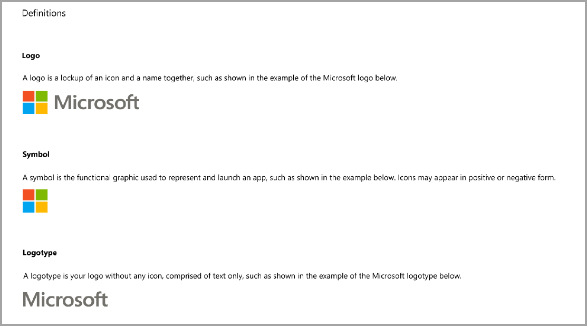
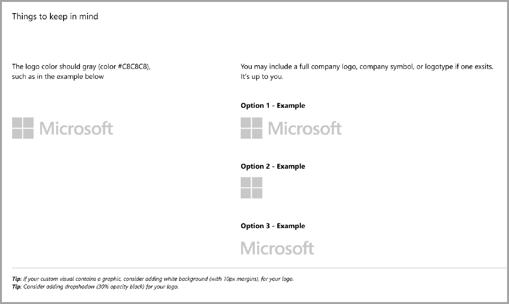
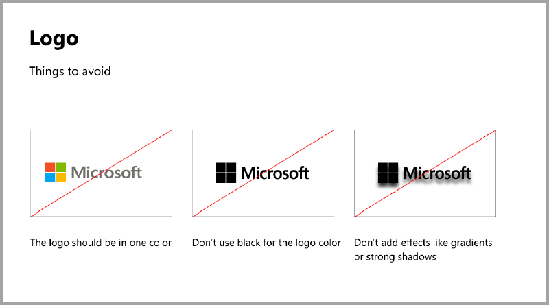
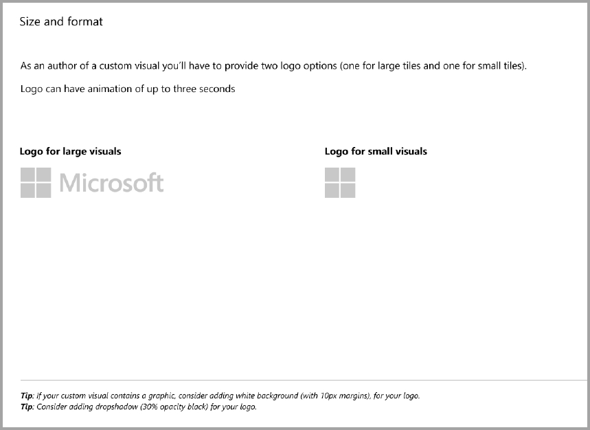
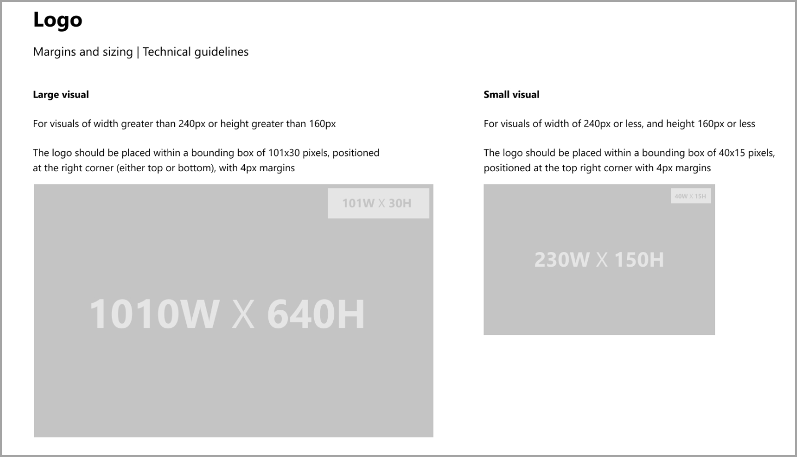
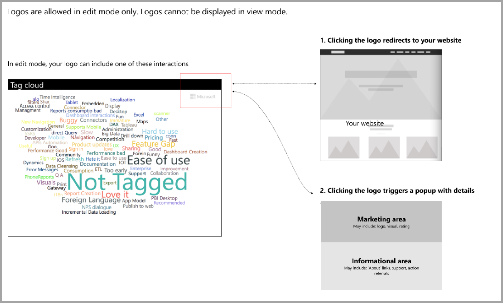

# Guidelines for Power BI visuals with additional purchases

Until recently, the Marketplace (AppSource) accepted only Power BI visuals that are free. This policy has changed, so that you can also submit visuals to AppSource that have an "additional purchase may be required" price tag. 

"Additional purchase may be required" visuals are similar to in-app purchase (IAP) add-ins in the Office Store. Developers may also submit these visuals for certification after the AppSource team approves them, and after making sure they comply with certification requirements. For more information about the requirements, see [Certified custom visuals](../power-bi-custom-visuals-certified.md).

> [!NOTE]
> * For the visual to be certified, it must not access external services or resources.
> * All free visuals should keep the same free features that were previously offered. You may add optional advanced paid features in addition to the existing free features. We recommend that you submit the IAP visuals with the advanced features as new visuals and not update the existing free ones.

## What changed in the submission process?

Developers upload their IAP visuals to AppSource via the Seller Dashboard, as they've been doing for free visuals. To indicate that the submitted visual has IAP features, developers should write in the Seller Dashboard notes, "Visual with in-app purchase." Also, developers need to provide a license key or token so that the validation team can validate the IAP features. After the visual is validated and approved, the AppSource listing for the IAP visual states, "Additional purchase may be required" under the pricing options.

## What is a Power BI visual with IAP features?

An IAP visual is a free visual that offers free features. It also has some advanced features for which extra charges may be applied to operate them. In the visual's description, developers must notify users about the features that require additional purchases to operate. Currently, Microsoft does not provide native APIs to support the purchase of apps and add-ins.

Developers may use any third-party payment system for these purchases. For more information, see [our store policy](https://docs.microsoft.com/office/dev/store/validation-policies#2-apps-or-add-ins-can-display-certain-ads).

> [!NOTE]
> Watermarks are not allowed on the free features. Developers may display a pop-up window or a watermark if the advanced paid features are used without a valid license.  

## Logo guidelines

This section describes the specifications for adding logos and logotypes in visuals.

> [!NOTE]
> Logos are allowed in edit mode only. Logos can't be displayed in view mode.

## Best practices

### Visual landing page

Use the landing page to clarify to users how they can use your visual and where to purchase the license. Don't include videos that are automatically triggered. Add only material that helps improve the user's experience, such as information or links to license purchasing details and how to use IAP features.

### License key and token

For the user's convenience, add the license key or token related fields at the top of the format pane.

## FAQ

For more information about visuals, see  [Frequently asked questions about visuals with additional purchases](https://docs.microsoft.com/power-bi/power-bi-custom-visuals-faq#visuals-with-additional-purchases).

## Next steps

Learn how you can publish your custom visual to [AppSource](office-store.md) for others to discover and use.
