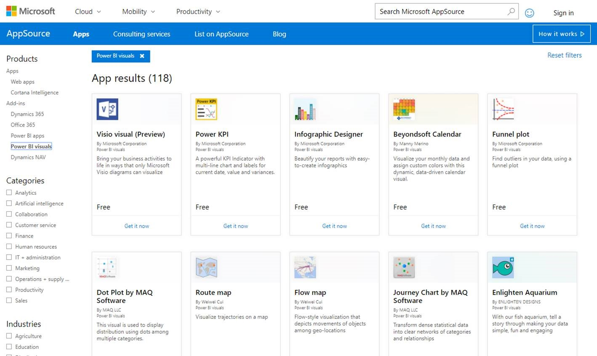
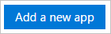
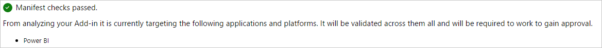
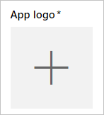

# Publish custom visuals to AppSource

Learn how you can publish your custom visual to AppSource for others to discover and use.

Once you have created your custom visual, you may want to publish it AppSource for others to discover and use. There is some preparation that needs to be done before you can do that. For more information on how to create a custom visual, see Developing a [Power BI Custom Visual](custom-visual-develop-tutorial.md).

   

## What is AppSource?

The **AppSource** is the place to find SaaS apps and add-ins for your Microsoft products and service. [AppSource](https://appsource.microsoft.com/marketplace/apps?product=power-bi-visuals) connects millions of users of Office 365, Dynamics 365, Cortana Intelligence, and others, to solutions that help them get work done more efficiently, more insightfully or more beautifully than before.

## Preparing to submit your custom visual

Once you're done coding and testing your custom visual and have packaged it into a pbiviz file, you should also have the following ready for your submission.

| Item | Required | Description |
| --- | --- | --- |
| Pbiviz package contains all the required metadata |Yes |Visual name Display name GUID Version Description Author name and email |
| Sample .pbix report file |Yes |To showcase your visual, you should help users to get acquainted with the visual. You should emphasize on the value the visual brings to the user and give examples of usage, formatting options, etc. You can also add a *"hints"* page at the end with some tips and tricks, things to avoid and the like. The sample .pbix report file must work offline, without any external connection |
| Icon |Yes |You should include the custom visual logo that will appear in the store front. The format can be .png, .jpg, .jpeg or .gif. It must be exactly 300 px (width) x 300 px (height). **Important!** Please review the [short guide](https://docs.microsoft.com/office/dev/store/craft-effective-appsource-store-images) carefully before submitting the Icon. |
| Screenshots |Yes |You must provide at least one screenshot. The format can be .png, .jpg, .jpeg or .gif. It must be exactly 1366 px (width) x 768 px (height). It can be no larger than 1024 kb for the file size. *For greater usage, add text bubbles to articulate the value proposition of key features shown in each screenshot.* |
| Support download link |Yes |Provide the URL to support customers who have issues with your visual. This link is entered as part of your SellerDashboard listing and is visible to users when they access your visual’s listing on AppSource. The format of your URL should include https:// or http://. |
| Privacy document link |Yes |Provide a link to the privacy policy for customers who use your visual. This link is entered as part of your SellerDashboard listing and is visible to users when they access your visual’s listing on AppSource. The format of your link should include https:// or http://. |
| End-user license agreement (EULA) |Yes |You must upload a EULA file. This can be either your own EULA or use the default EULA within the Office store for Power BI custom visuals. To use the default EULA, paste the following URL in the seller dashboard's "End-User License Agreement" file upload dialog: [https://visuals.azureedge.net/app-store/Power BI - Default Custom Visual EULA.pdf](https://visuals.azureedge.net/app-store/Power%20BI%20-%20Default%20Custom%20Visual%20EULA.pdf). |
| Video link |No |To increase the interest of users for your custom visual, it is advised to provide a link to a video about your visual. The format of your URL should include https:// or http://. |
| GitHub repository |No |It is preferred to have a valid and public link to a [GitHub](https://www.github.com) repository with sources of your visual and sample data in it to allow other developers to provide feedback and propose improvements to your code. |

## Submitting to Power BI

Submission starts with sending an email to the Power BI custom visuals submission team. You can email [pbivizsubmit@microsoft.com](mailto:pbivizsubmit@microsoft.com).

> [!IMPORTANT]
> You must fill the following fields in the pbiviz.json file: “description”, “supportUrl”, “author“, “name” and “email” before you create the .pbiviz package.

Attach the **.pbiviz file** and the **sample report .pbix file** in your email. The Power BI team will reply back with instructions and an app package XML file to upload. This XML app package is required in order to submit your visual through the Office developer center.

> [!NOTE]
> To improve quality and assure that existing reports are not breaking, updates to existing visuals will take an additional two weeks to reach production environment after approval in the store.

## Submitting to AppSource

Once you get the app package XML from the Power BI team, navigate to the [developer center](https://sellerdashboard.microsoft.com/Application/Summary) to submit your visual to AppSource.

> [!NOTE]
> You must have a valid Office developer account to log in to the [Office developer center](https://dev.office.com/). An Office developer account must be a Microsoft Account (Live ID, e.g. hotmail.com or outlook.com).

> [!IMPORTANT]
> You must send an email with the .pbiviz file and the .pbix file to the Power BI team before submitting to AppSource. This allows the Power BI team to upload the files to the public share server. Otherwise, the store will not be able to retrieve the files. You must send the files with each new visual submission, update to existing visual, and fixes to rejected submissions.

### Process to submit visual

Follow the below steps to complete the submission.

1. Select **Add a new app**.

    

2. Select **Power BI custom visual** and then **Next**.

3. Select the **+** under **App package** and select the app package XML file that you received from the Power BI team from the open file dialog.

    

4. You should receive an approval that this is a valid Power BI app package.

    

5. Fill out the **General info** details.

   * *Submission title:* How your submission will be named in the developer center
   * *Version:* Your version number is auto-populated from your add-in app package.
   * *Release Date (UTC):* Select a date for your app to release to the store. If a future date is chosen, your app will not be available in the store until that date is reached.
   * *Category:* The first category will be auto populated as "Data Visualization + BI". That's how all Power BI custom visuals will be tagged. You may provide up to 2 additional categories, for help users easily search for your visual
   * *Testing notes:* optional, if you'd like to provide some instructions for the testers at Microsoft
   * *My app calls, supports, contains, or uses cryptography or encryption:* leave unchecked
   * *Make this add-in available in the Office add-in catalog on iPad:* leave unchecked
6. Upload your visual's logo by selecting the **+** under **App logo**. Then select the icon file in the open file dialog. The file must be .png, .jpg, .jpeg or .gif. It must be exactly 300 px (width) x 300 px (height) and no larger than 512 kb in size.

    

7. Fill out the **Support documents** details.

   * Support document link
   * Privacy document link
   * Video link
   * End User License Agreement (EULA)

       You must upload a EULA file. This can be either your own EULA or use the default EULA within the Office store for Power BI custom visuals. To use the default EULA, paste the following URL in the seller dashboard's "End-User License Agreement" file upload dialog: [https://visuals.azureedge.net/app-store/Power BI - Default Custom Visual EULA.pdf](https://visuals.azureedge.net/app-store/Power%20BI%20-%20Default%20Custom%20Visual%20EULA.pdf).

8. Select **Next** to proceed to the **Details** page.

9. Select **Language** and pick a language from the list.

    

10. Fill out the "Description" details.

    * *App name (for this language):* Enter the title of your app as it should appear in the storefront.
    * *Short description:* Enter the short description of your app, up to 100 characters, as it should appear in the storefront. This description will show up in the top-level pages along with the logo. You can use the description from the pbiviz package.
    * *Long description:* Provide a more detailed description of your app that customers will see on your app details page. If you'd like to let the community improve your visual by making it open source, provide the link to the public repository, such as GitHub, here.

11. Upload at least one screenshot. The format can be .png, .jpg, .jpeg or .gif. It must be exactly 1366 px (width) x 768 px (height). It can be no larger than 1024 kb for the file size. *For greater usage, add text bubbles to articulate the value proposition of key features shown in each screenshot.*

12. If you'd like to add more languages, select **Add a language** and repeat steps 10 and 11. Adding more languages will help your users view the custom visual details in their own language. Languages that will not be listed will default to the first language selected.

13. When you are done adding languages, select **Next** to proceed to the **Block access** page.

14. If you want to prevent customers in specific countries or regions from using or purchasing your app, check the box and select from the list.

15. Select **Next** to proceed to the **Pricing** page.

16. Currently, only *free* visuals are supported and additional purchases inside the visual (In-App purchase) are not allowed. Select **This app is free**.

    > [!NOTE]
    > If you select any other option other than free, or have an In-App purchase content in the submitted visual, the submission will be rejected.

17. You can now select **Save as draft** and submit later, or select **Submit for approval** to submit the custom visual to the Office store.

## Tracking submission status and usage

You can review the [validation policies](https://dev.office.com/officestore/docs/validation-policies#13-power-bi-custom-visuals).

After submission, you will be able to view the submission status in the [app dashboard](https://sellerdashboard.microsoft.com/Application/Summary/).

## Certify your visual

Once your visual is created, you can optionally get your visual certified. This means it can run within the Power BI service and be used with other features of the service such as exporting to PowerPoint. For more information, see [Getting a custom visual *certified*](../power-bi-custom-visuals-certified.md).

## Next steps

[Developing a Power BI custom visual](custom-visual-develop-tutorial.md)  
[Visualizations in Power BI](../visuals/power-bi-report-visualizations.md)  
[Custom Visualizations in Power BI](../power-bi-custom-visuals.md)  
[Getting a custom visual *certified*](../power-bi-custom-visuals-certified.md)

More questions? [Try asking the Power BI Community](http://community.powerbi.com/)
