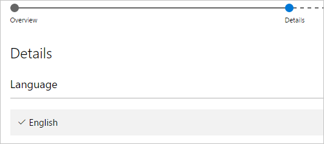

# Publish Power BI visuals to Partner Center

Once you have created your Power BI visual, you may want to publish it to the AppSource for others to discover and use. For more information about creating a Power BI visual, see [Developing a Power BI visual](visuals/custom-visual-develop-tutorial.md).

## What is AppSource?

[AppSource](https://appsource.microsoft.com/marketplace/apps?product=power-bi-visuals) is the place to find SaaS apps and add-ins for your Microsoft products and services.

## Preparing to submit your Power BI visual

Before submitting a Power BI visual to AppSource, make sure you've read the [Power BI visuals guidelines](guidelines-powerbi-visuals.md) and [tested your custom visual](https://github.com/Microsoft/PowerBI-visuals/blob/master/Tutorial/SubmissionTesting.md).

When you are ready to submit your Power BI visual, verify that your visual meets all the requirements listed below.

| Item | Required | Description |
| --- | --- | --- |
| Pbiviz package |Yes |Pack your Power BI visual into a Pbiviz package containing all the required metadata. Visual name Display name GUID Version Description Author name and email |
| Sample .pbix report file |Yes |To showcase your visual, you should help users to get familiar with the visual. Highlight the value that the visual brings to the user and give examples of usage and formatting options. You can also add a *"hints"* page at the end with some tips and tricks and things to avoid. The sample .pbix report file must work offline, without any external connections. |
| Icon |Yes |You should include the custom visual logo that will appear in the store front. The format can be .png, .jpg, .jpeg or .gif. It must be exactly 300 px (width) x 300 px (height). **Important!** Please review the [AppSource store images guide](https://docs.microsoft.com/office/dev/store/craft-effective-appsource-store-images) carefully, before submitting the icon. |
| Screenshots |Yes |Provide at least one screenshot. The format can be .png, .jpg, .jpeg or .gif. The dimensions must be exactly 1366 px (width) by 768 px (height). The size of the file can't be larger than 1024 kb. For greater usage, add text bubbles to articulate the value proposition of key features shown in each screenshot. |
| Support download link |Yes |Provide a support URL for your customers. This link is entered as part of your Seller Dashboard listing, and is visible to users when they access your visual’s listing on AppSource. The format of your URL should include https:// or https://. |
| Privacy document link |Yes |Provide a link to the visusl's privacy policy. This link is entered as part of your Seller Dashboard listing, and is visible to users when they access your visual’s listing on AppSource. The format of your link should include https:// or https://. |
| End-user license agreement (EULA) |Yes |You must upload a EULA file. This can be either your own EULA or use the default EULA within the Office store for Power BI visuals. To use the default EULA, paste the following URL in the seller dashboard's "End-User License Agreement" file upload dialog. [https://visuals.azureedge.net/app-store/Power BI - Default Custom Visual EULA.pdf](https://visuals.azureedge.net/app-store/Power%20BI%20-%20Default%20Custom%20Visual%20EULA.pdf). |
| Video link |No |To increase the interest of users for your custom visual, provide a link to a video about your visual. The format of your URL should include https:// or https://. |
| GitHub repository |No |Share a public link to a [GitHub](https://www.github.com) repository with sources of your Power BI visual and sample data. This allows other developers an opportunity to provide feedback and propose improvements to your code. |

## Getting an app package XML

To submit a Power BI visual you need an app package XML from the Power BI team. To get the app package XML, send an email to the Power BI visuals submission team ([pbivizsubmit@microsoft.com](mailto:pbivizsubmit@microsoft.com)).

Before you create the **.pbiviz** package, you must fill the following fields in the **pbiviz.json** file:
* description
* supportUrl
* author
* name
* email

Attach the **.pbiviz file** and the **sample report .pbix file** to your email. The Power BI team will reply back with instructions and an app package XML file to upload. This XML app package is required in order to submit your visual through the Office developer center.

> [!NOTE]
> To improve quality and assure that existing reports are not breaking, updates to existing visuals will take an additional two weeks to reach production environment after approval in the store.

## Submitting to AppSource

You must send an email with the **.pbiviz** file and the **.pbix** file to the Power BI team before submitting to AppSource. This allows the Power BI team to upload the files to the public share server. Otherwise, the store will not be able to retrieve the files. You must send the files with new Power BI visual submissions, updates to existing Power BI visuals, and fixes to rejected submissions.

You can submit a Power BI visual to one of the following AppSource Office management tools:
* [Partner Center](https://docs.microsoft.com/partner-center/) - The **new** management tool
* [Seller Dashboard](https://docs.microsoft.com/office/dev/store/use-the-seller-dashboard-to-submit-to-the-office-store) - The **old** management tool

>[!NOTE]
> *Partner Center* is replacing *Seller Dashboard*. We recommend submitting your Power BI visual to Partner Center, as Seller Dashboard will eventually be phased out.

### Partner Center

1. Log into **Partner Center**.

2. On the left pane, select **OFFICE STORE**.

3. Select **Overview**.

4. Select **Create a new** and from the drop down menu,select **Power BI visual**.

    

5. In the **Create a new Power BI visual** window, enter a name for your Power BI visual and click **Create**.

6. Select **Packages** and upload your Power BI visual XML app package.

7. Select **Properties** and provide the required information.

8. If your product requires additional purchase, select **Product setup** and check the **Associated service purchase** chec kbox.

9. (Optional) If you want to [certify](power-bi-custom-visuals-certified.md) your visual, select **Product setup** and check the **Power BI certification** check box.
    >[!TIP]
    >The Power BI certification process might take time. If you're creating a new Power BI visual, we recommend that you publish your Power BI visual via the Partner Center before you request Power BI certification. This ensures that the publishing of your visual is not delayed.

10. Select **Product setup** and click **Review and publish**.

### Seller Dashboard

You must have a valid Office developer account to log in to the [Office developer center](https://dev.office.com/). An Office developer account must be a Microsoft Account Live ID, such as hotmail.com or outlook.com.

1. Navigate to the [developer center](https://sellerdashboard.microsoft.com/Application/Summary).

2. Select **Add a new app**.

    

3. Select **Power BI custom visual** and then **Next**.

4. Select the **+** under **App package** and select the app package XML file that you received from the Power BI team from the open file dialog.

    

5. You should receive an approval that this is a valid Power BI app package.

    

6. Fill out the **General info** details.

   * *Submission title:* How your submission will be named in the developer center.
   * *Version:* Your version number is auto-populated from your add-in app package.
   * *Release Date (UTC):* Select a date for your app to be released to the store. If a future date is chosen, your app will not be available in the store until that date is reached.
   * *Category:* The first category will be auto populated as "Data Visualization + BI". That's how all Power BI visuals are tagged. To help users easily search for your visual, you can provide up to two additional categories.
   * *Testing notes:* optional, if you'd like to provide some instructions for the testers at Microsoft
   * *My app calls, supports, contains, or uses cryptography or encryption:* leave unchecked
   * *Make this add-in available in the Office add-in catalog on iPad:* leave unchecked
7. Upload your visual's logo by selecting the **+** under **App logo**. Then select the icon file in the open file dialog. The file must be .png, .jpg, .jpeg or .gif. It must be exactly 300 px (width) x 300 px (height) and no larger than 512 kb in size.

    

8. Fill out the **Support documents** details.

   * Support document link
   * Privacy document link
   * Video link
   * End User License Agreement (EULA)

       You must upload a EULA file. This can be either your own EULA or use the default EULA within the Office store for Power BI Power BI visuals. To use the default EULA, paste the following URL in the seller dashboard's "End-User License Agreement" file upload dialog: [https://visuals.azureedge.net/app-store/Power BI - Default Custom Visual EULA.pdf](https://visuals.azureedge.net/app-store/Power%20BI%20-%20Default%20Custom%20Visual%20EULA.pdf).

9. Select **Next** to proceed to the **Details** page.

10. Select **Language** and pick a language from the list.

    

11. Fill out the "Description" details.

    * *App name (for this language):* Enter the title of your app as it should appear in the storefront.
    * *Short description:* Enter the short description of your app, up to 100 characters, as it should appear in the storefront. This description will show up in the top-level pages along with the logo. You can use the description from the pbiviz package.
    * *Long description:* Provide a more detailed description of your app that customers will see on your app details page. If you'd like to let the community improve your visual by making it open source, provide the link to the public repository, such as GitHub, here.

12. Upload at least one screenshot. The format can be .png, .jpg, .jpeg or .gif. It must be exactly 1366 px (width) x 768 px (height). It can be no larger than 1024 kb for the file size. *For greater usage, add text bubbles to articulate the value proposition of key features shown in each screenshot.*

12. If you'd like to add more languages, select **Add a language** and repeat steps 10 and 11. Adding more languages will help your users view the custom visual details in their own language. Languages that will not be listed will default to the first language selected.

13. When you are done adding languages, select **Next** to proceed to the **Block access** page.

14. If you want to prevent customers in specific countries or regions from using or purchasing your app, check the box and select from the list.

15. Select **Next** to proceed to the **Pricing** page.

16. Currently, only *free* visuals are supported and additional purchases inside the visual (In-App purchase) are not allowed. Select **This app is free**.

    > [!NOTE]
    > If you select any other option other than free, or have an In-App purchase content in the submitted visual, the submission will be rejected.

17. You can now select **Save as draft** and submit later, or select **Submit for approval** to submit the custom visual to the Office store.

## Tracking submission status and usage

You can review the [validation policies](https://dev.office.com/officestore/docs/validation-policies#13-power-bi-custom-visuals).

After submission, you will be able to view the submission status in the [app dashboard](https://sellerdashboard.microsoft.com/Application/Summary/).

## Certify your visual

Once your visual is created, if you want you can get your visual [certified](../developer/power-bi-custom-visuals-certified.md).

## Next steps

[Developing a Power BI custom visual](visuals/custom-visual-develop-tutorial.md)  
[Visualizations in Power BI](../visuals/power-bi-report-visualizations.md)  
[Custom Visualizations in Power BI](../developer/power-bi-custom-visuals.md)  
[Getting a Power BI visual certified](../developer/power-bi-custom-visuals-certified.md)

More questions? [Try asking the Power BI Community](https://community.powerbi.com/)
